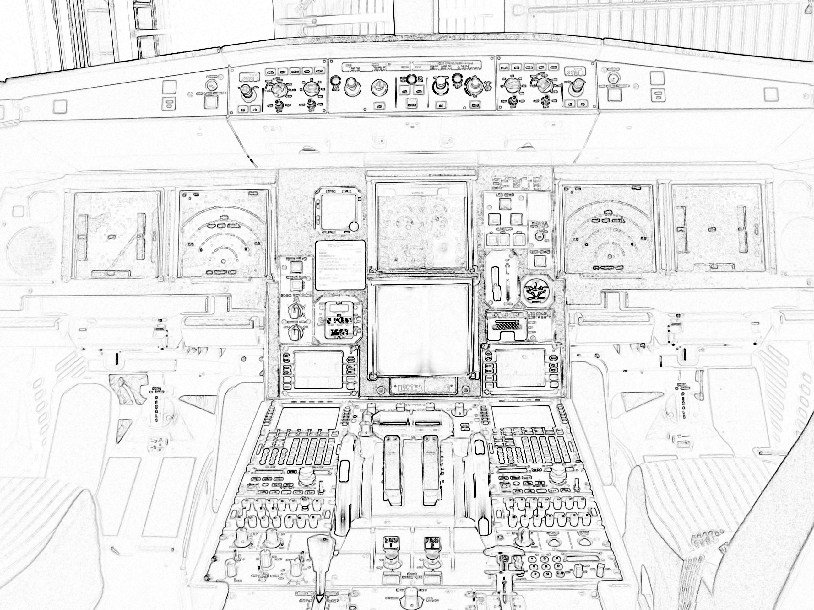
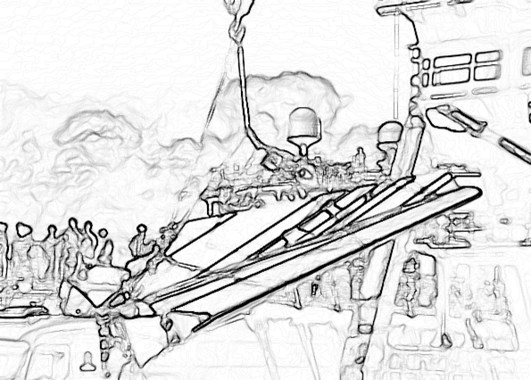

-#Foundation

# Chapter 1

Information doesn't get to the right people at the right time. 

People die.

Marc Dubois wasn't thinking that as he walked out on the Rio de Janeiro airport tarmac on May 31, 2009. It was a beautiful evening, light winds and unlimited visibility[^1-1]. Dubois looked up at the Airbus 330 that he was going to fly from Rio to Paris. Nothing to be worried about. Just the usual convection storms around the equator[^1-2].

[^1-1]: Weather history for Rio de Janeiro was sourced from the Weather Underground. https://www.wunderground.com/history/airport/SBRJ/2009/5/31/DailyHistory.html?req_city=&req_state=&req_statename=&reqdb.zip=&reqdb.magic=&reqdb.wmo=

[^1-2]: The overall outline of what happened on flight 447 is taken from the Wikipedia entry on the crash. https://en.wikipedia.org/wiki/Air_France_Flight_447

The flight was mostly full. They had a senior pilot and two junior copilots on-board. One of the copilots was relatively new, but he had hundreds of hours in the plane and in the region. Nothing suggested anything amiss. His mind was dwelling on his beautiful Brazilian mistress and the evening they had spent together the night before.[^1.5] He had only gotten about an hour of sleep. 

[^1-2.5]:All speculation, of course. We know he had a great night, and we know he mentioned it to others.

Yawning, he watched a few light clouds blow in from the sea. As the sun sank in the tropical sky, preparations were complete. Soon they would be in Paris.

They would all be dead within four hours.

The huge, 150-ton airplane went nosewheel-up and began climbing into the sky. Dubois was at the controls. As senior pilot, he always took the controls on the first part of the flight. But this flight was too long for any one person to fly, so around 3.5 hours into the flight, he turned the controls over to the new guy, the junior copilot.

He reminds them that they're entering the normal thunderstorm area and to be careful.

By now they only had 15 minutes until they'd all die. Experts agree that had the pilot gotten more sleep the night before, had he stayed in the cockpit just a little longer, nothing would have happened.

But that's not how it played out. Instead, the two junior copilots at the controls call the flight attendants in the back and let them know there will be some turbulence ahead. Should they alert the passengers. No need to worry them, but you flight attendants should grab a seat.

At 35,000 feet, They enter a cloud bank. Following procedure, they switch on some heating systems to protect against icing. All is going as planned. They leave the cloud bank.

"We seem to be out of the cloud layer," the senior copilot says, "It might be okay."[^1-3]

[^1-3]: Specific quotes from the flight were taken from the English translation provided by Popular Mechanics. [http://www.popularmechanics.com/flight/a3115/what-really-happened-aboard-air-france-447-6611877/](http://www.popularmechanics.com/flight/a3115/what-really-happened-aboard-air-france-447-6611877/)

Meanwhile the junior copilot has realized he has set the radar incorrectly. Instead of threading between the worst of the storms, they're in reality heading for the worst of them. He starts fixing the radar.

"You can possibly pull it a little to the left" the senior copilot says.

Due to the turbulence, the plane had started banking a bit to the right.

"Sorry. what?"

"You can possibly pull it a little to the left. We're agreed that we're in manual, yeah?"

The plane has the autopilot on. The copilot helps by fixing the tilt.

Now they're back in the storm. Hail or ice begins hitting the front of the plane. The junior copilot slows the plane to the correct speed for entering areas of turbulence. 

An alarm sounds. The alarm is the plane announcing that it is switching modes. Both of its pitot tubes have iced up. Pitot tubes provide direct information on how fast the airplane is flying by measuring how much pressure the incoming air has. Without the pitot tubes, the plane's autopilot is unable to directly determine the speed of the plane through the air.

Things like this happen all the time in aviation. Pilots train for it. The autopilot switches off. The plane's computer system switches from "normal law" to "Alternate Law 2". This means that the copilot is now flying the plane by hand -- and the plane's controls are responding in a different way than they used to. The electronics of the cockpit are working slightly differently.[^1-4]

[^1-4]: Wikipedia provides a great overview of various flight modes. [https://en.wikipedia.org/wiki/Flight_control_modes#Alternate_law](https://en.wikipedia.org/wiki/Flight_control_modes#Alternate_law)

Now they are truly in manual mode, the controls are operating differently, the warnings and alerts are different.

The junior copilot corrects to the left, but in the new mode, the stick has more control, so the plane over-corrects the other way, to the right. He is now probably spending his time looking at something called the flight director. (Remember, it's midnight and they are flying through clouds. The only thing pilots have in this situation are the instruments inside the plane. The flight director is supposed to tell them where they are, how they're moving, and which way the plane is tilted.) He over-corrects one way then the other, struggling a bit to bring the plane back to level.

"I have the controls," the Senior Copilot says.

"Okay"

The plane continues wobbling a bit as the Senior Copilot gets it level.

As he is doing this, he pulls back on the stick bringing the plane into a climb. There's no reason to do this. It's human nature when in a plane to want to go slower and/or higher when you're uncertain what to do. The plane begins to climb, steeply. They can't see or feel this because without instruments in the clouds at night, pilots can't tell what the plane is doing.

Right away an alarm sounds announcing that they are leaving their assigned altitude. Then the stall warning sounds, telling the pilots that they are pulling too hard back on the stick. It is believed that the flight director, however, shows that the plane is heading down, towards the ocean. According to the flight director, more power is needed and the thrust must be increased.[^1-5]

[^1-5]: The theory that the copilot was actually following the flight director instead of figuring out on his own what was going on was advanced by the final report and Aviation International News, a publication focused on professional aviation. (It's my uninformed belief that the crash was caused as much by the flight director as it was by the confusion in the cockpit) [https://www.ainonline.com/aviation-news/2012-07-08/final-af447-report-suggests-pilot-slavishly-followed-flight-director-pitch-commands](https://www.ainonline.com/aviation-news/2012-07-08/final-af447-report-suggests-pilot-slavishly-followed-flight-director-pitch-commands)

The stall warning on an A330 is designed to be loud and impossible to ignore. It will sound 75 times over the next few minutes. The copilots make no mention of hearing it or respond to what it's telling them.

Nobody can look out the window and see anything. What happens on Air France Flight 447 happens entirely in the cockpit between the computers and the humans.

In normal conditions, the stall warning can go off and safely be ignored. Happens all the time. The plane is smart enough not to let the pilots pull too far back on the stick. They can pull as far as they want, but the plane will prevent them from pointing the nose up too high. It's a safety measure. 

It's quite likely that both copilots had always flown the plane in this mode. They had never flown with the stall protection electronics turned off.

But now the plane was in a new mode. Safety protections no longer worked. Once an A330 enters Alternate Law 2, it has to be manually flown from that point until landing, when the systems can be rebooted. It's not something that happens very frequently at all.

The senior copilot looks around at the controls. "What's this?"

"That's no good. There's no good speed indication" says the junior copilot who was just relieved.

"We've lost the speeds, then?"

The plane is now zooming as fast as it can directly up into the top of the storm it's flying through, moving vertically at 7,000 feet-per-minute. As the nose points up, the forward speed drops, eventually sinking as low as 60 mph.

The junior pilot, the new guy, notes the error and tries to correct the copilot flying.

"Pay attention to your speed. Pay attention to your speed"

He means the vertical speed. They are zooming far too high for conditions. The other copilot probably thinks he means their speed through the air -- which can't be relied on right now because of the frozen pitot tubes. We don't know.

There is nothing wrong with the plane. 

The senior guy gets it. "Okay, okay, I'm descending"

The speculation here is that the flight director is still telling them they are in a dive when in fact they are in a climb. We don't know for sure because the flight director indications are not recorded in the black box.

"Stabilize"

"Yeah"

"Descend....It says we're going up...It says we're going up, so descend."

The senior copilot lets go of the stick a little bit.

"Okay"

"Descend!"

Within two minutes the plane is at 38,000 feet, as high as it can go. It's in an odd configuration that most pilots have never flown before. The engines are in full power mode, they're flying as high as they can, the nose is pointed up, but they are not climbing any more. In a sense, they are hanging in the sky. There's a little more icing.

"Here we go, we're descending."

"Gently!"

The copilot eases back on the stick a bit more. The plane gains speed. The stall warning goes off. For three seconds there are no warnings. The plane is still fine. Everything is normal.

The copilot flying still has back pressure on the stick. Whether this is due to him following the flight director, confusion, fear, or unconscious thought, we'll never know. The plane starts slowing again. The junior copilot pushes a button to call the pilot.

"Damn it, where is he?"

At this point, the plane is in an odd situation, but nothing is broken, aside from the humans' ability to determine what was going on. The pitot tubes started unfreezing. The displays were showing conflicting information.

"Damn it!"

Now both pitot tubes have unfroze. Everything is coming back to normal. Aside from the Alternate 2 Law situation, the plane is as capable as the day it rolled off the assembly line.

"I'm in TOGA, huh?"

Now we might be able to figure out what the copilot is thinking. TOGA is takeoff configuration: slow airspeed, nose up, full takeoff power. He wants to get the hell out of Dodge. I don't blame him. But that configuration only works at ground level. At the highest the plane can fly, if you point the nose up like that, no matter how much power you have, the plane is coming down. You can't point the nose too far up and have the engines hold you in the sky. It's an airplane, not a helicopter.

They call this area of flight "coffin corner", and for good reason. You are very limited on the things you can do that work. Turning the engines completely back to idle and pointing the nose down a bit is probably the best move, but even then you have to be really careful you don't overspend the airframe. Everything you do should be done very slowly and with close attention paid to what's going on.

"Damn it! Is he coming or not?"

 "We still have the engines! What the hell is happening? I don't understand what's happening!"

Now they begin dropping faster and faster towards the ocean, the entire time with the plane's nose pointed up and the engines at full throttle. They probably don't feel the fact that they're dropping.

It's only been 90 seconds.

"What the hell are you doing?" the captain enters the cockpit, looking blearily at the two copilots, struggling to wake up.

"We've lost control of the plane!"

"We've totally lost control of the plane. We don't understand at all...We've tried everything."[^1-6]

[^1-6]: For the record, there is a procedure called "unreliable airspeed" in the A330 which involves disconnecting the flight director. The problem here, of course, is that the pitot tubes were only frozen up for a couple of minutes -- and some parts iced over, unfroze, then iced over again. In a busy cockpit, with a lot going on, I for one don't understand how you could diagnose an intermittent condition. Pilots train on partial instruments all the time, but the bear of the thing is that slowly failing instruments rarely are just one way: bad or good. Instead they can fluctuate back and forth, working fine one minute and giving you bad information the next. The more complex the plane, the tougher it is to deal with this.

## Night

It was a dark and stormy night in the Atlantic in the early morning hours of June 1st, 2009. Aside from the storm and waves, nothing else happened. There were no fishermen or transport ships. The scene was totally empty when Air France 447 plummeted through the clouds and impacted the ocean falling at over 120mph.

One of the last phrases heard on the cockpit voice recorder is this: "But what's happening?" Then silence.

And that's how one night in June a highly-trained crew flew a perfectly functioning airplane into the Atlantic ocean, killing everybody on board.

As a pilot, programmer, and technical coach, as I read the final reports of the crash of Air France 447, I get angry. There was nothing wrong with the plane. It was a state-of-the-art machine that had a wonderful track record. There was nothing wrong with the pilots. Sure, everybody blames the pilots in these things. It would have been nice if the senior pilot had gotten more sleep, or taken longer to leave the cockpit. But these guys were well-trained, at the top of their game. I wouldn't have any problem at all flying with any of them.

Yet 228 people died. Why?

It's tempting, and true, to say that the key problem was the copilots' ability to understand what was going on. Just leave it at that. But whatever they missed certainly isn't related to how complicated flying can be: I was able to describe to a general audience in just a few paragraphs what happened. The concepts are quite simple.

It'd be more accurate to say something like "The model of how the airplane worked that was in the copilots' heads did not match up to how the real airplane was actually working" That's good enough, for as far as it goes.

But why did that happen? Flying is simple: thrust, lift, drag, and aerodynamics. Modern airplanes can get very complex. The A330's bigger cousin, the A380, has over 325 miles of wires. In systems that complex, whose responsibility is for it to figure out what kind of configuration the electronics are in, the pilots or the airplane itself?

No. What happened here happened sometime before first A330 ever flew. The plane crashed because critical, simple information couldn't get from the airplane to the crew, and that information couldn't get there because of something else. Information about how the plane should operate, about how the plane actually operated, and about how people fly planes didn't flow the way it should. While the plane was being designed and built.

I've worked with technology teams in many different industries and in organizations of all sizes. I've seen a ton of information flow: specs, requirements, backlogs, manuals, bug reports, marketing plans, user reports, CMM/CMMI plans, quality stats, statistical process control, and so on. Like the pilots in Air France 447, organizations are awash in information and data flowing every which way.

Some small teams and large companies take this information and consistently make quality things people want. Some small teams and companies take this information and consistently under-perform, creating wonderful reports and presentations, but failing to deliver where it really matters. When the bad news finally hits, like the copilot, they're left saying "But what's happening?"

We live in a world awash in digitized information but we're very bad at knowing what to do with all of it.

And I'm not going to tell you. It's an unsolved problem and there are tons of management theories and books out there that will do a much better job than I ever could. I'm going to tell you how to categorize and manage your information flow so that the people that produce and consume the information get the maximum value for the minimum amount of work. Then you can concentrate on your job instead of wondering whether or not you know what's going on around you.

Moving information around so you can do your job. That's this book.