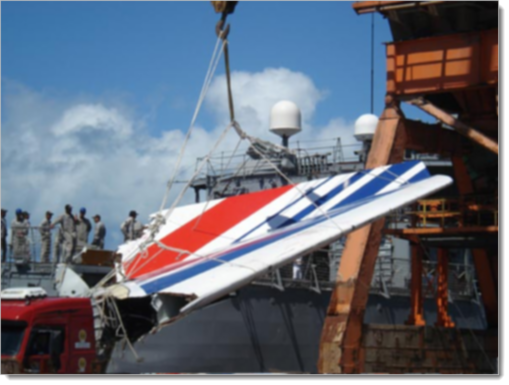

{mainmatter}

# Chapter 1

Information doesn't get to the right people at the right time. 

People die.

But Marc Dubois wasn't thinking that as he walked out on the Rio de Janeiro airport tarmac on May 31, 2009. It was a beautiful evening, light winds and unlimited visibility. Dubois looked up at the Airbus 330 that he was going to fly from Rio to Paris. There was nothing to be worried about. Just the usual convection storms around the equator.

The flight was mostly full. There was a relatively new junior co-pilot on board, but even he had hundreds of hours in the plane and in the region. There was nothing to suggest anything was amiss. We don't know for sure, but in all likelihood, Dubois's mind was dwelling on his beautiful Brazillian mistress and the evening they had spent together the night before. He had only gotten about an hour of sleep. 

Yawning, he watched a few light clouds blow in from the sea. As the sun slowly sank in the tropical sky, the plane loaded up and excitement was in the air. Soon they would be in Paris.

They would all be dead within four hours.

As the huge, 150+ ton airplane went nosewheel-up and began climbing into the sky, Dubois was at the controls. As senior pilot, he always took the controls on the first part of the flight. But the flight was too long for any one person to fly, so around 3.5 hours into the flight, he turned the controls over to the new guy, the junior copilot.

He reminds them that they're entering the normal thunderstorm area and to be careful.

They will all be dead within 15 minutes. Experts agree that had the pilot gotten more sleep the night before, had he stayed in the cockpit just a little longer, nothing would have ever happened.

But that's not what happened. Instead, the two junior pilots at the controls now call the flight attendents in the back and let them know there will be some turbulence ahead. No need to worry the passengers, but you flight attendents probably should grab a seat.

They enter a cloud bank. They switch on some heating systems to protect against icing. Everything is going as planned. They leave the cloud bank.

"We seem to be out of the cloud layer," the senior copilot says, "It might be okay."

Meanwhile the junior copilot has realized he has set the radar wrong. Instead of going between the worst of the storms, they're heading for the worst of them. His attention is directed to fixing the radar.

"You can possibly pull it a little to the left" the senior copilot says.

Due to the turbulence, the plane had started banking a bit to the right.

"Sorry. what?"

"You can possibly pull it a little to the left. We're agreed that we're in manual, yeah?"

The plane has the autpilot on, but the copilot is "helping" by fixing the tilt.

They're back in the storm. There's hail or ice hitting the front of the plane. The junior copilot slows the plane to the correct speed for entering areas of turbulence. 

An alarm sounds. The plane is announcing that it is switching modes. Both pitot tubes have iced up. The pitot tubes provide direct information on how fast the airplane is flying by measuring how much pressure the incoming air has. Without the pitot tubes, the plane's autopilot is unable to directly determine the speed of the plane.

Things like this happen all the time in aviation. Pilots train for it. The autpilot switches off. The plane's electronics switch from "normal law" to "alternate law 2" This means that the copilot is now flying the plane by hand -- and the plane's controls are responding in a different way than they used to. The electronics of the cockpit are working slightly different.

Now they are truly in manual mode, the controls are operating differently, and the warnings and alerts are different.

The junior copilot corrects to the left, but the in the new mode, the stick has more control, so the plane over-corrects the other way. The copilot is now probably spending his time looking at something called the flight director (Remember, it's midnight and they are flying through clouds. The only thing pilots have in this situation is the instruments inside the plane) He over-corrects one way then the other, trying to bring the plane back to level.

"I have the controls," the senior copilot says.

"Okay"

The plane continues wobbling a bit as the pilots gets it level.

As the senior copilot is doing this, he pulls back on the stick bringing the plane into a climb. There's no reason to do this, but it's human nature when in a plane to want to go slower and/or higher when you're uncertain what to do. The plane begins to climb, steeply. 

Right away an alarm sounds that they are leaving their assigned altitude. Then the stall warning sounds, telling the pilots that they are pulling too hard back on the stick. It is believed that the flight director, however, shows that the plane is heading down, towards the ocean. More power is needed and the thrust must be increased.

The stall warning on an A330 is designed to be loud and impossible to ignore. It will sound 75 times over the next few minutes. The copilots make no mention of hearing it or respond to what it's telling them.

Remember that in instrument conditions, nobody can look out the window and see anything.

In normal conditions, the stall warning can go off and safely be ignored. The plane is smart enough not to let the pilots pull too far back on the stick. They can pull as far as they want, but the plane will prevent them from actually stalling. It's a safety measure. It's quite likely that both copilots had always flown the plane in this mode.

But now the plane was in a new mode. The safety protections no longer worked. One an A330 enters Alternate Law 2, it has to be manually flown from that point until landing, when the systems can be rebooted. It's not something that happens very frequently at all.

The senior copilot looks around at the controls. "What's this?"

"That's no good. There's no good speed indication" says the junior copilot who was just relieved.

"We've lost the speeds, then?"

The plane is now zooming as fast as it can directly up into the top of the storm it is in, moving vertically at 7,000 feet-per-minute. As the nose points up, the forward speed drops, eventually going as low as 60mph.

The junior pilot, the new guy, notes the error and tries to correct the copilot flying.

"Pay attention to your speed. Pay attention to your speed"

He means the vertical speed. They are zooming far too high for conditions. The other copilot probably thinks he means their speed through the air -- which can't be relied on right now because of the frozen pitot tubes.

There is nothing wrong with the plane. 

The senior guy gets it. "Okay, okay, I'm descending"

The speculation here is that the flight director is still telling them they are in a dive when in fact they are in a climb. We don't know for sure because the flight director indications are not recorded in the black box.

"Stabilize"

"Yeah"

"Descend....It says we're going up...It says we're going up, so descend."

The senior copilot lets go of the stick a little bit.

"Okay"

"Descend!"

Within two minutes the plane is at 38,000 feet, as high as it can go. The engines are in full power mode, the nose is pointed up, but they are not climbing any more. There's a little more icing.

"Here we go, we're descending."

"Gently!"

The copilot eases back on the stick a bit more. The plane gains speed. The stall warning goes off. For three seconds there are no warnings. The plane is still fine, although flying as high as it can.

The copilot flying still has back pressure on the stick. Whether this is due to him following the flight director or not, we'll never know. The plane starts slowing again. The junior copilot pushes a button to call the pilot.

"Damn it, where is he?"

At this point, the plane is in an odd situation, but nothing is broken, aside from the copilots' ability to determine what was going on. The pitot tubes were becoming unfrozen. The displays were showing conflicting information.

"Damn it!"

Now both pitot tubes have unfroze. Everything is coming back to normal.

"It'm in TOGA, huh?"

Now we get a view into the senior copilot's thinking. TOGA is takeoff configuration: slow airspeed, nose up, full takeoff power. He wants to get the hell out of Dodge. But that configuation only works at ground level. At the highest the plane can fly, if you point the nose up like that, no matter how much power you have, the plane is coming down out of the sky.

They call this area of flight "coffin corner", and for good reason. You are very limited on the things you can do that work. Turning the engines completely back to idle and pointing the nose down a bit is probably the best move, but even then you have to be really careful you don't overspeed the airframe.

"Damn it! Is he coming or not?"

 "We still have the engines! What the hell is happening? I don't understand what's happening!"

Now the plane begins dropping faster and faster towards the ocean, the entire time with its nose pointed up and the engines at full throttle.

It's only been 90 seconds.

"What the hell are you doing?" the captain enters the cockpit.

"We've lost control of the plane!"

"We've totally lost control of the plane. We don't understand at all...We've tried everything."

##

It was a dark and stormy night in the tropic Atlantic on the morning of June 1st, 2009. Aside from the storm and waves, nothing else was happening. There were no fishermen or transport ships. It was totally empty when Air France 447 came plumetting down through the clouds and impacted the ocean at over 120mph.

One of the last phrases heard on the cockpit voice recorder was this: "But what's happening?"

As a pilot, programmer, and technical coach, when I read the final reports of the crash of Air France 447, I got angry. There was nothing wrong with the plane, it was a state-of-the-art machine that had a wonderful track record. There was nothing wrong with the pilots. Sure, everybody blames the pilots in these things. Sure it would have been nice if the senior pilot had gotten more sleep, or taken longer to leave the cockpit. But everybody was well-trained. I wouldn't have any problem at all flying with any of these guys.

Yet 228 people died. Why?

It's tempting, and true, to say that the key problem was the copilots' ability to understand what was going on. But that lack of ability certainly isn't related to how complicated flying can be: I was able to describe to a general audience in just a few paragraphs what was going on. The concepts are simple.

We'd be more accurate to say something like "The model of how the airplane worked that was in the copilots' heads did not match up to how the airplane was actually working" That's good enough, for as far as it goes.

But why was that? Flying is simple: thrust, lift, drag, and aerodynamics. Modern airplanes can get very complex. The A330's bigger cousin, the A380, has over 325 miles of wiring in it. In a system that complex, who's responsibility is for it to figure out what kind of configuration the electronics are in, the pilots or the airplane itself?

No. What happened here happened sometime before first A330 ever flew. The plane crashed because critical, simple information couldn't get from the airplane to the crew, but that information couldn't get there because of something else. It failed because information about how the plane should operate, about how the plane actually operated, and about how people fly planes didn't flow the way it should.

I've worked with technology teams in many different industries and in organizations of all sizes. Over 35 years, I've seen a ton of information flow: specs, requirements, backlogs, manuals, bug reports, marketing plans, CMM/CMMI plans, quality stats, statistical process control, and so on. Like the pilots in Air France 447, organizations are awash in information and data flowing every which way.

Some small teams and large companies take this information and consistently make things people want with it. Some small teams and companies take this information and consistently underperform, having wonderful reports and presentations, but failing to deliver where it really matters. When the bad news finally hits, they're left saying "But what's happening?"

I'm not going to tell you what to do with information. It's an unsolved problem and there are tons of management theories and books out there that will do a much better job than this one ever could. I'm going to tell you how to categorize and manage your information flow so that the people that produce and consume the information are getting the maximum value for the minimum amount of work.

That's this book.

