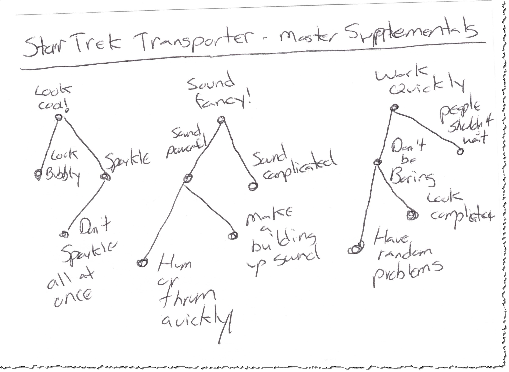

# Capturing Minimal Supplemental Detail

Supplementals will get you every time.

Supplementals are the nuclear bombs of analysis. They lie in wait, identified or not. One day they go off and boom! You've got a mess.

You haven't seen pain until you've seen a shop with a deployed product costing tens of millions of dollars suddenly be told that it needs to run 50 times faster. "We can't do that! If you'd only asked at the beginning , maybe we could have, but not now!""

On the other side, I've sat with folks in rooms before multi-million-dollar systems were built. We've talked about business supplementals "We'd like to know about changes in inventory status in real-time" only to have the business itself shoot the idea down because "computers can't do that."

I've worked as a technical lead and architect on brand-new systems that had so many System Abstract Supplementals that effectively you'd have to build a mess to make it all work. Somebody, I never did figure out who, had read a bunch of blogs and decided that the new app would be a collection of all the cool buzzwords people were using. Whether they all worked together well or not didn't matter.

Ever work a job that was just far too restrictive? Too many rules, too many processes. Too much paperwork. Too many meetings. Some people over the years at some high level in the organization decided that all of these various things are the "official way we do business around here." Usually each decision was made for a good reason, but after dozens and dozens of them pile up, you end up doing a bunch of stupid stuff that has nothing to do with your actual job. It's Meta Realized Supplemental hell.

Identifying Supplementals that you *don't* need will kill effectiveness. Not identifying Supplementals that you *do* need will kill effectiveness. Identifying *too many* Supplementals will kill effectiveness. Identifying *too few* Supplementals will kill effectiveness.

Supplementals will get you every time.

## Supplemental Titles

Confession time. For a long, long time I never formalized any of my suppplemental titles in my supplemental lists. I made them, sure. We would always put them on a flip chart during initial scope-out, then transfer them to either cards or a grid format as the project progressed. But I never formalized the system. I never had to.

Why? Because of the issues mentioned above. It's far, far too easy to sit down with a group of people and come up with Supplementals that sound good but don't work. The best strategy, for both teams and teams of teams (programs) is to start simple and add complexity only as needed, just like everything else we do. As a consultant, I was always there at the "start simple" part, hanging out a bit with "add complexity" part, but leaving once things were humming along.

Later, I'd visit shops where things had "hummed along" for a long time and now it was all broken. So we started over. Starting over many times is the least painful of all options, although it can be terribly humbling.

Eventually, though, I worked in places where it was important to connect-up the executives with the way the company was run and the things they built. (Yeah, that's always important, but it wasn't always important to *me*)[^10-1]

[^10-1]: This is known as organization *alignment*. You get paid a lot of money to talk about this, write books, and give motivational speeches. I'm a huge believer that the CEO and other execs have the primary mission of setting culture, values, and direction. I've never been a fan of the buzzword "alignment". Always seemed too fuzzy. This book talks about how to make that a lot less fuzzy, if that's your thing.

Later, as I started formalizing Info-Ops, all of these other experiences came together. This is a work in-progress, but this is my format for Supplemental titles:

**Because** Any supplemental has to have a reason why it exists "**Because** most of our readers can't read above a sixth-grade level, we will make sure that the complexity level of our articles stays low." This is the piece that's missing in a lot of Supplemental disasters: clear reasons why each supplemental is necessary.[^10-2]

[^10-2]: If these sound like "assumptions", you've been skipping ahead!

**Whenever**. This is a statement that tells us when the supplemental should be applied. "Because we have to comply with the Americans with Disability Act, **Whenever** we show any written material to one of our customers, we also have to have a braille version."

**It has to be that** is the final part. It's the part that I default to when writing supplementals, the generic statement. "**It has to be that** we will always treat our customers with respect" Remember, Supplementals are by necessity vague, and when you're at the top of the pyramid, they're downright sloganeering.

Here are a few Supplementals in the formal title format:

1. **Because** we are a state-of-the-art shop, **Whenever** we do new development, **It has to be that** the only programming stack we will use will be Ninja Turtle 7.0, Caramel Milkshake 3.0 or better, and anything with sprinkles. (This is funnier if you know that computer folks tend to name their technologies really odd things, many times around food items.) **System Abstract Supplemental**
2. **Because** business referrals mean more to us than new customers, **Whenever** we interact with our existing customers in a non-trivial way, **It has to be that** somebody will follow-up in person and ask for a referral. **Business Realized Supplemental**
3. **Because** somebody went to a conference and learned something called 
"Scrum", **Whenever** we form a new team **It has to be that** the team uses Scrum as its methodology. **Meta Abstract Supplemental**

Sometimes the reasons make no sense even if the rule is a good one, but asking the questions (and writing them down) at least clears up to folks what you mean.

## Supplemental Details 

For Behavior and Structure, the details are mostly in some kind of diagram. There's a parent-child relationship if things get complicated, but in general, for whatever you're doing, you want a small number of Behavior and Structure items. If you absolutely need more data written down, you use the diagrams to do that.

Supplementals are not like that. Because Supplementals are vague, there is no detail until you actually start using them. They are, by definition, unformed.

What this means in practice is that the parent-child relationship becomes important, as does tracking which supplementals apply to which behaviors.

**Supplemental Trees** show a top-level Supplemental with a tree underneath as it gets more and more children. I use dots and lines for this, with text outside the dots.

**Supplemental Matrices** Supplementals are broad statements (We must always be friendly!) but it's never really clear what they apply to until you actually do the work. If you're mopping the floor, should you be friendly to the mop? What does "Always be friendly" mean in the context of mopping the floor.

Probably nothing.

The real meaning in supplementals is figuring out which behaviors and structural components they map to. "We should always be responsive to our users" is a great Supplemental. Maybe we don't need anything more than that. But it begins to take on meaning when we start building something and figuring out what "always be responsive" means, what it applies to, and how we can know we've done it.[^10-4]

[^10-4]: For those of you coming from the User Stories World, Business and System Supplementals are a huge part of a User Story's acceptance criteria.

Let's say you are opening a new hamburger stand. There are some things that are important to you, that is, Supplementals. There are also some things you do in order to run a hamburger stand that makes it a hamburger stand, Behaviors. Finally, there are pieces that come together to make a good hamburger stand, structure. (We'll be skipping around abstraction levels)

What are the important values for your hamburger stand. That is, what are your **Business Abstract Supplementals**?

1. Always be responsive to our customers
2. Keep a clean store 
3. Never make the customer wait 

Ok. That might be fine. You may never need to add any more children to that Supplemental list. 

The next question is: what behaviors does a hamburger stand perform?

A. Stocks supplies
B. Makes Hamburgers
C. Sells Hamburgers
D. Organizes/Cleans up

Do all the supplementals apply to all the behaviors? Nope. To figure out which apply to which, you make a **Supplemental Matrix**

||1|2|3|
|A||X|X| 
|B|X||X
|C|X|X||
|D||X|X|

As it turns out, this grid is where the *real* details of Supplementals happen.

Behavior "B" is making hamburgers. Aside from the flowchart/Activity Diagram that we'd use to make hamburgers, what other things are important to think about while we make them? The grid shows "1" and "3". That is "Always be responsive to the our customers", and "Never make the customer wait".

So when we make hamburgers we need to be responsive to the customers, make what they ask for, and never make them wait -- make the burgers quickly. If we were writing a process manual, we'd add even more detail here, explaining exactly what the supplementals meant. (Never making them wait means that no burger should take longer than 60 seconds to cook, and 30 seconds to prepare and wrap.)

It's the intersection of a behavior and all its supplementals that really tells you what it is. Nobody cares if you make a hamburger according to the approved process if it takes ten minutes, is not the burger the customer wanted, and is too sloppy for anybody to like. The "Making Hamburger" Activity Diagram is nice and all, but without the supplementals that go with it, it's completely useless.

Behaviors don't mean anything until you apply the supplementals. They're just flowcharts/activity diagrams. It holds the other way. Supplementals don't mean anything until you show which behaviors they apply to. Nobody cares if you're abiding by your values if you're making roofing shingles instead of hamburgers. It's the intersection that matters.

We do that using a **Supplementals Matrix**.

In practice, when writing software in a small project setting, I always keep a list of supplementals on a flip chart or text file. Then, as we start writing tests for features and bug fixes, we review the supplemental chart to see what applies. We stick that on the back of our cards under the title "Acceptance Criteria", and use that section to help write our tests. This is so simple as to be trivial, but it works great.

On the other end of the spectrum, I've seen really complex systems set up that don't work very well and have little buy-in from the teams. They make really cool reports, though. (We'll get into why this happens later, as we talk about scaling up.)

What you don't want to do is nothing. You don't want to get each supplemental for each feature when you write it. This is a good way to be really sad at work, because if you do it that way, you'll forget stuff. And the Product Owner will forget stuff. And one time you'll define a Supplemental one way, another time another way. Meanwhile another team or programmer will come along, take the same supplemental, and do it completely differently. The one feature will be "responsive" and take 100ms, another feature will be "responsive" and take 20 minutes. Like I said, sad. Sad is not happy.

Supplementals will get you every time.

## Even-up Your Buckets

As we move more into application we're going to find that it is the intersection of items in the buckets where all the cool stuff happens. This means that each bucket is equally important.

A nice rule of thumb for keeping the sadness away is *keep your buckets balanced*. If you've got around ten items in your Business Abstract Behavior list, you should have around ten items in your Business Abstract Structure list. You should have around ten items in your Business Abstract Supplementals list (although with Supplementals, it probably wouldn't be a flat list. Instead you might have three items at the top and seven or so children/grandchildren.)

It's not a perfect rule. You don't need exactly the same number. But usually it's close, and usually when it's out-of-whack there is a problem. For any abstraction level, keep your buckets filled mostly the same.

## Where we are

We have come on quite the journey so far! We started with the overall plan for the book: this book is about getting the right information to the right people at the right time. The right things get built. People don't get killed. We don't waste a lot of time and energy.

To do that, we talked about what the purpose of information was. Otherwise, how would we know if we were doing a good job of gathering and moving it around or not? Information exists to support analysis, the dialectic -- a group of people assembled to hash out something by the use of honest, humble, penetrating, questions, theses, and antitheses. Information leads to questions. Questions lead to more information. Good information leads to good questions. The dialectic doesn't discover truth, it does something much better; it creates shared mental models.

How do we know information is good or not? How do we get it to the people who need it for their analysis? We do that by narrowing the scope. We narrow the scope enough, then just the right information is collected and goes to the just the right place. 

We narrow the scope by using tags. There are four sets of tags. Any piece of information we have can be decomposed and stuck into this tagging system. All you do is pick a tag from each group.

**Genre**: Business, System, Meta

**Abstraction Level**: Abstract, Realized 

**Buckets**: Behavior, Structure, Supplementals 

**Temporal Indicator**: Was, As-Is, To-Be 

There's also a parent-child relationship information can have. Things are more abstract or more detailed versions of other things along some certain dimension.

That's it. That's how we tag stuff.

Once we get actual work, we start putting things into our tagging system. We quickly find that all three buckets go together: you don't ever just do stuff in one bucket. So whenever we're talking, engaging in analysis, we're putting stuff in each of the three buckets as we go along. 

As we put things in our buckets, they form lists. For anything you're doing or trying to understand, there's a list of behavior, structure, and supplementals. It's always been that way. We usually keep the lists all in our head. But if you write them down, you can all talk about them and agree on what they mean. There's that analysis stuff happening again.

The final thing we've learned is that sometimes even writing it down and talking about it isn't enough. You need to add more detail. In that case, we have a fill-in-the-blanks way of creating items in each of our lists. We also have diagrams (and a cool chart) you can use to sketch out as much detail as we'd like. 

If we're putting things in lists, our list format for each bucket is like this (just fill in the blanks):

**Behavior**: When, As A, I Need To, So That (or Outcome/Outcomes)

**Structure**: <Noun|Noun Phrase>

**Supplemental**: Because, Whenever, It Has To Be That 

Don't forget parent-child. Any of those can have children, which can then have even more children. It's a big, freaking Analysis Pyramid O' Fun once you get going.

And for each of those items in the pyramid, there's the way to add more detail.

**Behavior**: Activity Diagrams (Stripped down to the bare essentials)

**Structure**: Class Diagrams (Also stripped down to the bare essentials)

**Supplementals**: A parent-child node tree along with a Supplementals Matrix which shows which Supplementals apply to which Behaviors 

We just started talking about how the fact that the buckets are so connected is important.

To finish this out, we need to talk about two more things: how the buckets relate to one another, and **Master Models**. That will close out the section. Then we'll know all the pieces and how they relate. Once we know that, the rest of the book will show you how to collect and deliver those pieces in real-time to the folks who need them.

