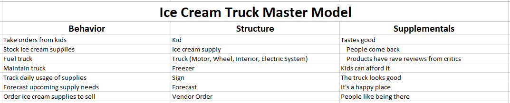
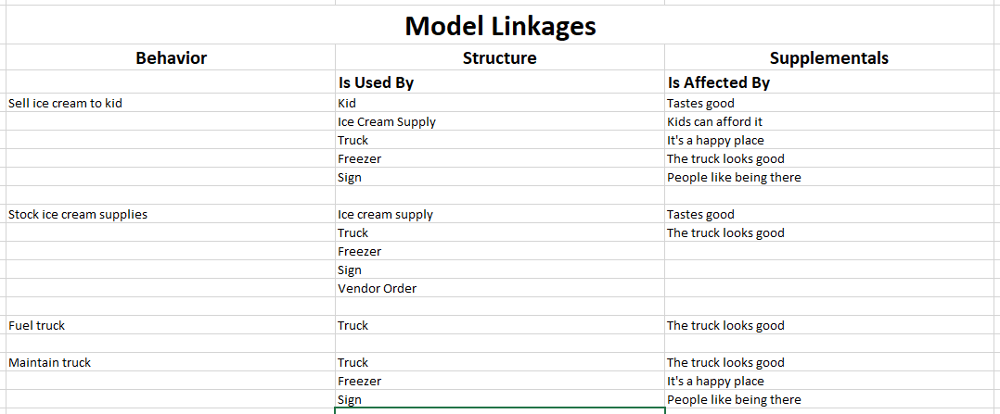

# Chapter 11

We've done our time, suffered through a bunch of technical terms in the abstract. Most of our foundational work is complete. Now it's just a couple of more organization/clean-up concepts and we're ready for the road.

This is the most abstract part of the book, and also the most important. Everything else hinges off understanding the concepts so far and in the next couple of chapters.

I've been using these concepts for over twenty years, and the more I use them, the more useful they become. Although we'll pivot and do a lot of talking about technology development in the chapters to come, I have yet to run into a field of study where what we've learned so far isn't applicable. The more you play with them, the more usefulness you get from them. Anytime you're trying to understand a system[^11-0], whether in the past, present, or future, from pyramid-building to ice-cream trucks, this works.

[^11-0]: Technically a formal, consistent system, like a machine, business, mathematical transform, or computer program. It doesn't work with squishy, inconsistent systems, like trying to decide with your spouse on where to go to eat tonight. (Sadly -- although it might not hurt trying!)

Pretty cool stuff.

## Cross-References: The Magic Act Begins

Back in school, we used to take sentences apart and draw pictures of them. This was called "sentence diagramming". It wasn't a lot of fun for me, but it was a good way to learn the parts of speech. There were a bunch of parts, but the main ones were nouns, verbs, adjectives, and adverbs.

Language is the way we communicate, so it makes sense that there is a tie-in between language and what we're talking about. Domain Models? They're important noun/noun-phrases and how they relate to one another. Activity Diagrams? They show the meaning of the verbs used. You might not know what "Make Hamburger" means, but making a flowchart of what you do to make a hamburger usually helps explain it. Supplementals? They explain how the adverbs work. When we say "Respond quickly to customer" in a Supplemental, its children and the way it applies to various behaviors defines what we mean by 
"quickly".

If you play around with Structured Analysis for a while, you'll eventually come to this earth-shattering realization: it's all in the model! The written model isn't our shared mental model of reality, it's the important conversations we went through to get that shared mental model. Yikes!

Got an important noun? It's in the Domain Model. But wait! There are other nouns as part of the Supplementals and Behavior buckets. Yep. Are they important? They're in those models, so yes. Well, they belong in the Domain Model. They're important nouns.

Because the Domain Model handles important noun/noun-phrases, it's the "Visual Glossary" for your project. It's also a bit of a switchboard. You can point to a noun in the Domain Model and think about all the Behaviors that talk about this noun. All the Supplementals that mention this noun. Everywhere in your project that this noun appears? It's all just different contexts for the same noun. 

Point at a noun in the domain model. What does this noun mean to us? *It means the things it does in the model. The model exists to provide meaning to the noun by covering all the important ways we've used it.*

Looking at the Behavior list, it not only covers all the verbs in the project, it links them to important nouns. Remember, the list title for Behaviors is at least a verb-noun phrase: wash laundry, dry clothes, fold clothes. Every one of those behavior titles has nouns in it. When we talk about "wash laundry", we're joining up the noun "laundry" with the verb wash. The Activity Diagrams around this behavior, it's parents and children, the supplementals that apply? They define what "wash" means for this project.

Point at a behavior in the domain model. What does this behavior mean to us? *It means the things it does to the nouns while following the supplementals. The model exists to provide meaning to the verb*

Everybody walks into a project with different ideas of what things mean. If I worked on a Customer Resource Management system last year, I might have my own ideas of what the noun "Customer" means. If I worked on a retail sales application, I might have a different idea of "Customer". If I've never worked on an app at all, something completely different. If I am the user of the app, something completely different still.

You could put all of these people in a room and have them chat informally about the application and what it does. During that chat, they would all use the noun "Customer"

To each person, however, they would be thinking about something slightly or completely different from the other person. And nobody would realize it.

We used to throw paperwork and process at this problem to fix it. With enough docs, we thought, we could have the exact same understanding.

This did not work. Docs help to a degree, but they quickly become unmanageable, unread, and unproductive. And you still have ambiguities.

Then we switched to "conversations". Good product development is about good conversations.

This is true, but incomplete. Yes, a small team in a room with the person to be helped, using good technique can deliver value. Every time. But real-world development is rarely like that. (Startups and small-team consulting/IT? A different story entirely.)

So we ended up with a hodge-podge that didn't work for anybody. Lot of conversations, but not with the right people in the room, lots of tools and docs, but nothing that facilitated higher quality and more precisely-targeted work. Things wouldn't work. We wasted a lot of time and energy. On one side teams asked for better conversations with the right people. But the right people didn't scale the way it should. On the other side, organizations asked for better chartering and tracking tool usage. But that always ended up looking like it should help without actually helping.

In many cases, doing the "right" thing led to more dysfunction. Teams wanted more conversations but the people weren't available. So we minted up some new folks, gave them a badge that said "Product Owner". and stuck them in the room with the team. Now they technically have somebody, but in actuality just have more inertia and waste. Organizations asked for better tool usage, so tons of data was collected and disseminated, but all that accomplished was becoming awash in reports, graphs, and useless meetings instead getting things done.

Both sides were right. Both sides were wrong. They wanted the right thing. They just didn't know how to go about it. By pushing so hard, they ended up 
*looking like* they were doing the right thing -- without actually **doing the right thing**.

Now that we're headed towards the end of the foundation part, we know what's required. Not just conversations, but *Analysis*. And not just ad-hoc, informal analysis the way a small IT or software team would do, but *Structured Analysis*, where we tag stuff to use later showing where important conversations take place.

The crazy thing both sides have to understand is that there is no meaning to the terms being used to describe the work aside from how those terms are used in the **Analysis Model** -- the lists, parent-child stuff, and details, (if needed) in all the levels and all the buckets. These hunks of text and diagrams **do not represent documentation**. They represent places where important conversations have happened, like pushpins in a map. They are not the conversations themselves.

It's like the difference between a library and a book. Libraries contain a ton of stuff, books of all kinds. If you have hundreds of books, you have a library. And if you need access to those books from time-to-time, you need to organize your library using some kind of system.

**Structured Analysis**, where we tag stuff and add detail, gives us a system for setting up conversation libraries. The conversations themselves and the analysis that happens there happens inside the minds of the people doing the work. The books we make in our minds. That's still true. But with a lot of moving pieces, a good library system can get people oriented, in the right section for the work they're doing, and set them up for productive Analysis.

So the models -- all the pieces with all the tags -- are the card catalog system. They represent all of the important conversations and how the pieces relate to one another.

Take that team where everybody had a different idea of what "Customer" meant. After a bunch of analysis, prototypes, and value delivery? They still all have different ideas about what Customer means! They always will -- because each person has had difference experiences with that noun (and they continue to make them). But for the Analysis Model and where all of those nouns, adjectives, verbs, and adverbs intersect? That's where we had some conversations where we came to agree on *what those things mean for our project*.

We're not just "having important conversations", we're using Structured Analysis to tag up the universe of things we're working in so that we mark the places that are important and remember where we were later on when we get back there again.

Everything in the Analysis Model relates to everything else. If I'm interested in what "Customer" means for this particular project, I end up walking through the Domain Model (perhaps at various levels and in various forms) seeing how "Customer" relates to the other nouns. I walk through all the behavior that includes customer, understanding how the project works with the idea of a customer. I review the supplementals with "customer" in them, learning about the values the organization has concerning customers and how those values are implemented in the behavior the team is implementing in the target system.

For purposes of our shared mental model, there's only one "Customer" that exists in all of these places.

***There is no meaning for any term or phrase for the team for that work outside of the Analysis Model. This is true whether the model is written-down or not.***

That's not saying that you have to write everything down. Far from it. 90% or more of all Analysis Models exists unspoken in the minds of the people doing the work. But the parts you *do* decide to write down? They become "stepping stones", a way three months from now to forget about your beach vacation and get back to talking about making custom hamburgers using flying robots. You could do it without writing any of the model down. Happens all the time. It's just a heckuva lot harder. And you forget stuff. So don't do that.

So how does this "The Analysis Model is love, happiness, goodness, and the universe! It's all connected with itself! It is meaning!" work in practice?

Let's say that you're building a stadium where giant robots can fight. Your first day on the job, like you should, you make a quick list of your three buckets.

Behavior. What does this stadium have to do?
1. Seat people in the spectator area
2. Charge robots
3. Televise robot battles
4. Feed spectators
5. Clear off robot fight debris

Ok. What are the rules that always have to be true?
1. Never let robots get into the audience
2. Never let the audience get into the robot arena
3. Look like something out of Star Trek

Ok. How about Structure? What's our first pass at a Structure list?
1. Person
2. Spectator
3. Spectator area
3. Robot
4. Battle
5. Television Camera
6. Debris
7. Arena

Neat. There we go. Took a minute. Since we have to start somewhere, let's pick the first behavior and talk about it. I've got verb-nouns on all these items. How about actors? "Seat people in the spectator area". Hmm. Who does that? Well, the entire process starts when an usher goes to the gate and sees somebody waiting.

Great! So we have our first actor, the usher. "When people arrive at the gate, As an usher, I need to seat people in the spectator area so that they can watch the fight."

Woot! We're filling out our first title!

Everybody nods their heads. Yay! The status report this week is looking great already!

But wait. Now we have some new nouns. We have "usher". And we have "gate" Are we going to talk about these a lot?

I dunno. Since "usher" is an actor, he does stuff. Say, what kinds of other stuff do ushers do?

Well, they "clean restrooms", "remove rowdy spectators", and some other stuff. We don't know yet.

Are those behaviors that we have to support? I guess so. If we built a stadium that you couldn't clean, and it was impossible to get folks to leave, that would be a pretty sucky stadium. 

Lookee here. By picking up our new nouns and asking where they might go, we have two more behaviors.
6. Clean restrooms
7. Remove rowdy spectators

We also have "gate" and "restroom" as nouns. Let's chase those down. Is there anything else we do at the gate? Or in the restrooms? (Anything the stadium has to support. What you do in the restroom mostly your own business. Robots are great, but they shouldn't get too friendly.)

Nobody can think of anything else with "gate" or restroom right now. They might later. So it's doubtful but possible these are important nouns. You'll have to see how the conversations happen. Either you leave them alone, or add them as **Attributes** under "Stadium" in your Domain Model. Now we're adding some Structure detail.

Take any of the Behaviors, whether you've added a formal title or detail or not. Point at the behavior and have the group talk about what happens. Do you hear any new nouns? Are they going to pop up elsewhere? If so, put them in the Domain Model. Then ask where else those nouns be found in the project.

Working with a behavior and somebody tosses out a supplemental? Cool. Which behaviors does this supplemental apply to? Are there some new behaviors you hadn't thought about? Cool! Put them in the list.

You can play this game all day long. You pick one thing up. You talk about it. You find some new things. You guess whether or not these new things are going to show up a lot in conversation. If so, you add them, and these new things lead to even more new things. And playing the game over time with the team creates a self-contained picture of how everything relates to everything else. Agreeing on what those relationships are with the team is what gives us meaning.[^11-6]

[^11-6]: You have to remember to keep filtering based on "Is this going to show up a lot in conversation!" Otherwise you'll spend all your time drawing, by definition, useless diagrams and taking useless notes. The filter is extremely important to remember.

You can point to anything in the model and ask about how it fits into the rest of the model. Everything is connected to everything else, and you need to stay on top of all of those connections and keep it all up-to-date. By being a big roadmap of where all the important concepts in your project come together for critical conversations, the model is a huge web of discovered meaning.

## Walking the Model 

When go through the model looking at linkages like that, it's called "Walking the Model," since you can start at any one spot and move around depending on how things are connected.

There's no right or wrong way to do it. In fact, it's best if you mix it up and do it different ways. Just pick a pattern and apply it over and over.

You might pick a pattern like this: "For each behavior, go over the detail flow while pointing out which supplementals are applicable and how they apply." That's a good one. Or maybe it's "For each Domain Model Entity, talk about how they relate to each of the behaviors they participate in." That's another good one. Everything's connected, so it's up to you how you would like to walk it.

You can even string together three or more items in your pattern. "For each behavior, talk about each supplemental that applies to it. As we look at that supplemental, talk about the other places it's being used."

You'll walk the model over and over again. It's good that you can do it so many different ways.

## Synchronizing the model

What all of this linkage means is that every time we add something to the model, we need to cross check to see where else it might be used. It's not just one time. We also need to go through on a regular basis and make sure that everything is connected to everything else important.

You can call this "Analysis Model Grooming", or just "Backlog grooming". But since we're working at a higher level now, let's call it "Synchronizing the Model". It's the process where everything important in the model is explicitly connected to everything else.

We **walk the model** making sure it is consistent: it's not missing things it should have to make sense, it doesn't have the same thing listed two different ways, things aren't in the wrong spots, new things that are added in one context are looked at to see what other contexts they apply to, and so on.

Good diagramming tools can handle some of the work here. I did a lot of analysis work early on using UML tools. With the good tools, you could drag a noun into a Domain Model, give it a label like "customer", then "link" that class to Activity Diagrams and a bunch of other stuff -- where it was used. The tool kept track of all of the cross-linking.

There are many problems with using diagramming tools like this. They tend to take the focus off the people having conversations and put it on drawing cute little complex diagrams that nobody reads. It's very difficult to prevent from happening. It's very tempting to be by yourself and want to create your own diagrams. That might impress people, you might get a raise. But that ain't Analysis.

The easy answer is just to keep everything simple. For a lot of small team work, you can keep things so simple that you can keep track of the linkages in your head. Three lists, maybe some formal titles and a diagram or two, and then chat every now and then about how it all connects up. That's it. (This should be the same things you did before you learned any of this, all I've done is explain what was happening back then, right? You're doing backlog grooming that looks at the overall backlog, right?)

In the next section I'll introduce a free tool and we'll start talking about managing all of this in our day-to-day work. But for a lot of situations, Keep It Simple, Silly! Socrates wasn't a dork. Don't be a dork.

But first we need to know and use Master Models.