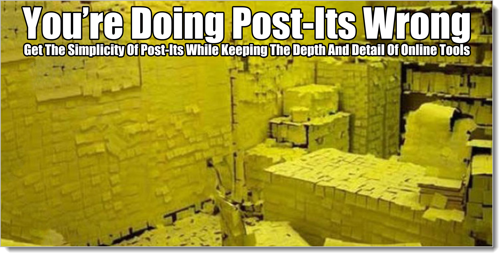

# Master Models

If you've been following along with our examples, you noticed something common whether the job was building doghouses or planning a Martian Colony: we started with three lists, one for each bucket, at the **Business Abstract** level.

Even when we were building the cool CGI model, and we didn't want to do any documents at all, we started with the three lists. (Remember how, when the Director came back, we used those lists to talk about what we had created while we were all playing with the models?)

These top-level lists show up everywhere, no matter the job. They show up so much, and they're used for so many things, we're going to label them and make them a required part of any analysis we do. (I hate prescriptive process, and I hate documentation, but here I'm willing to make an exception. A quick list for each of the top level buckets ain't going to kill anybody.)

## Master Models

Let's call the lists, the formal titles, the diagrams, and details at the **Business Abstract** level our **Master Models**. 

The rest of this book will be about how to apply everything we've learned to whatever our work is, but in case you get hit by another oxcart while reading this chapter, it's good to review what you can do with **Master Models** right now, without learning anything else.

**Master Models give you things you can share across teams and groups**. Because we are working at the **Business Abstract** level, by definition we should be trying to create Master Models that work for anybody talking about this kind of thing. In fact, a good way to tell our Master Models are whack is if we can't share them with some random person off the street -- or a team down the hall. They're supposed to be common enough to be universal.

Master Models are the top of the pyramid. They're the most fuzzy and vague (broad and non-specific) pieces of information we can tag while still being something useful. They're how the information we gather joins up the rest of the universe with whatever it is we're doing. 

**Master Models allow us to introduce newcomers to whatever it is we're working on** Whether you're assembling just three plain lists or you've got a bunch of diagramming going on, all of your work at the **Business Abstract** level is an introduction to your project.

They also make a nice re-introduction to your project. As strange as it may seem, it's extremely useful every now and then to go over why you're here, why you're doing the things you're doing, and what success looks like. On several occasions I have taken an hour or so to review the Master Models with teams that have been running for several months -- only to find that everybody had a different idea about what a Supplemental meant, what a term meant, or the types of things covered by a **Business Abstract Behavior** item. Nobody had been synchronizing the model.

You'd think this would never happen, especially in a tight team. In fact it's really weird when it doesn't happen.[^12-01] Remember analysis and the dialectic are natural things. They happen whether or not we want them to or not. They happen whether we've read this book or not. So as time goes on, people keep performing analysis, it's just unstructured and happens in little subsets of the group instead of the group itself. Take your tight, highly-functioning group of 8, let them assemble into 4 pairs of 2, then work for a few weeks. You've been doing a ton of new analysis -- in 4 different groups and in 4 slightly-different directions.

[^12-01]: Something is extremely wrong, it is a huge red flag, if a team doesn't reach a point where it has to go back and re-model everything. You would think that would be a terrible thing. But it's not. As we've seen, the Structured Analysis part can be done very quickly, and you only do what you have to. So you're not really doing more work, you're just re-organizing. In reality you end up with less stuff, not more stuff, in there each time around. Your worst understand of your problem is the one you first come up. After that it gets simpler. Remember, the work is people's heads, not on the paper. The paperwpork is never important as a focus of work.

Conversations happen without everybody being present. Mental models change. The understanding drifts. Going back through the Master Models give us a chance to remember things, cross-check against drift.

**Master Models provide a catalog for any kind of conversations**. Let's say you drop in on a team building something. It's your first day, and you're the new guy. You're not a manager. Your job is just to sit still, smile, maybe ask some questions, and leave the real work to the people who have been there for a while.

As you chat and ask questions, you're keeping a list of items in the Behavior, Structure, and Supplemental buckets at the **Business Abstract** level, right? You'd better! Behave yourself there in the back! Don't make me stop this book!

Whatever conversations you hear, you should be able to point to your lists and show where they're happening. Conversations about real work usually happen way down in the weeds, down at the **System Realized** level, but it's a pyramid, right? You can't have anything down at the bottom of the pyramid at the System Abstract level that doesn't trace back to an item in the **Business Abstract** level.

Maybe you work with programmers. They're doing a code review of a method that supports an ATM checking the account balance of a customer. It goes out across a secure internet connection, does a handshake, and so forth.

Well you've got that Business Abstract Behavior item called "Check Account Balance" That's the behavior they're talking about. Earlier in the day they gave you a network diagram and a class model of the code. You also have a list of terms which they using. That covers the structural stuff. Your Business Abstract Structure terms might also tell you a bunch more interesting things and offer ideas for questions. We'll talk about that later. And as they talk, you make notes about things the code has to do. Some of that is System Abstract Supplemental stuff, some Business Realized, some of it is Business Abstract Supplemental.

It's a code review, it's your first day on the job, and you're able to take notes in way that will get you up to speed on the project that fastest way possible. 

Note that many junior-level programmers would dive right into the weeds here. Start talking about messaging queues and typed errors. Nothing wrong with that, especially if you have something useful to add or want to impress them. But trust me, you had better also be keeping situational awareness. How does this one conversation you're hearing fit into the overall project? That's a job for Master Models.

**Master Models provide a Steering Wheel/Pivot Point between Business and System Genres.**

Because the Master Models are both understandable by outsiders and cover everything that goes on in a project, they provide a "pivot point" to discuss business control over the System work the team is performing.

**Master Models are the basis for all Meta work**.

Finally, Master Models are where all of the **Meta** stuff happens. Your process. Whatever you're building or maintaining, whatever you day-to-day work is, that's the Meta genre, how things happen. The Meta genre is how you take the Business Genre and turn it into changes in the target System.

This turns out to be a quite surprising and cool thing! *Whatever your process is, it's just a transformation of some kind of information in the Business Genre to some kind of information in the System Genre*

We can pick any management fad or process we like. It all comes back to our tags. In the rest of the book, I'll try to use various management and information techniques that seem to have lasted for a while: Statistical Process Control, Agile/XP, MBO, Lean Startup, and others. I'll try to show a couple of common things that happen in each of these techniques. Hopefully that will be enough for you to understand that Meta works at a layer above all of that.

The way we talk about any Meta genre is starting with a view of what you're doing. That's your Master Models. As we scale out, we'll talk about Meta a lot more.

## Master Backlog

The Master Model in the Behavior genre is called a **Master Backlog**. It does a ton of cool stuff.[^12-31]

[^12-31]: The Master Models name and concept is something I've invented from thin air. There is a lot of material written around working at the Business Abstract level, but because you can't go any higher, that level has special significance. Master Models, Master Backlog, Master Supplementals, and Domain Model are easier to use and remember than continuing to always say something like "top-most items in the Behavior, Structure, and Supplemental Models tagged with Business Abstract To-Be". That's just way too much verbiage to keep repeating over and over again.

**Master Backlogs control scope**. Master Backlogs are the highest-level list of "What's this thing supposed to do, anyway?" Because of that, whatever it is you're doing, it has to fit under that list somewhere. No exceptions. The Master Backlog list is your scope.

**Master Backlogs are a place to put things**. A big part of any ongoing project is what to do with unstructured data: video interviews, user emails, usage stats, other oddball snippets of stuff that you want to keep, but don't need a formal system for. The Master Backlog provides a great high-level category list. Because it's all about what the system is supposed to do, you can use it to easily put stuff to use later on whenever you're talking about that behavior.

**Master Backlogs are a convenient way to organize and manager any analysis work**. The Master Backlog also makes a great list for doing any other kind of work. Need to talk about what this Supplemental means? Go down the Master Backlog and explore whether or not it applies. Have a question about how some new marketing material may impact the product? Go down the Master Backlog. Interested in scoping through the Domain Model to make sure you have agreement on what the important nouns are? Go down the Master Backlog and "walk through" each behavior, pointing to the nouns that are being used and asking questions.

Whatever kind of analysis work you're doing, the Master Backlog provides the place for getting it all organized. (We're going to come back to this concept again and again. The MBL is kind of a playbook for a lot of things we do.)

## Master Supplemental Model

The Master Supplemental Model always makes me laugh because it's always where all of the marketing material goes. "Tastes Great!", "Less Filling!", "The Most Important Part of Your Day!"

As a tech guy, I tend to either scorn or laugh at these kinds of things. And why not? They're big, fuzzy, feel-good slogans. On their own they are completely meaningless. I'm a tech guy! Give me details!

But we put them together with other things and suddenly wow! All of that fuzzy stuff starts impacting schedules, production techniques, tooling, and everything else we do. For something that starts off so useless, the Master Supplemental Model has more of an impact than anything else in a project.

**Strat map**. Does your organization do Strategy Maps, documents that explain how it plans to accomplish its mission in the next year or so? A Strat Map is simply a superset of a Master Supplemental Model with some other stuff thrown in. 

**Qualitative to quantitative strategy**. The most important thing to do with your Master Supplemental Model, even if you don't any other kind of Structured Analysis work, is to make notes and ask questions about what, exactly, all this high-level talk means. So we have to be faster responding to the customer, right? That's great. What, exactly, does that mean? 

You can ask those questions about each of the Behaviors in your Master Backlog -- but then you're back to doing Structured Analysis, taking information, asking questions, tagging the new information, and putting it somewhere you get to easily. You don't have to do Structured Analysis to take the Master Supplemental Model and probe for meaning.

The Master Supplemental Model traces itself all the way down the pyramid to become something we call "Non-Functional Requirements" when we do programming. (It's called "Standards of Service" in some other areas.) Because of that, even if you don't do any other work, if you're programming, you should constantly be referring back to the Master Supplemental Model to determine acceptance criteria.

**Values discussion**. An odd thing happened on the way to understanding something and building something of value to people: we started talking about our own values.

There are things that are important to the people we're trying to help, the folks living in the Business genre. And so when we help them, we do it in a way that reflects both their values and ours. The Master Supplemental Model is a statement of what we believe about the people we are trying to understand/help, and what we plan on doing about those beliefs. It tells people what's important to us. (In exactly the same way, the Meta Abstract Supplemental Model is our team explaining to itself what our values are about how we treat one another and how we plan on implementing those values.)

Supplementals are about standards, values, morals, missions. The Master Backlog tells you what target system we're trying to understand and change. The Master Supplemental Model tells you what values we're trying to put into that change. It doesn't get a lot of love, but in many ways, it's the most important Master Model of all.

## Master Domain Model

A good way of explaining the Master Domain Model is a "Visual Hierarchical Dictionary", because that best describes what it does and how the diagram looks if you draw it out. Many people are familiar with the idea of a glossary or dictionary. The Master Domain Model isn't a glossary. In many ways, there's much less stuff there. The idea isn't that you point to a noun and get a definition. But because it joins up everything else in the model -- after all, no matter what you're writing, it's going to have nouns -- it's actually much, much more detailed than any glossary ever could be. The trick is that you get the meaning by tracing the noun through the rest of the models, not by reading some text.

The Master Domain Model is a huge connector. It connects terms to behavior to standards back to more terms, behavior, and standards. It's not what we're doing. It not our values. It's how what we're doing and our values all connect to one another. In many ways it is a derivative thing (we'll talk about this a lot later) You don't *decide* a term is going to be important and stick it in the model. You *discover* that a term is important -- you're using it a lot in conversation! -- and so it goes in the model. Likewise, if you're not using it a lot in conversation; it comes out of the model. The Master Domain Model is not "stuff we'd like to be important", it's "stuff we keep talking about so it is important". Different thing entirely.

**Visual Dictionary**. If nothing else, the Master Domain Model is a visual dictionary. Add in "hierarchical" and that's good enough. You can learn a lot simply by having your team sketch out a visual dictionary.

**Agreement on importance**. The requirement for appearing in the Master Domain Model is that a noun or noun phrase is used a lot in conversation. This actually turns out to be much more than boolean, yes/no condition. It's not just important or not-important. It's a sliding scale.

Each noun is in the Master Domain Model because it is important. When you diagram out the Master Domain Model using a simplified Class Diagram, you connect up terms to other terms using a "Has A" relationship. You create a hierarchy of what "owns" what.

Guess what? As you continue to sketch out the Master Domain Model while you do a bunch of other stuff (Remember, it is completely impossible to work in any one bucket at a time) you actually end up with a system where as a group you've determined which concepts are more or less important than which other concepts. That's cray cray because that's not what you set out to do. You were doing some other stuff with behaviors and supplementals. In fact, if set out to do this directly, you'll get the wrong answer. Is that wild or what? The only way you can create an agreed-upon and valuable answer to which concepts are more or less important which other ones is by working the Master Domain Model to do other things. All of the value we get from structural models is derivative.

**New terms and language rewiring**. This is yet another unexpected benefit from the **Master Domain Model**. As analysis progresses, a natural consequence is changing old terms and inventing new ones to represent what you're talking about.

This happens in every industry already, right? They work together for a while, then suddenly there's ton of jargon and buzzwords that they've developed that means nothing to the outside world. If you do a lot of technology development across many different industries, you'll find each business has its own culture and terms. (We talked about this when we talked about understanding aliens.) Same goes for technology shops. Every shop that uses technology has all of the buzzwords of the technology it uses -- plus a bunch of stuff they created on their own.

This will happen to you if you doing it right. As your team wades into whatever world it finds itself in, as you apply the dialectic and Structured Analysis to orient yourself and get going? You're going to come up some new terms. Some things just get rather cumbersome to say over and over again and soon enough you've got a shortcut. Cool beans. Awesome possum.

Sidebar: one of the things I've noticed as a software architect is that once I start drawing domain models, I keep wanting to apply software architecture concepts to them. Is this a Visitor Pattern? Are you using a Party Relationship here? These two things have a many-to-many relationship. So these two things have a many-to-many relationship? Are you sure there's not some concept in the middle that joins those two up?

There's nothing wrong with these instincts -- as long as you remember that the work takes place in people's heads, not in the diagram. So the skills, ideas, and patterns you see in the diagram should provide new questions to use with the group to talk about their terms. Master Domain Models ain't database diagrams, but you don't have to throw away your skills either. Any skills regarding obtaining and organizing information are welcome and valuable. Because we're talking about information for *anything*, this book is process agnostic[^12-4]

Using skills from other places is great, but the work is the people. Every time I've ever "cleaned up" a model on my own by using some sort of best practices or patterns? It's always created friction and waste. Changes that take seconds to make offline can take hours to un-frack once you're back with the group. Much danger here if you are not careful.

[^12-4]: I'll have to use processes and terms from somewhere, especially as we get more detailed. I will concentrate on technology development, but terms, tools, and processes around technology development are just a prop so that you'll have real-world examples and working code.

With a good group, what happens is that they do their work and continue to update the Master Domain Model. Then they start seeing patterns in the way the terms relate to one another. They add in a term, take one out, create a new one to simplify things. Now they have a new noun! Where in the Behavior bucket is that noun used? How does it apply to the Master Supplemental Model.

Everything is connected. Changes in any of the models cascade over to the other models.

**Model Synchronization** for the win!

## The Magic Act Explained

Analysis almost entirely takes place inside of the brains of the people solving the problem. So you can set up various processes and rituals, but really the determining factor is what invisibly goes on in their heads. Even more interesting, it looks to me that your mind ends up in the best place to solve a problem when you focusing your attention somewhere else. Like a magician with a magic trick, as you're doing this other thing, the big problem you had initially begins to come into focus.

Linkages across items creates this situation where you can be talking about one thing -- and affecting seven other things without knowing it. The links show you how that happens. You're working on behavior #7 and suddenly you have a critical insight about supplemental #12. Later on, when you go back and look at supplemental #12, you realize it tells you more about several other items in the Domain Model than you ever thought possible.

The linkages not only identify where crucial conversations have happened, they identify where crucial conversations *might* happen -- and by keeping all of these crucial conversation points linked up, while you're focusing on one area you end up solving problems somewhere else. This is just like when a magician directs the audiences' attention to one spot while a bunch of other things happen right in front of them but they don't realize it at the time.

We saw this first when we talked about buckets. Ask somebody about structure and they answer with behavior. Ask them about behavior and you're as likely to get supplementals, or structure. What we ask them, where we direct their attention, seems to never the place where the really useful work is happening. We'll see this pattern over and over again. Our attention will be in one spot while major accomplishments are happening off-stage. Of course it happens who have never read this book. A written Analysis Model, when done well, along with walking the model? They vastly accelerate this process.

There are plenty of examples coming up for Master Models and everything else we've learned. We'll do a bunch of tagging. We'll see a lot more magic tricks. For now, however, you should have a good idea of how critical linkages are in understanding and coordinating work. And how you can stop reading right now and still get value from what you've read. (But look out for oxcarts!)

You've got most all of the tagging system by now. You're beginning to understand how powerful it is and how many places it can be used.

Now let's go use it.

You've nailed it. Let's go scale it!

{blurb, class: information}

### Did you get it?

There's some information we should keep track of no matter what. They're called Master Models.

{/blurb}