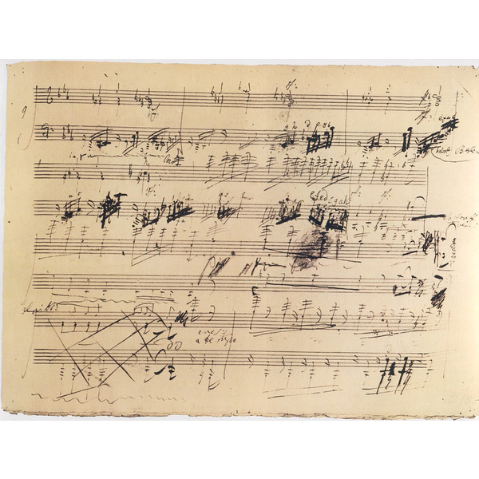
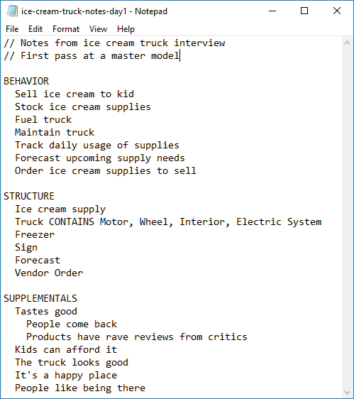
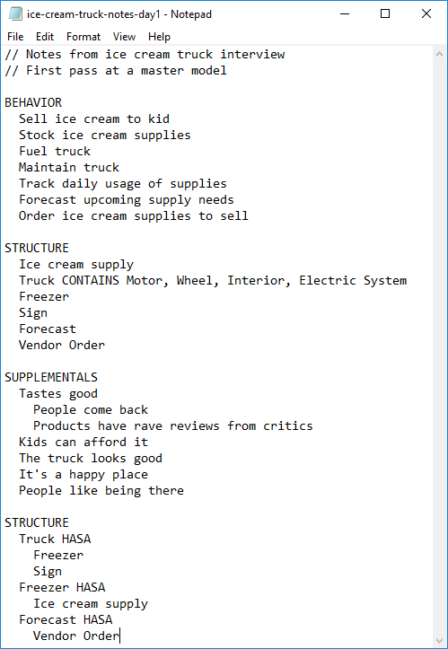
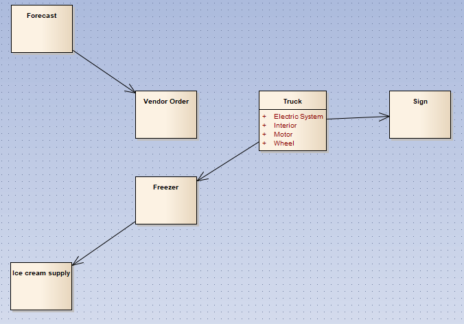
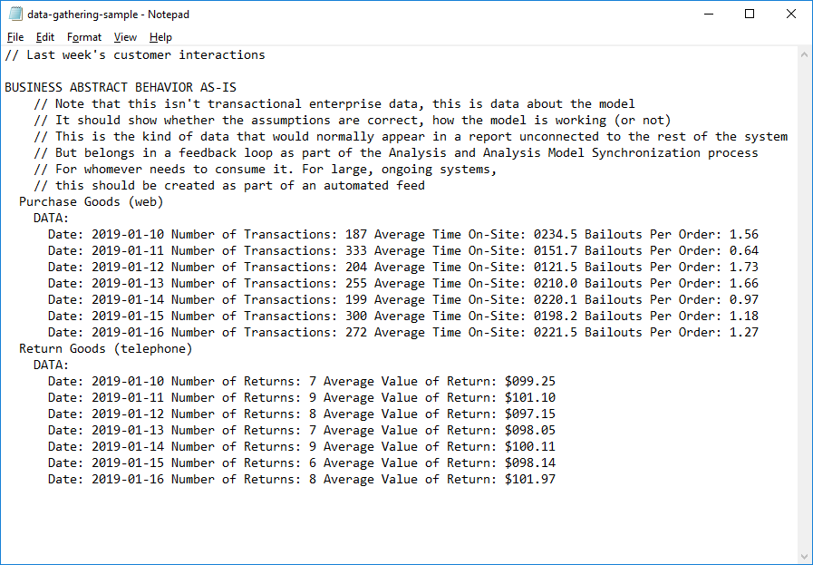

-#Test-Driven Analysis

# Chapter 13

Beethoven wasn't a pleasant person to be around.[^13-1]

[^13-1]: There are a lot of really great ways to get to know Beethoven. I'd recommend the Great Courses "Listen to and Understand Great Music" series. Get the mp3s and listen while you workout. Learn something. 

As a child, he was brought up from birth to be a great composer, and that's what he became. He didn't live in Vienna, which was the artistic center of the time. He lived out in the boonies -- but he studied and practiced like the dickens. He had an abusive father and didn't do anything but play as a kid, so he had no social skills. The worse his family life, the more he withdrew to himself.

Once they realized they had a genius on their hands, they sent him to Vienna for Haydn to teach. Haydn was a prolific composer, the darling of the town. He wrote more than 100 symphonies. He was kind and gentle. It was an honor to have him as a teacher.

When he was young, only 22 or so, his family took him to Vienna for a performance competition. All the other kids were much older -- teenagers. Many of them laughed at the country hick.

But not for long. Beethoven easily cleared out all the competition.

Leaving for the contest, one man said to another, "We must make mincemeat out of him!" They left in quite merry mood.

Arriving back home, things were no longer happy. What happened? 

"Oh. I'll never forget yesterday. Satan himself is hidden in that young man...He can overcome difficulties and draw effects from the piano that such as we couldn't even allow ourselves to dream about. "

"And what is this man's name?"

"He is a small, ugly, dark, and wild-looking young man....his name is Beethoven."

Another person put it like this:

"His improvisations were the most brilliant and striking. In whatever company he was in, he knew how to achieve such an effect in every listener, such that frequently not an eye in the house was dry while many would break out in sobs. After ending an improvisation of this kind, he would burst out in wild laughter and banter his hearers on the emotions he caused them. 'You are fools!' Sometimes he would feel himself insulted by these indications of sympathy. 'Who can live among such spoiled children?'"

Haydn was the master of what music was at the time: the history, the complexity, the nuance, the milieu of classical Vienna. Beethoven was the master of what music was going to be: a personal expression of art from the artist to the audience.[^13-2]

[^13-2]: Sometimes not even to the audience.

Haydn at 58 was at the top of his game. He had invented huge part of the Viennese classical style. He was a master of the form. He could compose in his sleep. Kings paid Haydn to compose and create great music. He had just returned from a whirlwind tour of England when he was given the job of training this bit of a uncontrollable hellion from the sticks into something worthwhile. The kid was obviously a genius, but he had his own way about everything.

Beethoven was not honored. We don't know for sure, but it's likely that Beethoven found him a nice but silly and pretentious old man peddling tricks from a long-lost age -- an age best forgotten. For his part, Haydn had to know that Beethoven was a master of music. As unruly as Beethoven was, it was impossible not to acknowledge his talent.

Haydn knew the rules and followed them; his audiences knew what to expect. Beethoven instinctively knew *how music worked in the listner's mind* and broke whatever rules he felt like to get his feelings out of his mind and into the minds of the people listening. Haydn could put very complex and beautiful melodies together that would soar to the heavens. Beethoven could do that too -- when he wanted to. He could do whatever he wanted -- and he didn't want anybody telling him whether he wanted to or not.

Neither one was better or worse than the other, but they were definitely opposites. It had to have been a very interesting set of lessons![^13-4]

[^13-4]: The lessons lasted 14 months. A miracle in itself.

Because Beethoven viewed music itself differently from those around him, many times even the audience itself was left wondering what was going on. Beethoven's most famous symphony, received horrible reviews when it first came out.

## Beethoven and the origami complexification factor

Varied unity. Unified variety. When you know the pieces and learn why they fit together the way they do, you're able to take them and rearrange them to do anything you'd like.

Take Beethoven's Fifth Symphony.[^13-6]

[^13-6]: As you might imagine, I am vastly over-simplifying a ton of things from Beethoven's life. I have to, otherwise this book and a dozen more would be just about Beethoven -- not Structured Analysis.

For years while he was in Vienna, Beethoven wrote works that looked and sounded mostly like what people would expect. Music back then isn't like it is now. Now, music is passive. We listen, tap our foot, then go about our business. You can have favorite songs that you don't know the lyrics to.

Back then, there was no radio or TV, so music and the theater were complex and intricate things that people spent time preparing for and talking about afterwards. Today if you watch a zombie movie, there are a few things you're looking for: the first sign something is wrong, the realization that they are the undead, the sidekick that gets bitten, and so forth.

People went to hear music with a list of 30 or 40 things, maybe more that they were looking and listening for. Did that Oboe solo lose tempo about half-way through? Was the minuet and trio balanced for the rest of the work? These are things that music nerds might talk about today. But most everybody knew about them back then. There was nothing else to do. Bonanza wouldn't start on TV for another 200 years.

So Beethoven was in an unique spot. He had found his way to music mostly on his own, and he understood how all the parts came together to make people feel one way or another. However he lived in an age where music was just as much form as it was function. People didn't listen and become happy and then talk about the structure of the music. They interacted with the structure of the music and that made them happy (Happy, sad, whatever) You listen to some great Baroque music? While you're listening it organizes the mind. Many of Haydn's works fit together almost mathematically in a pleasing way.

Needing money, Beethoven played the game, but he didn't like it. Once he had been in Vienna for a few years and got known, the money started coming in. He remarked to one person that finally he was in spot to name his price. Whatever money he wanted, people paid.

Even then, though, he kept pushing the limits.

As he composed, Beethoven was a keen observer of things around him. He used to love to go on walks in the countryside. When he heard things, he would "sketch them out" using music notation. He kept books of his musical sketches. Later, when he was composing, he'd go back to the sketches, pull things out and arrange them.

Beethoven didn't compose as much as he just lived, absorbed life, then re-arranged his experiences into mathematically beautiful tonal creations that conveyed his view on life. His work could probably be best called a musical diary. As we listen to Beethoven over the years, we're traveling inside his mind through time.

By the time he got to the Fifth Symphony, he was tired of playing by the rules.

Everybody knows how Beethoven's Fifth being. Bum-bum-bum-bum. Bum-bum-bum-bum. It's almost a universal theme[^13-8]

[^13-8]: If you haven't heard Beethoven's Fifth Symphony, you're in for a treat! There are plenty of free downloads online. I recommend listening to it one time, then listening to somebody explain how it's all done, then listening again with fresh ears.

With Haydn, such a theme would be analyzed in terms of melody and harmony. Let's face it, there's a not a lot of melody there. In fact, it sounds like somebody knocking on the door. Perhaps it was fate, telling Beethoven his time had come!

With Beethoven, however, the *rhythm* of the "knock-of-fate", the bum-bum-bum-bum, was as important or more important than the notes themselves. When you hear the piece, he does that intro, then he moves the same sound down a bit. The entire first minute of the symphony is that same rhythm and sound played over and over again in different ways.

We finally get to something that sounds different. But wait! What he actually did was take the initial tones that started out, stretch out the timing, and make something that's the same, only a little different. We hear that for a bit, then there a new tune.

But wait! That's just the last tune turned upside down with a trill added.

Holy cow! It's all that same bum-bum-bum-bum from the beginning, only twisted, turned, folded, and stuck into parts that sound new, but are actually just versions of the first thing.

Ever watch somebody who's really good at origami? They can take a piece of paper, fold it just the right way, and end up with a boat, or a bird, or a duck, or just about anything. It's quite amazing. 

Beethoven does that with rhythm and tunes, only about a million times more complex. He picks up a tune, shows it to you, turns it about a bit, does some folding, then there's another tune -- but it's really the first one. Then he takes those two, moves them around, flips them upside down, and suddenly you've got this more complex thing, but it's just different versions of that simple thing, only folded around kinda clever.

In the Fifth Symphony, Beethoven takes a very small number of musical ideas he gets from nature, shows them to us, works with them while we watch, and in the process this magnificent symphonic story happens. We're transported inside Beethoven's mind where musical ideas form, interact with one another, and become new things.

We don't see it today because, well, frankly we don't pay much attention to music. Those days of complex music where everybody understood a lot of things are gone. To us it's just a bunch of instruments all playing something that sounds kind of pretty. To people at the time, it blew their mind.

It's as if Beethoven, instead of making a duck out of a piece of paper, picked up a stack of paper, make a duck, chicken, man, and a boat, then, while we will were watching, folded them all together into a high-resolution, 3-D movie about Noah and the flood. People at the time left wondering something like "What the heck did I just hear?"

They were expecting to participate in a wide, precision pageant where all the pieces of the orchestra worked in harmony. Instead they saw some kind of crazy magic trick where some composer took all the pieces you use to play "real" music and punched them in the head with some emotional story of light and darkness.

Beethoven knew how to capture and manipulate the pieces. That allowed him to make new, complex and beautiful things out of little pieces of almost nothing. Looking at each little piece, it didn't even look like a tune, much less a song or symphony. But putting them together, magic happens.

In a very real way, Beethoven didn't sit down to write a symphony. He sat down to assemble musical bits of tagged information, rhythm, tune, melodic conflict, juxtaposition, and so on -- into larger things that reflected his insides. My guess is that he absorbed life and transformed it into meaning -- both for himself and the rest of us.

Before Beethoven music was form and ritual, the audience and musicians were part of a set. After Beethoven music was self-expression and timeless impact, the artist made art that was a deep part of him. Nothing would ever be the same.

## EasyAM

Music happens all the time, whether we realize it or not. Beethoven heard it, captured it, then put it to his own uses.

Analysis happens all the time, whether we realize it or not. We can hear it. We can capture it, we can put it to our own uses.

What's happened with analysis is much the same as what happened to music before Beethoven: the form, ritual, and participation part has become the purpose of it. 

How many project kick-off meetings are there where they make good speeches, you meet the bosses, and you're left with a feeling of success -- but you don't have a common grasp of what, exactly it is that you're doing and why. Yes, you were told, but without group consensus, without questioning, without a shared model, without analysis, it's all just happy talk "We're going to implement the gestalt into a prepared and willing niche" is a joke, but it's not far from what many people hear in kickoffs.

How many meetings share data in various forms, graphs, charts, projections, cohorts, and so on -- but it's not plainly clear how the data fits into everything else that's going on? Or if the meaning is understood, does the fact that new analysis is needed get to the people that need to know?

We won't be writing any major symphonies in this book, but now that we know how to take "analysis sketches", let's take these sketches and assemble into things you use in our day-to-day life.

Just like Beethoven started with sounds he heard in nature for many of his great works -- birdsong, brooks, wind, storms, people talking, pub music -- we start with our analysis notes and transform them into whatever we need.

What we want to do is to be able to annotate our notes without using a complicated tool, then organize and share them automatically without having to send emails or hold meetings. If we're getting together for analysis we should do that. If we're moving around lists, models, and data organized into our important concepts, then we should do that. They're two separate things.

After all, the process of identifying important concepts and having conversations around them is the most important thing your team does. Even more importantly, any data we could collect, by definition, will fit somewhere in our analysis model. So really the 

Everything else we do in life we record and distribute. The key points where conversations occur, our analysis model, is certainly more important than pictures of our cat, right?

If we have a system for tagging everything, we can automate it, then just like Beethoven, we can plug it into various transforms and re-statements that are useful to various people.

By breaking things down to the smallest pieces and using a tagging system, we can enter however much we want. Perhaps those notes are enough. Great! We're done.

Perhaps we'd like a domain model for our our nouns. If so, directly under our notes for today (or wherever else we'd like to put it), we add in the model details.

Note that we've separated the note-taking from the drawing. If you like drawing things out, you can do that. I like modeling as a group and that's the way I work. But you still write the notes down the same way.

Then if you want some output, like story cards, reports, or diagrams? That's just another output in the toolchain. Because everything is tagged, and because we know how to handle the tags, we can connect up various tools in a chain to collect and disseminate information.

Using a tagging system you set up yourself along with an analysis compiler allows us to dive as deep as we'd like and a

