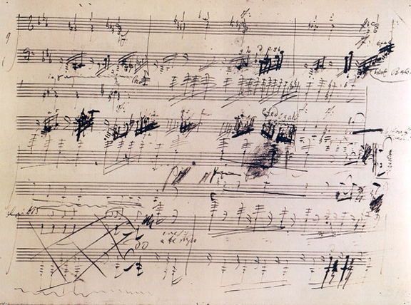

-#Test-Driven Analysis

# Chapter 13

Beethoven wasn't a pleasant person to be around.[^13-1]

[^13-1]: There are a lot of really great ways to get to know Beethoven. I'd recommend the Great Courses "Listen to and Understand Great Music" series. Also there's an entire series on "Beethoven's Symphonies", which is excellent. Get the mp3s and listen while you workout. Much fun.

As a child, he was brought up from birth to be a great composer, so that's what he became. He didn't live in Vienna, which was the artistic center of the time. He lived out in the boonies, on the wrong side of the Rhine -- but he studied and practiced like the dickens. He had an abusive, alcoholic father. He didn't do anything but play music as a kid, so he had no social skills. The worse his family life, the more he withdrew to himself.

Once they realized they had a genius on their hands, the Beethovens sent little Ludwig to Vienna for Haydn to teach. Haydn was a prolific composer, the darling of the town. He wrote more than 100 symphonies. He was kind and gentle. They called him "Papa". It was an honor to have him as a teacher.

Before he met Haydn, Beethoven had never been in a competition, so he went to his first one. All the other kids were quite experienced. Many of them laughed at the country hick trying to compete at their level.

Not for long. Beethoven cleared the room easily.

Leaving for the contest, one guy said to his friend, "We must make mincemeat out of him!" They left in a happy mood. Good times. 

Arriving back home, the same guys weren't so happy. What happened? 

"Oh. I'll never forget yesterday. Satan himself is hidden in that young man...He can overcome difficulties and draw effects from the piano that such as we couldn't even allow ourselves to dream about. "

"What is this man's name?"

"He is a small, ugly, dark, and wild-looking young man....his name is Beethoven."

Beethoven was a machine. Somebody else put it like this:

"His improvisations were the most brilliant and striking. In whatever company he was in, he knew how to achieve such an effect in every listener, such that frequently not an eye in the house was dry while many would break out in sobs. After ending an improvisation of this kind, he would burst out in wild laughter and banter his hearers on the emotions he caused them. 'You are fools!' Sometimes he would feel himself insulted by these indications of sympathy. 'Who can live among such spoiled children?'"

Yeah. He wasn't a pleasant person to be around. But the danged guy could play and compose.

Haydn was the master of what music was at the time: the history, the complexity, the nuance, the milieu of classical Vienna. Beethoven was the master of what music was going to be: a personal expression of art from the artist to the audience.[^13-2]

[^13-2]: Sometimes not even to the audience. Beethoven was happy just to have taken his inner feelings and created great art with them. He knew that future generations would appreciate and love him. (He wasn't the most modest person, either.)

Haydn at 58 was at the top of his game. He had invented a huge part of the Viennese classical style. He was a master of form. He could compose in his sleep. Kings paid Haydn to compose and create great music. He had just returned from a whirlwind tour of England. Now, back at home, he was given the job of training this bit of an uncontrollable hellion from the sticks into something worthwhile. The kid was obviously a genius, but he had his own way about everything.

Beethoven was not honored. We don't know for sure, but it's likely that Beethoven found him a nice but silly and pretentious old man peddling tricks from a long-lost age -- an age best forgotten. For his part, Haydn had to know that Beethoven was a master of music, in many ways his better. As unruly as Beethoven was, it was impossible not to acknowledge his talent.

Haydn knew the rules and followed them; his audiences knew what to expect. Beethoven instinctively knew *how music worked in the listener's mind* and broke whatever rules he felt like to get his feelings out of his mind and into the minds of the people listening. Haydn could put very complex and beautiful melodies together that would soar to the heavens. Beethoven could do that too -- when he wanted to. He could do whatever he wanted -- and he didn't want anybody telling him whether he wanted to or not.

Haydn learned music from history and culture, from the outside-in. Beethoven learned music from pain and raw talent, from the inside-out.

Neither one was better or worse than the other, but they were certainly opposites! That had to have been a very interesting set of lessons![^13-4]

[^13-4]: The lessons lasted 14 months. A miracle in itself. At one point Haydn wrote Beethoven's town to tell them that he had loaned the poor kid some money just to get by. They wrote him back and told him that Beethoven was already getting several times the amount he told Haydn he was getting. He simply was blowing all his cash on other things, then hitting up Haydn for more.

Because Beethoven viewed music itself differently from those around him, many times even the audience itself was left wondering what was going on. Even Beethoven's most famous symphony, the Fifth, received horrible reviews when it first came out.

## Beethoven and the origami complexification factor

Varied unity. Unified variety. When you know the pieces and learn why they fit together the way they do, you're able to take them and rearrange them to do anything you'd like, like repeating tiles on a floor. Or an Escher painting.

Take Beethoven's Fifth Symphony.[^13-6]

[^13-6]: As you might imagine, I am vastly over-simplifying a ton of things from Beethoven's life. I have to, otherwise this book and a dozen more would be just about Beethoven -- not Structured Analysis. This is cartoon Beethoven and Haydn. The real men were much more complex and interesting. But we can learn something from the cartoon versions too.

For years while he was in Vienna, Beethoven wrote works that looked and sounded mostly like what people would expect. Music back then isn't like it is now. Today, music is mostly passive. We listen, tap our foot, then go about our business while it plays in the background, competing for our attention among a dozen other things. You can have favorite songs that you don't know the lyrics to.

It wasn't like that back then, there was no radio or TV. Music and the theater were complex and intricate things that were the focus of extreme attention. Listening to music was an active and skilled thing to do. People spent time preparing for and talking about performances. You might save up all year to go see and hear one symphony. It was nuanced, complex, and miraculous.

And it had rules. Today if you watch a zombie movie, there are a few things you're looking for: the first sign something is wrong, the realization that they are the undead, the sidekick that gets bitten, and so forth. These are the automatic and required parts of a zombie flick.

People went to hear music back then with scores of things like that. They were looking and listening intently. Did that oboe solo lose tempo about half-way through? Was the minuet and trio balanced for the rest of the work? These are things that only music nerds might talk about today. Most everybody knew about them back then. There was nothing else to do. Bonanza wouldn't start on TV for another 200 years, and Rick and Morty a long time after that.

So Beethoven was in an unique spot. He had found his way to music mostly on his own, and he understood how all the parts came together both to show how he felt and to make the audience feel one way or another. But he lived in an age where music was just as much form as it was function. There was required structure. Expectations. It was a form. People didn't listen and become happy and then talk about the structure of the music. They interacted with the structure of the music and that made them happy. (Happy, sad, whatever). When you listen to some great intricate Baroque music, it organizes the mind. Haydn's works fit together almost mathematically in a pleasing way. It makes your brain happy.

Needing money, Beethoven played the game he had to play, at least as much as he could being Beethoven. Once he had been in Vienna for a few years and got known, the money started coming in. He remarked to one person that he finally found the sweet spot. Whatever money he asked for, people paid.

Even then, though, he kept pushing the limits.

As he composed, he was a keen observer of things around him. He used to love to go on walks in the countryside. When he heard things, he would "sketch them out" using music notation. He kept books of his musical sketches. Later, when he was composing, he'd go back to the sketches, pull things out and arrange them.

Beethoven didn't compose as much as he just lived, absorbed life, then re-arranged his experiences into beautiful tonal rhythmic creations that conveyed his view on life. His heart. His work could probably be best called a musical diary. As we listen to Beethoven over the years, we're traveling inside his mind through time.

By the time he got to the Fifth Symphony, he was tired of playing by the rules.

Everybody knows how Beethoven's Fifth begins. Bum-bum-bum-bum! Bum-bum-bum-bum! It's almost universal.[^13-8]

[^13-8]: If you haven't heard Beethoven's Fifth Symphony, you're in for a treat! There are plenty of free downloads online. I recommend listening to it one time, then listening to somebody explain how it's all done, then listening again with fresh ears.

With Haydn, such a theme would be analyzed in terms of melody and harmony. Let's face it, there's not a lot of melody there. In fact, it sounds like somebody knocking on the door. Perhaps it was fate, telling Beethoven his time had come![^13-8a]

[^13-8a]: Later on, somebody actually made that up -- that Beethoven took "Fate's knock on his door" to start the symphony. He did not. It was birdsong. But the fake idea took hold, and to this day we call that "bum bum bum bum" sound the "fate motif". Fake but true news, from the 1800s.

With Beethoven, however, the *rhythm* of the "knock-of-fate", the bum-bum-bum-bum, was as important or more important than the sounds of the notes themselves. When you hear the symphony, he does the intro, then he moves the same sound down a bit and plays the intro again. The first minute of the symphony is that same rhythm and sound, the "fate motif" played over and over again in different ways. Kind of like a kid with a cool sound humming it to himself.

Finally we get to something that sounds different. The music changes around a bit. But wait! What he actually did was take the initial tones that started out, stretch out the timing, and make something that's kind of the same, only a little different. To us it sounds like a new tune, but if we stop and really listen, we realize it's just the other tune folded around a bit.

That goes on for a while, then there is a new tune.[^13-8b]

[^13-8b]: I am butchering any kind of understanding of music and the symphony. I apologize. It's very difficult to convey these ideas to a non-musical audience, especially in printed form. If I had started using more technical (and correct) terms, it wouldn't work. So please, music friends, put down you conducting batons and relax a bit.

But wait! That's just the last tune turned upside down with a trill added. That dang Beethoven. There he goes again! 

It's all the same thing! It's all that same bum-bum-bum-bum from the beginning, only twisted, turned, folded, and stuck into parts that sound new, but are actually just new versions of the older thing. E-gads, he's just taken a rhythm and some bird song and twisted and turned it into an entire symphony. How'd he do that?

Ever watch somebody who's really good at origami, where you fold paper into cool shapes? They can take a piece of paper, fold it just the right way, and end up with a boat, or a bird, or a duck, man, or just about anything. It's quite amazing. 

Beethoven does that with rhythm and tunes, only he does it at level 100. He picks up a tune, shows it to you, turns it about a bit, does some folding, then there's another tune -- but it's really the first one. Then he takes those two, moves them around some, flips them upside down, and suddenly you've got this more complex thing, but it's just different versions of that simple thing, only folded around kinda clever. The music and rhythm keeps folding and twisting in on itself.

In the Fifth Symphony, Beethoven takes a very small number of musical ideas he gets from nature, shows them to us, works with them while we watch, and in the process this magnificent symphonic story happens. We're transported inside Beethoven's mind where musical ideas form, interact with one another, struggle, and become new things.

We don't see it today because, well, frankly we don't pay that much attention to music. Those days of complex music where everybody understood a lot of things are gone. To us it's just a bunch of instruments all playing something that sounds kind of pretty. But to people at the time? It blew their mind. It was indeed something incredible.

It's as if Beethoven, instead of making a duck out of a piece of paper, picked up a stack of paper, made a duck, chicken, man, and a boat, then, while we will were watching, folded them all together into a high-resolution, 3-D movie about Noah and the flood. People at the time left wondering something like "What the heck did I just hear? Was that awful or brilliant?"

They were expecting to participate in a wide, precision pageant where all the pieces of the orchestra worked in harmony. They saw and heard something very close to that, but they also saw some kind of crazy magic trick where this guy took all the pieces you use to play "real" music, shuffled them around some, then punched them in the head with an emotional story about the battle of light and darkness.

Beethoven knew how to capture and remember pieces of sound and rhythm. He was a master at manipulating and permutating those pieces. That allowed him to make new, complex and beautiful things out of tiny little pieces of almost nothing. Looking at each little piece, it didn't even look like a tune, much less a song or symphony. But putting them together, he made magic happen.

In a very real way, Beethoven didn't sit down to write a symphony. He sat down to assemble musical bits of tagged information, rhythm, tune, melodic conflict, juxtaposition, and so on -- into larger things that reflected his insides. He absorbed life and transformed it into meaning -- both for himself and the rest of us.

Before Beethoven music was form and ritual, beauty and standards, the audience and musicians were part of a set. After Beethoven music was self-expression and timeless impact, freedom and surprise, the artist made art that was a deep part of him. 

Nothing would ever be the same.

## EasyAM

Music happens all the time, whether we realize it or not. Beethoven heard it, captured it, then put it to his own uses.

Analysis happens all the time, whether we realize it or not. We can hear it. We can capture it, we can put it to our own uses.

What's happened with analysis is much the same as what happened to music before Beethoven: the form, ritual, paperwork, and pageant part is all that it means to people. We've done this so much that most people hardly ever even use the term "analysis", although that's what they spend most of their time doing. 

How many project kick-off meetings are there where they make good speeches, you meet the bosses, and you leave with a feeling of success -- but you don't have a common grasp of what, exactly it is that you're doing and why, how everything relates to everything else. Yes, you were told, using plain English and wonderful prose, but without group consensus, without questioning, without a shared model, without **Analysis**, it's all just happy talk. "We're going to implement the gestalt into a prepared and willing niche," is a joke. Business buzzwords have become their own form of humor. But it's not far from what many people hear in kickoffs.

How many meetings share data in various forms, graphs, charts, projections, cohorts, and so on -- but it's not universally understood how the data fits into everything else that's going on? Or if the meaning is understood, does the fact that new analysis is needed, does that get to the people that need to know? We have a library of important information in our heads. Where's the card catalog system?

There are no warning lights that go off when communication fails. There's no klaxon sounding, there's no horn that blasts. When communication fails, it fails without a trace. People talk, they smile, they leave. All with different mental models. You don't find out about that until much, much later. Many times it is not a happy experience. Information doesn't get where it needs to go. People die.

We won't be writing any major symphonies, but now that we know how to take "analysis sketches," let's take those sketches and assemble them into things we use in our day-to-day life.

Just like Beethoven started with sounds he heard in nature for many of his great works -- birdsong, brooks, wind, storms, people talking, pub music -- we start with our analysis notes and transform them into whatever we need.

We want to be able to take and annotate our notes without using a complicated tool, then organize and share them automatically without any extra work. If we're getting together for Analysis we should do that. Analysis. If we're moving around lists, models, and data organized into our important concepts, then we should do that. They're two separate things.

After all, the process of identifying important concepts and having conversations around them is the most important thing your team does, no matter your job. Even more importantly, any data we could collect, by definition, will fit somewhere in our analysis model.

Everything else we do in life we record and distribute. The key points where conversations occur, our analysis model, is certainly more important than pictures of our cat, right?

If we have a system for tagging everything, we can automate it, and just like Beethoven, we can plug it into various transforms and re-statements that are useful to various people.

From here on out, we're going to use a freeware tool called **EasyAM**, which stands for Easy Analysis Modeler. It takes our tagged notes in plain text format from a bunch of files, sorts all the information by tags, then spits out all the information sorted into our genres, levels, buckets, temporal indicators, and master models.

We could do all of this work by hand, of course, but by using an "Analysis Compiler", we're able to move much more quickly from gathering notes from various sources, working in real-time, automating creation and consumption of information, applying testing criteria to make sure we're not spending too much time in analysis, creating add-on tools that convert the information into all kinds of useful end-products -- all from the same simple set of notes.

It's the origami complexification factor, put to good use.

By breaking things down to the smallest pieces and using a tagging system, we can enter however much we want. Maybe those notes are enough. Great! We're done.

The notes above took five minutes to enter for a new team and create user story cards for that team to use in project planning. Spending another five or ten minutes makes the cards even better. Or not.

The team and project requirements decide how much it needs.

Perhaps they'd like a domain model for our nouns. If so, directly under our notes for today (or wherever else we'd like to put it), we add in the model details.[^13-52]

[^13-52]: Automated domain model creation is currently not supported by EasyAM, but it's on upcoming features list.

We've separated the note-taking from the drawing. If you like drawing things out, you can always do that. I like modeling and sketching as a group and that's the way I work. It's fun and fast. But I still write the notes down the same way.

If you want some output, like story cards, reports, or diagrams? That's just another output in the tool-chain. There could be dozens of different outputs. Because everything is tagged, and because we know how to handle the tags, we can connect up various tools in a chain to collect and disseminate analysis-related information.

Perhaps there's a stream of data the team wants to capture that needs to be used as input to future conversations around the analysis model. Great. Take the model -- as detailed or vague as you've made it -- and stick in the information you'd like to view later on during Model Synchronization.

This section will be about downloading, installing, and using the tool in various small-team scenarios. Scaling up we'll also start creating an information pipeline to handle things like bug reports, user interviews, field notes, statistical process control data, and more.

As we work through the rest of the book, our simple tagging system will either stay simple and easy -- or become as intricate and detailed as we need to continue Analysis. The old way was all about structure, filling out forms, handling document flow. The new way is about taking small pieces of important conversations, tagging them, then creating a map as detailed as required to support the work in front of us.