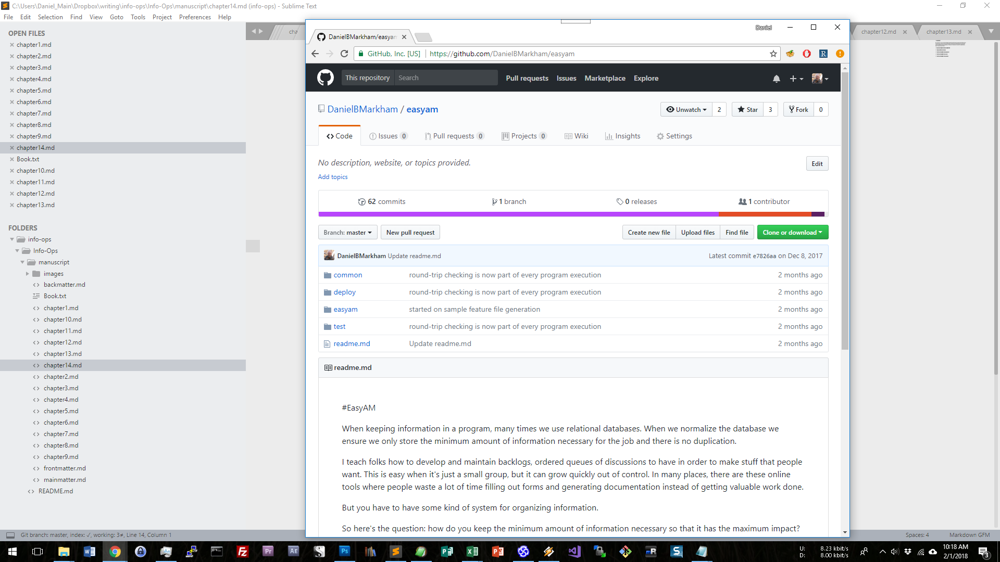

# Chapter 14

We've done a lot of sketching various analysis scenarios, and while that will continue, we'll also start working on larger analysis models and automated collection and processing. So we'll need a tool and a bunch of sample data. Here's how to get that:

## Downloading and Installing EasyAM

### General Instructions

First, get the latest version of the compiler and sample data files by opening your web browser and going to [https://github.com/DanielBMarkham/easyam](https://github.com/DanielBMarkham/easyam)

Once there, you'll see a green button that says "Clone or Download". Click on that. If you're a programmer and know how to use git, you'll probably clone the repository. Otherwise you'll click on the "Download zip" button to get a zip file of the project.

Once the zip file has been downloaded, extract it into a folder that you can remember. 

### Instructions for Windows users

### Instructions for Mac users

### Instructions for Linux users

## EasyAm Hello World

## EasyAM Tagging Language