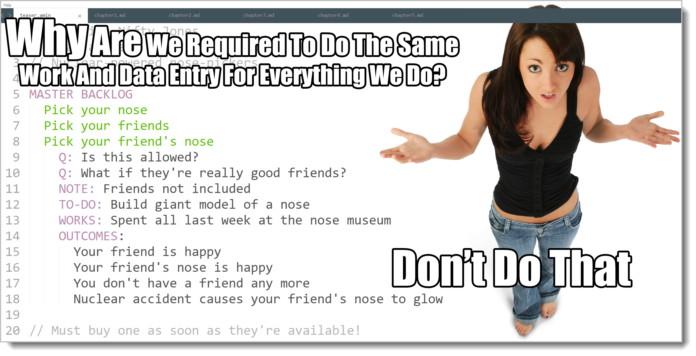

# Introducing EasyAM




If you've ever worked with databases, there's a thing called "database normalization". This basically means for any set of data you are collecting about a problem, there's a way to store and use it getting the maximum amount of value using the least amount of space and effort.[^14-1]

[^14-1]: Insert long discussion here about Codd, document-oriented databases and the NoSQL movement. Sometimes that makes sense -- but database normalization still represents a type of optimizing information gathering and processing.

When it comes to Analysis, when you don't have a lot of anything, the way you store it doesn't matter that much. A technology project with a co-located team? One that works alongside a real owner and real user that only lasts for a month or two? It might make do with nothing formal at all -- although I'd still make that master model. Everything hinges off of it, and it's far too useful of a tool (and easy to make) to pass for projects of any size.

But when you're asking a lot of questions and gaining alignment, you can cover a ton of territory. Even if you decide *not* to do something, that might be an important conversation point. I've been known to make a quick list of "excluded behaviors" at the bottom of my master backlog. When a lot of ground is covered, it gets difficult to get back to a certain point again if you have to revisit it. People can only hold so much stuff in their head at one time.

And behaviors define the borderlands, the demarcation point between "stuff we're doing" and "stuff we're not doing". If it's not in our master backlog, we're not doing it.[^14-2] On larger projects we tend to visit the borderlands again and again.

[^14-2]: I've never done any detail work on anti-behaviors. I guess it's possible. I wouldn't advise it, however. The important thing about anti-behaviors is that they help qualify and add detail to real Master Backlog Items (MBIs). So it's great to note they exist, then figure out what detail you're missing in the MBL, if any, that the anti-behavior points out. Many times they make excellent reminders of conversations that ended with the team deciding something was out of scope. (So while anti-behavior details don't make sense to me, listing them in the notes might be a great idea.)

We've worked out that we've got the minimum set of tags. We've also worked out how to organize things using our tags into pyramids with cross-linking items. This is the minimal system necessary for organizing any analysis data.

But like we said, this stuff gets out of hand quickly. People send us emails with stuff we need to remember, but not right now. There are feature discussions that are important to stuff we delivered six months ago. There are all of these random notes we gathered when we had that weekend user workshop. Information grows like a snowball -- which is one of the reasons the tagging system is so important in the first place. Too much gets lost and/or stuck somewhere it shouldn't be.

For any project we have that's non-trivial we'll need to store information and recall it. Now that we're moving from theory to application in the book, we'll also start working on larger analysis models and automated collection and processing. 

You may be asking: Do we really need to move to programming? Does every technology system have to end in some overblown tool that we install and use? Isn't this just the opposite of what we've been learning all along?

It's a good question. Working by hand with physical items in a group is always best. It creates a situation and a game where the dialectic naturally happens.

**Transformations always happen manually**. No matter how we tag or move anything around, the real work always happens in the heads of the people in the team, not anywhere else. That means that *changes to the shared mental model always happen before the written model changes, never the other way around.* It won't work the other way. The written analysis model "knows" more than you do because it remembers all the connections and notes that caused important conversations to happen, and can point us to new ones we haven't thought about yet, but it doesn't actually know anything. So there's no way it could change without the shared mental model driving that change.

We can tag and move data around all day, but we cross a line when we start transforming the lists and structure of our model into something new. The important part of our work is the transform, and for that we need the dialectic. Always.

We may have to work with seven-thousand item backlogs. (Yes, I've seen them.) We may have thousands of items on a bug list. Our work will be the same as it always was, we just use tools to work through any grunt work. There's no point in banging our head against a wall. Since the nature of analysis is always having more data and information than you need to work with at one time, we'll need some way of working with lots of data.

So, like it or not, to continue forward we'll need an electronic tool. We'll also be talking about what can be automated and what can't.

We'll cover the simplicity of the theories involved, things like estimating, grooming, or prioritizing, then the complexity of the data, then how to combine both the theory and the data simply in order to physically organize our thoughts as a group. Throughout this we'll be using tools to move data around.

So put on your tin-foil hats and pocket-protectors, kids! We're getting our nerd on. 


## Downloading and Installing EasyAM

### General Instructions

First, get the latest version of the compiler and sample data files by opening your web browser and going to [https://github.com/DanielBMarkham/easyam](https://github.com/DanielBMarkham/easyam)

Once there, you'll see a green button that says "Clone or Download". Click on that. If you're a programmer and know how to use git, you'll probably clone the repository. Otherwise you'll click on the "Download zip" button to get a zip file of the project.

Once the zip file has been downloaded, extract it into a folder that you can remember. 

You should have a bookprog folder. Inside of that you'll have a sample data folder. Inside of that there will be the samples we use.

You will need to have the .NET CLR 4.0 libraries or later installed to run EasyAM. All Windows and most Linux installations already have these available.

Installation can get kind of tricky depending on what sort of computer you have -- and these kinds of things are always changing. Instead of my trying to write a book-inside-a-book on running .NET programs, if you can run .NET programs, you can run EasyAM. Most major computers can do this.

If not? If you have a special situation or would like to help others, join the forum! Info-Ops was written using LeanPub. Not only can you buy the book and subscribe to automatic updates there, there's a forum where you can get the latest up-to-date tips and advice. [https://community.leanpub.com/t/easyam-installation-and-setup/340](https://community.leanpub.com/t/easyam-installation-and-setup/340)

(You'll have to sign-up first if you've never visited LeanPub before.)

Go there and join the Info-Ops gang. Not only is there help for EasyAM installation, there are all kinds of other cool stuff there too.

Once you've got .NET and EasyAM installed, from a command line in the bookprog folder, type "easyam --help". 

You should be looking at help text which includes some sample easyam code.


If you want to use EasyAM in a lot of places, and you probably will, you'll also need to add it to your PATH, so that it will run no matter what directory you are in. Or if you're lazy, you can just copy it and its DLLs around to whatever directory you want to play in.

## How Does EasyAM Work?

Once EasyAM is installed, using it is fairly simple:

1. Take mostly freeform text notes using the EasyAM tags.
2. Pick a directory for everybody to use. 
3. Save your notes with an ".amin" extension. (amin stands for Analysis Model IN).
4. Run the EasyAM compiler (Point it to your input directory if you are running it from somewhere else).
5. The compiler goes through all of your .amin files in that directory and its subdirectories *in alphabetical order*.
6. Using the tags, it sorts, organizes, collates, and creates all of the pyramids and crosslinks for you.
7. It outputs everything in a standardized .amout format. (amout is for Analysis Model, OUT).

Each file starts from a completely blank slate. As you add tags, you indicate where you want to put the information. So if you had some notes to add for the Master Backlog Item "Wiggle When I Walk", you'd start with a fresh file and do it like this:

```
MASTER BACKLOG 
  Wiggle When I Walk 
    NOTES:
      Wiggle in the walk
      Giggle in the talk
      Makes the world go round
      Ain't nothin' in the world 
      Like a big-eyed girl
      That makes me act so funny
```

And so on.

You identify where stuff goes, then put stuff in there.

Indentation is important. In the above example, by moving in another indent level each line, we show that this line goes under the previous one. If I mess up an indent, weird things happen.

Let's say I lost an indent on the last line.

```
MASTER BACKLOG 
  Wiggle When I Walk 
    NOTES:
      Wiggle in the walk
      ...
  That makes me act so funny
```

In this case, I've created a new Master Backlog Item titled "Makes me act so so funny", which is not what I wanted.

The program eats its tail, that is, it outputs in the same format as it inputs, so you can take all of the organized, sorted, and processed .amout files and use them as input for another project. 
  
This means we can pipe analysis information from one project to another, or to another online system that reads EasyAM

I always prefix my .amin files with the date in yyyy-mm-dd format along with my initials. So the analysis notes I took on March 1st last year are named "2018-03-01 dbm Initial Notes.amin" This way when EasyAM processes alphabetically, the notes are processed in correct date order.

EasyAM takes source and destination directories as optional parameters. If you provide them, it uses them. Otherwise it uses the current directory. You can also output everything to a single file if you like.

```
./easyam /S:./infiles /D:./outfiles /O:SINGLEFILE=myfile.amout 
```

The above example takes all of the files ending in .amin in the ./infiles directory, processes them alphabetically, then outputs the entire model as one file to ./outfiles/myfile.amout


### It's Programming, Silly

A key concept is that EasyAM works just the same as any other programming tool or language on your system. You can edit files using your IDE, you can version control using DropBox or something like git (for more advanced usages). You can diff two files, you can share common master files and use/maintain your own project-related ones.

If all of this sounds too nerdy for you, if you have DropBox and a small team, create and edit your files in notepad or some text editor and save to a DropBox folder. DropBox will handle all of the moving around, sharing, and versioning for you. If you move past a small team, you should learn to use git and GitHub and save and version your files that way.

For this section, we're going to be talking about working in a small team. (It might be a huge project, but the number of people is small.) So use whatever works for you. Notepad or some other simple text editor will go a long way.

### Keeping Current and Getting Help

To keep current with the progress of EasyAM, which is open source and free, simply visit the GitHub site. GitHub also has a feature where you can watch and be notified when the project changes.

To get assistance or report a bug, send an email to help@easyam.org

Now let's organize some stuff!

{blurb, class: information}

### Did you get it?

You learned why it's easier to use a tool to slice and dice the tagged information instead of trying to do it all by hand. You learned how to download the free tool that comes with the book and in general how it works. Yay! No duplicate work! Enter only the minimum amount necessary!

{/blurb}