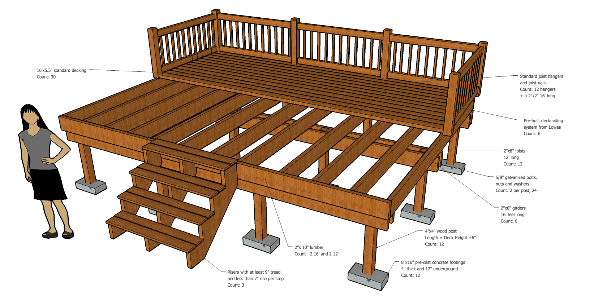
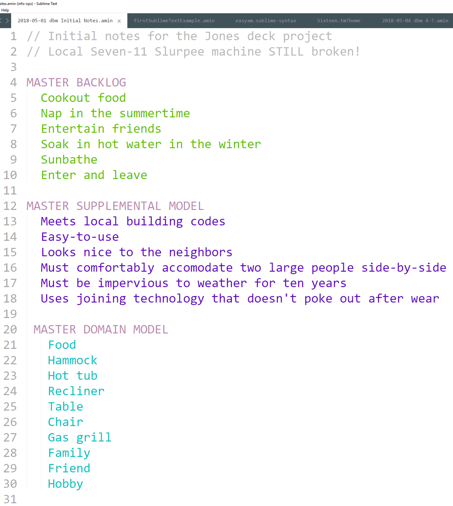
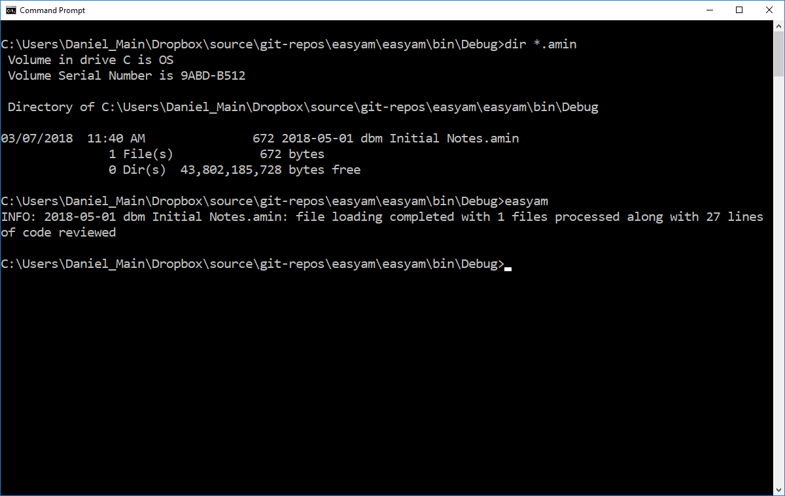
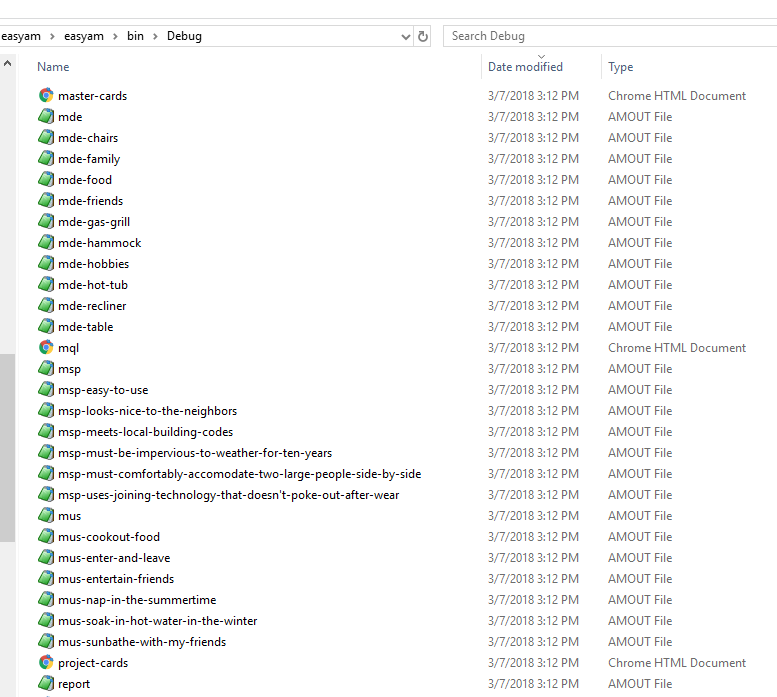
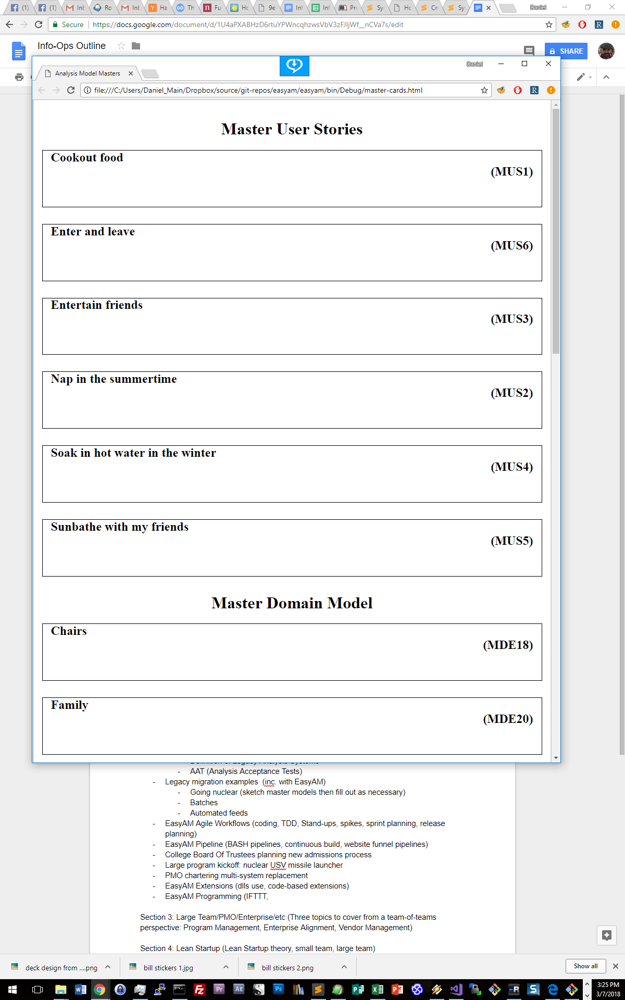
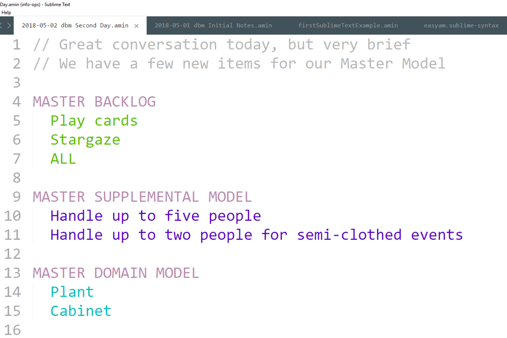
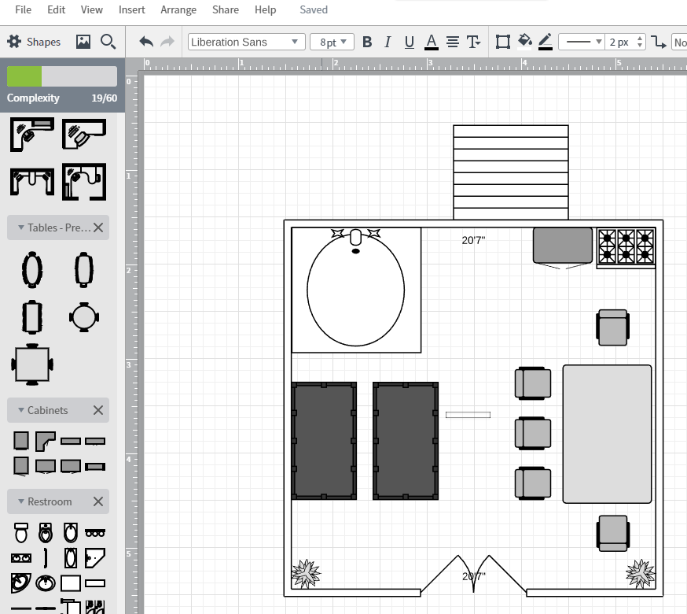

## Chapter 15

After trying your hand at dog houses, dental franchises, Mars colonies, and several other jobs, you've decided that the best time you had was back when you were building stuff. You've also decided that dog houses suck. What to do? Build backyard decks, that's what!

After reading this book, you're determined to do this the right way, maybe even do a little too much up-front work just to make sure you do a good job. When your first customer comes along, instead of just chatting and sketching something on a napkin, you chat and jot down your master model as you go.

What does the world of backyard decks look like in this guy's mind? After 15 minutes of chatting, here's your Master Model sketch.

**MASTER BACKLOG**

- cookout food
- nap in the summertime
- entertain friends
- soak in hot water in the winter
- sunbathe with my friends

**MASTER SUPPLEMENTAL MODEL**

- Has to meet local building codes 
- Has to be easy-to-use
- Has to look nice to the neighbors 

**MASTER DOMAIN MODEL**

- food
- hammock
- hot tub
- recliner
- table 
- chairs 
- gas grill
- family 
- friends 
- hobbies

Also, there were a few times where he started giving out structural pieces, like he was designing it in his head.

- "Those steps will need to be six-feet wide"
- "The railing should only be a couple of inches apart."
- "Boards ought to be made of that red stuff you see in pictures"
- "I don't want to stub my foot on a nail"

If hadn't read this book, or if you were like many technology teams, you'd take these statements as requirements. "Oh, we will have steps that will be 6' wide. Here are specs on the railing. And wow, looks like we'll be buying redwood! This will get expensive! Also we should buy headless nails. Do they make those?"

But nope, you ain't falling for that one. ***All structure is deriviative.*** That means that whenever a customer or Product Owner starts talking structure, it's the result of some kind processing they've already done in their head. Maybe what they concluded makes sense. Maybe they had bad or incomplete information. Maybe they're thinking about a problem from a different angle than you are. (This is actually the most likely thing to happen. If you're talking to a guy about building a backyard deck, he's probably loading up a mental model he shares with the family about outside fun at home. That's got all kind of items and linkages that you don't know and probably don't matter)

If you take structural information at face value, you've abandoned the dialectic. That's not happening.

So you push back, gently. You list those sentences and say you'd like to talk about them further. After just a few minutes, you've eliminated this extraneous structure stuff and gained more insight (and continue to align mental models with your customer)

Here's how those statement decomposed:

- "Those steps will need to be six-feet wide" -> Uncle Joe and his wife Edna are very large people who like to hold hands a lot. The steps need to accomodate them without making them uncomfortable
- "The railing should only be a couple of inches apart." -> He read somewhere that babies can get their heads stuck in railing and die. You point out that building codes cover this problem and a lot more. Is it okay just to abide by the codes, instead actually having a 2" gap? Or is there something else? Nope. So this item is deleted
- "Boards ought to be made of that red stuff you see in pictures" -> He wants redwood *stain*, not expensive hardwood. He doesn't know what he's talking about, he's never built a deck. He likes the redwood stain and wants weather protection for ten years
- "I don't want to stub my foot on a nail" -> He visited a friend last year who had an old deck and stubbed his foot on a nail.

Out of all of that, we've got three supplementals. One Business Abstract Supplemental: "All entrances must comfortably accomodate two large people side-by-side". We've got two System Abstract Supplementals: "Structure must be impervious to weather for ten years", and "Use joining technology that doesn't poke out after wear (screws, for example)"

We have no structure information, although if we had let him, he'd probably start sketching out deck designs on a napkin. Then he would be doing the work, we'd just be preparing materials and joining them. There are a ton of technology teams that think this is an ideal situation. I feel sorry for the people who pay them. 

We've also began to establish some rapport with our customer, learn about his life. Maybe we've started to become friends. Remember, he doesn't know Structured Analysis. From his side, we've taken care to learn more about what's important to him. This isn't you taking over the project. This is you showing that you're actually concerned about what the guy wants and the quality of the work.

We've asked permission to learn about what he really wants and what he's afraid of, and we've asked him if we could have the honor of sketching out some ideas and talking to him about them instead of having him giving us a model made out of Legos or something. All of this adds what we know to what he wants.

So we have three more supplementals. For now we'll put the System Supplementals up at the top of the model, in the Business Abstract spot. Easier to use that way. Sue me. We've also got a new behavior, one that seems obvious but was never brought up: I need to enter and leave the deck.

### Loading up EasyAM 

So that's our Master Model. The customer has to leave, so we agree to meet in the morning. Over lunch, we enter the Master Model into EasyAM. We make a text file named "2018-05-01 dbm Initial Notes.amin" The contents look like this:

Dang, that's pretty much word-for-word what our hand-scribbled list was. Very cool. So let's run EasyAM!

Doesn't get much better than that, does it? We type the command in and --- nothing much happens. Just one line that begins with "INFO"

EasyAM is set up to run in "silent" mode by default, and plug into an IDE, so if everything's working there's not a lot to see. But if we take a look at our directory, a bunch of stuff has shown up.

That's all fine and dandy, but we don't have all day to be playing around with compilers. Remember our pattern: load a bunch of data from somewhere, filter it out to some usable chunk that we can work with physically, then do the work.

At the top of the file list there's a file called "master-cards.html". Let's open that up in Chrome.

No. Not exciting. But if we go to File/Print, we see that these are configured to print out as cards we can work with physically. They are funky-looking cards that don't have much of anything in them, but we haven't put much data in so far either. And maybe that's all we need. So let's print them and get to work.

We print our Master Model cards and scatter them out on the desk and think about sketching out a potential deck to show our customer. A sketch is a physical object, a structural model of how the various pieces will look when assembled. It's probably the perfect tool to drive out more analysis.

Speaking of analysis, we've got "Enter and leave", but enter and leave where? The backyard? The house? Both? Is the side yard important? Do we want an escape hatch? We could speculate all day -- or just write "Where?" on the "Enter and Leave" card.

How about this "Sunbathe with my friends"? This guy got two friends or 50? As a matter of fact, a lot of these things happen with a group of friends. We'll write "How many people?" on the cards about cooking food, enter and leaving, entertaining, soaking, sunbathing -- heck, it's a question for every behavior. (And the answer is probably going to be a supplemental)

We sketch out a deck and go to meet our customer the next morning.

### EasyAM Round 2: We have questions

We tell our customer first thing that we need to talk a lot more than 15 minutes to get this thing nailed. He agrees! Yay! He has a full 30 minutes today.

Sigh.

Making the most of what we have, we show him that all we've got for a sketch is just a large square -- the more he has time for us, the quicker it will work and the happier he'll be. We get our questions answered. When he says "friends", he means his family, which has three people in it. Make it five people when they dine out. He's very shy, so sunbathing is a one-person event. The deck must connect to the house and the backyard.

We ask some more questions around his family, friends, and hobbies. Are there hobbies the deck has to support we haven't thought of? He doesn't think so. (It's good to ask open-ended questions around structure: what are the kinds of poodles you will be stuffing, Mrs. Rogers?)

That was quick, so we throw in some System Realized stuff so he'll think that we're smart, maybe show him the seven kinds of non-nail fasteners, the history of each, and ask his opinion on them.

We tell him we'd like to bring a more professional model back tomorrow, do some interactive work. Could he spare an hour? Seeing that we know our business, are capable and thorough, and are concerned about his values, he agrees.

By acting in a professional manner, using Structured Analysis, gently explaining to our customer how he can be the happiest for the money he's spending, negotiating carefully with him to give him what he wants, we are establishing trust. Aside from job competence, the reason most projects fail is due to a lack of trust. We create poor, buggy products. We don't spend enough time together. We become order takers for the customer instead of friends and partners. We use bait-and-switch tactics with staffing. All of these create a lack of trust, and a lack of trust kills projects.

But -- since we understand the dialectic, and since we can use Structured Analysis in freeform, open and natural conversations, as long as we're craftsman at what we do, we're always establishing more trust simply by being there and chatting.

Back at home, we take a look at our handwritten notes from our chat. We've added some stuff and answered some questions. We make a new file named "2018-05-02 dbm Second Day.amin"

We don't need to do anything with our stuff from yesterday, so we just start a fresh file as if we were starting all over again, but only put in the new stuff. EasyAM will join it all up behind the scenes. One thing we want to all is an "ALL" Behavior. It's placeholder. We don't have any detail for it, but whenever we have notes or questions about the entire project, we can stick it under "ALL" Our file looks like this:

We run EasyAM and print out our cards again, ready to do some work.

We're ready to add some snap and pop to our conversations, but we don't want to end up sitting around a computer. After we sketch out a second draft of a deck, we go to Google Drive and add a LucidChart diagram of our deck.

It's not Monet, but it was quick and easy. Better yet, free! We can print this diagram, we can create a link and share it online, we can even work together online with people all over the world....

Wait a minute! There we go focusing on the tool again, dang it. It's great because it's free and we can send links if we need to. That's it. We don't work in it. Just like EasyAM, it exists to clean things up and store semi-permanent things as bits so they're easy to move around. And just like EasyAM, it's not something we "work in"

Carpenters don't go around staring at their hammers and we're not going to go around staring at all of our cool apps. We're professionals. We know better.

While we're moving our cards around and creating our latest masterpiece, we have more questions and some notes we'd like to remember. The easiest thing to do is jot them on the cards again, but we might forget the cards in the morning, and it'd be nice to be able to print the cards with the notes and questions on them.

Never fear! We'll just add them at the bottom of our notes, like so:

I stopped at a few questions so the graphic would fit in the book. In reality, we'd probably easily have a dozen questions or more.

We run EasyAM again. This time it tells us it has processed two files, and when we look at our Master Cards? There are our questions and notes! We print out our Master Model cards. Then we print out our fancy deck layout diagram. Those things always impress. Finally, we print out the deck diagram one more time, *then cut out each piece of furniture as it's own little piece.*

