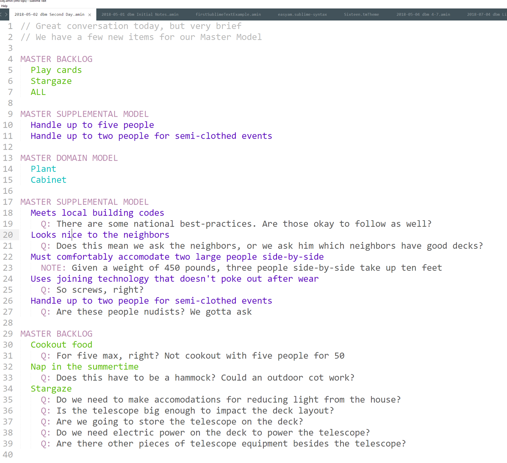

## Chapter 15


After trying your hand at dog houses, dental franchises, Mars colonies, and several other jobs, you've decided that the best time you had was back when you were building stuff. You've also decided that dog houses suck. What to do? Build backyard decks, that's what!

After reading this book, you're determined to do this the right way, maybe even do a little too much up-front work just to make sure you do a good job. When your first customer comes along, instead of just chatting and sketching something on a napkin, you chat and jot down your master model as you go.

On your first meeting, you tell him that you're doing this a new way, and that he should expect a half-dozen small conversations before you settle on a deck design and begin work. But there's no charge for that, and you've found that people love it when you do it this way.

What does the world of backyard decks look like in this guy's mind? After 15 minutes of chatting, here's your Master Model sketch.

**MASTER BACKLOG**

- cookout food
- nap in the summertime
- entertain friends
- soak in hot water in the winter
- sunbathe with my friends

**MASTER SUPPLEMENTAL MODEL**

- Has to meet local building codes 
- Has to be easy-to-use
- Has to look nice to the neighbors 

**MASTER DOMAIN MODEL**

- food
- hammock
- hot tub
- recliner
- table 
- chairs 
- gas grill
- family 
- friends 
- hobbies

Also, there were a few times where he started giving out structural pieces, like he was designing it in his head.

- "Those steps will need to be six-feet wide"
- "The railing should only be a couple of inches apart."
- "Boards ought to be made of that red stuff you see in pictures"
- "I don't want to stub my foot on a nail"

If hadn't read this book, or if you were like many technology teams, you'd take these statements as requirements. "Oh, we will have steps that will be 6' wide. Here are specs on the railing. And wow, looks like we'll be buying redwood! This will get expensive! Also we should buy headless nails. Do they make those?"

But nope, you ain't falling for that one. ***All structure is deriviative.*** That means that whenever a customer or Product Owner starts talking structure, it's the result of some kind processing they've already done in their head. Maybe what they concluded makes sense. Maybe they had bad or incomplete information. Maybe they're thinking about a problem from a different angle than you are. (This is actually the most likely thing to happen. If you're talking to a guy about building a backyard deck, he's probably loading up a mental model he shares with the family about outside fun at home. That's got all kind of items and linkages that you don't know and probably don't matter)

If you take structural information at face value, you've abandoned the dialectic. That's not happening.

So you push back, gently. You list those sentences and say you'd like to talk about them further. After just a few minutes, you've eliminated this extraneous structure stuff and gained more insight (and continue to align mental models with your customer)

Here's how those statement decomposed:

- "Those steps will need to be six-feet wide" -> Uncle Joe and his wife Edna are very large people who like to hold hands a lot. The steps need to accommodate them without making them uncomfortable
- "The railing should only be a couple of inches apart." -> He read somewhere that babies can get their heads stuck in railing and die. You point out that building codes cover this problem and a lot more. Is it okay just to abide by the codes, instead actually having a 2" gap? Or is there something else? Nope. So this item is deleted
- "Boards ought to be made of that red stuff you see in pictures" -> He wants redwood *stain*, not expensive hardwood. He doesn't know what he's talking about, he's never built a deck. He likes the redwood stain and wants weather protection for ten years
- "I don't want to stub my foot on a nail" -> He visited a friend last year who had an old deck and stubbed his foot on a nail.

Out of all of that, we've got three supplementals. One Business Abstract Supplemental: "All entrances must comfortably accommodate two large people side-by-side". We've got two System Abstract Supplementals: "Structure must be impervious to weather for ten years", and "Use joining technology that doesn't poke out after wear (screws, for example)"

We have no structure information, although if we had let him, he'd probably start sketching out deck designs on a napkin. Then he would be doing the work, we'd just be preparing materials and joining them. There are a ton of technology teams that think this is an ideal situation. I feel sorry for the people who pay them. 

We've also began to establish some rapport with our customer, learn about his life. Maybe we've started to become friends. Remember, he doesn't know Structured Analysis. From his side, we've taken care to learn more about what's important to him. This isn't you taking over the project. This is you showing that you're actually concerned about what the guy wants and the quality of the work.

We've asked permission to learn about what he really wants and what he's afraid of, and we've asked him if we could have the honor of sketching out some ideas and talking to him about them instead of having him giving us a model made out of Legos or something. All of this adds what we know to what he wants.

So we have three more supplementals. For now we'll put the System Supplementals up at the top of the model, in the Business Abstract spot. Easier to use that way. Sue me. We've also got a new behavior, one that seems obvious but was never brought up: I need to enter and leave the deck.

### Loading up EasyAM 

So that's our Master Model. The customer has to leave, so we agree to meet in the morning. Over lunch, we enter the Master Model into EasyAM. We make a text file named "2018-05-01 dbm Initial Notes.amin" The contents look like this:


Dang, that's pretty much word-for-word what our hand-scribbled list was. Very cool. So let's run EasyAM!


Doesn't get much better than that, does it? We type the command in and --- nothing much happens. Just one line that begins with "INFO"

EasyAM is set up to run in "silent" mode by default, and plug into an IDE, so if everything's working there's not a lot to see. But if we take a look at our directory, a bunch of stuff has shown up.


That's all fine and dandy, but we don't have all day to be playing around with compilers. Remember our pattern: load a bunch of data from somewhere, filter it out to some usable chunk that we can work with physically, then do the work.

At the top of the file list there's a file called "master-cards.html". Let's open that up in Chrome.


No. Not exciting. But if we go to File/Print, we see that these are configured to print out as cards we can work with physically. They are funky-looking cards that don't have much of anything in them, but we haven't put much data in so far either. And maybe that's all we need. So let's print them and get to work.

We print our Master Model cards and scatter them out on the desk and think about sketching out a potential deck to show our customer. A sketch is a physical object, a structural model of how the various pieces will look when assembled. It's probably the perfect tool to drive out more analysis.

Speaking of analysis, we've got "Enter and leave", but enter and leave where? The backyard? The house? Both? Is the side yard important? Do we want an escape hatch? We could speculate all day -- or just write "Where?" on the "Enter and Leave" card.

How about this "Sunbathe with my friends"? This guy got two friends or 50? As a matter of fact, a lot of these things happen with a group of friends. We'll write "How many people?" on the cards about cooking food, enter and leaving, entertaining, soaking, sunbathing -- heck, it's a question for every behavior. (And the answer is probably going to be a supplemental)

We sketch out a deck and go to meet our customer the next morning.

### EasyAM Round 2: We have questions

We tell our customer first thing that we need to talk a lot more than 15 minutes to get this thing nailed. He agrees! Yay! He has a full 30 minutes today.

Sigh.

We also tell him that every time we meet, we'll be bringing along various things to play with -- modeling clay, Legos, pipe cleaners, and so forth. We've found it's both fun and easier to convey ideas when we're actually touching and manipulating things together. (And no, not like that.)

He likes that idea better.

Making the most of what we have, we show him that all we've got for a sketch is just a large square -- the more he has time for us, the quicker it will work and the happier he'll be. We get our questions answered. When he says "friends", he means his family, which has three people in it. Make it five people when they dine out. He's very shy, so sunbathing is a one-person event. The deck must connect to the house and the backyard.

We ask some more questions around his family, friends, and hobbies. Are there hobbies the deck has to support we haven't thought of? He doesn't think so. (It's good to ask open-ended questions around structure: what are the kinds of poodles you will be stuffing, Mrs. Rogers?)

### The Magic Act

That was quick, so we throw in some System Realized stuff so he'll think that we're smart, maybe show him the seven kinds of non-nail fasteners, the history of each, and ask his opinion on them.

We'll repeat this pattern with each visit, by the way, brining examples of various System Realized behaviors, structures, and supplementals, explaining them, and asking his opinion on them.

This accomplishes a bunch of things all at once. First, we look good. We look like we know the intricacies of the work instead of just chatting. (And we do know the work). Second, we subtly start coaching him on having a dialectic with us about *our* work. Remember, this isn't a one-way street. The closer all of our mental models get, the better the result. He has as much work to do as we do -- only he doesn't know it, and we're not going to tell him.

Finally, as we converse around System Realized stuff, when he gives us answers and opinions on things? We find out why he feels that way. We'll be playing around with various stain colors for the deck and he'll choose Redwood.

"That's interesting. What a nice color. Wonder why you liked that instead of this brown"

"It looks more like something you'd see in a forest. Although it's square and obviously man-made, I want my deck to appear as much as possible as part of the forest we live in."

Bam! We just got a beautiful Business Abstract Supplemental like a birthday present. "**Because** I love nature and the forest, **Whenever** I look at my deck, **It has to be that** I am reminded of trees and nature."

We would have *never* gotten that with silly questions like "Hey there! What kinds of supplementals you think you'd like?" This guy probably doesn't even realize he holds these values -- until they pop out under the right circumstances. And now that we know that, think of all the things we can do during the project as little "sparklers" to make the product even more enjoyable. This kind of benefit is the difference between order-taking and true analysis. Good analysis tells you things you didn't know before and might not ever discover without it.

In new projects like this, I judge the professionals from the noobs by watching how they handle System Realized items. Some noobs read a book like this and only want to talk about abstract crap. Some noobs hate anything to do with abstraction and just want to start pounding some nails (or heads). I can't tell you how many project kickoff meetings I've been in where a high-level business leader comes to the team, explains some situation and opportunity; the reason for the project. The floor is open for questions. First question is senior TechWeenie Oswald's: In the sharded database cluster we keep in Europe, how the field length change going to impact CPU load?

This may be a great question. This may be the key, critical question that has to be answered or nothing else can be accomplished. Hell, this question may only be able to be answered by this guy -- and he's hard to get! But the reason a business leader is here talking to us is that the *business* situation has changed. Assuming you know everything involved with Business Abstract, Business Realized, and System Abstract is probably a dumbass thing to assume.

The meetings I still have nightmares about are the ones that go off-the-rails like this, diving way too far into the weeds way too early -- and then the business leader? He dives right in too. Turns out he used to be a tech guy. So we're going to spend an hour talking clusters and indexing strategy. After all, he wants to show the troops he hasn't lost his edge.

The pros pop all over the place, adjusting their mental model as they go. In a new effort, they're constantly looking to the top of the pyramid, not in the weeds. That day will come soon enough. If the business leader wants to prove he's still got database chops? Fine. We'll look at database diagrams asking questions about minutiae -- while we follow up with questions that fill out the rest of the model. It's a handicap but they'll work through it.

We tell him we'd like to bring a more professional model back tomorrow, do some interactive work. Could he spare an hour? Seeing that we know our business, are capable and thorough, and are concerned about his values, he agrees.

By acting in a professional manner, using Structured Analysis, gently explaining to our customer how he can be the happiest for the money he's spending, negotiating carefully with him to give him what he wants, we are establishing trust. Aside from job competence, the reason most projects fail is due to a lack of trust. We create poor, buggy products. We don't spend enough time together. We become order takers for the customer instead of friends and partners. We use bait-and-switch tactics with staffing. All of these create a lack of trust, and a lack of trust kills projects.

People expect deck guys to come and talk about hammers, color swatches, and roofing nails. So that's what we'll do. Like any good magic act, the place where the other person holds their attention isn't the place where all the good stuff happens.

### Back Home

But -- since we understand the dialectic, and since we can use Structured Analysis in freeform, open and natural conversations, as long as we're craftsman at what we do, we're always establishing more trust simply by being there and chatting.

Back at home, we take a look at our handwritten notes from our chat. We've added some stuff and answered some questions. We make a new file named "2018-05-02 dbm Second Day.amin"

We don't need to do anything with our stuff from yesterday, so we just start a fresh file as if we were starting all over again, but only put in the new stuff. EasyAM will join it all up behind the scenes. One thing we want to all is an "ALL" Behavior. It's placeholder. We don't have any detail for it, but whenever we have notes or questions about the entire project, we can stick it under "ALL" Our file looks like this:


We run EasyAM and print out our cards again, ready to do some work.

We're ready to add some snap and pop to our conversations, but we don't want to end up sitting around a computer. After we sketch out a second draft of a deck, we go to Google Drive and add a LucidChart diagram of our deck.


It's not Monet, but it was quick and easy. Better yet, free! We can print this diagram, we can create a link and share it online, we can even work together online with people all over the world....

Wait a minute! There we go focusing on the tool again, dang it. It's great because it's free and we can send links if we need to. That's it. We don't work in it. Just like EasyAM, it exists to clean things up and store semi-permanent things as bits so they're easy to move around. And just like EasyAM, it's not something we "work in"

Carpenters don't go around staring at their hammers and we're not going to go around staring at all of our cool apps. We're professionals. We know better.

While we're moving our cards around and creating our latest masterpiece, we have more questions and some notes we'd like to remember. The easiest thing to do is jot them on the cards again, but we might forget the cards in the morning, and it'd be nice to be able to print the cards with the notes and questions on them.

Never fear! We'll just add them at the bottom of our notes, like so:



I stopped at a few questions so the graphic would fit in the book. In reality, we'd probably easily have a dozen questions or more.

We run EasyAM again. This time it tells us it has processed two files, and when we look at our Master Cards? There are our questions and notes! We print out our Master Model cards. Then we print out our fancy deck layout diagram. Those things always impress. Finally, we print out the deck diagram one more time, *then cut out each piece of furniture as it's own little piece.*

### EasyAM Round 3: Details, Details, Details 

This time we've got an entire hour. Yay! And we continue to look more professional with each visit. Now we have a dozen or two questions, a cool deck layout diagram, and an interactive game where we can all move the furniture around to see how we'd like it laid out.

Wow, this is starting to look like a dialectic.

When we get the answers to our questions, what do we do with them? Remember that once we're asking the questions as a group, that's the work. The answer is kind of a moot point. In fact, writing down the answer can create more problems than it solves.

Why? Because when we post a question and answer in a permanent record, we're really assuming that all of the terms mean the same thing to everybody involved. In many generic situations, this is true: I need to find answers to questions about installing or using software. I need to know more about the college I'm attending. I'd like to learn more about this watch I'm thinking of buying.

In each of these situations, there's a generic problem domain. We all know and live in mostly the same world when it comes to installing software. Some goes for college. All colleges have common features and services (behavior and structure). We can make a vast number of assumptions and still provide usefulness.

If this were completely true, we would never need anything more than FAQs in life, and any light perusal of a software web site will tell you quickly that this ain't true. FAQs can help -- to a certain degree.

This may sound anal, but it's not. You guys know what the score is now, and it's important to know how easy it is to screw analysis up by simply doing something that seems to make sense. 

**When you get an answer to your question, delete the question, then start talking about how that answer changes the analysis model.** That's where the real work is, in the model, either in your head or on paper. 

If you think about it, it makes sense. We could just draw a box, then spend the rest of our time asking questions and making some huge FAQ. In the corporate world, when analysis is done, most of the time that's exactly how it happens: A bunch of people come up with questions, write them down, then get answers and write them down. Analysis for many teams is no more than a long series of questions and answers. For these folks, the *answers* are the goal. And that's weird, since we know it's the shared group questions that's where the value is.

We already know how to tag *any kind* of information that we can talk about. Why in the world would we stop tagging stuff simply because it's an answer to a question about something else? The analysis model builds on itself. That means that we continuously using questions to work on the model, not get answers. When the model is developed enough, we'll know all the answers we need.

So 90-99% of the time, we get our answer, delete the question, then update and synchronize the analysis model, even if that model is only in our head. Every now and then, you'll get answers that seem important, but you're not really sure. It's not worth stopping the conversation to chase down, but you don't want to forget it, either.

Productivity secret: use notes as a go-to when you're having conversations and get stuff but don't want to interrupt the flow. Worry about what's in the notes later. So if I'm busy having an interesting and useful conversation about A, and in the middle of it there are other interesting things that come out about B, C, D, E, and F? I'm just throwing some notes under A, even if they don't belong.  When I go to clean things up, I'll sort it out. It usually results in notes or questions being added to other items.

In EasyAM, you can just bring up a new text file with an .amin extension, then start typing notes. Apart from doodling on a napkin, that's about as simple as it gets. We'll talk later in this section about what I mean by "cleaning up" when we cover grooming.

So we take our questions, get answers, then update the model (or just jot down notes). As we play together with our fake furniture pieces, moving them around to find better placement, we have more questions and we get answers.

As you know, most of the time those questions are never written down and we don't write down the answers. We simply talk, play, and build shared models. So while we may arrive with a dozen written questions, in our hour together, if we're doing a good job, we'll actually go through four or five times that many.

The flip-side of this is equally important: not everything that comes out of somebody's mouth is important. In fact, most stuff isn't -- or at least isn't important as far as you can tell. Since analysis is about conversations, whenever I hear something new I always try to just guess if I'll be hearing it a lot. Most times the answer is no, so it just bounces off the wall, doing it's job in the heads of the people there. Sometimes the answer is "maybe", so I'll make a note on whatever else we were talking about. See if it shows up again. Sometimes it's obvious. For those items, I always repeat them in the room alongside with a question that covers how important they are. "So you say you keep live gorillas? Are they going to be on the deck too?"

Working with models in physical form, whether it's cards, legos, little furniture pieces, PlayDough, etc. is a pleasing experience. I think that's because deep inside we know that we're actually beginning to think and work as one unit. Working with live gorillas is not.


Getting back home that evening, you're pumped. You learned a ton more about how this guy thinks of his deck, and he's starting to learn how the deck business works. Both of you are becoming friends.

Going through your notes, the first thing you do is clean up the new deck layout you guys created on the web. (Once you were done, you took a snapshot with your phone. Now you look at the snapshot and make a pretty drawing out of it online.)

You're not going to be looking at the deck design all the time, but you'd like to get back to it easily. We've said that everything goes in our tagging system, so how do we put this in there?

Our sketch is a structural piece of information at the System Abstract level. The domain model, where we show important nouns, is the most important model for analysis, but there are tons of different kinds of structural models: sitemaps, office layouts, neighborhood maps, and so on.

All structure is derivative. That's another way of saying that any structural model must meet the requirements of both the entire behavior model and the entire supplemental model. Even if you're just looking at a small piece, that small piece has to fit in with the rest of it.

Since Behavior scopes the project, and since structural models have to fit into everything in the other two buckets, our "ALL" behavior item is the place to put other kinds of models.

We create a new file for our third day. We name it "2018-05-02 dbm Third Day.amin"

Typing in just three lines, we link our EasyAM model to our online diagram.

```
MASTER BACKLOG
  ALL
    DIAGRAM: https://www.lucidchart.com/invitations/accept/284edbd2-039b-4f09-a8e3-81b5a615ba76
```

Easy-Schmeezy.

Speaking of details, diagrams, links, and such, if we want to do the whole shebang, we need more details here, right? How can we finish out this chapter and see all the stuff EasyAM can do unless we fill out a bunch of forms for some tool!

Whenever we're thinking of working with the model as a whole, we always start with Behavior. It's like our playbook for whatever else we're doing. So we call up our customer and tell him we're filling out some paperwork, then ask him if he has a few minutes to answer some questions.

After 15 minutes, we have all of our full title details for our Master Backlog. Since we have that .amin file already open, we just add them all at the bottom, like so:

```
MASTER BACKLOG
  ALL
  Cookout food
    WHEN I'm hungry on a holiday
    ASA House Owner
    INEEDTO Cookout food for my friends and family
    SOTHAT We can create happy memories together
  Nap in the summertime
    WHEN It's a weekend and I have nothing to do
    ASA House Owner, House Guest
    INEEDTO Take a nap 
    SOTHAT I can enjoy the outside and feel rested
  Entertain friends
    WHEN Our friends come to visit
    ASA House Owner
    INEEDTO Entertain friends outside
    SOTHAT They enjoy their stay and think of us fondly
```

And so on. We also change "Sunbathe with friends" to just "Sunbathe", since he doesn't do that with friends, no matter what he said the first time we met.

Lookee here, we have EAsyAM tags for our title details. We add them just by mentioning the item, then adding tags that are indented a bit more.

We could do the titles for the other buckets, but we've really done too much as it is. You never want to go through a list of behaviors and add all of the title details at once like that. It's asking people to think in an unnatural way simply so you can fill some forms out. You end up with forms filled out -- but not a lot of thought going on.

You wouldn't have 6 hour-long conversations where you do these atomic things. You'd have 18 20-minute conversations. You end up taking the exact same amount of time, only the quality is tremendously better. We'll talk about this more a little later. For now, we'll do it the wrong way.

We add in some more questions, print out our cards and model, and head out for our fourth meeting.


### EasyAM Round 4-7: Adding in all the details 

Over the next couple of days, we meet a few times and complete adding all the detail items in. We'll make a file called "2018-05-04 dbm 4-7.amin" and put that information in.

Ok, so we've spent ten hours or so, we've gotten to know our customer much better and we've added a bunch of stuff to EasyAM. Now get to work, dang it! We're not paying you folks just to sit around printin' out cards.

