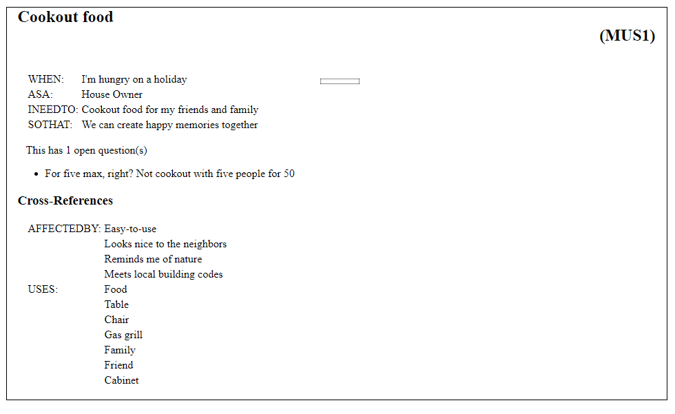
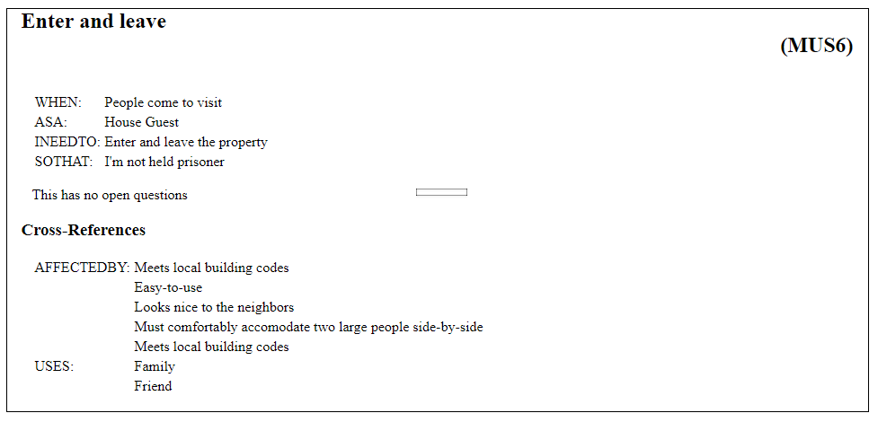
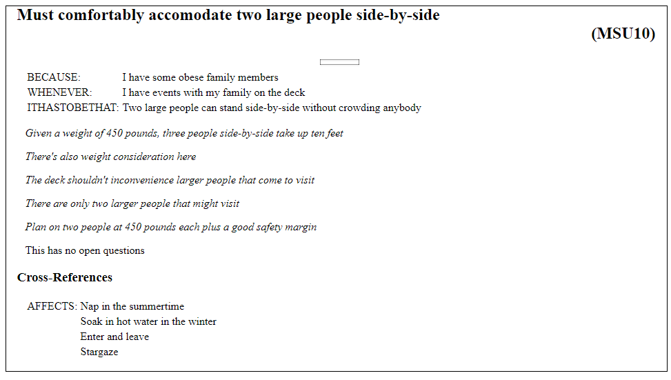
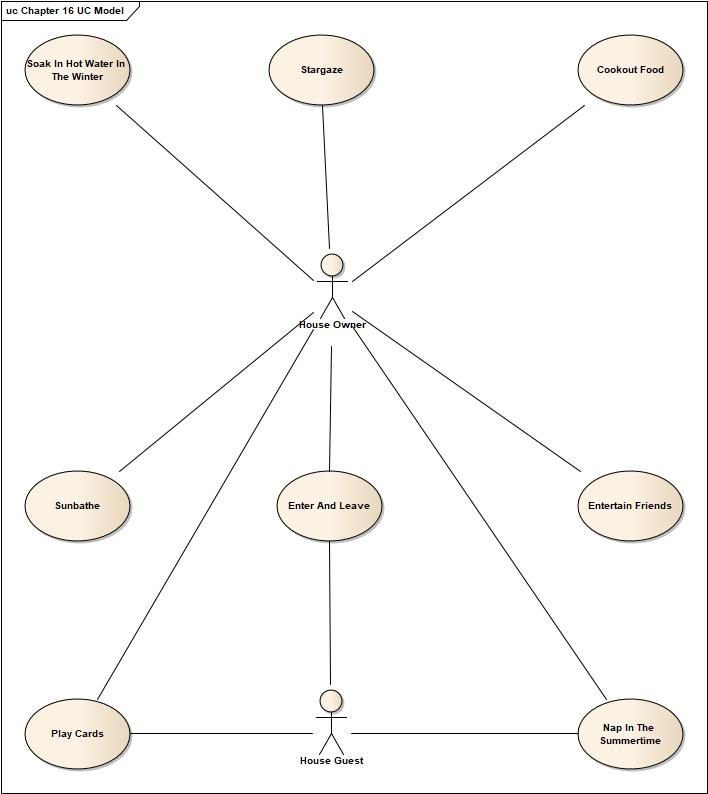
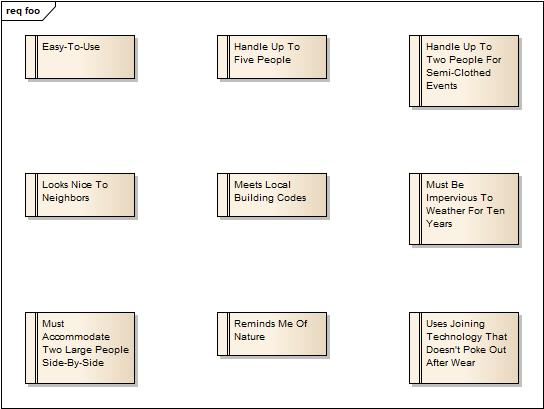
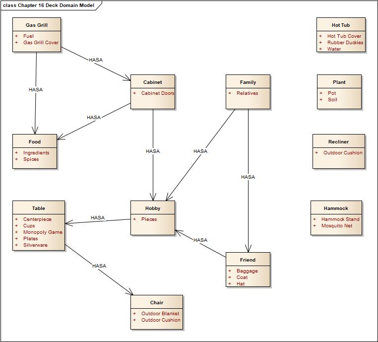
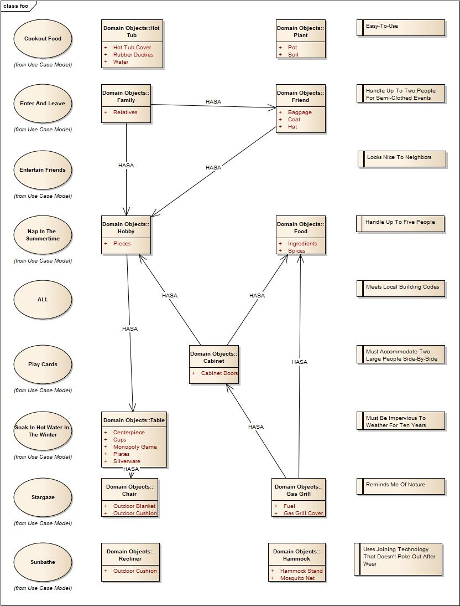
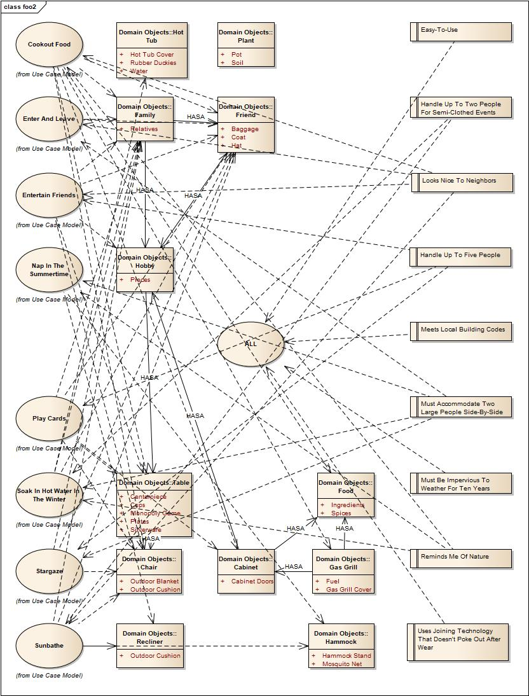
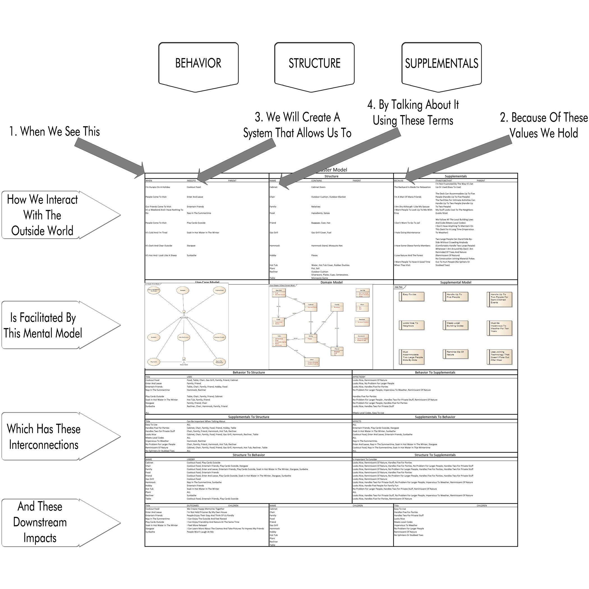

# Chapter 16


Ok, here we go! Off to work now!

(Looks around)

So how does any of this Structured Analysis, EasyAM stuff do anything useful? Can we push a button and a deck come out of the printer?

Yes, actually you can. Just keep pushing the button. It'll come out eventually. Hang in there!

The work of analysis is creating a shared mental model. The good stuff is in our heads, not in a drawing in a tool somewhere. You could throw away everything we've done so far and probably do a good job of building a deck. Likewise, you could run away to Paris in the Springtime, a new contractor could come in, and botch the whole thing up -- even if he had all of these notes. (Yes, I'm going to keep pointing that out because some folks will dive right into the "real" part of the book without knowing what the heck they're doing.)

So whatever work we've done? It's invisible. It's like an invisible friend, only better.

Structure is derivative. Once enough Behavior and Supplemental information is in place, the structure "pops out". Structure leads to more structure, which can be a good or bad thing.

In our case, we've played with physical models that represent structure all along (models, or structural proxies), ever since we printed out that diagram with the movable furniture pieces. **We haven't had a meeting where there wasn't some representative physical stuff people could manipulate to play with structural ideas.**

The analysis has done its job when both the customer and us have a stable shared mental model on how this deck is going to look and work. We test that stability by using simplified structural proxies, things like floorplan games, diagrams, or modeling clay. Put a different way, we walk the Analysis Model asking ourselves which outstanding questions are in the way of making the customer happy (i.e. facilitating the behavior the customer desires). Then we ask those questions, either directly or by creating a structural proxy that contextualizes and facilitates the discussion. In the begining, most questions can just be asked. The structure's in our head. But with any kind complex, ongoing project, important questions need some kind of structural proxy in order for people to make sense of them.

Now we know we have what we need, if required by building code, we'll draw up some blueprints and get a sign-off. Heck if we've been updating our online model as we go, we may already have that completed. If a blueprint is not required, we'll simply move on.

## Links

But wait! We forgot the links between items, how the supplementals impact the behaviors, how the behaviors use the domain model items. Hey, if we're going to learn all this crap we had better be using some of it!

Hurriedly, we go back and add all of that. We create a new file, "2018-05-07 dbm Linkages.amin" and put all of that in there. We do it with our customer there (Remember, we never, ever, ever add or change the model by ourselves. Cleaning up is fine, writing questions and notes is fine. Anything else? We all have to work on it together.)

We thought there would be no surprises, but nope. As soon as we started doing the work, we learned new stuff. Dang analysis. So here's how we add linkages in EasyAM:

```
MASTER BACKLOG
  ALL
  Cookout food
    AFFECTEDBY
      Easy-to-use
      Looks nice to the neighbors
      Reminds me of nature
    USES Food, Table, Chair, Gas grill, Family, Friend, Cabinet
  Nap in the summertime
    AFFECTEDBY
      Easy-to-use
      Must comfortably accomodate two large people side-by-side
      Must be impervious to weather for ten years
      Reminds me of nature
    USES Hammock, Recliner
  Entertain friends
    AFFECTEDBY
      Easy-to-use
      Looks nice to the neighbors
      Handle up to five people
    USES Table, Chair, Family, Friend, Hobby
```

We just re-list the item, then, for behaviors, we type "AFFECTEDBY" and a list of supplementals that affect it. Likewise, we type "USES" and a list of domain objects. All of this is exactly the material we went over in the last section, only typed into a text file.

We can describe relationships either way. A behavior is AFFECTEDBY a supplemental, or a supplemental AFFECTS a behavior. Same difference. Here we see how that works.

```
MASTER SUPPLEMENTAL MODEL
  Meets local building codes
    AFFECTS ALL
  Easy-to-use
```

Also note that since we're using "ALL", EasyAM knows what it means. "ALL" is a special behavior. We tell it that "Meets local building codes AFFECTS ALL", then all behavior will have that associate with it. We don't have to go copying and pasting a bunch of stuff.

For a refresher, here are the linkages and keywords

<behavior> AFFECTEDBY <supplemental>

<behavior> USES <structure> 

<supplemental> AFFECTS <behavior> 

<structure> USEDBY <behavior> 

<one structure item> HASA <another structure item> or 

<one structure item> ISOWNEDBY <another structure item>

(Then there's the parent-child stuff, which works with anything in the same bucket in the same level or across any number of levels.)

EasyAM doesn't care which direction you list things in. Put the relationships in any way that makes sense to you. You can repeat the same stuff over and over again. It'll just skip it. Note, though, it automagically tries to figure out what you mean, so if you misspell something, you end up creating a new thing with the misspelling. Then you have to chase that down. It's a bug, just like in any other programming language.

```
MASTER DOMAIN MODEL 
  Animal
  Horse
  Cart

  Animal CHILD Horse 
  Horse PARENT animal 
  Cart CONTAINS Wheel
```

At the bottom, first we said that Animal has a child of Horse. A Horse. Of course. Then we said that Horse has a parent of animal.

Oops. That's broken. The second line, we didn't capitalize "animal", although we did at the top, so now we have a new item. EasyAM doesn't care that you repeat stuff, but if you change things up, even just a little bit, you get stuff you don't want.

Also note that you can only join to structure *through* behavior. Supplementals can't join to structure. That makes sense because without an associated behavior, supplementals don't have any meaning, therefore joining the two up doesn't make sense.

Our links are in place! Yay! You're probably still wondering how this helps at all, aren't you? I know you. The troublemaker. And I've got my eye on you there in the back. 

Let me show you.

## Starting work

We have a structural model of everything we need and an EasyAM model loaded up with the basic model information. The next day we come to work with our cards and physical model and start doing deck-building stuff. I'm guessing the work would involve footers. Builders seem to be crazy about footers. Never hear much about headers. Or sidebars.

After a day or two, we've got footers in place and we're starting on the steps. The customer comes by.

"How's it going?"

"Great! Let me show you!"

We get out our cards and give a tour of how the work is progressing.



We walk over to where the grill will be. What we're doing here is walking through the analysis we've already done together and pointing out how the derived structure fits into all the constraints. There should be no surprises!

To the customer, however, it just looks like we are smokin' hot at knowing what our job is. Maybe a little bit on the too-detailed side -- but that's a good thing.

"Over here is where the grill will be, like we discussed. Your grill fits right in here and should no problem feeding up to five people, maybe twice that. (glances at card again). Nothing complicated here. You know, "Big Bubba" (his pet name for his grill) is going to look great sitting there. The dark color will sit mostly behind the rail, looking like a shadow from the treeline. I don't think the building inspector will have any problem here."

Then we walk him through the flow.

"So you reach into the refrigerated cabinet, to the left beside the grill, grab your burger and dogs and fry 'em up. When they're ready, you turn around, walk six feet and put them on the table. If a couple of friends want to help you cook, there's plenty of room."

That's the really detailed way of doing it. The laziest way, and what I would probably do, since I am a lazy person, is just stand there and point at the deck going through the behavior list -- but I would use structure terms. Remember: you want behavior, you talk about structure (or supplementals)

"Over there is where the steps will go (enter and leave). The grill goes here. (Cookout food). Hot tub's there. Hammocks right beside it. The table is big enough for all of your games, and there's plenty open space, easily enough for you and your friends to stargaze."

That covers the status of the project in two minutes. If he has a question about the structure, pop immediately back over to behavior and supplementals and restate.

Every day or so, we repeat and rinse. Point to System Realized Structure stuff, talk about how it's changed in the last day, what problems we're having, and what our plans are for tomorrow. Be sure to cover all the behavior.

At the end, you could perform some kind of formal walkthough or hand-off, but why? You've made sure there's no gap in understanding between you or the customer, and you both know where everything is and more importantly, *why things are made the way they are.* So there's nothing to approve. Go out and get a beer or something.

But let's say the first day, as we're pointing at stuff, when we point at where the stairs go, the customer says something like "That's not going to be wide enough at all"

What do we do? Do we ask exactly wide they should be?

I sure hope not. I'd ask "Why?" Because I'm really interested how the customer and I have such different ideas about this. Changing the deck is easy. Continuing to live on different planets is painful. The mental model misalignment problem is much more important than a stupid stair measurement mistake.

He might say something like "Well, I need my three heavyset friends to be able to walk up the steps at one time."

You take a look at your card; not because you're trying to determine exactly what was said. Analysis isn't specs, remember, but because you want to remind you and him about the conversations, figure out what happened. **You guys don't have a broken deck because the specs were bad. You have broken specs because the conversations were bad.**



"Yeah, I'm looking here. I've got that the steps (reading) 'must comfortably accommodate two large people side by side'. We talked about that the first couple of days, didn't we?"

You've pointed out the supplemental linkage and asked if he remembers the discussion. Let's say he doesn't. So then you pull out the 'two large people' supplemental card.



Now you're looking at all of the touch-points regarding this supplemental, right at your fingertips. Your "conversation library", aka formal, written analysis model, is starting to save your butt, reminding everybody of how we got here.

"Yeah, ok. We talked about this last Thursday, right? When we talked about taking naps in the summer, you mentioned that you wanted your two family members to be able to use the hammocks. We talked again about them using the hot tub and telescope. Remember I showed you these notes about how ten feet would be enough?"

Notice how this is a collaborative, not confrontational, discussion. 

Whatever happens now is fine. Maybe we missed something. Maybe we didn't. In either case, we're able to pick up a model card, look at what's joined to it, then read those notes and questions, reminding everybody about all the great times we had back in the day. The written model has done its job.

You most likely have a Meta problem. Remember, the Meta genre is about how we do our work. It's the last of the three genres, the one we haven't talked about a lot so far. The other genres are Business and System.

What you will find is that the more you use EasyAM in a reasonable and constrained fashion, the quicker the model becomes smarter than you are. That is, it remembers how a ton of stuff is interconnected such that no human being could ever keep it all in their head at one time. And it has enough linkages and annotations that with a just little bit of reading, you can find yourself back in the same spot you were a month ago discussing a topic with as much (usually more) context than you had back then.

If this drags on longer than a few minutes, you can run another set of cards, get out the modeling toys, and have a bit of continued analysis, just like you did before you started. (I have never had this happen. Usually just taking a few minutes and poking through a few cards, we're good to go.)

This should sound very cool to you. The more you see this happen in your practice, whatever you're using it for, the more it will seem like magic. Compare that to the usual way of trying to "capture requirements" Then going back for scope control, filing requirements variance reports. Yuck. Blech. (And even when you do it that way, you never, ever get around to addressing your real problems: bad conversations probably due to some Meta issues.)

10/10 highly recommended. Would do again.

## TO-DOS, WORKS

For each item, we've talked about adding questions, notes, even diagrams. But there are other things you might want to stick on your items.

**TODO** The name covers it. Put stuff in you want to be reminded to do later

**WORK** If you want to capture work you've done on the item, say for billing purposes, this is the tag to use. (This isn't a work-tracking system. It might be relevant to future conversations to say something like "WORK: I spent all last week trying to determine if those giraffes could swim! Giraffes can't swim, dang it!" The rest of us will know to tread gently the next time we talk about giraffes, which is relevant to analysis conversations.)

There are three other ones, **DEFECT**|**BUG**, **DATA**, and **CODE**. They do a bunch of stuff. We'll cover those later.

Here's our Stargaze behavior with a couple of these added:

```
MASTER BACKLOG
  Stargaze
    AFFECTEDBY
      Easy-to-use
      Must comfortably accommodate two large people side-by-side
      Handle up to five people
    USES Family, Friend, Chair
    DEFECT Outside security light prevents good stargazing
    WORKS Spent six hours on the phone with an astronomer from Hershey.
    // There's no fixing the light problem
    TODOS Call the city to see if the light can be moved  
```

And here's our new Stargaze card.


Wait! There's nothing there.

Correct. That's because these model cards are for a single purpose. They're not for keeping track of everything. Once you know the full title, open questions, notes, and linkages, you should have enough context to start or continue conversations -- or dive deeper somewhere else.

This is a key part about automating: delivering the right amount, but also the minimal amount of information needed for whatever the job is. These cards are useful for a lot of general-purpose stuff. Maybe if we were comparing how much work we've done we would make cards with WORKS items on them. We design different cards for different kinds of things.

There is a single place you can go to see everything about an item -- but it's not a place that you would use to do any work. It's the .amout file for that item. It's just a sanity check. Remember: the tool, even if it's a bunch of cards, is not the work.

We want to do as much as we can to prevent or discourage folks from spending a lot of time with their head stuck in any tool.

## The Analysis Canvas 

This gets us to a bit of a thorny problem that I've been struggling with for years: how do you handle and display all of the items at any level of the Analysis Pyramid (Business Abstract, Business Realized, System Abstract, System Realized) so you can get a good overview of the entire level at once? The purpose of our tagging system is to create a "Library for Conversations", and the tags give us all that we would ever need to organize and sort stuff, but where's the little map of the library? All big libraries have little maps you can look at to get yourself into the right spot. Where's that?

I think it has to be a diagram. It has to be an abstract structural thing.[^16-50] Whether it's a floorplan or a roadmap, diagrams help get you quickly oriented and pointed in the right direction. So let's make a "map" to show how our three buckets work together on our deck project.

[^16-50]: But there might be some other abstract structural thing that would be better. Wonder what kinds of things would work?



Our version of the Use-Case model isn't a bad place to start. It's simple. It kinda shows us why we're here. But it doesn't really show what we're doing. We could add in Activity Diagrams for all of our behaviors, but then we're really just talking about *what we do*, that is, the desired behavior of the target system [^16-2]

[^16-2]: Of course, there are always the temporal indicators: was, as-is, and to-be. Most of the time I'm going to skip those and just talk about the to-be case.

Well heck, how about our Supplemental Model?



That's even worse. It's good stuff. It just doesn't tell us how to get anywhere. It doesn't orient our mind to dive into a discussion quickly. It's no map.

Ok. So how about the Domain Model?



Same thing. It's not that these diagrams are bad, they just don't help orient us across the entire level. These diagrams are about *how items in each bucket relate to other items in the same bucket.* Useful for looking at an entire bucket at a time, just not an Analysis Level. See if that helps.

So let's throw all three items into a diagram, like so.



Better. It certainly looks more impressive! Lots of boxes of different shapes and lines. We could probably even do something with the font, maybe add in a drop-shadow. Wonder if a serif font would be best?

(wink)

So --- not so much.

It's the linkages that matter. That's what you need. When you are orienting yourself around an item, say a behavior, the use-case diagram is where to start. Find the bubble. Find the stick figures with lines to the bubble. Now you know the test and who you're changing the behavior to make happy. But what about the supplementals that affect behavior? The words used in describing the behavior. You could go to those models, find out things about how supplements work with one another, or how the important words we use are related to one another. But you still don't have the links. It's the links where the magic happens.

Ok, dang it. Let's draw the lines in! I've got a drawing tool, dang it, and I'm not afraid to use it!



Ooof. That's a mess. Although if we had a plotter and generated a wall-sized diagram, it might work. It's just not very useful for carrying around with you or putting on a cubicle or team wall. It may be useful for attracting spiders, though.

When I first started using Structured Analysis, I kept everything in diagrams and used a UML modeling tool to handle linkages. (UML modeling tools are different from the kinds of drawing/diagramming tools most people use. With a tool made specifically for UML, you should be able to re-use the same thing in multiple places. The tool keeps track of all the links behind the scenes.)

This wasn't bad, but it led to lots of meetings where I was futzing around with the tool trying to find the context instead of actually participating in the meetings. At times, I'm sad to say, I ended up working in the UML tool while everybody watched. This was a fail.

And it was as exciting as watching paint peel. The only thing that kept me from going down the full path to perdition was my insistence that I would only update the model with the entire team in the room. As a group, the team simply wouldn't put up with a bunch of diagramming using a projector, so I kept things simple simply because everybody would have shot me with a bazooka if I had pushed things too far. Sometimes things work in spite of themselves.

After that, I tried printing the detail pages of everything on a certain level and sticking them on the wall. When I add the diagrams for the three buckets, it works. Takes up a lot of space, but it works.

Over the past couple of years, as I have taught Structured Analysis to teams all over the place, I have been trying to develop **one chart to rule them all**, my idea of a single diagram to get you oriented and working as quickly as possible.



Eventually this will all be standard EasyAM output, once the industry has banged it around enough that we know it makes sense. For now, if you're interested in creating your own Analysis Survey, there are instructions in the appendix. (It's not that hard to do, but it takes a few hours).

The key thing about the Analysis Survey that has to be true no matter how it's done is the overall plan for how to read it, which is called out in the boxes. 

Behavior should generally stay to the left, since that's what scopes projects. Supplementals stay to the right because they control the quality of what we do. Structure is in the middle because it's the tension between behavior and supplementals that determines and validates structure.

For any level, there are the things "outside" or "above" it. That should be at the top. There are the things that go inside our minds as we created a shared mental model. That should go in the middle. There are the interconnections between the buckets where the magic of Structured Analysis happens. Finally there are "downstream" impacts, other groups, machines, teams, and people that are impacted every time our mental model changes. That should go at the bottom.

This version of the Analysis Survey is good enough for now, but it needs a lot of work. It's far too busy for a standard-sized piece of paper. It probably would work on a printer that prints tabloid or A2-sized paper. Improvement needed here.

However you do it, you should be able to pick anything that you're talking about, walk to a printout of the Analysis Survey on the wall, whatever it looks like, and within 10-30 seconds know all of the other things that touch on it and the things it touches on. And that should be true for anybody in the team. (This is what I would consider to be the acceptance criteria for future versions of the survey). I'm looking forward to seeing it evolve.

We have built a deck and our customer loves it. Next let's talk about lessons learned and how we can take the analysis work we've done so far on the deck and continue to use it. 
