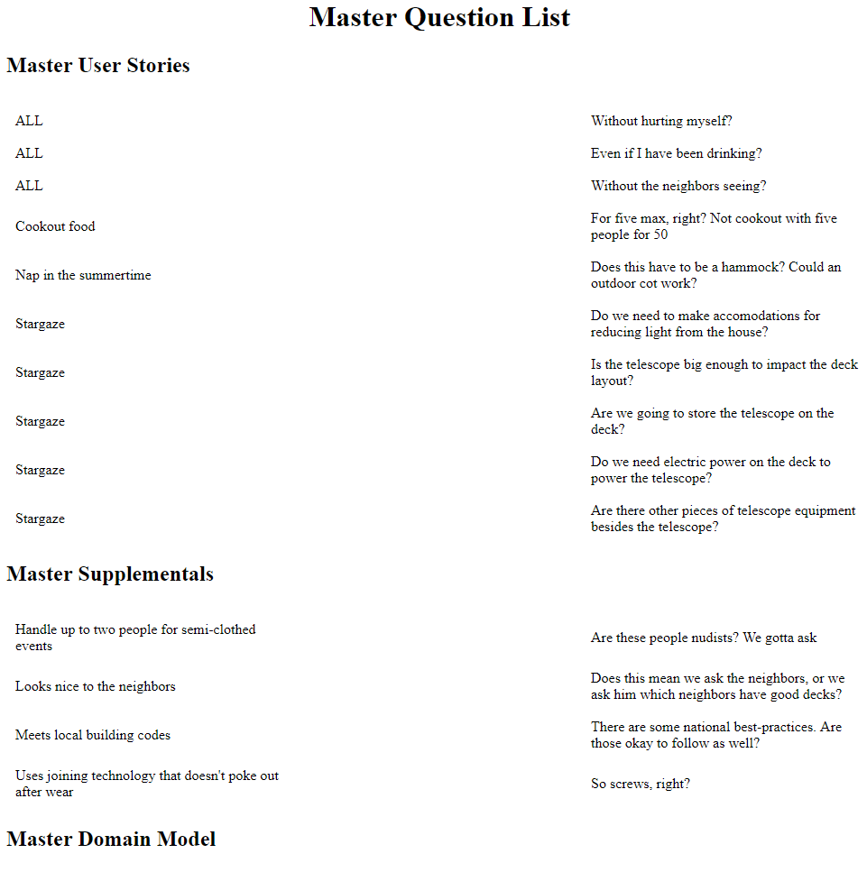

## Chapter 16



Ok, here we go! Off to work now!

(Looks around)

So how does any of this Structured Analysis, EasyAM stuff do anything useful? Can we push a button and a deck come out of the printer?

Yes, actually you can. Just keep pushing the button. It'll come out eventually. Hang in there!

The work of analysis is creating a shared mental model. The good stuff is in our heads, not in a drawing in a tool somewhere. You could throw away everything we've done so far and probably a good job of building a deck. Likewise, you could run away to Paris in the Springtime, a new contractor could come in, and botch the whole thing up -- even if he had all of these notes. (Yes, I'm going to keep pointing that out because some folks will dive right into the "real" part of the book without knowing what the heck they're doing.)

So whatever work we've done? It's invisible. Like an invisible friend, only better.

Structure is derivative. Once enough Behavior and Supplemental information is in place, the structure "pops out"

In our case, we've playing with physical models that represent structure all along, ever since we printed out that diagram with the movable furniture pieces. We haven't had a meeting where there wasn't some physical stuff people could manipulate to play with structural ideas.

The analysis has done its job both the customer and us have a rock-solid shared mental model on how this deck is going to look and work. If required by building code, we'll draw up some blueprints and get a sign-off. Heck if we've been updating our online model as we go, that's probably already done. Otherwise we'll move on.

### Links

But wait! We forgot the links between items, how the supplementals impact the behaviors, how the behaviors use the domain model items. Hey, if we're going to learn all this crap we had better be using some of it!

Hurriedly, we go back and add all of that. We create a new file, "2018-05-07 dbm Linkages.amin" and put all of that in there. We do it with our customer there (Remember, we never, ever, ever add or change the model by ourselves. Cleaning up is fine, writing questions and notes is fine. Anything else? We all have to work on it together.)

We thought there would be no surprises, but nope. As soon as we started doing the work, we learned new stuff. Dang analysis. So here's how we add linkages in EasyAM:
```
MASTER BACKLOG
  ALL
  Cookout food
    AFFECTEDBY
      Easy-to-use
      Looks nice to the neighbors
      Reminds me of nature
    USES Food, Table, Chair, Gas grill, Family, Friend, Cabinet
  Nap in the summertime
    AFFECTEDBY
      Easy-to-use
      Must comfortably accomodate two large people side-by-side
      Must be impervious to weather for ten years
      Reminds me of nature
    USES Hammock, Recliner
  Entertain friends
    AFFECTEDBY
      Easy-to-use
      Looks nice to the neighbors
      Handle up to five people
    USES Table, Chair, Family, Friend, Hobby
```

We just re-list the item, then, for behaviors, we type "AFFECTEDBY" and a list of supplementals that affect it. Likewise, we type "USES" and a list of domain objects. All of this is exactly the material we went over in the last section, only typed into a text file.

We can describe the relationship either way. A behavior is AFFECTEDBY a supplemental, or a supplemental AFFECTS a behavior. Here we see how that works.

```
MASTER SUPPLEMENTAL MODEL
  Meets local building codes
    AFFECTS ALL
  Easy-to-use
```

Also note that since we're using "ALL", EasyAM knows what that means. We tell it that "Meets local building codes AFFECTS ALL", then all behavior will have that associate with it.

For a refresher, here are the linkages and keywords

<behavior> AFFECTEDBY <supplemental>

<behavior> USES <structure> 

<supplemental> AFFECTS <behavior> 

<structure> USEDBY <behavior> 

<one structure item> HASA <another structure item> or 

<one structure item> ISOWNEDBY <another structure item>

EasyAM doesn't care. Put the relationships in any way that makes sense to you. You can repeat the same stuff over and over again. It'll just skip it. Note, though, it automagically tries to figure out what you mean, so you misspell something, you end up creating a new thing with a misspelling. Then you have to chase that down, just like any other programming language.

Also note that you can only join to structure *through* behavior. Supplementals can't join to structure. That makes sense because without an associated behavior, supplementals don't have any meaning, therefore joining the two up doesn't make sense.

Our links are in place! Yay! You're probably still wondering how this helps at all, aren't you? I know you. And I'm watching you there in the back. 

I'll show you.

### Starting work

We have a structural model of everything we need and an EasyAM model loaded up with the basic model information. The next day we come to work with our cards and physical model and start doing deck-building stuff. I'm guessing it would involve footers. Builders seem to be crazy about footers. Never hear much about headers.

After a day or two, we've got footers in place and we're starting on the steps. The customer comes by.

"How's it going?"

"Great! Let me show you!"

You get out your cards and give a tour of how the work is progressing.


You walk over to where the grill will be. What you're doing here is walking through the analysis you've already done together and pointing out how the derived structure fits into all the constraints. There should be no surprises!

To the customer, however, it just looks like you are smokin' hot at knowing what your job is.

"Over here is where the grill will be, like we discussed. Your grill fits right in here and should no problem feeding up to five people, maybe twice that. (glances at card again). Nothing complicated here. You know, "Big Bubba" (his pet name for his grill) is going to look sitting there. The dark color will sit mostly behind the rail, looking like a shadow from the treeline. I don't think the building inspector will have any problem here."

Then you walk him through the flow.

"So you reach into the refrigerated cabinet, to the left beside the grill, grab your burger and dogs and fry 'em up. When they're ready, you turn around, walk six feet and put them on the table. If a couple of friends want to help you cook, there's plenty of room."

That's the really detailed way of doing it. The laziest way, and what I would probably do, is just stand there and point at the deck going through the behavior list -- but I would use structure terms. Remember: you want behavior, you talk about structure (or supplementals)

"Over there is where the steps will go (enter and leave). The grill goes here. (Cookout food). Hot tub's there. Hammocks right beside it. The table is big enough for all of your games, and there's plenty open space, easily enough for you and your friends to stargaze."

That covers the status of the project in two minutes.

Every day or so, you repeat and rinse. Point to System Realized Structure stuff, talk about how it's changed in the last day, what problems you're having, and what your plans are for tomorrow. Be sure to cover all the behavior as you do so.

At the end, you could some kind of formal walkthough or hand-off, but why would you? You've made sure there's no gap in understanding between you or the customer, and you both know where everything is and more importantly, *why things are made the way they are.* So there's nothing to approve. Go out and get a beer or something.

But let's say the first day, as you're pointing at stuff, when you point at where the stairs go, the customer says something like "That's not going to be wide enough at all"

What do you do? Do you ask exactly wide they should be?

Maybe. I'd ask "Why?" Because I'm really interested how the customer and I have such different ideas about this. Changing the deck is easy. Continuing to live on different planets is painful. The misalignment problem is much more important than the mistake.

He might say something like "Well, I need my three heavyset friends to be able to walk up the steps at one time."

You take a look at your card; not because you're trying to determine exactly what was said. Analysis isn't specs, remember, but because you want to remind you and him about the conversations, figure out what happened.


"Yeah, I'm looking here. I've got that the steps (reading) 'must comfortably accommodate two large people side by side'. We talked about that the first couple of days, didn't we?"

You've pointed out the supplemental linkage and asked if he remembers the discussion. Let's say he doesn't. So then you pull out the 'two large people' supplemental card.


Now you're looking at all of the touch-points regarding this supplemental. Your "conversation library", aka formal, written analysis model, is starting to save your butt.

"Yeah, ok. We talked about this last Thursday, right? When we talked about taking naps in the summer, you mentioned that you wanted your two family members to be able to use the hammocks. We talked again about them using the hot tub and telescope. Remember I showed you these notes about how ten feet would be enough?"

Whatever happens now is fine. Maybe you missed something. Maybe you didn't. In either case, you're able to pick up a model card, look at what's joined to it, then read those notes and questions, reminding both of you about all the great times you had back in the day. The written model has done its job.

What you will find is that the more you use EasyAM in a reasonable and constrained fashion, the quicker the model becomes smarter than you are. That is, it remembers a ton of stuff that everybody else forgets. And it has enough linkages and annotations that with a little bit of reading, you can find yourself back in the same spot you were a month ago discussing a topic with as much (usually more) context than you had back then.

If this drags on longer than a few minutes, you can run another set of cards, get out the modeling toys, and have a bit of continued analysis, just like you did before you started. (For the record, I have never had this happen. Usually just taking a few minutes and poking through a few cards, we're good to go.)

This is way cool. The more you see this happen in your practice, whatever you're using it for, the more it will seem like magic. Compare that to the usual way of trying to "capture requirements" Yuck.

10/10 highly recommended. Would do again.

### To-Dos, WORKS

For each item, we've talked about adding questions, notes, even diagrams. But there are other things you might want to stick on your items.

**TODO** The name covers it. Put stuff in you want to be reminded to do later

**WORK** If you want to capture work you've done on the item, say for billing purposes, this is the tag to use. (This isn't a work-tracking system. It might be relevant to future conversations to say something like "WORK: I spent all last week trying to determine if those giraffes could swim! Giraffes can't swim!" We'll know to tread gently the next time we talk about giraffes.)

There are three other ones, **DEFECT**|**BUG**, **DATA**, and **CODE**. They do a bunch of stuff. We'll cover those later in automation.

Here's our Stargaze behavior with a couple of these added:

```
MASTER BACKLOG
  Stargaze
    AFFECTEDBY
      Easy-to-use
      Must comfortably accommodate two large people side-by-side
      Handle up to five people
    USES Family, Friend, Chair
    DEFECT Outside security light prevents good stargazing
    WORKS Spent six hours on the phone with an astronomer from Hershey. There's no fixing the light problem
    TODOS Call the city to see if the light can be moved  
```

And here's our new Stargaze card.


Wait! There's nothing there.

Correct. That's because the model cards are for high-level activities. They're not for keeping track of everything. Once you know the full title, open questions, notes, and linkages, you should have enough context to either do whatever your work is -- or dive deeper somewhere else.

This is a key part of all the automation we'll be doing: delivering the right amount, but also the minimal amount of information needed for whatever the job is. There is a place you can go to see everything about an item -- but it's not a place that you would use to do any work. It's reference-only.

### The Analysis Canvas 


**Diagrams are for navigation. Cards are for manipulation.**


 

 

 

 

 


### File Organization, Canonical Output, and Round-Tripping

### EasyAM Language Guide

### Changes
what if the business situation changed -- same model for house hunting
what if there were more backyard work 
