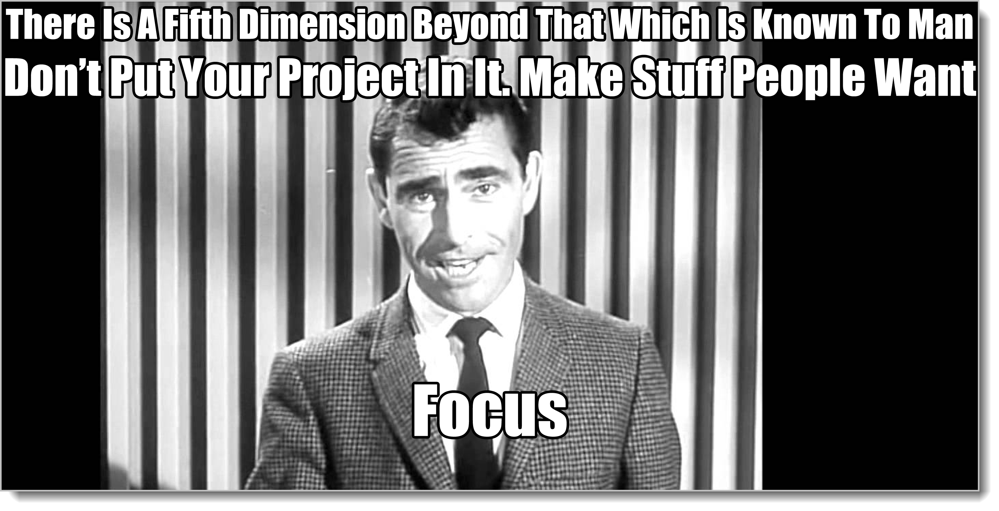

# Beginning The Process Discussion

Since we're going to be talking a lot about reports, diagrams, exercises, flows, and all sorts of things that can exist in various forms, I'm going to suggest a heuristic that we apply to the rest of our discussion.

That is, if it's a picture of something, whether it's a UML diagram, the Analysis Survey, a sketch of a new porch, a database model, or a snapshot you made with your phone of a wireframe workshop you had this morning? It's only purpose is for navigation, to find your way back to where you were before. It's a map. If it's a physical item -- and we use the word "cards" here liberally, it could be almost any physical item -- it's for working together to validate and update our mental model.

So if there ever was such a thing as a "generic, abstract business discussion", it'd go something like this: Diagrams are shown to establish context. Historical narratives are presented to remind those in the room of the things in the diagrams. Some kind of work is done using physical things based on the diagrams and narratives. Discussion, negotiation, questions asked, answered, and put on the MQL). Progress is made (or not). Somebody snapshots the physical representation of the mental model. Later on the "pretty" version of the shared mental model is uploaded to a tool. Repeat and rinse. We'll talk about this more when we talk about the TDA Wheel.

There are tons of physical-based discussion techniques. I'm a fan of Legos and Playdough myself, but there are a bunch more: model-storming, wireframes, role-playing, VR and AR-facilitated games, and so forth. You don't have to use cards. Cards don't hurt. You can certainly bring cards and put them out on the table or a wall and refer to them while you use whatever other tools you'd like. A bunch of stuff may need to go back in the written model at some point, anyway. Both the beauty and the curse of Structured Analysis is that there is a place for everything. Remember to keep winnowing down what you write down to only things that are likely to be talked about a lot.

## Analysis Paralysis 

While we're covering some ground rules to use throughout the rest of the book, we should also cover the bear in the room.

Wait, there's a bear in the room? RUN! RUN FROM THE BEAR!

(much later) Sorry about that. There was no actual bear.

What I mean is this simple question: How do I know when to stop analysis? After all, I read all of these super cool books that told me the problem with analysis is that it never ends. People use the term "Analysis Paralysis". That sounds awful!

First, the easy answer. 

Set up your work so that you are promising to do something valuable to the person that pays you every so often, like every day or every week. "Hey boss, every Friday I'm going to show you what I've made for you. You're going to love it and be happy you paid me that twenty bucks!"

This simple statement solves many problems. If you show up Friday without anything valuable, your customer should not pay you. If you only make little diagrams and play games, your customer should not pay you. If your customer continues to pay you for stuff like that, then both of you are very nice people who are kind and sweet and don't know what you are doing. You seem to like each other, so go together in peace. Just don't ever work for me.

This book is about making things people want. Efforts exist to produce **value**, whether you are in a business, a club, a charity, or working on a personal project, if you're not producing value there's nothing to judge you by. There's no point in making a map when you're not going anywhere. So -- commit to doing something that a reasonable outside person would find valuable on a regular basis. 

There's nothing like a hanging in the morning to focus the mind.

Sidebar: we have done nothing so far in this book that should take a lot of time. Sure, analysis may take a long while, but *only when it is difficult to establish a shared mental model*. People don't show up for meetings but want the right of approval. People agree in the room but need alignment with their direct reports before they can commit. There's a disagreement over scope with another group in this same area. But that's a Meta problem, not an analysis problem. It's really impossible for good analysis to take a significant chunk of time. People finding stuff out and making decisions can take a long time, maybe forever, but that's not an analysis problem. That's a people-working-together problem.

And if you're waiting on important answers or external agreement, be prepared to wait. At the risk of sounding pedantic, it's either important or it's not. If we don't know whether this is being done by our group or the other one, if we don't have permission to provide anything of value, if it's an important question, it's a dead stop until it's answered. Otherwise it wasn't important for analysis in the first place.

Courage.

The most common failure mode for junior analysts is mixing up the buckets and confusing *any* question with *important* questions. I've seen analysis teams hung up for weeks on whether this button display should allow A, B, and C or just A and B. Dudes! That's a System Structure Realized question. Why are you working down in the weeds so far? Why are you hung up organizing your work with items at the bottom of the pyramid? What a dismal and disastrous way to try to do any kind of useful analysis work. 

If you're talking about just doing analysis, your job starts with Business Behavior Abstract. Hopefully it ends there. Hopefully you'd scope out some Master Model work, *then start working*. That's kinda the idea. And you never, make structure an issue in analysis. How could something that's derivative ever be an issue? *Testing* the structure can and should be a problem, but not the structure itself. (I should make a poster that says "Structure has no part in analysis". Sometimes I walk into team rooms where the backlog has items on it like "Customer Table". I die a little inside each time I see this. This is why your consultants drink.)

So, working at the appropriate level and in the appropriate bucket, you should have paths A, B, and C available to the behavior, *set when the system is coded or configured*, i.e., when the System Realized stuff happens. Which probably ain't you. If it is you, then write the acceptance test, sit down and code it up as an options in the configuration file. Done.

It is very rare not to get agreement at the Business Abstract level, and when it happens, it means you have chartering and organizational support problems, not analysis problems. It's a big danger signal.

## Humblebrag Story #17

I do not enjoy telling humblebrag war stories, but if you will please indulge me, I'd like to show you that I have serious experience in this area. I'm not just simply throwing out feel-good slogans.

Many years ago I was working in Silicon Valley with a team of CEOs building out products. These weren't startup CEOs, these were *real* CEOs. There was a Fortune 50 company that wanted to form their own incubator, give the troops in all the subsidiary companies kind of a cool startup bootcamp they could go to. Each of these CEOs had managed very large companies. They were on a kind of sabbatical in SV seeing if they could build and launch a new product. (The products were things that the various sub-companies had made but hadn't marketed).

So really, in their mind, there wasn't much technical stuff to do at all. The things were already built. There shouldn't have been much coding or detailed work either, only setting various demos up and working with potential customers. How hard could it be? The entire floor was full of millionaires, well-regarded and highly praised by their various industries. They all believed in Agile and Lean and all of the other buzzwords.

Should be a piece of cake, right?

Nope.

The problem was like always: shared mental models. Everybody was a genius in a little box, just like you'd buy down at Target (There's a genius-in-a-box section just beside the Turbo-Man dolls. Sadly, they're usually sold out.) No amount of smarts, process, and attention-to-detail can take the place of a shared mental model.

We had work to do. We formed up into small teams. Each team was required to stay in the same room with one another.

The CEOs hated this. And why not? They'd spent their entire career going for that corner office! The last several years, they had dozens of direct-reports who were all senior executives. They were responsible for organizations of thousands. Sit in a room with a bunch of low-level schmucks, including this oddball Markham dude from the backwoods of Virginia? My first team leader told me "I'm making million-dollar deals here with this product. I don't have time to sit with a group all day."

But when I looked at the work, I had offshore groups that were clueless about why they were doing what they were doing, a CTO that was basically acting as a McDonald's customer, giving out bulleted to-do lists to everybody once a day, an attached tech team that tried to stay as much as possible out of the crossfire, and a customer that was wondering where the actual product was.

Did I mention that? The product didn't work. (Although the demo was freakin' awesome!) It worked on the original developer's machines. Just didn't work for us, the people trying to sell it.

So there was that.

We needed a shared mental model, just like every other business. Or we would die. Just like every other business. Once we gained and kept that model, the rest would fall into place. This wasn't difficult, but if you put enough smart people on a project, just about anything can get damned-near impossible.

To try to establish momentum, he and I met with *his* boss, which was kind of a CEO-of-CEOs. It was established that yes, you need to listen to Daniel.

Next morning he comes into the room. We do a little bit of work for 20 or 30 minutes, then he announces that he has to leave.

"Ok," I say, "We'll just be here doing nothing until you come back."

That got his attention!

The room dropped to silence. Everybody looked at me. Did he really just say that?

He, I, and the team all worked through our problems. I still stay in touch and consider them all friends. They tell me that during the time I was out there, they finally realized how it was always supposed to work.[^17:4]

Yay!

[^17-4]: The project still had bad problems, and I left after the initial engagement even though they wanted me to stay, but the problems were because of a lot of outside stuff we couldn't control, one of which was related to the very CEO-of-CEOs that called me out there in the first place! 

All we had was a few hours or maybe even a few days of analysis to do, but we were stuck. We didn't have analysis paralysis, though. We had a project that wasn't set up to succeed. (Chartering projects is coming up later). We had work to do, real, valuable work. Without a shared mental model, we could certainly have a lot of activity and spend a lot of money, but we couldn't get the job done. So we stopped. No matter how important you are, it doesn't change the nature of reality. Conversations only work if we're honest.

Courage.

Turns out, "make something people want" along with regular accountability and teamwork does wonders for analysis paralysis. And without those things, it doesn't matter what you do as far as analysis anyway.

## Test-Driven Analysis (TDA)

But I have been falling down on my job! We've been several dozen pages and you don't have any new complicated-sounding terms or buzzwords to put on your status reports. So here's one: **Test-Driven Analysis**.

TDA says that all analysis work, initial customer conversations, screen discussions during app development, user experience and bug discussions -- all of it -- is geared to either creating or passing a test. We just need to be explicit about what those tests are. There's a list of rules, there's a wheel. It's quite exciting.

Another way of stating the "easy answer" above is that the Behavior Bucket, as it is continues to develop, describes a test of future system behavior that represents our values (as expressed in the supplementals and behavior flows). Making those tests pass, either manually or through creating some kind of automated system, is the goal of any effort.

Doesn't that sound much better than the alternative title of the book, "Git 'er done"?[^17-421]

[^17-421]: I hear that title may already be taken. When it's a good topic, everybody wants to horn in.

We'll be expanding on the TDA concept from here on out. It's the core of all practical application of what you've been learning.

## The Detail Is In The Files 

Much like Beethoven was able to use music theory and notation to create various works, Structured Analysis uses the same tagging system and the same Master Models to create all sorts of valuable things. EasyAM tries to stick with this concept. The standard output format uses the same syntax as the input format. Duplication is fine, even encouraged. If you mention the Behavior "Pet Cat" in seven different places, it's still the same behavior.

This lets us take all the tagged information and output it in a bunch of places, even though there is overlap. So, for instance, if you look at the Master User Story item "Stargaze". .amout file from our deck project, it mentions family, friend, and chair from the Master Domain Model. If you go to the .amout for those items, you'll find they mention "Stargaze" Repetition is fine.

You can easily generate a bunch of analysis notes over several months! When this happens, and there are several of you on the team, you have a few choices for how to organize things.

You might just make One Big Honking File, then keep it updated. This is how I got started. It works, but it is a pain. It's also why I wrote EasyAM, to handle all of that sorting and collating for me.

You might want to continue in the same fashion we have with our deck project, labeling each file by date, author, and title. That's the way I work now at the beginning.

After the project kickoff, especially on a technology project, we need to start making stuff, so people get out their protractors, pocket protectors, slide rules, and programming environments.

EasyAM is a programming language. Just like any other. It should be treated the same.

So once we start setting up a "real" environment, with IDEs, compilers, build tools, and so on, EasyAM bolts right in. We set up an "Analysis" folder alongside the other project folders (at the top of the directory structure, of course, where else would it go?). We add it to source control, trigger it in our local builds, and put it in the CI/CD pipeline alongside everything else.

In larger projects, in order to keep things as clean as possible, each time I make notes I create a file as before with the date-based naming convention. During the compile process, however, I rename the .amin file I just made to use an .amin-old extension instead of a .amin extension. Then I rename all the .amout files to .amin files. I do this with a batch file that runs after EasyAM compiles things. In this way, EasyAM always keeps everything sorted, and when I want to know everything there is to know about something I just go to the file that has its name.

There are a zillion ways of doing this, which is kinda the point. But I'm a writer, not a DevOps or coding guru. You'll come up with your own system. If you've found something cool, let me know! I'd love to share it with the rest of the community.

## EasyAM Language Guide

Interested in all the tags you can use in EasyAM? Here they are:

The latest version of this is on GitHub in the same place you found the EasyAM compiler.

## Changes

We have really been cooking these last few chapters. We've covered setting up and using the EasyAM analysis compiler, we've used it on an actual project, we've talked about several different kinds of reports it creates and the beginnings of how to integrate it into simple projects. We've even talked about how to use it unobtrusively when there's conflict.

Then we talked about how to navigate our way around an entire abstraction level at once using the Analysis Canvas. We talked about rules of thumb we're using throughout the rest of the book: "diagrams for navigation, cards for manipulation". We had our first mention of Test-Driven Analysis. It's going to be really cool to watch how these ideas help as we increase the difficultly level.

What about our deck project? What would happen if our customer, who has just built a shrine downtown in honor of the great work we've done, asks us to build a backyard playground? Do we start doing analysis work from the beginning all over again?

Yes and No. Yes because it's the same people, same mental model. We just need to add more to it. We start with a survey of the new behaviors involved and then ask if the supplementals still apply. The vast majority of the analysis model, which exists in all of our heads, continues to hum along just fine. Because we probably won't be talking about deck stuff much anymore, all of the nouns, behaviors, and supplementals that are just related to building the deck aren't that important now. They stop being important concepts. We no longer need them in our written model. We will need to remove them as part of our regular synchronization/cleanup process. If it ain't something we talk about a lot, it doesn't go in the written model.

But for most everything about the work, because we've already synchronized, as long as we're careful to mind our knitting, the backyard playground project will be just as kick-ass as the deck was, probably even more so, because we'll continue to have quality conversations as we go along.

What if we changed the team? What if a new guy joined? What if we had to use a subcontractor to do the work? What if there was a completely new kind of job, say our customer likes us so much he wants us to help him in house-hunting?

You ask a lot of questions, you know that?

Yes, these are excellent questions and we're going to answer all of them. Just not right now. Right now our mission of completing a simple EasyAM example is accomplished. We have leveled up.

The first question, however is so important we can't go any further without dealing with it: what to do when the people stay the same but the business situation changes? When new stuff comes into a team and it needs to adapt, it's easy to fall back into order-taking mode. After all, all these things are new now! Why don't you just tell me what you want me to do and I'll go do it.

Don't do that. Resist that urge.

In technology, we call getting organized around upcoming work and new information "Backlog Refinement" (or "Backlog Grooming"), and backlogs and backlog refinement is the topic of our next two chapters.

{blurb, class: information}

### Did you get it?

You learned why if you're building the right thing, the only thing you should be talking about is creating and executing important tests. You learned how his both limits the amount of useless conversations and demands that we stop what we're doing if critical conversations can't happen. You learned the proper role of project information tools and more about all the detail you can add in your notes, if needed, using EasyAM.

{/blurb}