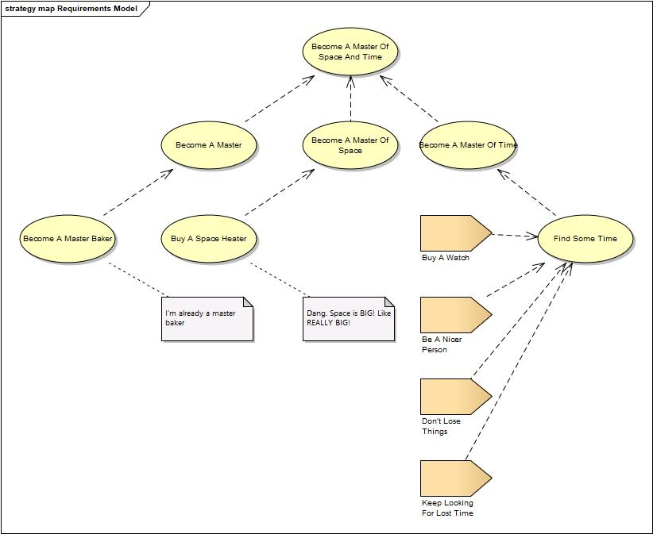

# Chapter 18

## Backlogs

Most people keep a list of to-do items with them during the day. For many, there's nothing like the happiness of checking an item off a checklist. There are hundreds or thousands of books that all encourage people to make long-term goals, then short-term goals, then to-do lists. It's like a pyramid! You can master the universe through this method of goal/task breakdown and enough pyramids. More pyramids. Sigh.

People really love this stuff.

I am not one of those people.

I believe that having a mission comes ahead of everything else. A mission translates to values + habits and that leads to success. That is, you get further by creating habits and a lifestyle that reflect your values and advances your mission than you do by trying to complete some kind of top-down masterplan of where you want to be in five years. You have no idea what things are going to be like in five years, and you have no concept of what things might be feasible or impossible. So how could you break things down?[^18-2]

[^18-2]: Scott Adams covers this in-depth in his "Goals are for losers" essay. [http://blog.dilbert.com/2014/01/21/goals-are-for-losers-passion-is-bull/](http://blog.dilbert.com/2014/01/21/goals-are-for-losers-passion-is-bull/)

Of course, that kind of top-down planning makes sense in fixed domains where the number of unknowns is drastically reduced, like sales or warehouse management, but not in an environment where everything is poorly defined and changing, like, say, life. If you're in a factory building widgets, you know how widgets are put together and what widgets look like *before you start anything*. That means everything is defined. In that case, certainly big physical things break into little things.

People get it mixed up. They assume that they can come up with a goal, any goal. ("I would like to be master of space and time") Then, simply because they've written that goal down, broken it into smaller goals, they're magically able to define all of these heirarchical breakdown tasks. ("To begin, I will buy a watch."). Both in the technology development arena and in some of my dear friends' lives, I have seen folks create these wonderful imaginary task breakdown structures around whatever goal they have, simply by imagining how it all might work. The brain is an amazing tool, able to work with incomplete and contradictory information to assume what reality is. Give it a question, it'll give you an answer.

Every time this has happened -- every time -- it's been a mistake. There's great pain and misery because there's no way in hell that imaginary work breakdowns are going to be correct. Not even close. 

If you're building a new type of battleship that's never been built before, you have no idea what it's going to look like or how you're going to put it together -- until it's all done. There's nothing defined. (Except maybe a lot of baggage people might bring into the discussion when the term "battleship" is mentioned, some of which might be terribly counter-productive) What happens when you start breaking down something that's not defined? You end up defining it, that's what! You have to. If you're going to define the endstate by creating one of these goal/task pyramids, what's the purpose of Analysis? You already know there's going to be a gunwale. Look, there on page seven it says "build gunwale". You've short-circuited the most important part of the work simply with your desire to have a big list of things and all of your questions answered about how everything fits together.

I think this is why you see so much of this break-your-goals-into-tasks kind of advice from people who have built their own world to live inside. Once you construct a machine to live in, such as your own used car business, you can take a much more structuralist view of life and success. You know what all the pieces are. You built them. Then that kind of multi-level goal breakdown makes sense. (Startup guys call this "building the flywheel". We'll go over startups and flywheels in the last section.)

When we think top-down, we bring a bunch of baggage along with us, intentionally or not. Since there are a ton of unknowns about planning how something we've never done breaks down into tasks, and since there are even more unknowns about doing things we've never done before --- we make stuff up.

That's a feature of being human, not a bug. Humans are able to exist as a sentient species on this planet because of the way our brains work. We take vague, fuzzy, incomplete data  --- and construct a narrative and a universe around it. Get bitten by a clown when you're a kid and you avoid clowns for the rest of your life. That may be a horrible stereotype to have, and clowns don't deserve it, but it prevents you from having future clown bites. Our ability to imagine narratives and stereotypes, creating these imaginary castles out of thin air? It's a survival skill. We do it all the time subconsciously.

Goals breaking down into smaller goals makes a kind of sense. After all, it's similar to what we've been talking about with our pyramids (Our pyramids are really much nicer than those other pyramids those other guys talk about.) Something bad happens once we start in with the tasks, though.

There's a difference between goals and tasks, and it turns out that understanding that difference helps with backlogs and grooming.

**Goals** are things in the future you want to accomplish but don't know how. Goals are a combination of Behavior and Supplemental Abstract To-Be items. They can be either **Business** or **System**. "I want to run the five-minute mile" is a System goal. (Your body is a physical thing). We are describing a future System behavior, running the mile. The Supplemental is the 5-minute qualification. "I want to reduce claims processing time by 30%" is a business goal. Claims processing is an abstract business process, at least at the level we're talking about it now. There are a ton of physical system linkages in there somewhere that we would need to discover, but it's a business goal.

Goals have tests. Without an executable test, we don't have a goal. If I go out running, you can take a stop-watch and see how fast my mile is. We can dig out records and find the speed of claims processing. No test, no goal.

**Tasks** are Meta Realized Behavior, that is, they're things that you (or your team) go out and do. Tasks have no tests associated back to the model. *Tasks have no relationship to goals except in our own minds* They are independent, stand-alone units describing *activity*, not *value*. We think of a goal, then we *imagine* the type and number of tasks it takes to reach that goal, then we start doing them. It's the same thing people do when they take life goals and imagine how the tasks would all break down.

It's important to understand that there is no relationship between tasks and value. In the movie "Christmas Vacation", one character praises another character by saying "You know, he works hard", to which the reply is "So what? Dishwashers work hard". Activity and value are separate things.

Since goals are another word for tests and tasks are supposed to be in support of goals, it stands to reason then that the more tasks you do before executing a test, the more likely you are to be wasting your time. Ideally you never want to get more than a few hours between executable tests. A few minutes is even better. And in most cases, this is easy enough to do. (Trust me on this)

In our deck example, as soon as we had our initial conversation and gathered some behavior and supplementals, we "bounced together" the behavior and supplementals and thought about what kinds of goals were involved. (We did this in our head). Then created something structural, the diagram of the deck, that we thought would meet our goals. Then we ran our tests on our little structural diagram vby showing it to the deck guy and walking through how it would all work. That conversation sent us back through the loop again, only this time we know more than we did last time.

The structure does not have to be part of some assembled finished product, but it must be structural. That's the only way to test how behavior and supplementals come together in tests/goals, by walking through some kind of derived structure.

So while we had a few tasks to get things organized, maybe print some stuff out, gather some modeling tools together and so forth, we were immediately back into testing mode. We didn't go back to the hotel and spend the next week doing a bunch of tasks that we imagined might be useful.

Good **Backlogs** are a list of future behaviors/supplementals the target system needs to exhibit. They're all Behavior To-Be items, whether at the Business or System level, combined with Supplementals. Good backlogs are full of tests/goals. Bad backlogs are full of to-do items. We call this **"Tasking out the backlog"**, and it means that instead of constantly talking about *what the system will do*, the focus shifts to us constantly talking about *what we're doing.* Enough about the customer's goals, let's talk more about me.

Tasking out the backlog is an excellent way to spend a lot of time and money, make really good status reports, be stressed and busy -- without accomplishing anything of value. 

I've seen a lot of poorly performing teams and organizations, and almost without exception I see tasking out the backlog as a key component of their poor performance. On dozens of occasions, sadly, I have walked into programs where there are a bunch of teams slugging away at something. Performance was down, staffing costs high, stress levels unacceptable. In every one of these cases, when I look at the team backlogs, they are full of tasks, not testable goals. (Behavior to-be matched up with supplementals).

Somebody, somewhere, at some time made some kind of mapping between goals and tasks -- just like our friend who wants to master space and time. But that person is not around anymore, didn't know what they were doing at the time, and what they imagined in their mind was completely wrong. It was the worst-way possible to accomplish things. 

The team and developers can sort of tell you the purpose of their project, but not how to deliver value faster. How could they? At the end of the day, they're just checking off boxes on a to-do list. They're completing the work by going through a bulleted list that somebody else somewhere thought described what had to happen. They have ceased becoming valued and cherished parts of the organization.

I have never, ever seen this work well. It's not unusual to see teams operating in this manner run 3, 4, 5, or even *10* times slower than other teams that aren't living this horrible life.

Watching teams struggle like this, over and over; watching marriages crumble, people have heart attacks, and companies fail? That's the reason I wrote this book. It doesn't have to be that way.

That's the reason I'm here. That's my mission.

## Your Model of how Work Happens is all Wrong

It's one thing to talk about how tasking out the backlog is wrong, and how we want to reduce the "suspense" time between tasking and testing to just minutes. It's another thing to deeply realize what an anti-pattern this is.

Humans think naturally in terms of structure. Our minds are constantly combining behavior and supplemental information to create structural models that we accept as reality.

So when we approach a new problem, we approach it as a structural matter, which works in 99% of all situations. Need a chair? Make these structural pieces and put them together like so. Voila, a chair. This is the way nature works.

When we became industrialized, we started creating things using factories. Factories have assembly lines and stations. Station A makes these structural changes. Station B makes these structural changes. We combine the various sub-assemblies into the finished product. In short, to build a pre-defined physical object, we break it down into small pieces, build each piece, then put the pieces together. Just like everything else we experience life.

Beginning formally with a guy named Frederick Winslow Taylor, but informally a long time before that, people decided that to build stuff, you had to create categories and manage those little categories around structure. Managers did management jobs. Head riveters riveted heads. A modern factory is a wondrous example of taking something complex, breaking it up into small pieces, then optimizing the production of each piece. The idea is that each thing, whether a widget or a person, is the same. They are all just physical things we can put in boxes. The only difference is the label we stick on the outisde of the box.

The problem is that this way of doing things only works for physical, well-defined things, not creative things. It certainly works for making the widgets. It doesn't work for coming up with what a widget should be. When we built the deck, the analysis work we did was the creative part, coming into alignment with the customer, trying out various physical models in miniature form, and so forth. The actual building of the deck was mechanical and rote. Because we added analysis to the deck work, our customer was much happier than if he had simply pointed to something in a catalog.

Anybody with expert knowledge in carpentry could build a deck given the plans. Heck, we could create a factory for decks where robots do all the work and 50 decks are made in an hour. But this isn't what we mean when we tell people we built a deck for somebody. At least it isn't if we're a professional.

Don't want your job taken by robots? Learn and wield analysis to creatively make things people want.

Modern management theory is all about optimizing the machine. A business is a machine that makes money, just like a factory. We optimize how each of the workstations perform and we end up optimizing the entire thing. To manage a business is to assume that there already is a machine in place that needs reorganizing, tweaking and ramping up.

In this environment, managers are about codifying work into rules that control and implement flow and then optimizing the rules and the flow.[^18-50] Their job is to replace you with robots. There's nothing wrong with that. Nobody wants to be working in an 1880s sweatshop anymore. But the type of work that this represents is not the type of work Analysis covers. This kind of work assumes all the questions have been answered and there is no shared mental model to create or maintain (Insert long discussion here about how in many ways they may be wrong, but that's for another day.)[^18-51]

[^18-50]: Nobody should ever write a book on making things without mentioning and giving credit to Donald G. Reinersten and his book "The Principles of Product Development Flow". Along those lines, Eliyahu M. Goldratt's book "The Goal" is also must-reading. (Read The Goal first, then Product Development Flow. Reinersten's book was a bit of a tough haul for me, but it's the basis of about probably 200-300 other books, so it's foundational.)

[^18-51]: You can use Structured Analysis as a powerful tool for optimizing, I've just never seen anybody do it. I've seen lots of Business Process Modeling, Statistical Process Control, and other Six Sigma-ish-type efforts put into service to make the widgets faster, but I've never seen Structured Analysis deliberately used as a tool to creatively re-design the widget factory. I think this is because each of these disciplines tends to focus on on detail, while the thrust of SA is about creating the simplest shared mental model possible that generates results. It's the opposite way of looking at things. Don't know. In the last section of the book we'll talk about using it like this.

There is another business process which is, in some ways, the antithesis of modern management. It's called value discovery. Value discovery is what we've been doing with Structured Analysis; orienting ourselves in somebody else's world and coming up with stuff they would like. A successful startup combines value discovery into a machine that then can be managed. (Here is also an explanation for why so many great startup founders need to bring in professional management just when things start to take off. Management and value discovery are different skills.)

Most management work optimizes the machine. Value Discovery creates the machine.

What this means is that if you're interested in doing Structured Analysis and/or value discovery, 99% of the books out there are not for you. In fact, they will lead you down the wrong road entirely and put your head in a bad spot. It also means that if you've been a great programmer, or have a sharp, analytical mind that can organize things spatially and structurally, the way you see and decompose problems is exactly the opposite of what's required in Structured Analysis. Your brain is broken. It will constantly mislead you.

I can almost guarantee you that whatever your background, it hasn't prepared you to break down goals into tasks in a way that actually works over big chunks of time.[^18-4] In startup work and general analysis work, we make lots of mistakes. We find that we continue to apply things that worked for us in the past to the current situation, because we're humans. And then we waste a lot of time and money.

No matter how smart you are, your instincts will lead you wrong. Every time. You have to get a deep grasp of just how broken your brain is and how easily it will lead you into setting things up in a way that won't work well. That's the difference between your long-term success, failure, or mediocrity.

[^18-4]: Improv comedy might be a background that would be helpful. I am not sure. I have friends who are experimenting with teaching teams by way of improvisational comedy lessons. I have no idea how successful it is, but I would like to observe it a few times.

## But I Know My Backlog Item Isn't Behavior

There are a few common scenarios when folks think they know for sure that their backlog item just *can't* be behavior.

*The customer told me he needed a red button.* If the guy directly tells you he wants to see X, then that's a backlog item, right?

Wrong.

As we learned in the deck example, whenever you take these things at face value, you cheat both the customer and yourself. In that example, the customer just *knew* the deck steps had to be ten feet wide. But what he really knew was that he had a couple of common visitors that were rather large, and he didn't want to do anything to make them uncomfortable. That supplemental, not the structural size of the deck, was important to a lot more than simply the stairs.

Whatever the structure, ask yourself what behavior and supplementals it satisfies. Then ask where those pieces apply across the rest of the analysis model. Most of the time when you get a structure request, it's because the customer has been doing analysis for you in their head, "helping" you. After a couple of times walking through how you tease apart these requests, they'll be more than happy to work with you on the rest of them.

*We're doing data warehouse work.* Data warehouse work is a bit of an odd duck because many times it looks like software development when it's not. The key term is "warehouse". You're not building a warehouse. The warehouse already exists. You're just putting stuff in and taking it out.

In many cases you're providing views into existing data as part of a larger effort. In that case, the larger effort should manage the analysis. All you have is tasks to make their tests pass. This is a place for tasks as long as they are in support of tests owned by another group. (The general rule for tasks items is that you always find out "which test is this task making pass?")

In other cases your job is to move hunks of data around, bits of structure. The natural tendency is to organize your work around the structure. Instead, organize your work around automating the move. Your job is not to move these 17 tables from one place to another. Your job is to write code to move those 17 tables. Same result, different way of looking at things. Building a database moving program is a creative venture. You're still going to have big issues with tests, but if you do it this way the analysis process will identify those for you.

*We're working on an architectural tier*. We saw this a lot in the latter part of the 20th century and the beginning of the 21st, but it's slowly dying off, thank goodness. The concept went something like this: because we are deploying our system in layers, and each person/team is responsible for a different layer, our work is to put together and maintain pieces on the layer we are responsible for.

It is not. You have organized your work poorly. Start over. 

Here's the reason why. In technology, there are infinite ways to group and organize your solution. This is a bug, not a feature, because *organizing your solution and organizing your work are two separate things*. Yet people seem to keep conflating them.

There are 20-person teams, right now, who are struggling with writing a new log-in screen. Why? Because everybody in the room is an expert in one area. One person is an expert on security. Another on mainframe access. A third on UI. We have a UX person, a front-end person, a back-end person, a corporate policies person, a representative from the cloud group. It goes on and on and on. Every year new technology comes out, new specialties are created, and the team size grows.

Solving problems stops being about solving problems and starts being about making sure all the check-boxes are checked.

And each of those people? They each have been to several specialized training sessions where they were taught how to organize their work around their specialty. Those back-end guys are experts at creating projects to manage back-end work. The UX guys have an entire playbook around making good UX happen.

If you don't know what you are doing, if you lose track of the goal and instead focus on the people or technology, you'll end up pulling out each persons work pattern tasks and stuffing a backlog full of it. Then, when somebody tells you the backlog is for goals only, it doesn't make any sense. How can we get the database done if we don't have database things on the backlog?

But that's not the way it's supposed to work. What's supposed to happen is that you have a goal/test to meet, and then anybody involved adapts their work pattern to reach that goal. If they don't understand how to do that? Then we need to train them. They have been misled, probably by other trainers.

Over time, all of the jobs that are necessary get done, but they get done in increments as the target system begins to exhibit more and more new behaviors. Nothing goes away. All of that cool engineering you learned in school is still applicable. Every role or layer just isn't the center of its own little universe. You just need to look at things the right way, instead of the wrong way. Don't let your natural inclination to become an expert in one area get in the way of the team staying laser-focused on goals and tests.

You are not a Javascript expert. You are a Claims Processing expert who just happens to know Javascript, perhaps at an expert level. Don't get it backwards.

## Test-Driven Analysis Redux

Test-Driven Analysis means we're always throwing behavior and supplementals together to create some tests/goals. Then we move down a level and use those tests/goals to drive out structure for approval or disapproval, to pass or fail tests.

We identify and provide value through quality conversations. We never have a conversation without a piece of structure and (at least one) test we bring and manipulate to get feedback. If our work is shaped around 2-week sprints, then we never begin a sprint without a test(s) we bring to define what done looks like. If our work is shaped around writing a computer function, then we never begin work without a test we bring to define what that function's successful conclusion looks like. 

As they used to say when I went to school, it's turtles all the way down, folks. The only difference between conversations about Business Abstract stuff and System Realized is how the tests are created and executed. If we can't actually build something due to time, money or some other constraint outside out control, we're forced to use structural proxies.

Whatever level we're talking about, we have questions. We ask them. We get new information. Then our shared mental model changes, and that could have all kinds of repercussions. Whatever questions we ask, and however it changes our ideas about things, we have to keep cranking out value. What's important to us? Are we ready for our next tests?

And that takes us to Backlog Grooming.