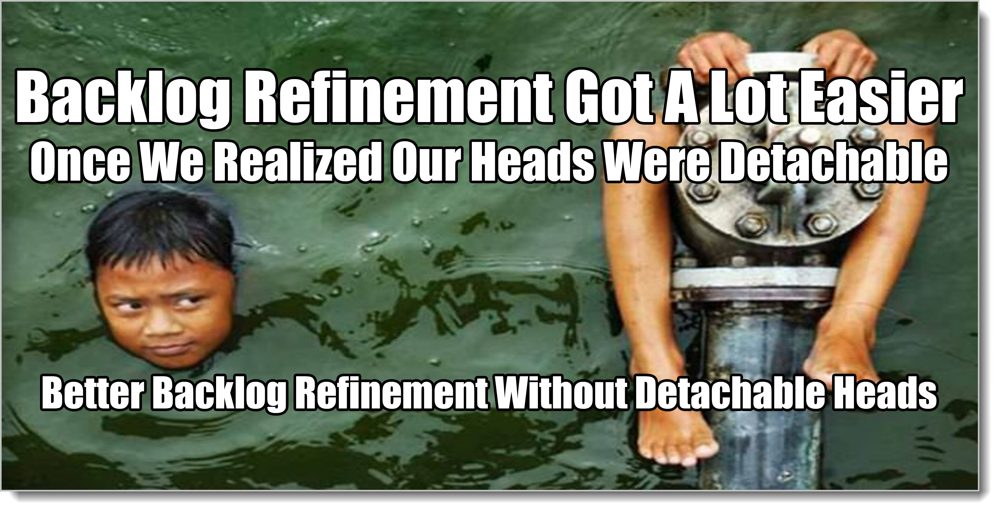
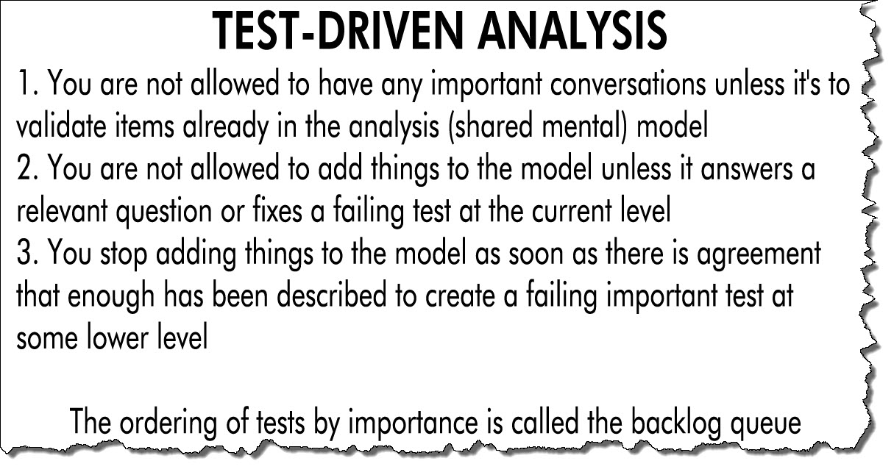
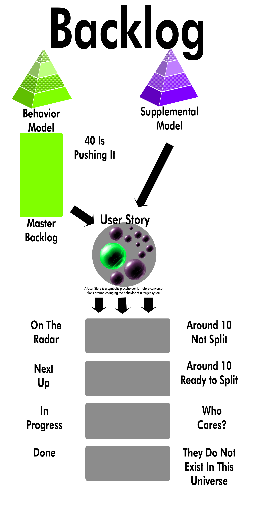

# Backlog Refinement (Grooming)

Just to get everybody caught up, a backlog is a series of partially-constructed tests. We make those tests by combining Behavior To-Be and various Supplementals To-Be. We don't develop the tests all at once, instead, we continue to mature the analysis model, and then pick off pieces to make into tests once we get close to when we want to use them. 

Tasks are to-do items. They may be associated with tests -- or not. They may be just things we'd like to do one day. They may be tremendously valuable things that must happen right away! Tasks may be *associated* with tests, but they have no tests directly tied to them. They're just things we'd like to do one day. There's no test you perform to see if a task is done aside from just looking at something. Did you wash the car? I did! (Looks at car). I see that. Thanks! Without a test, do the words "I washed the car" mean anything?

You can't tie tasks to goals/tests without mentally defining what you want it to look like and how it's built. At that point, all creative work stops. Any analysis work is done. Goals/tests created from the analysis model define value. Tasks define *activity*, not *value*.

Tasks do not go in the backlog. A list of tasks is just a to-do list. Tasks are fine and necessary, they're just not related to what you're trying to change as much as they describe what you are doing. In many cases there's no match between the two. The worst thing is that tasks can appear to be providing value when in fact they're introducing tons of friction and waste into the system. By breaking things into tasks, you end Analysis, since you're assuming the solution and how you're reaching it is both known and fixed. 

Tasks are good and necessary in other areas aside from using Structured Analysis, though. Set aside time for to-do items everyday. Put post-its on your monitor.[^19-1] There are tons of ways to keep track of your tasks. It's just that the backlog isn't one of them. Because of all of that, in general, breaking down creative work into written tasks should be avoided.[^19-0]

[^19-1]: When I develop software for myself my entire tracking system consists of post-its on my monitor. On the left is to-do, on the right is completed. At the bottom are things I need to consider. The entire model exists in my head, and the reason I refuse to use any more structure than that is that if I can't see it, it doesn't exist. I want my mind constantly going through the analysis model and how it relates to the work-in-progress. If I put things in a doc somewhere, for me it's just a formal way of forgetting about them.

[^19-0]: Most everybody will have examples of where they had a creative job, broke it into tasks, and everything worked out fine. In most all of these cases, that's because there are only one or two people involved, the task list isn't considered written in stone, and everyone involved is actively challenging the shared mental model with one another as they go along. That's a wonderful thing when it happens, but it only works in extremely tiny and constrained situations. You'd be fool or idiot to try it in the commercial world. Even in those isolated environments, it's more likely to fail as succeed.

That's not true if you are breaking down big tasks into smaller tasks in a non-creative, factory-like environment where value discovery is completely off-the-table.

**The backlog isn't about stuff you're going to do. It's about ways you're going to change the target system.** To-do stuffed backlogs are good for robots, not for people being paid to use their brains.

Ideally you wouldn't do anything and you'd still somehow change the target system to provide fabulous wealth. Then you'd be living on tropical islands drinking those drinks with little umbrellas in them. Worst-case, you have some to-do list from hell that you call a backlog and everybody has far too much work than they ever could get done and the target system doesn't change at all.

## How NOT to do Backlog Grooming

Require a large group to attend. Only have it once a month or so, and make sure the group that is attending never sees each other much during the day. (This will provide for an incredible amount of cross-talk and make it difficult to stay focused). Use a projector in a darkened room, especially after lunch, because who doesn't like projectors in a dark room after a big meal?

Once everybody is assembled, bring up a big list of items on an electronic tool, preferably all prefixed with some impenetrable code that you use as a moniker. "First up is CS743183 dash seven. Who can forget that one?"

Ask a bunch of questions that are related to whatever process you are doing instead of the nature of the work. "How many points for 'Reverse polarity on the deflector array?'", and "Has the TPS cover sheet been completed for this?"

Make everybody wait while you click around through some interface. Bonus points for misspelling things and then, while everybody painfully watches, having to slowly back up and fix it.

Never talk about the overall scope of work, only tiny items in a large, seemingly vast and endless list. Double bonus points if you can spend a large chunk of time discussing some System Realized issue that few in the room care about or can engage in.

As you go along, never clean up. Instead, just keep incrementally adding stuff here and there. Don't refactor 17 items into 3, instead, keep adding new items and keep adding a lot detail for existing items. Sometimes you'll copy and paste, sometimes you'll re-type things, only using different terms. The important thing is that over time it just keeps getting bigger and bigger. It's the Backlog Blob that ate Cincinnati!

Hold it a day or two before sprint close, so that it people will be sitting there worrying about completing the rest of their work.

Do this enough times and you could be brought up on war crimes. You also may get a promotion. Or both. Either is equally likely. But I wouldn't risk it if I were you. Trust me.

## Backlog grooming/refinement[^19-20]

[^19-20]: For years it was called "backlog grooming". This is because that's what you were doing: grooming. Grooming is preparing something. You groom horses. You groom your hair. You groom your replacement. Rather recently, however, some folks realized that evil child molesters also use the word "groom". That's right: they groom their victims. So, in order not to be associated with child molesters, there is a movement to use the word "refinement" instead of grooming. There are more problems than I want to go into here, the primary of which is that "grooming" is what you need to do, not refining. I have no idea what people are doing with horses now. Refining them? Are they spending their time before a date refining their looks. Whatever. But if the evil child molester people ever start using the word "aardvark"? Then I'm putting my dang foot down. Enough is enough. We can't let the terrorists win.

This is just a typical process list you might get from a trainer. It is an agenda for grooming. *We're going to use this list as a prop to talk about how goals/tests are created and delivered*. There could also be games, puppets, or laser tag. How you do this stuff is a process question. Whatever you do when you do for your grooming/refinement, it's ends up a dialectic that focuses around three questions: 

1. What will it do when it's done?
2. What's important right now for it to start doing?
3. How will we know it's doing that?

You cogitate on the first question while bouncing the second questions against one another until you feel the last question has been answered well enough to do whatever's next. (By "bouncing two questions together", I mean that the answer to one changes the nature of the other. So then you have to re-ask the first one. This can continue for a few rounds.)

It's all about that dialectic.

Grooming is what we did in the deck example every time we went back home and got organized for another conversation. "What will it do when it's done? What's important right now? What does it have to start doing next?" might be a good slogan for grooming. We never, ever knew the complete answers to those questions, but by asking them we were able to come up with model items and props we could use to test out whether or not we were getting closer.

Grooming is also what happened as we played with a physical model of the deck when we were with the customer, only it was informal grooming. (The best and fastest kind, by a couple orders of magnitude.) We didn't have some kind of special session or meeting we called "grooming". Instead, we just tested whatever model we had by giving a structural prop to the customer and walking through the behaviors with him. 

A bunch of stuff we did was wrong -- the chairs don't go over there by the hot tub. Great. A failing test means we change the model, either the deployed target system or a structural proxy. Either way is a win for us.

In TDD, (mostly), our tests are never wrong but our code might be. In Structured, Test-Driven Analysis, when our tests fail it's because the model is somehow out of sync with the people we're trying to help.[^19-22] We added that new information into our mental model, we cross-checked what we could remember to see if it changed anything else, we made sure we weren't confused about what the heck was going on, then we came up with new questions about "just what will this entire thing do when it's done", "What's the most important thing to figure out right now?", and "How do we find that out?" We created or updated a structure, either in our deployed target system or one of our structural proxies. Then we started more conversations with the customer.

[^19-22]: In this way, the Air France failure was an *analysis* test failure, the pilots flying and the engineers building the flight deck had a huge gap in their models. That's a horrible, horrible test to fail in a way that involves loss of life.

That's grooming. Continuous grooming.

Ideally grooming happens continuously. If you've only got one person you're making happy, stick them in the room with you all of the time. There's no reason it has to be a separate meeting or big formal event. But many times we don't have time to get organized and leave things in a mess. Stuff gets thrown in notes that should be master model items. Questions are stuck in the wrong place. There's a new supplemental that we haven't had time to talk about. 

Most importantly, not everybody on the team is capable of cleaning up and getting organized, which means that keeping things neat ends up bottle-necking through the people who know how to do it. Since things get messy and you've created this bottleneck, you have to call out a special time for grooming. (This means that the ultimate goal of a formal grooming meeting is teaching the team how to groom informally and continuously. It's not that hard. You've figured it out by reading a book. When everybody can constantly help keep things clean and organized as you move along, everybody will be much happier and productive. As my mom used to say, instead of waiting until there's one big cleanup job, Daniel, clean just a little bit as you go along. Makes life much easier.)[^19-24]

[^19-24]: I never listened to my mom.

### **Introduce new information**. 

Sally is a Customer Service Representative in a mid-sized insurance company. She works in the same building as the rest of headquarters, just a few hundred feet away from the IT department.

Sally has found a bug in the software she uses everyday.

What does she do? Does she tell her supervisor? Fill out an online form? Just suffer and put up with it? Find another job?

In so many words, these were the options she was given.

Sally entered the bug information. Two months later, when nothing was done, she entered the information again. Then again in six months. Finally she left for another job.

Joe is a Product Owner for a financial app that runs on three major platforms. His team works in a building 100 miles away. He has some new ideas for the app based on some conversations he had with UX experts this morning. 

What does he do? Does he wait two months until some kind of program-level meeting? Does he set up an online meeting? Nope. He was told not to do that. He was told that all he had to do was enter stuff into this magic tool and it would be done by the team. So whenever he thinks of new stuff, he enters it into the tool.

Now the tool has over 200 items that Joe and other people have put in. The team doesn't understand what the items mean, and Joe and the other business owners are dickering over which items go ahead or behind which other items. For many of the items, even the people who entered them can't remember what they mean. When he points out how difficult it is to keep track of everything and remember exactly what things mean, he was told that every item he entered had to follow a formula -- a formula that once you are following creates several-hundred-word entries.

Now? He doesn't have time to scan through a list of even ten of these and look at all the detail. Now he's being told he has to go back through all of the other items on the list (!) and enter the information for all of those too. Many times much of the information it's just boilerplate duplicate stuff. To Joe, it feels a lot like busywork.

Joe gave up on the tool. Now when he needs something, he calls the developer directly, interrupting whatever was going on and massively changing direction of the project from day-to-day. Developers do not say nice things about Joe (They like him as a person, of course. He just drives them crazy as a Product Owner.)

Mary is a Senior Vice President at a manufacturing firm that's embedding software in their products.  When she wants something done across a complex system, she'll subtly ask several of the embedded teams to implement the same feature, knowing if just one team delivers it, her goals will be met. Months later, during a sidebar conversation at a management meeting, managers figure out that several teams are doing the same thing -- and they're all doing it different ways.

Louis is a supervisor in a regional office of a large government agency. Most of the software he deals with is outdated and brittle. Over the years he's seen a dozen different efforts to improve things. He's seen consultants come by with surveys, he's attended national conferences with other supervisors and sat on committees, he's been asked to write up his experiences in reports. He has four different systems for requesting upgrades, bug fixes, and enhancements. None of them seem to ever produce positive results.

He tells his direct reports to use all of the systems religiously, but they all know that secretly Louis has given up on change. Now he's just biding his time until retirement.

We understand the dialectic and Structured Analysis. We know that all of these ways of adding information to a team are counter-productive. We also realize that there are people outside the team that have important information to add. We have to have some way of interacting with outside folks using the dialectic to hone the team's shared mental model of the world.

No matter what, somehow we gotta effectively add information to the team from outside that are time-constrained in various ways. So in anything but a one-on-one situation, you gotta have some kind of meeting called "grooming", even if it's just 20 minutes every morning after the stand-up. There are just a few simple rules that have to be followed to add this information well. But they all have to be followed.

* Nobody but nobody adds information to a team's backlog aside from the team. People have to go through the team to make new information appear there.
* People who work physically near the team are the ones that can work with the team to add new information. If you aren't one of those people, you have to work through one of them. No "mailing it in" or using an online tool as some sort of project-manipulation device.[^19-26]
* When you want to add information, you show up at a set time and have a conversation with everybody in the team. If you have formal grooming sessions, a good time for this is at the beginning of those sessions.
* The team's job is to do the best it can to translate the universe you live in to the universe they live in. They may actually have to start modeling out your world, with Master Models and the rest of it, for it to make sense to both of you. (Remember, you should be able to do this quite quickly. Minutes, not hours.)
* At the end of adding information, the team should be able to walk you through your world, how you came across this new information and why it's needed. They should know enough of your world to be able to change their model so that it meets the needs of your model. (Even if later they decide not to do the work.)
* The conversation isn't over until the team can describe a test that everybody agrees on that would reflect the team understanding and correctly responding to the information you're providing.
* There's no way that all of this can be guaranteed to be completed in a single conversation (although it certainly happens that way most of the time for an ongoing, established product), so you have to be available, somewhat fluidly for ad-hoc, in-person follow-up questions. Hence the co-location thing.

[^19-26]: There's a special case for situations in which it is completely impossible to meet or talk to anybody that you're trying to help. We cover that in the startup section. (Warning: there are a lot of really unpleasant implications in this situation. There are good reasons most startups fail.)

For technology teams that use Scrum, the ideal situation for people with information to add is to wander down the hallway to their daily stand-up. Once that's over, raise your hand and tell them about what you'd like to talk about. At this point the team will self-scope and self-organize around the work instantly. Maybe they'll have to set up a meeting with experts and take a day to talk about it. Maybe you should just come down during the next grooming session. Maybe they're already doing that work and just need to tweak it a little bit to match what you're providing.

Maybe everybody just hangs out an extra five minutes and asks you a few questions. Boom. The adding-information part of grooming is done.

By making the addition of work physical instead of electronic, you ratchet down the amount of churn that can happen while also reducing the waste associated with blindly entering things into systems where the items have to be worked and reworked, over and over again.

You take the work to the people, let them organize it. You don't organize the work and then assign people to do it. That's backwards.

(Of course it can work without following these rules, and most of the time does -- eventually. All I'm doing is relaying what I've seen as being necessary to move very quickly and effortlessly to adapt to new situations.) The absolute best grooming I've ever heard of -- I didn't get to see it -- was an Agile Coach who went to work as a developer for a financial trading firm. They worked as solo developers, and they did financial trading alongside a real trader. There was no wall at all between doing the work and automating the work.  Traders were expected to program and programmers were expected to trade. They worked in pairs. The shared mental analysis model was continuously groomed by writing code, using it, then talking about what was learned as they continued working (trading). I believe this is about as optimal as technology development can get. That's nirvana.

Except for this example and some teams in the startup world, I've never seen it in the commercial sector. Everybody I've ever worked with had to set aside time somehow.

### **Synchronize the Model**

If there is some kind of grunt work involved with backlog grooming, it's synchronizing the analysis model. It doesn't have to take long, but it has to be done regularly, religiously. It's like brushing your teeth. You do it and it doesn't feel like anything happens, but if you don't do it, all kinds of unpleasantness is on your way seemingly from nowhere.

Behavior always seems to be the best way into scanning the entire Analysis Model.[^19-5] Go down the behaviors. Are we able to point to domain objects and talk about how they work together to make this behavior happen? For each behavior, are we able to point at the applicable supplementals and describe how they affect this behavior? Can we do it just by chatting with one another without relying on tools or docs? The real model exists in our heads, after all, and no matter what's in the EasyAM system, if it's not in our heads it doesn't exist. That's the model we need to be synchronizing.

[^19-5]: If I get bored, I'll start with the Domain Model. Or the Supplementals. It's all the same thing, anyway. People just seem to relate more to behavior, and it doesn't relate to the behavior list, it's out of scope. So if you want to start somewhere else, it's a fun thing to do, just always be sure you're not accidentally increasing scope without realizing it. Watch that behavior list.

If that goes smoothly, go through each behavior and ask about actors. Who is the person/entity that initiates this behavior? Do they initiate other behaviors? Then triggers. What kicks off this behavior? Does it kick off other behavior? Finally outcomes. Do we know all the possible ways this behavior can end? Do these outcomes kick off yet more behaviors?

You're trying to create a dialectic. If you're not getting a lot of action, pop around in the details a bit, if only verbally. You're trying to poke people into having important conversations they probably wouldn't normally have.

Scope yourself to a certain amount of time and quit when the time is up. If you've done the first couple of items above without finding anything new, maybe next time start at the third item, then the fourth, and so on. You can also skip around. In many ways this is like painting a landscape. First you sketch out the general look, then you pay a little attention here, then you pay a little attention there. Each time you look at your landscape painting your goal is to sketch out a few more details. (Not go on a death march. Remember -- fun. There's a reason why you never hear about Klingons writing good software.)

You're not doing this to build a spec. You're doing this to do a cross-check between model items to see if there are important conversation areas you might have missed. Hint: there always are. Once the model gets sketched out past an hour or two, it starts suggesting conversation areas and reminding you of things you that you probably wouldn't have thought of before. That's another piece of the magic.

### **Clean up the backlog**

Once your model is sketched out a little more and cross-checked, it's time to make sure your backlog isn't whack.

Most backlogs are whack. They get that way quickly. They're whack because the model keeps changing from minute-to-minute while the backlog doesn't (until grooming, that is.)

I'm just going to get the shocking thing out right away. You may want to get a grip on your chair.

***Your backlog should never have more than 20-60 items in it.***

But Daniel, how can that be? We have a big project! A complicated system we're building! Funding for the next two years! How could that kind of work be covered in 20-60 items?

There are five and only five kinds of things that go in your backlog.

* Goals/Tests you are currently working on 
* Goals/Tests that you will be working on next 
* Goals/Tests that you need to start seriously thinking about (on the radar)
* Master Backlog Items 

That's it. Nothing else. Since your Master Backlog is a small list of things, 20-30 items, and since what you're currently working on doesn't really count here, all we're talking about is Master Backlog plus next up plus things to start worrying about. Assuming the max of 40 items in your MBL, and assuming you could work on a quarter of those at a time (optimistically), worst-case we're talking about 40+10+10. Sixty items. Most of the time it's around 40 or so. 

But what about bugs? Defects? Feature requests? That thing with the font on page 17? That big, bulleted list we got last week from the Dallas office?

If something is coming up next, it's coming up next. If something is on the radar, it's on the radar. If what we're talking about is not either of those two things? It's in the model -- where it should be. Where everything else is. Analysis is about what happens in people's heads. Your brain can't handle more than 3 or 4 dozen items. Why would you create and maintain things in your environment that you're unable to grasp and work with as a group? It's a horrible and dehumanizing anti-pattern.[^19-30]

Note that I am **not** saying you won't end up with various large lists of things. There are myriad interesting and valid reasons for having various big lists o' stuff. Some of you folks may be calling these lists a backlog. That's fine. You can call things whatever you want -- just for purposes of this book, those things are not backlogs. (And calling those other things backlogs may be a big reason why your release planning, roadmapping, estimation, and other processes don't work the way the books tell you they're supposed to.)

[^19-30]: Many of you will have lots of questions around other ways of manipulating the analysis model: release plans, roadmaps, bug triage, and so forth. We'll handle these as we get to them. Right now it's grooming. 

### Verifies that we're ready to create executable tests for upcoming pieces of work

Everything that goes in our Behavior bucket describes a test, it's just more or less detailed. Associating that behavior with supplementals completes the description -- once the flow of the behavior and the detail of the supplementals are worked out. In fact, all of grooming, and all of Structured Analysis, is about continuing to develop the behavior and supplemental buckets so that we can take various intersections of the two to make executable tests. Describing and writing those tests, having them pass in the target system, that's what we're here for. (Making and running the tests give us more information to fill out the mental model, which helps us out with the next tests, if there are any.)

Soon, however, the moment of truth happens: we have to execute the tests. We run the test, it fails. We do some work, then we run the test again. It passes. We have completed that backlog item. That is, we have changed the target system such that it implements the behavior described in the test. (Remember, the target system doesn't have to be a computer system at all. It could be a set of corporate policies to help employee welfare, or a description of a fantasy world that our new novel will be set in.)

So the overall pattern is that we join up supplementals and behaviors to create testable chunks of future system behavior. This creates a testable chunk of work for us to do -- to make the test pass. Once the test passes we do this again. We continue doing this until the target system reaches a state we find acceptable.

What that executable test looks like depends on which layer we want to create tests in. 

In technology development, stories that we're almost ready to work on have to be developed enough to work at the System Abstract level. Most product/project backlogs consist of children of the Master Model at either the Business Realized or System Abstract level (or a mix of both. Never feel like you have to work in only one level.)

Of course, ideally you make a few lists to create a Master Model, talk about what kinds of System Abstract tests need to pass for a goal to be reached, then dive down into the System Realized level to make it happen. There's no talking about abstraction levels. It's only when things simply must be more complicated and we have no other choice that we care about knowing which level we're on.

And it varies. For one story, maybe you need to work through some levels, add some details in. For another story, you jump right to writing the test in the code. It varies. It's supposed to vary.

TDA means constantly walking through behaviors, supplementals, and domain items at any one level to see whether there is agreement that enough detail has been provided to make a test at one of the lower levels. (Not necessarily the next one down.) Analysis only exists to create and modify target systems using tests that everybody agrees to, and so analysis is constantly driving towards defining those tests in good-enough detail. As you learn more from making tests pass, you learn more about tests you'd like to have pass. Analysis Drives Tests. Tests Drive Analysis.

It's the circle of life.

## User Stories and Story Splitting

A lot of Agile folks call these backlog goal/test items "User Stories", They have a bunch of other terms too, like "Feature", "Epic", "Technical User Story". A few others. The same terms mean different things depending on which book you've read. I'm calling everything in your backlog a "User Story" because life is complicated enough as it is. A User Story is a symbolic placeholder for future conversations around a testable chunk of work which describes future behavior in a target system. It's a match between Behavior and Supplementals which insists on a structure being created in order for the test to pass.

"But my User Story is too big for this next chunk of work!" is the most common thing I hear from teams that are new to backlogs and backlog grooming. "How could I ever make it smaller?"

The trick here is that once you understand what User Stories are, the intersection of Behavior and Supplementals, you can easily break them out into smaller pieces based on the details of the items in each of those buckets that apply to this user story.[^19-30]

[^19-30]: If you can't breakdown your user story, most likely you don't have a user story in the first place.

Many times the first time you split a story is the first time you figure out a lot of supplementals that were hidden until that point. You just never think of them.

Let's say you are implementing a complicated behavior. It was tough understanding this behavior, so you sketched out an Activity Diagram to describe the flow, which has one entrance point and six outcomes. 

Great Scott! You can't implement this complicated flow all at once! That's crazy! And it's the first story too! Heck it might take a month just getting the environment in place.

Okay. You're off-the-rails already. You don't "get the environment in place", you develop the environment a little bit at a time as you deliver goals, just like you develop the rest of the structural items. We do serious engineering, but we do it incrementally, a little bit at a time. It all depends on which goals we're delivering.

*This means that environmental/build/deploy items should appear on your supplemental list*.

If I'm delivering the "foo" goal, what kinds of supplementals might I need related to the environment?

* Show something to the user related to the goal
* Do something when the user acts (UX)
* Do something and update the rest of the system when the user acts (delivery pipeline)
* Show the right thing to the user 
* Show the right thing to the user when the user acts (ZOMBIES)[^19-32]
* (Rest of supplementals go here)
* Tweak the machine, ie. add performance supplementals as the system continues to mature

[^19-32]: ZOMBIES was a term invented as far as I know by my friend, James Grenning. I believe he covers it in his book "Test-Driven Development For Embedded C", the best book for writing quality embedded code around. [https://amzn.to/2qffrYd](https://amzn.to/2qffrYd). It describes the various types of "paths" that should be considered when writing a function. You start writing the **Z**ero function, the one that does nothing. Then you handle **O**ne item, then **M**any items, then **B**oundaries, then **I**terfaces, then **E**xceptions, finally **S**cenarios. James wrote the book on writing quality software in embedded systems. You should check it out. There's also a good blog entry on it here: http://blog.wingman-sw.com/archives/677

You've got six outcomes for your behavior. That's six different flows. For each flow, you've got these seven supplementals, plus whatever other ones your system has. If you wanted to have a status report that looked good, you could blow this out immediately into 6 times 7, or 42 small User Stories. 

For user stories that you're worried about doing all at one time, blow them out like this. At the last possible minute  (Somebody once called this the "Last Responsible Moment"). Never add them to your backlog all blown out like this because you don't have anything to do with them accept decide to deliver them and then deliver them. (For a lot of people, this happens during a process called "Sprint Planning"). It's the last possible step before actually working on the dang things. They don't need to be in your queue because there's nothing for them to do there, just deliver them. If there's something left to do, it's not the last responsible moment.

Instead, when it comes time to figure out what you can do, pull the little ones off and write tests, watch them fail, then change the structure and watch them pass. Many of these delivery supplementals will have tests that consist of functions that are reused over and over again. If you write a separate test for each story that has the only acceptance criteria of "show something to the user", I will come to your office and use invective and strong language until I hurt your feelings. Instead just write a platform tests that makes sure the pages are up, then add your page to the list when you come to that story.

You've split a User Story into 73 small User Stories, but decided not to do them all. Do you have to keep all of un-done ones around on the backlog?

Heck no! If you're doing 12 of them and saving the other 61 for some future date, they don't go in the backlog. They don't go anywhere, since they are not tests that you currently plan to work on. I don't want to see them on your backlog. I don't want to see them on the wall. I don't want to see them anywhere. If you insist, stick them in the notes section of the appropriate Master Backlog Item. They'll be there for your consideration the next time you look at that item. Not before. Keep It Simple, Silly. (And I would be extremely cautious about putting them in your notes. Why would you want to pre-determine how some future version of yourself might want to deliver stuff? Insanity.)

### **Tease out the best way the entire model might be delivered (Points, Estimation, and Other Games)**

Finally we come to estimation and other topics of this ilk. Estimation and commitment are subjects that have caused much wailing and gnashing of teeth for some in the technology community. It seems that some folks have bosses that are assholes, and to prevent them from being assholes, somebody came up with the bright idea to remove the word "commitment" from the list of things a team might do. Replace it with the word "forecast". 

This is like preventing fires by outlawing the word fire and instead calling all fires "balloons". We've had no fires all last year! Had a ton of balloons, though.

Estimation has suffered a similar fate, for similar reasons. Estimation can be important, and grooming is a good time to do it. But estimation is not important for the reasons you might think.

Let me describe a popular system for estimation that some folks use.

Take the entire backlog. Pick the simplest item. Call it a 1. For other items, **guess** how **relatively difficult they are to deliver** compared to this one. Twice as much? It's a 2. Four times as much? It's a four. Total up the points. It's a simple game you should be able to play in a few minutes. The advanced version includes only using numbers that are doubles of one another (1,2,4,8,16...).  The super-advanced ninja cowboy version uses Fibonacci or Lucas series. I like using the Fibonacci series simply because I like saying "Fibonacci".

Then, at some later time or date, take the "story points" for what you completed in one chunk of time and see how they relate to the total stuff left to do. Did you complete 10 points in the last week and your remaining total is 100 points? Then you've effectively "guessed" that you have ten more weeks to go.

Pretty advanced math and engineering going on here, folks. Please step back! Give the professionals some room to work!

Of course this is easy, perhaps even somewhat frivolous and silly. When I first saw it, I was a bit astounded. Just putting numbers on things and adding them up could give you an estimate? Really? People do this? They pay people to do this? Can I get paid to do this?

Something weird happened. I saw it working, over and over again. But I don't think people understood why it worked, even the people who liked doing it. As long as the team was regularly playing this point and estimation game, after several rounds the estimates got strangely accurate.

As I continued to watch, I saw why my friends wanted to get rid of the word "estimation". I saw all the ways this was being done wrong. It was painful.

I saw people insist that these points had to map to some time period, like an hour or a day. This is a terrible fail. You might as well just estimate hours or days. The abstraction gets you nothing if you're really just talking about time. (Story points are a second-order abstraction. In the formula "y=2x+7", the story points are the "2" in that equation. They don't represent anything tangible until you plug an "x" in, that is, until you start actually delivering something. They don't represent the time period of things happening, they represent the *scale at which things happen*. Story points work with zooming teams and really slow teams the exact same way. It's second-order estimating.)

I saw people do scheduling and commitment at the same time they did points. This is also a terrible fail. The entire point (ouch!) here is to separate the guess about how complicated it is to deliver stuff from the actual projection of when things will be done. They're separate events with separate participants, concerns, and interactions. To do a projected work duration (to figure out the total amount of work duration you're looking at, not involve dependencies or a bunch of other things. I'm not talking about release planning) you don't even need the team in the room. It's simple math. If you try to do both points-guessing and scheduling at the same time, people are going to look at points as days or hours again. It's useless. Add commitment to the mix? Toxic. Might as well walk around the room and ask each person to swear an oath about when they'll be done.[^19-34]
 
[^19-34]: I am firm believer that technology development in most cases is a business transaction. One person has money. One person can make stuff happen. Getting the two together in a mutually-beneficial relationship is business. It can and should be treated as such. "How much can you guys do for twenty-five bucks?" is a legitimate questions the team should be able to answer. Professionals make commitments, they negotiate uncertainties, they hedge their bets, use slack wisely, and so forth. For purposes of this discussion, I'm just explaining the failure modes. Professionals make commitments, but they don't do it like this. This is insane. (And used far too frequently by businesses. Doing it this way only makes everybody miserable and destroys trust.)

I saw people take how much time they had for a project, then divide the number of time chunks they had, arriving at some weird number. Do we have ten sprints and 100 points in our backlog? Then we have to do ten points per sprint, dang it! This is a triple fail. First, it completely forgets the concept that the points for items will change over time. Second, it ignores any new items being added, and new items are always added. Finally it uses time to drive work. The work is the work. At the risk of being crude, if you change what the work is based on time (instead of what the users want), you don't know what you're doing. You know when you'll be done, but you have no idea what you're doing. In more ways than one.

(Although it's perfectly acceptable to talk with users about what they actually want, of course. That's the entire purpose. You just can't put the cart in front of the horse. I'd like a pony for Christmas. Doesn't mean that it's possible for me to get one. It's also natural and expected to have deadlines. Life is full of them.)

I saw people leaving the points from last time on the story from one game-playing-session to the next. Well heck, if you're going to do that, people aren't really guessing again, are they?[^19-344] They're just looking at what the old number was and asking if anything changed. That might be an interesting thing to do, but it's a different thing from the way the game is played. You, also, are doing it wrong.

[^19-344]: Wait a minute. Am I saying we shouldn't use "yesterday's weather", we shouldn't use the points from the last sprint to figure out what we can do this sprint? That's exactly what I'm saying. Using points from the previous sprint to drive what goes in the next sprint -- also called "Yesterday's Weather" -- is a hack. It's a hack teams have to use because they don't know how to manage their information stream. We had to have something because who had time to look at the entire backlog again? That thing was a mess! But now we know how to keep the backlog simple, right? We keep simple so we can think about it, the entire thing, at one time, right? We want to think about the whole thing. We have to think about the whole thing. Everything in your project should be changing. The difficulty to deliver should be going down, your understanding of the nature should get a lot better, your teamwork should be getting better. So how in heck could you use points in that fashion? The teams I see using points that way are teams in which _nothing_ is changing. Don't be that team. If you are that team, I will come and beat you with a wet noodle. 

I saw people taking the points from one time period and then using that number to determine the next time period. Did ten points last time? Pick ten points of stuff for next time and do that. After all you did ten points last time, right? The failure here is that points are a lagging indicator, not a leading one. That is, you do what you can do. Points got nothing to do with it. Until you do something, you really don't know how hard it is to do or not. I've gotten to erasing points as soon as the game is finished to prevent this kind of nonsense. Do the points. Forget them. Do the work. Then, if you want, offline, use the points to guess how much work is left. 

Now? Now I totally understand why people don't like the words estimations and commitment. Points are a simple thing to do but hell if we don't screw them up a lot.

The point game does this: the entire team walks through the entire backlog working through a mental model of how each item might be delivered. They do that over and over again, and as they get better at delivery and understanding the entire project, they get pretty good at guessing how relatively difficult things might be.

At least that's the way it reads in the book.

Something else happens too. We know something now that maybe the other book writers didn't: as the team walks through an imaginary delivery of all these goals, they're creating a shared Meta model of execution which gets more and more accurate with problem engagement and practice. 

We're back to alignment and shared mental models again, only this time in the **Meta** genre, not Business or System. What we're doing as we deliver things and think about how we're going to deliver more things is come together on a system for how we deliver stuff. That's the real value of the point game, which has nothing to do with estimation. Over time it creates a shared Meta Abstract To-Be model.

In the deck example, we did the same kind of thing. As we continued playing with our models, bouncing them up against behavior and supplemental items, we were also thinking about how we'd build the deck.

So much of what happens in analysis is invisible.

There's also an aspect of this that's more social psychology than anything else. As the team keeps estimating, making stuff, then estimating some more, they end up convincing themselves about what's possible and impossible That becomes their reality. And it becomes a reality for them simply by them all agreeing on it.

It's like placebos. It may be total crap *how* it works, but it works, so who cares?

(By the way, this more than anything else, should convince you that the team should estimate *all* the backlog, start fresh each time, and only use points as a lagging indicator. This social bonding can be used for evil. If the team only estimates the first day the project kicks-off, then estimates new things as they are added? They are never challenging or changing their mental model of the entire project delivery. Just re-confirming it. You can end-up effectively "programming" the team to view the project as taking a longer and longer time instead of the other way around).

If you like estimating, then estimate, using whatever method works for you. If you don't like estimating, or your relationship with your customers and users doesn't require estimating? Don't estimate. Technology delivery is an art, an engineering practice, and a service business. All three. And all three of those are equally important.

But whatever your decision around estimation, you need to engage the team mentally on a regular basis with thinking about the entire model and how it will be delivered, not just what items are in the formal, written model and how they connect.

This book is not about Agile, Scrum, Story Points, or Sprints. It's about what's going on behind-the-scenes in the minds of people who create new realities for folks. A hundred years from now maybe nobody does Story Point estimation anymore. They'll still need to be going through the entire backlog creating a shared mental model of items in the Meta genre. Story points are a tool for that. There are others.

So we reach some odd conclusions about estimating. To be effective, the estimation process, whatever it is, must:

- Be frequent
- Be about delivering the entire system, not just parts of it
- Be something that requires the team to form, re-form, and validate their shared mental model of how execution will play out 
- Be something that looks believable/reasonable to those performing it
- Be completely disconnected from scheduling or commitment discussions
- Be fun, perhaps distractingly so
- Generate some kind of numerical result that later can be used in scheduling and commitment discussions 

If it has those qualities, it has a chance of being a great estimation process. It's a good process tool.

Speaking of tools, let's dig in to see backlog grooming/refinement in action using EasyAM.