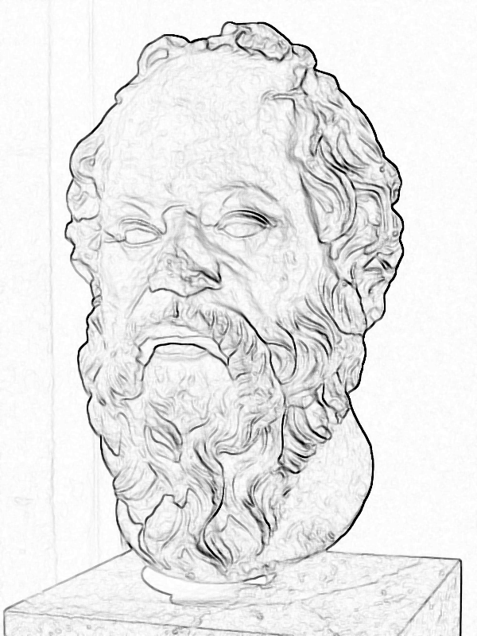

# Chapter 2

"Explaining a joke is like dissecting a frog. You understand it better but the frog dies in the process." - E.B. White[^2-1]

[^2-1]:White was author of Charlotte's Web and Stuart Little, among other books. He was also part of the team that made "The Elements of Style" or Strunk and White", one of the most influential books on the art of English writing in existence. (This quote has also been attributed to Mark Twain.)

If we're going to spend some time talking about information flow, we're going to have to talk about what people do with information when they get it. No, we've already established that this won't be a book on management theory, technology construction, startups, program management, artificial intelligence, backlogs, or product design, although it has a lot to do with all of those things and more. 

Instead, we first have to ask the general question "What do people do with information that makes it useful to them? *Any* kind of people? *Any* kind of information?" If we can answer that question, we can talk about gathering, sorting, and optimizing information flow. If we can't, then we can all go out for beers. Our work here is done. 

Just like humor, getting information and making something useful out of it is something that we've done almost since birth, quite naturally. Funny things are funny because they're funny, and we gather and process information because that's what we do. To take it apart any further than that kills the frog -- takes the magic out.

Yet here we are. That's Job #1 for us. And here's the answer: *We ask questions to gain information in order to ask more questions*. 

Ha! You probably thought it would be more complicated than that, didn't you?

All information participates as part of one or more question-response loops. That's information's purpose. That's all its purpose. Nothing else.

## Socrates

They killed Socrates[^2-2] for asking too many questions. There are a lot of things we can say about Socrates. If you're looking for the shortest version, that's it.

[^2-2]:I'm writing all of the Socrates, Plato, and Aristotle stuff from memory after consuming a dozen or more different books over the years, using Wikipedia as a reminder of various dates and terms I might have forgotten along the way. If you're interested in the great thinkers of the western tradition that we talk about in this book, there's a great "The Great Courses" audio lecture series that's a great place to start. Google it.

There are three people in western history that form the basis for just about our entire modern life: Socrates, Plato, and Aristotle. They're like a grandfather, father, and son. Socrates taught Plato. Plato taught Aristotle.

It all started with questions. Our modern world, our schools, our technology, our science, our literature. It all started with questions.

Socrates lived about 2500 years ago, long before Jesus or the Roman Empire. He lived in Athens. It was during a period that for the first time we had writing that people wouldn't lose and people of all kinds of religions and languages were mixing it up in the Mediterranean around where Socrates lived.

Merchants started making enough money to want to teach their kids to be more educated than their parents were. Along with writing and literature came the philosophers. The initial job of philosophers was probably something like "Smart people who we'll pay to train our kids to be smarter than we are so that they'll have a better life."

That covered a lot of ground! But remember: there were no schools or colleges. No public libraries stocked full of books. If you wanted your kid to learn stuff you had to send him *somewhere*, to *somebody*, and philosophers were the guys. If you were rich you hired a philosopher to come to your estate. The really good philosophers had their own cool kids club where they taught a group all at once.

The first schools.

Before Socrates, Plato, and Aristotle? The Sophists were the great teachers of youth. This was a long, long time ago, and much of what we have is guesswork. The Sophists to me were the first self-help authors. You know the ones. They're the folks telling you to "fake it until you make it!", the people making those motivational posters, appearing in infomercials, the guys writing books promising a new you.

Sophists taught rhetoric, the art of speaking well and arguing. They also taught how to be well-regarded, how to get along with others, how to move up in the world. It made sense. These were all skills that any merchant would want their kids to have. These were the skills that made you well-regarded among others.

The problem was, while it made the kids much more socially adept, it didn't actually make them any smarter. It's like the guy who took so much training he's the best salesman and manager in the world, but his product sucks. People love to be around the guy, he's invited to all the parties -- but there this huge thing missing. There's no depth. There's great packaging, just nothing good inside the box.

After years and years of watching the Sophists and their students, some people wondered: What was missing? What's wrong here? These guys sound and look good, but they're all fluff. What did we miss?

Questions.

Here's Socrates talking about meeting one of these guys.

"When I left him, I reasoned thus with myself: I am wiser than this man, for neither of us appears to know anything great and good; but he fancies he knows something, although he knows nothing; whereas I, as I do not know anything, so I do not fancy I do. In this trifling particular, then, I appear to be wiser than he, because I do not fancy I know what I do not know." - Socrates[~2-3]

[^2-3]: From Plato's Apology, the account of the trial of Socrates.

Socrates didn't charge for his school. He didn't teach kids to look good, or say the right things. Instead he taught something else, one of the most valuable things to have in life. We could probably summarize by calling it *intellectual humility*. He knew that he didn't know. And he knew that was more important than anything else.

Socrates was professionally curious. He specialized in asking good questions. They even have a method used today named after him called The Socratic Method. It is a way for 2 or more people to bounce ideas back and forth by asking each other honest and penetrating questions based on the conversation so far. 

In the Socratic Method people challenge one another's ideas -- as sharply as they can -- but not the people themselves. It's a friendly yet sharp exchange of questions seeking a common understanding of some subject. One philosopher called it "midwifery", because just as a midwife helps women give birth, the Socratic Method helps a group of people come to a better understanding of something.[^2-4]

[^2-4]:I had a boss once that used to ask me questions until I finally came to the conclusion that I had to do whatever it was that he wanted me to do. I guess he felt this was better than just telling me what to do. After one half-hour session of my playing "guess the right question", I wanted to punch him in the nose. I believe that he thought he was using the Socratic Method. He was not.

Socrates would hang out at the city gates, watching all the rich and powerful people walk by. They were taught by the Sophists, so they would say something that people loved and sounded awesome.

Socrates, being curious, would ask them a question, In the spirit of honesty and humility, he asked them questions that involved explaining why they said what they said.

As you can imagine, it didn't take much questioning at all before these people looked like idiots to themselves and everybody else. This was very bad! After all, image was everything to these folks. (Just not Socrates.) Whether he meant to or not, he had a way of taking apart stuff with questions. Many times once you passed the surface detail, there was nothing else there.

That made Socrates not the most popular guy around town. The kids loved him, of course. The rich and powerful folks despised him.

So they killed him. They gave him a trial, they made him drink a poison, which he did voluntarily.

They may have even burned his books, if he had any. We lost any direct information about Socrates. All we know is from his student Plato.

Plato picked up where Socrates left off, writing down as much as he could of what Socrates wrote and forming a school where the way Socrates thought could be learned by anybody that was interested.

It's impossible to overstate what a huge impact all these old Greek dudes had. All of western thought, all of western science, every piece of tech you hold in your hand, every sci-fi movie you've ever seen -- most everything we interact with has been called "footnotes to Plato"[^2-5]

[^2-5]: The full quote is "The safest general characterization of the European philosophical tradition is that it consists of a series of footnotes to Plato." by Alfred North Whitehead in "Process and Reality". Free Press, 1979

Plato's student, Aristotle, has been called "Father of Logic", "Father of Natural Science", "Father of Biology", "Father of Political Science", among other things. One of Aristotle's students was Alexander the Great. He went on to conquer much of the known world.

Modern man had been in existence for tens of thousands of years. They had spoken language much of that time. They had writing for thousands of years. Everything that was needed had been in place for a long, long time.

What the heck happened with these guys? How can these Greek guys be considered to have had such a huge impact on, well, basically everybody?

Questions.

When you were a tiny baby, you interacted with your environment. Maybe you moved your hand one way and a light came on. So you thought that your hand controlled the light. Your mother? Just an extension of yourself. When you cry another part of yourself, your mom, comes. Things change. 

You have the ability to recognize stimulus and response, you just don't have any kind of mental model for how it all works. You know that when you cry, things happen and eventually you stop crying, but you have no concept of pooping, hunger, other people...anything. It's all just stimulus and response.

Once you start talking, after saying "No" approximately fourteen-thousand times, you start with a question. The dreaded question. The question adults far and wide fear coming from the mouth of a two-year-old.

"Why?"

As anybody who has been around small children know, you can spend an hour with a child simply answering the question "why."

Why is the sky blue? Because of Rayleigh Scattering. What's a Rayleigh? He was a famous scientist. Why? Because people liked him. Why? Because he said smart things. Why?

And so on. Most times this ends with the adult saying "Because I said so!" and both conversation participants leaving unfulfilled.

After about twenty minutes of this game with my nephew Jonathan one day, I finally said, "Jonathan, I love you with all of my heart. Why do you keep asking 'why'?"

"Because I want to know stuff"

I got nothing on that. He was absolutely correct.

We ask questions to form *mental models* of our environment. That is, we already know about stimulus and response. What we want to know is the words and symbols associated with that: what they are, how they fit together, how to put them together in new ways. We want an abstract model of things in our heads that we can use. So we ask questions.

That's babies. That's been going on since people could talk. What made those old Greek guys so special?

What Socrates, Plato, and Aristotle figured out was that there was a process where groups of people came together and asked questions that created a *shared mental model*, that is, you could take 10 or 20 people, put them in a closed group, and they could ask each other questions about *anything*. After a while, you could take each of them aside and they would all have the same answers to the types of questions discussed. 

This is one of those things which sounds completely facile. Why of course they would have the same answers! What else would we expect?

Well, if they argued, instead of asking honest, humble, and probing questions, they would continue to have different models. They might even get quite emotional about it. If they met in smaller groups, each group would have the same model but the overall group would be split. In fact, if they had different sub-groups, the different sub-groups would coalesce more or less depending on how good their questions were of each other.

This process held true no matter what the topic. It was magic. You could pick anything you could express in words, put a group of people together, and they would form a common mental model around those things. Simply by using good questioning of one another.

People had been accidentally doing this for thousands of years before the Greeks, of course, but it was Socrates and his buds that figured out that this was a generic process you could apply to anything.

You paid good money for this book. Let's toss in some complicated-sounding words you can use to impress your friends. The Greeks taught the **dialectic**[^2-6]. The dialectic is when somebody proposes something to be true, called a "thesis". Another person proposes something different to be true, a "antithesis". The battle engages. Other theses are suggested. Other aintitheses are presented to oppose these theses. Over time, all of the people that are part of the dialectic decide that either a thesis is true, an antithesis is true, or more likely -- there is a synthesis between the thesis and antithesis that is true. In other words, both are kinda true and both are kinda false, depending on how you look at things. If they change the way the thesis is stated, it becomes true.

[^2-6]: Plato tells us it was Zeno of Elea that invented the dialectic. As you can imagine, in order to make this book work I have chosen to eliminate and skip huge, important parts of history. Zeno is also the one who came up with several paradoxes that you'll still see people talking about today.

The Greeks, starting a tradition that has lived proudly with every philosopher since then, took their discovery too far. In their minds, the dialectic was what people used to determine truth. After all, if you had a bunch of the smartest people in the world in a room, and they all engaged as passionately and intelligently as they could with a topic through thesis and antithesis, what else could you come up with besides the truth?

(Later on, of course, other smarter people came along and took the same subjects, went through the same process, and came up with different answers. They also thought they knew the truth, but then still *smarter* people came along, and so on.)

The dialectic is the basis of everything. Everything that science is that we know? It's the result of a dialectic coming down through the ages. Your cell phone works because of electronics. Electronics work because of electricity and atomic theory. Electricity and atomic theory work because of probability and the calculus. You trace anything in your life far enough back, and you've got this wonderful conversation happening between really smart people over the years that results in a *shared mental model* of how the world works. Science. Knowledge.

That doesn't make any of it right or wrong, true or false. It just makes it tremendously useful.[^2-7]

[^2-7]: That's your epistemology lesson for today. Epistemology is the study of how we know things. Nothing means anything. It's an important subject, but it's not for the faint-hearted. We know a lot of stuff, but the word "know" isn't as rock-solid as you probably think it is. Much of our life growing up is learning one thing to be true, only to find out it was all a simplified fairy tale made into something you could understand at the time. Then you learn the "next level", only to find out later that they fooled you again. At the top of each field, if you're honest with yourself you realize you don't know much of anything at all. And, like Socrates, you've finally found wisdom.

Aside from being a lovable old coot, why am I telling you long-winded stories about old Greek guys in togas? Because the dialectic is the tool we still use today to do anything useful in life: develop products, teach students, send people to the moon. All of that is the result of the dialectics we participate in.

***All information exists either as the result or the input to a dialectic***

So that's our end-state. When we talk about optimizing information flow, what we mean is that we want to use the minimum amount of effort to get the maximum result from the dialectics that accomplish our mission. 

Let's say this a little differently: *We want to make sure people have as much and only as much information needed to form theses and antitheses in their group and ask the questions necessary to get their job done.* No extra information. No digging around for information that's hard to get. No missing information. No waiting around. No misleading information. Just enough and exactly at the right time for productive dialectics to occur. And when dialectics occur, the results of those dialectics should go back into the system to help other people.

I know this sounds fuzzy. Bear with me.

On Air France 447, the key, simple question was this: which way is the plane's nose pointed? The pilots in that cockpit did not have the information they needed to know that this was the critical question. [Sadder still, the people who designed, built, and trained the pilots did not have a shared mental model with the pilots in the cockpit that night, enough to understand that what the pilots thought was going on was not what the plane was telling them.]

Many times we *build things right* -- they have quality, they conform to specs, they're rugged, they're easy-to-use and own. We just don't *build the right things*. The people making stuff and the people using stuff don't live in the same world. The information flow is inadequate. The dialectics are faulty or missing. The models are different.

Information doesn't get to the right people at the right time. People die.