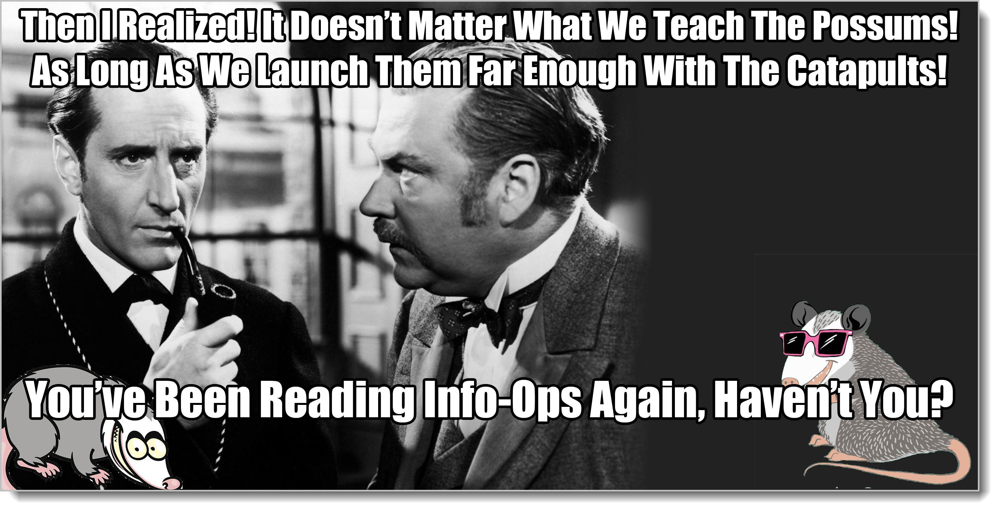
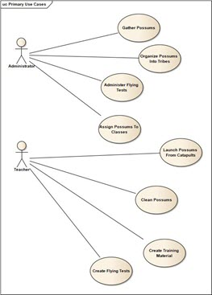
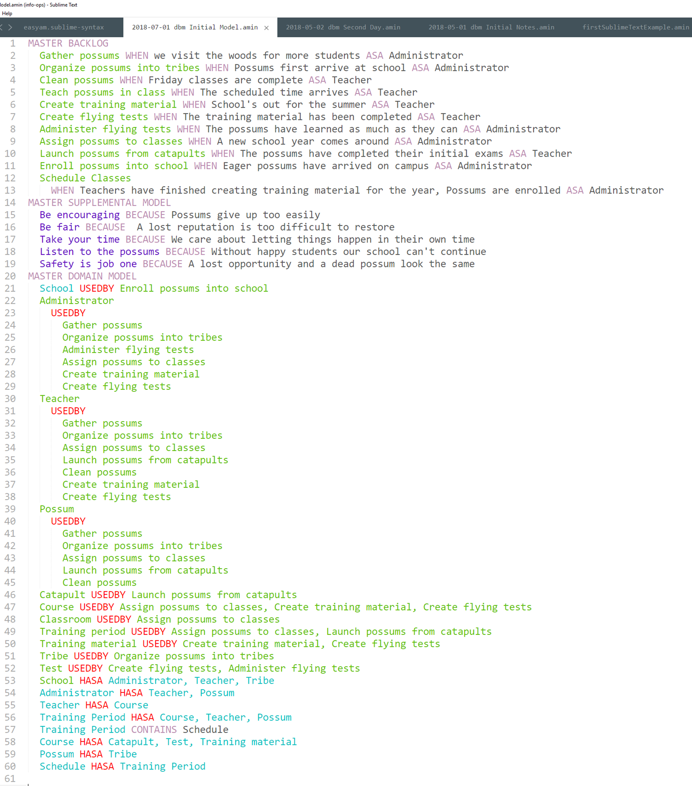

# Backlog Management Walk-Through

Congratulations! You've just received a large grant from a well-known charity to write software in support of flying schools for opossums! Flying squirrels get all the good press. You never hear anything in the news about possums that want to fly. The radical fringe group "Opossums United Curriculum Help (OUCH!)" wants somebody to develop a computer program to help those brave folks around the world who are teaching opossums to fly. Too often these kind and generous warriors are forgotten. Ever seen a fundraiser for opossum trainers? Ever see a flying opossum? See?

Along with the grant came a first-class ticket to Hooterville, Indiana, home of Peter's School of Opossum Flying and Martial Arts. It's a place for possums tired of feeling let down and disgruntled and ready to launch themselves somewhere out into the void.

You even have a team of three! Woot! It's about time you got some help around here. I'm very proud of you.

As you walk through the gates and onto hallowed ground, you see a plaque. It reminds you of the terrible price of failure.

When you meet Peter, the owner, the first thing you ask him is if he and your team can just work side-by-side for a few weeks. You'll help him with the possum pilot preparations, he can help you with the coding. This would create an instant feedback loop, eliminate any kind of analysis or backlog, and cut the crap down to the minimum-needed to get this software written, out the door, and providing value to people. Also I would get to skip writing the rest of this chapter and we could all head out for beers. Who's up?

Alas, this does not work for him. The demands of opossum organizations weigh heavy on the man, such that we'll have to set up some kind of schedule. In addition, there are other possum schools that need to use our software, not just this one. Peter isn't our customer, rather, he's not *all* of our customers. He's a potential first customer. He's just a guy to help us understand the needs of possum people.

-sigh-[^20-20]

[^20-20]: Why does everything always have to be so complicated? I know these examples are contrived, but real-world projects are just like this. They start off simple and quickly get complex.

Ok. So who *are* the customers? Where are they? What do they look like? It's good that you know analysis because you guys have a ton of questions. You look up the number to the OUCH! people and give them a call.

As it turns out, those headquarters maroons don't even want you to write software. Instead, all they want right now is for you to come back in a month or two and pitch them on what software *might* look like. Ouch! Those guys! Ouch!

You've read this book, so you know that analysis work without a test is breaking the rules. How are you supposed to know that the model is developed enough without a test? You could stop after five minutes. You could take five years. This is the crux of the problem with analysis paralysis. No tests, no end in sight.

You also know that the quicker the tests happen and the lower the level that the tests happen on, the faster you make progress.

How about if you guys built a *prototype* application while talking to Peter? It'll take the same amount of time either way, and you'd feel much better to have something to show them back at HQ.

They're okay with that. Hanging up the phone, you now have two goals in mind for your work:

1. Understand the world of opossum pilot training enough to propose and explain a software app, and 
2. Do that by building a prototype app that covers some of Peter's most pressing needs

The team spends an hour with Peter asking whatever questions come to mind. As he answers, the team asks follow-up questions, bouncing from bucket to bucket and trying to stay at the Business Abstract level (in their heads. Let's not bother Pete with Structured Analysis. He's got possum work to do.) 

In fact, whenever Pete wandered into System Realized stuff, as real humans are wont to do, the team took especially careful notes, looked as sympathetic as they could -- then tried to capture what Business Abstract Behavior or Supplementals Pete was instantiating. The actual stuff he said at that level stayed in their heads but did not go in the notes. (Why? Because if we don't understand why we're helping Pete, and Pete's world, we're never going to understand all the thousands of other possum trainers out there like Pete. We simply explained to Pete that we would get to the programming very quickly. If he would be kind enough to hang on to the programming-level stuff, we would circle back in a week or so and get it. For now we're really more interested in why he would want that.)

Pete doesn't know it, but Pete is training us to think like Pete. That's the real goal of the entire grant: know these possum flight trainers well enough to be able to anticipate their needs. (That's the goal of any technology development effort.) That's one of the many reasons Pete giving us System Realized stuff is so whack. We'll never learn to think like Pete like that.

We all go back to the hotel. Time for some grooming!

The first thing we do is compare notes, agree on what we understand, then run the final version through EasyAM. The meeting with Pete was step 1 of the grooming agenda we're using, **Introduce new information**. 

Our agreed-upon notes covers all of the top and most of the second section of the Analysis Survey. Those sections set the stage for whatever activity is going to happen.

Step 2, **"Synchronize the Model"**, was handled just by everybody taking their notes and agreeing on one version for EasyAM. If you had already had stuff written down, you would have to have everybody agree with one another, then agree with your previous notes. If you can't all agree, something's gotta change somewhere.

Step 3 is cleaning up the backlog to make it manageable. Wait! There is no backlog! We just got started! 

We'll need a backlog, then. Let's throw a few things on there for Pete to look at tomrrow.

## Analysis Affinity Mapping

Here's how to initially order a backlog with no Product Owner input: look at all the domain objects. Sort them by how important they've been to the conversation so far, like so:

* Number of connections
* Number of arrows leaving 
* Number of attributes identified

Sorting our model this way, we have:

* Teacher
* School
* Administrator
* Training Period
* Possum
* Course
* Tribe
* Catapult

Possum and course were tied, so we just picked one to go ahead of the other.

Now, for each domain entity, walk through the behaviors and list the ones that affect it. To do that, we "walk the model", going down the behavior list and pointing out domain entities while describing what happens.

For "gather possums", we go to the woods and, well, gather possums. The word "woods" is unlikely to show up anywhere else so it's not important. So that behavior right now only has one noun, "possum", along with the actor, "administrator". Next to "administrator" and "possum", we add "gather possums"

Next one is "organize possums into tribes". It's like the first one. For all we know right now, the only nouns it uses is "administrator" and "tribe". So next to administrator and tribe we add "organize possums into tribes"

Next is "administer flying tests". Next to "administrator" we add "administer flying tests"

Wait! "Test" seems like an important word. We'll be talking about that a lot. But "test" is not in our domain model! Yikes! We make a note to add it later (Or add it right away. You can do it either way). And what does the test actually check, anyway? It checks how much of the training material has been learned by the possum, right? So --- where's "training material"? That's an important phrase. Don't see it anywhere either.

Well frack. This is getting out of hand. So we make a note to add "training material" and continue on.

"Assign possums to classes" affects possums, course, teacher, training period, administrator.

Wait a minute. We catch these possums in the woods, right? So how do we know that they're eligible for classes? Don't we have to enroll them?

Geesh. Ok. So add "Enroll possums into school" to our list of things to add later. 

Now we have "launch possums from catapults" which involves a teacher during a training period taking a possum and shooting him into space using a catapult. (Hey, learning to fly ain't easy.)

"Clean possums" affects only the teacher and the possum involved. Why are we cleaning them? Add that as a question.

"Create training material" is where a teacher creates training material for a course which needs to be approved by an administrator

"Create flying tests" uses the teacher, training material, course, and administrator again.

So now we have each noun phrase listed by connections, then all the behaviors it supports, like this:

* Teacher: gather possums, organize possums into tribes, assign possums to classes, launch possums from catapults, clean possums, create training material, create flying tests
* School: enroll possums into school (which we haven't added yet)
* Administrator: gather possums, organize possums into tribes, administer flying tests, assign possums to classes, create training material, create flying tests
* Training Period: assign possums to classes, launch possums from catapults
* Possum: gather possums, organize possums into tribes, assign possums to classes, launch possums from catapults, clean possums
* Course: assign possums to classes, create training material, create flying tests
* Tribe: assign possums to tribes
* Catapult: launch possums from catapults

But we have new nouns! New behaviors! As we did this, we started getting new stuff. Shouldn't we re-do the list? Start again?

No. We should not. We're grooming. We're not disarming a nuclear missile. If this takes more than a few minutes we're spending too much time on it. Our goal here is to "gain agreement that enough has been described to create a failing test at some lower level." In other words, do we have enough to create an ordered list of behaviors we might want to test?[^20-26]

[^20-26]: We're also going to be doing this kind of thing over and over again.

We do. "Assign possums to classes" both appears associated with our most important noun ("Teacher", for now) and with the most other nouns (4). Second place looks like "Create Flying Tests" which has 4 nouns total. Third place is "Create training material", which also impacts our most important noun and hits on 3 nouns total. 

Fourth place? Who cares about fourth place? Second and third place were probably doing too much. Just throw stuff in there. So now we have a prioritized Master Backlog.

* Assign Possums To Classes
* Launch Possums From Catapults
* Create Training Material
* Create Flying Tests
* Create Training Material
* Gather Possums
* Organize Possums Into Tribes
* Clean Possums

Yay! If you've taken any sort of backlogs course in the past, you're probably yelling, "Why would we want to create a backlog without a customer or product owner present?"

***Because we want to be wrong***. "Failing tests that tell us stuff we need to know," that's our motto.

We want a test. Analysis happens naturally. Sure, we're calling this thing a meeting, but it's not, really. In any given week a good team is probably going through 50 grooming cycles, most of them informal. In a lot of ways, it doesn't matter as long as we have something that drives useful conversations with the customer. We have a test that could pass or fail.

Since we haven't quite spent an hour yet at the hotel, and since we can use what we have in the model to make more tests, we sketch out a couple of screen wireframes (System Abstract Structure) to show to Pete tomorrow and get his feedback.

Then we go back and add our new items to EasyAM, printing out the new diagrams. As we update the diagram, we realize we also forgot "Classroom", which is where a Teacher teaches a course during a training period to a bunch of possums, which we toss in there.[^20-30] And adding that, we realize we also have a "Schedule classes", which involves assigning teachers and courses to classrooms during a training period

[^20-30]: The behavior, not the possums.

We also add in the mapping to the domain model we got while walking the model. The diagram is now out of "sync" with our affinity map, but it's not important. Here's our initial notes from the first meeting and our first formal grooming.

So we started in on #3, **"Clean up the backlog"**, realizing immediately that we needed some kind of initial ordered backlog. A null backlog is not manageable. Pulling a rabbit out of our hat, we walked the model to do an **Analysis Affinity Mapping**, which created more items and gave us a starting backlog. We'll do more Analysis Affinity Mapping in Section 3 when we talk about program management.

We moved on to #4, **"Verify we're ready for the next bit of work"**. Tests always involve taking some structure and bouncing it off a combination of behaviors and supplementals. We're pushing as hard as we can not to do any paperwork at all, so we're jumping right down to System Abstract. 

My heart tells me to move immediately to System Realized, actually writing some code, but my head tells me that old Pete would freak out if he only spoke to us for an hour and we showed up the next day giving him code. He's a meeting kinda guy. He needs a bit of training from us. So our strategy will be to only go as far down as System Abstract for a few meetings, see if we can get into more of a continuous cycle, and then only do System Realized test, that is, running code.  We are using the work pattern to purposefully throttle the delivery speed so that we can work through bugs in how we work together, Meta Behavior Realized. Said a different way, we walked in with a lot of Meta Abstract Behaviors we've read about before and tried in various places. Now we're applying them a little at a time to test the waters and evolve a new Meta Behavior Realized that works for our particular situation.

Five things to note: 

1. Once we had absorbed the new information, synchronized the model, and made sure the backlog was manageable, we're immediately asking ourselves what kinds of tests we can make at a lower level. (The lowest level possible, actually. The more levels we can skip, the faster this goes.) Tests mean behaviors and supplementals coming together to drive out structure, which is either then approved or rejected. To get started we sketched out some wireframes that matched what we know so far. That's our derived structure, the wireframes. Now we just need approval that the test passed okay. I would not expect to get it.
2. We can run through analysis tests a heckuva lot faster than we can code, no matter how fast we can code. In fact, every time we suggest some structure that's driven out by the rest of the model and the other people in the room either disagree or point out that you have to add to or change the model, we've created and failed a test. That could happen dozens of times, maybe more than a hundred times in an hour, depending on how fast we can make and try out a test. Coding, no matter how fast you are, will hold you back if you want to move at that speed.[^20-32]
3. When we create a test and it passes, that means we either need to move down some levels and do it again -- or we're done. That goal has been met.
4. A good team should be able to deliver solutions faster than the customer can absorb them. (In fact, this is one of the key indicators you are working on a good team.) So at the beginning of a project, its primary concern should be "how fast can this relationship move", not "when do I get to the code-writing part?"
5. The model knows more than we do. By using a written model, as we go through the steps of grooming, we cover all the things we've learned before to see if they are consistent with one another. This results in a much deeper conversation than simply pointing at a behavior and asking "Who remembers what this is?" Just now, about 30% of the model just "fell out" while we were making sense of the rest of it. That drops off over time, but still remains significant. We get more out than we put in, even after just an hour's work.

[^20-32]: When running at that speed, you also quickly run out of important things you can test without actually doing something useful, forcing you to move lower.

## Possum Piloting School Day 2

Day 2 comes and the team is pumped up. We print out our cards, gather up our wireframes, and head off to the Possum Piloting place. What will Pete see? He'll see the team showing him some User Interface ideas using wireframes. He'll also see the team bring some kind of card game they want to play while working. What the team will be doing is seeing how fast they can get Pete working with both the analysis cards and wireframes at the same time -- no matter what, they are always moving towards continuous grooming.  (Although they'll probably never get there.)

We have created several tests in the Analysis Model that we want to run. The first thing we'll ask is "Are these the types of things you would need in an app?" Asking directly about the behavior bucket. Direct questions rarely get anything useful, but it'll start the ball rolling, get Pete used to working with the cards. Remember the magic act. What he thinks we're doing and what we're actually doing don't have to be the same thing. And that's fine. We're not trying to fool him, just make stuff he wants. He doesn't have to know everything we do.

Then we'll list the supplementals, telling him it's important values we heard while we were talking yesterday. That's test #2. Then we'll walk through the two wireframes. That's test #3 and #4.

None of these tests should pass, unless we are massively lucky. Instead, because we have failing tests, the conversation will continue, giving us more good analysis items to do another grooming session. As we add and change items, we'll modify physical cards, moving them around on the table as we point and chat about the wireframes. 

Day 2 went well. Pete liked the cards. He especially liked the wireframes and being the center of attention, but the cards seemed to make sense to him too. We talked about rapid prototyping, asked if we could come back tomorrow with wireframes for all the behaviors. He agreed. We also caught a new behavior, "Teach class". After all, if you're not teaching classes, what's the purpose of trying to teach possums to fly? Pete also agreed that we could show him some actual programming around the first item, "Assign Possums to Classes"

Back at the hotel, we started grooming, using our 5-step system we learned in that comic book. Step 1 is putting the new information in. While we were doing wireframes for the top two behaviors, we were talking structure, so we got several behavior and supplemental items captured. Remember: you always get stuff in a different bucket from the one you're talking about. Playing with wireframes actually got us walking through the flow of each behavior. (Flowcharts or Activity Diagrams is the way we capture the details of behavior items). We didn't go into exhaustive detail, but we got a good idea of the various scenarios (paths) for each of the two behaviors we wireframed.

Instead of getting into a bunch of diagramming, we just captured what we know using the EasyAM keyword "SCENARIO" for those behaviors. Step 2 is "synchronizing the model". We did that by simply taking our notes from day 2, coming to agreement on what we saw and heard, then looking at our notes from Day 1 to see if anything needs changing. (It didn't.)

Here are our day 2 notes:

Step 3 is cleaning up the backlog to make it manageable. Do we go back and do that Analysis Affinity Mapping thing to get a new prioritized list?

Why? What would be the purpose of that? 

We're always working towards something to do with tests. Our tests tomorrow will be showing Pete some programming for that top item, then going through wireframes for all of the behaviors. We decided this by going through a few questions.

What are we trying to build? A web application to help possum teachers. What's the most important thing we don't know? Exactly what kinds of things we're helping them do. Will these tests help us learn more about that? Yes. Would Analysis Affinity mapping help drive these tests out? No. So we don't do it.

There you go. Analysis Paralysis prevented in six sentences.

Step 4 for us is verifying that we're ready to create executable tests for upcoming pieces of work. 

Ok. What other easy tests can we do while we're at it? Do we know enough to wireframe the rest of the behaviors? Sure. We don't know a bunch, but who cares? The entire point here is to make failing tests over and over again as quickly as possible while we hone in on a final solution. We know enough to make a test that can fail. We're good to go. Do we know enough to write some code for that first one? Sure. It'll be wrong, but not as wrong as it was yesterday.

Now we have a couple of hours of kicking around some wireframes to get things going tomorrow. Remember, we're not writing specs. We're writing failing tests. We're just writing the best failing tests we can given what we currently know. Tomorrow we hope to spend a couple more hours with Pete looking at and re-doing the wireframes. As we work through these failing tests, we learn more.

Finally, before we quit for the day, we start chatting about the Meta genre again. The immediate work is always something tangible, like a wireframe. As we do the immediate work, we look out over the medium-term, updating the Analysis Model. But at the same time, the critical factor to all of this is the Meta genre: how we all work together to make good things happen. This is part of the Step 5 work.

What are our Meta goals for tomorrow? Let's see if we can get Pete to start joining us for grooming sessions, maybe set aside 3 hours every morning for working together. If we can get that, that'll kick things into high gear. Let's also talk about incremental delivery, where when we have really tough things, we do the blank screen first, then dummy data, and so forth. We can go ahead and add the Supplementals for that. Yay! More stuff to fail -- and meta stuff failing is always the best.

We update our Day 2 notes. They now look like this.

But wait! That's a System Abstract Supplemental! I thought we were working with Master Models?

Who cares? It doesn't matter. The real Analysis Model exists in our heads. Just after two days it's got stuff all over the place, as it should. We're not filling out forms, we're driving towards tests. We need this System Abstract Supplemental to talk to Pete about testing tomorrow, so in it goes.

When you're developing single/small team solutions, there's no right or wrong written model. Stuff goes all over the place. That's one of the reasons we have cleaning up mentioned as its own activity. We could have stuck it in the Master Supplemental Model, even though technically it's not worded appropriately for that level. Doesn't matter as long as we're driving towards tests.

Along those lines, we don't have the full title details for all of the supplementals, just that system one. Shouldn't we go back and put in the WHENEVER and ITHASTOBETHAT for the others?

No, we should not. Doesn't help us with the tests for tomorrow. It's wasted work. Same goes for some kind of deep sea fishing expedition we might do trying to come up with attributes for our entities in our master domain model. If it doesn't make a test happen, we don't fool with it.

When you start putting things in the model without associated tests in mind, at best you're wasting your time. This is how you get Analysis Paralysis. Those tests can either be Meta tests (Can we set things up with Pete so we can run faster?) or tests at a lower level (If we show him these wireframes, will Pete agree that we've captured all of the important information so far? We've been playing around with Business Abstract stuff in order to create some yummy System Abstract tests).

"Greenfield" is a term for projects that start fresh, without any history or baggage. We've done the initial greenfield work with Pete and his potential possum pilots. We've made huge progress in just a couple of meetings towards continuous grooming, we've gotten permission to start coding, and we've gotten Pete used to working with the modeling cards. Heck, we've even got a regular daily commitment. In the real world, this might several sessions to happen -- and we might walk away if Pete doesn't make much progress. But he's tooling along well-enough.

Pete's not so bad. We might even keep him.

Also we've done some wireframe and analysis model stuff. We could toss all that crap out the window tomorrow, though. It's the progress we've made in the Meta Behavior Realized that will make the difference between a success or failure.

Next let's set up a real-live backlog and talk about how small team grooming works while you're chugging through the work.