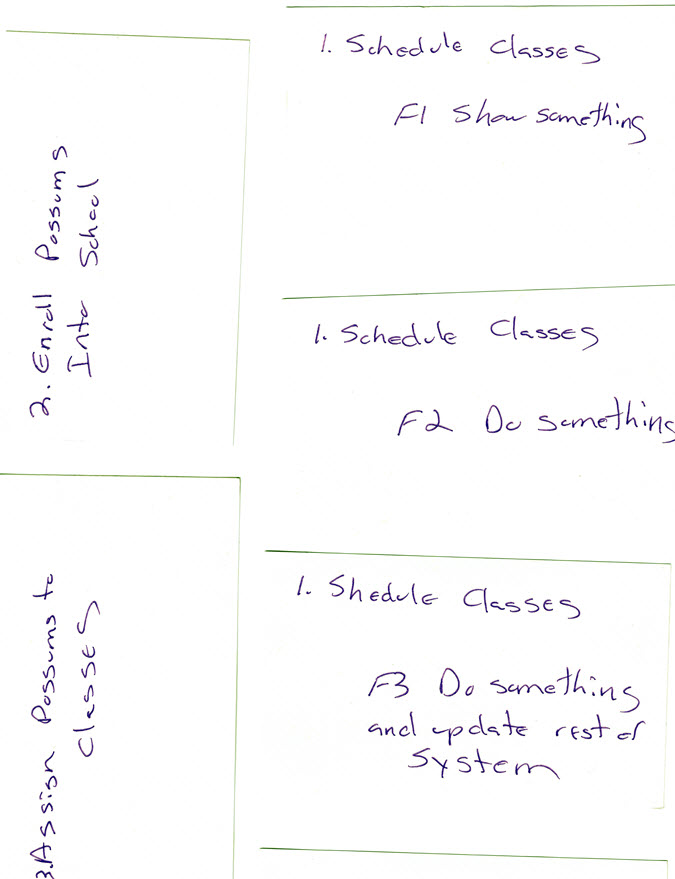

# Chapter 21

## Making Up Stories

We've done enough preliminary work to get a good Meta Model in place (how we work together to make a solution happen.) We've decided to use Scrum, which has a regular cadence of things you do. For our team, we're going to go through a week-long cycle, called a Sprint.

## Initial backlog 

First we need a backlog.

What's on a backlog? There are only five things that can go on a backlog: tests we are currently working on, tests we will be working on next, test we need to start seriously thinking about, and the Master Backlog.

Physically, we just want some cards.  Diagrams are for navigation, cards for manipulation. And we plan on manipulating the backlog in a lot of different ways.

We look at the top story. Is that small enough to do in a week? Who knows? We've never done any of this before (working with Pete, delivering in the exact stack they requested, working together as a team, etc.)

So let's split the first story. On the first card we write "1. Schedule Classes" and "F1. Show something"

Bingo. First story card done. 

We pick up the next one. It's "1. Schedule Classes" and "F2. Do something" Then the next, "1. Schedule Classes" and "F3. Do something and update the rest of the system."

User stories are when behavior joins up with supplementals. Why these supplementals? Because while we don't know Pete or possum piloting schools, we know tech. It's still early in the game. We have a ton of Meta stuff to blow out. Plus we need to build out a DevOps pipeline. So let's do the things we know the most first, concentrating on working setup (Meta) and our test-build-deliver pipeline (System Behavior/Structure Realized).

Finally, we'll do the rest of the supplementals, the *real* supplementals, all at once. We pick up another card and write "1. Schedule Classes", then list the other supplementals A-E.

That's stuff immediately coming up. We need to put some stuff on our radar, the next in line. We pick up one card and write "2. Enroll Possums Into School" and another card and write "3. Assign Possums To Classes."

When we're done, our backlog so far looks like this:

There's nothing we're working on now, we have four next up, and two coming up on the radar. What's the only other thing in our backlog? Oh yes, our Master Backlog.

Easy enough. It's already prioritized, so we make cards for items 5-11. All we need are the titles.

We have a backlog. It has 13 items.

Hang on. What about the first four stories? The ones we've either split up or queued up? Do we re-list them?

Yes, because they still exist in the Master Model. *All the master model gets listed in the backlog, no matter what else is on there* It's not like we're going to stop talking about it, it's part of our model. So we list  1-4 again at the end, bringing our total backlog size up to 17.

Our grooming for now is complete. Let's play around with EasyAM to see how we capture this in our formal model.

## Let's Estimate

## Grooming on-the-run

## About UX/UI

## ATDD 

## Evolving the build environment

1. You are not allowed to have any important conversations unless it's to validate items already in the analysis (shared mental) model
2. You are not allowed to add things to the model unless it answers a relevant question or fixes a failing test at the current level 
3. You stop adding things to the model as soon as there is agreement that enough has been described to create a failing important test at some lower level

The ordering of tests by importance is called the backlog queue

