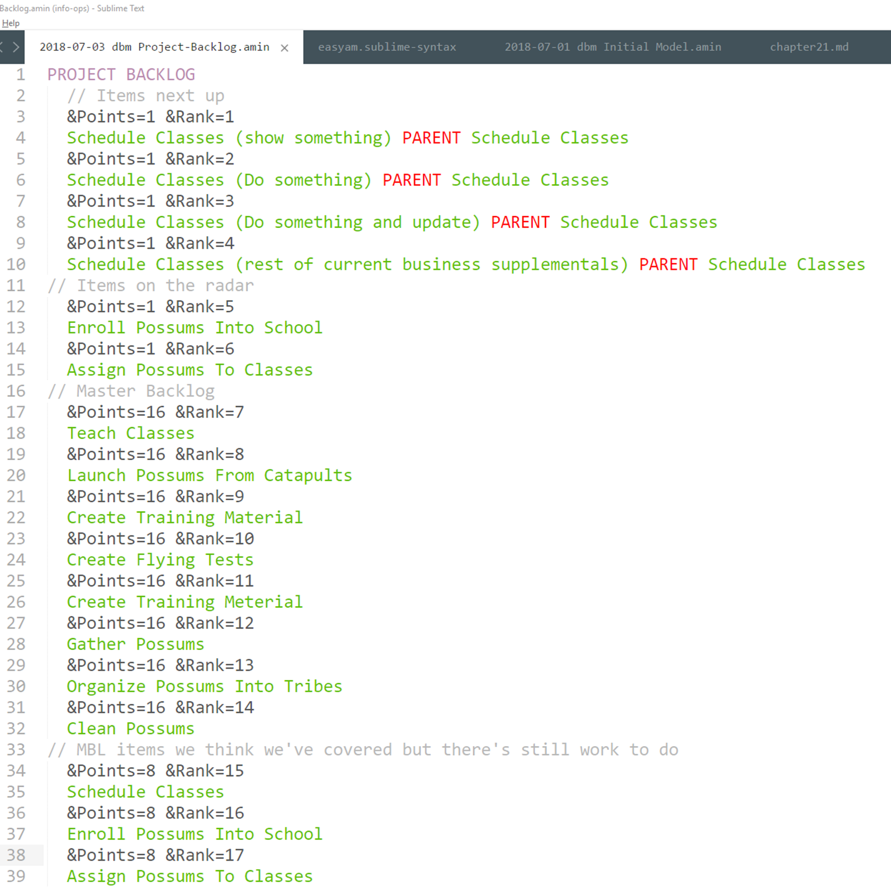

# Chapter 21

## Making Up Stories

We've done enough preliminary work to get a good Meta Model in place (how we work together to make a solution happen.) We've decided to use Scrum, which has a regular cadence of things you do. For our team, we're going to go through a week-long cycle, called a Sprint.

## Initial backlog 

First we need a backlog.

What's on a backlog? There are only five things that can go on a backlog: tests we are currently working on, tests we will be working on next, test we need to start seriously thinking about, and the Master Backlog.

Physically, we just want some cards.  Diagrams are for navigation, cards for manipulation. And we plan on manipulating the backlog in a lot of different ways.

We look at the top story. Is that small enough to do in a week? Who knows? We've never done any of this before (working with Pete, delivering in the exact stack they requested, working together as a team, etc.)

So let's split the first story. On the first card we write "1. Schedule Classes" and "F1. Show something"

Bingo. First story card done. 

We pick up the next one. It's "1. Schedule Classes" and "F2. Do something" Then the next, "1. Schedule Classes" and "F3. Do something and update the rest of the system."

User stories are when behavior joins up with supplementals. Why these supplementals? Because while we don't know Pete or possum piloting schools, we know tech. It's still early in the game. We have a ton of Meta stuff to blow out. Plus we need to build out a DevOps pipeline. So let's do the things we know the most first, concentrating on working setup (Meta) and our test-build-deliver pipeline (System Behavior/Structure Realized).

Finally, we'll do the rest of the supplementals, the *real* supplementals, all at once. We pick up another card and write "1. Schedule Classes", then list the other supplementals A-E.

That's stuff immediately coming up. We need to put some stuff on our radar, the next in line. We pick up one card and write "2. Enroll Possums Into School" and another card and write "3. Assign Possums To Classes."

When we're done, our backlog so far looks like this:

There's nothing we're working on now, we have four next up, and two coming up on the radar. What's the only other thing in our backlog? Oh yes, our Master Backlog.

Easy enough. It's already prioritized, so we make cards for items 5-11. All we need are the titles.

We have a backlog. It has 13 items.

Hang on. What about the first four stories? The ones we've either split up or queued up? Do we re-list them?

Yes, because they still exist in the Master Model. *All the master model gets listed in the backlog, no matter what else is on there* It's not like we're going to stop talking about it, it's part of our model. So we list  1-4 again at the end, bringing our total backlog size up to 17.

Our grooming for now is complete. Let's play around with EasyAM to see how we capture this in our formal model.

## That's simplistic tripe. I don't want to organize like that.

Ok. Fair enough. Maybe you have good reasons to not consider all of the business behavior around "X" at one time. Maybe it makes more sense to skip around all over the place.

Nothing changes.

Everything on your backlog stays the same except for the items that are next up, which you can construct in any fashion you like.

This is because things are still grouped in the universe by business behavior, no matter how you would like to construct your work queue. So when you look at some random item you'd like to do, *you still need to look at all of the things around the behavior that the item falls under*. You'll need to match the same supplementals, you'll need to have the same downstream considerations, you'll need to change the acceptance tests for that behavior to match the new work you're doing. 

You're free to do work in any order you'd like, but now you know that by grouping your work under Business Behavior Abstract (and Realized and System Abstract if you're using those levels), you can put a bunch of related things in one place to consider while doing that work. You also know that large backlogs, since they can't fit inside the team's heads, are counter-productive. So you're still back to grouping by Business Behavior Abstract, then "blowing things out" as the time to do the work approaches.

What if you don't do sprints? Instead you work in a free-flow form? It's still the same, you'll just need to do the "hooking-up" work for items in you work queue at the last possible moment before you start on them. (Lean experts Mary and Tom Poppendieck describe this as waiting until the "Last Responsible Moment")

Version control plays a role here. If you keep written analysis notes, you should version control them right alongside any work you're doing. After all, things change, and in any team beyond two people you can't expect to stay on top of everything all the time.

One of the biggest anti-patterns I see in corporate work management systems is using them as some kind of weird requirements tool. People understand that nobody does Use Cases any more, so they try to stick all the stuff they might have stuck into a too-long Use Case into a too long User Story.

You try to tell these folks that User Story titles are simply placeholders for future conversations, and you get blank stares. That's because they're aware that there are all sorts of important information that goes along with the user story, but you seem to be telling them to forget about it. It sounds like happy talk. 

Once you understand Structured Analysis, however, you realized that yes, there is a bunch of stuff that goes along with any user story, but very little of it has to do with the user story itself. Instead it exists as part of the model up the pyramid somewhere. And it's always changing, maturing. The last thing in the world you want to do is somehow extract the entire analysis model from one person's head and stick it in the notes section for a user story three months before anybody starts work on it.

What you want to do is just the opposite: keep your user stories in as simplistic a format as possible, pointing back to where they appear in the analysis. Then, just before you decide to work on one, snapshot what you know when you start just the same way you snapshot the codebase before you start coding. It's the same thing. The structure you create in terms of writing code or developing tech has to exist alongside of other behaviors and supplementals at the System Realized level. But it also has to exist alongside the behavior, structure, and supplementals of the analysis pyramid that begot it.

E-gads, the last thing you want is a backlog nobody can read or understand all at once, stuffed full of "user stories" whack-full of notes from all over the place, put in who knows how long ago.

## Let's Estimate

Now let's go through the complex and extremely difficult process of estimating.

We take a table. On it we put post-its every couple of feet or so. The post-its say 1,2,4,8,16,32, and 64. We put the backlog cards on the table.

"Ok, guys. Let's take 15 minutes and organize these by how relatively complex you think they are to deliver. There are no right or wrong answers"

We all walk around, move some cards, chat a bit. Time's up.

That's estimating.

This is not a book on process, or estimation. This is a book on how to organize and deliver information. Estimates are the type of information you might want to organize and deliver. More importantly, the process of thinking about what's involved with delivering all of this helps the team organize and align their mental model. They ask one another questions, they cross the check the answers with things they already know, they talk about the definition of terms. They think about strategies to deliver supplementals. 

It's analysis.

There are a bunch of other games and processes you can use to get the team regularly thinking through the entire model at once. I have a couple of friends that estimate using circus animals. Some of my friends refuse to estimate at all. Some estimate using man-days. Pick one and stick with it, or mix-and-match. But you have do something -- and regularly. At the very least once a week. Something that gets everybody thinking about everything and how it's all going to come together.

It's fine if our written notes end up reminding us of things we've forgotten. It's great if our written notes point us to things we might not have thought about. That's the magic happening. But it's a huge FAIL if our written notes become inconsistent or too complex for the team to dive down to any spot and have a reasonable conversation about the things there. Estimation and other solution-envisioning games prevent this from happening.

We add the points for each card into the file we have for our project backlog. We don't write anything down on the cards. We don't put anything on the wall. The pointing game happened and went away. But we'll record it in our notes. Now our project backlog notes look like this:

A couple of things to note. First, we have a new EasyAM token, "PROJECT BACKLOG", which automatically represents stuff at the System Abstract level. (That's as low as we can go. If it's System Realized, it's the solution itself.)

Everything at the System Realized level has its own unique blurb, like "Schedule Classes (show something)". They all point back to a Master Backlog parent (Where the vast majority of any context lies). 

Finally, they're tagged. Just before each item, you see things like "&Points=16 &Rank=7".  Things like points or rank are entirely process-dependent. They may be part of some instantiated Meta Realized model the team has come up with, but they're not part of the analysis model itself. Once again, not a book about process. EasyAM allows you to handle links like this, where the model links to some kind of external process or system, through the use of tags. 

## EasyAM Tags

Put tags wherever you like in a file. Tags apply to everything else in that file until they are reset, replaced, or a new file starts.

Tags use either the "&" or the "@" prefix. When you use the "&" tag, there can only be one of those tags active. If you say "&Kittens=cute" early on in a file, each item will be tagged with "Kittens=cute". If, later in that file, you type in "&Kittens=playful"? Then from there on out any items will be tagged with "Kittens=playful". The new tag replaces the old one.

The "@" tag works in an opposite manner. Whatever you throw at the "@" tag, it just keeps accumulating stuff. In our example, if you typed "@Kittens=cute", all the subsequent items would be tagged with "Kittens=cute", just like before. But when you type "@Kittens=playful"? It *adds* that tag. Now for all subsequent items, you have "Kittens=cute" and "Kittens=playful"

When a new file starts, the tags are all reset. If for some reason you'd like to reset all of the tags in the middle of a file, just both indicators, like so "@&"

## Getting tags out 

Every time you run EasyAM, there's a file called tags.csv that's created that has all of the items in your model along with their tags. Here's our model so far tagged up with Rank and Points.

Now that the data is in CSV format, we can do whatever else we'd like to with it. Finding the total points in our backlog is trivial.

As we start building our Info-Ops, we'll use CSV as much as we can in order to keep everything simple and readable.

## Grooming on-the-run

## About UX/UI

## ATDD 

## Evolving the build environment

1. You are not allowed to have any important conversations unless it's to validate items already in the analysis (shared mental) model
2. You are not allowed to add things to the model unless it answers a relevant question or fixes a failing test at the current level 
3. You stop adding things to the model as soon as there is agreement that enough has been described to create a failing important test at some lower level

The ordering of tests by importance is called the backlog queue

