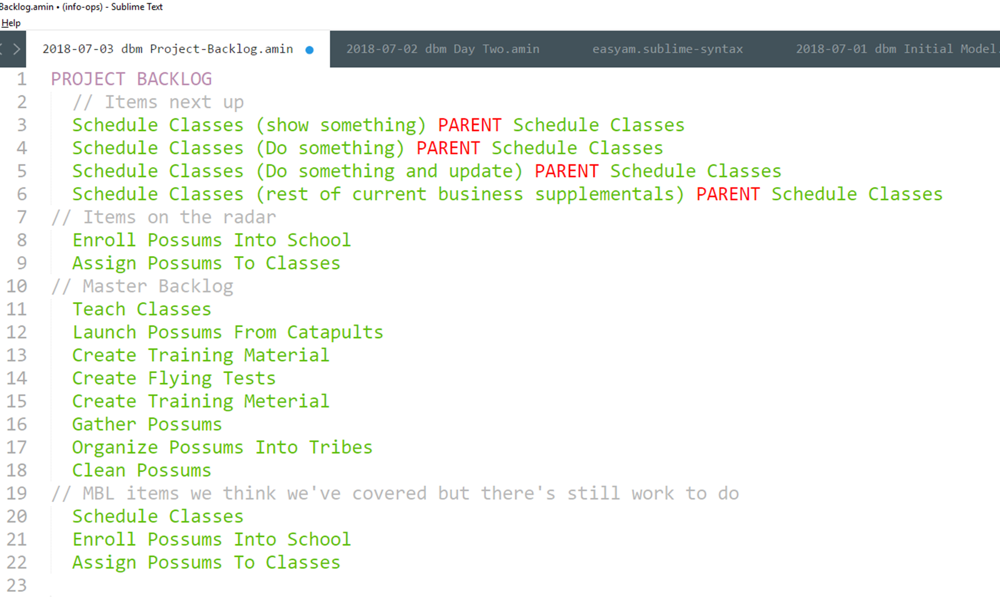
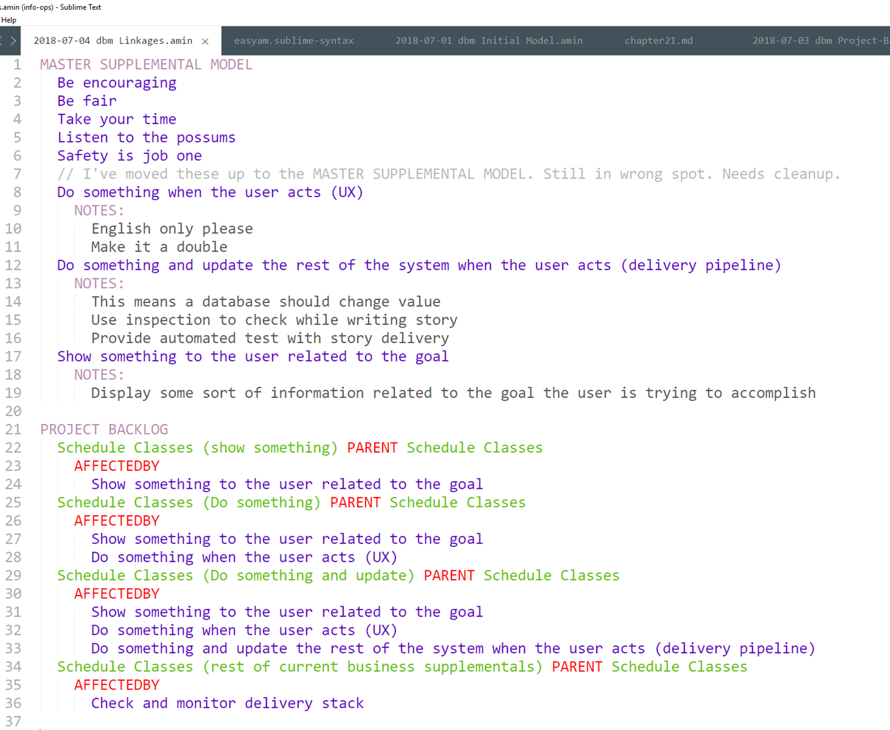

# Chapter 21

## Making Up Stories

We've done enough preliminary work to get a good Meta Model in place (how we work together to make a solution happen.) We've decided to use Scrum, which has a regular cadence of things you do. For our team, we're going to go through a week-long cycle, called a Sprint.[^21-21]

[^21-21]: You can also use continuous flow and Kanban. Scrum is only being used here as a prop.

## Initial backlog 

First we need a real backlog, not just a Master Backlog.

What's on a backlog? Remember, there are only five things that can go on a backlog: tests we are currently working on, tests we will be working on next, tests we need to start seriously thinking about, and the Master Backlog.

Physically, we just want some cards.  Diagrams are for navigation, cards for manipulation. And we plan on manipulating the backlog in a lot of different ways.

We look at the top story. Is that small enough to do in a week? Who knows? We've never done any of this before (working with Pete, delivering in the exact stack they requested, working together as a team, etc.)

So let's split the first story. On the first card we write "1. Schedule Classes" and "F1. Show something"

Bingo. First story card done. 

We pick up the next one. It's "1. Schedule Classes" and "F2. Do something" Then the next, "1. Schedule Classes" and "F3. Do something and update the rest of the system."

User stories are when behavior joins up with supplementals. Why these supplementals? Because while we don't know Pete or possum piloting schools, we know tech. It's still early in the game. We have a ton of Meta stuff to blow out. Plus we need to build out a DevOps pipeline. So let's do the things we know the most first, concentrating on developing a kick-ass working relationship (Meta) and our test-build-deliver pipeline (System Behavior/Structure Realized).[21-22]

[21-22]: The old advice used to be to do the tricky/tough stuff first. Doing it that way addresses architectural risk as early as possible. Also one of those things that was true but for the wrong reasons. Even more importantly, doing the tough stuff first gives our working relationship, the Meta Model, a good once-over.

Finally, we'll do the rest of the supplementals, the *real* supplementals, all at once. We pick up another card and write "1. Schedule Classes", then list the other supplementals A-E.

That's stuff immediately coming up. We need to put some stuff on our radar, the next in line. We pick up one card and write "2. Enroll Possums Into School" and another card and write "3. Assign Possums To Classes."

When we're done, our backlog so far looks like this:

There's nothing we're working on now, we have four next up, and two coming up on the radar. What's the only other thing in our backlog? Oh yes, our Master Backlog.

Easy enough. It's already prioritized, so we make cards for items 5-11. All we need are the titles.

We have a backlog. It has 13 items.

Hang on. What about the first four Master User Stories? The ones we've either split up or queued up? Do we re-list them?

Yes, because they still exist in the Master Model. *All the master model gets listed in the backlog, no matter what else is on there* It's not like we're going to stop talking about it, it's part of our model. So we list  1-4 again at the end, bringing our total backlog size up to 17.

Our grooming for now is complete. Let's play around with EasyAM to see how we capture this in our formal model.

## I don't want to organize like that.

Ok. Fair enough. Maybe you have good reasons to not consider all of the business behavior around "X" at one time. Maybe it makes more sense to skip around all over the place.

That's fine. Nothing changes.

Everything on your backlog stays the same except for the items that are next up, which you can construct in any fashion you like.

This is because things are still grouped in the universe by business behavior, no matter how you would like to construct your work queue. So when you look at some random item you'd like to do, *you still need to look at all of the things around the behavior that the item falls under*. You'll need to match the same supplementals, you'll need to have the same downstream considerations, you'll need to change the acceptance tests for that behavior to match the new work you're doing. It's all the same.

You're free to do work in any order you'd like, but by now you know that by grouping your work under Business Behavior Abstract (and Realized and System Abstract if you're using those levels), you can put a bunch of related things in one place to consider while doing that work. You also know that large backlogs, since they can't fit inside the team's heads, are counter-productive. You also know that the backlog isn't about what work you're going to do, it's about what value you're going to bring. So you're still back to grouping by Business Behavior Abstract, then "blowing things out" as the time to do the work approaches. You just want to blow them out in your own special and idiomatic way. 

What if you don't do sprints? Instead you work in a free-flow form? It's still the same, you'll just need to do the "hooking-up" work for items in you work queue at the last possible moment before you start on them. (Lean experts Mary and Tom Poppendieck were the ones that referred to this as waiting until the "Last Responsible Moment"). Many teams have a Kanban lane titled something like "Ready for work". Same thing.

Version control plays a role here. If you keep written analysis notes, you should version control them right alongside any work you're doing. After all, things change, and in any team beyond two people you can't expect to stay on top of everything all the time. You version-control your code; You'd better version-control your analysis.

One of the biggest anti-patterns I see in corporate work management systems is using them as some kind of weird requirements tool. People understand that nobody does Use Cases any more, so they try to stick all the stuff they might have stuck into a too-long Use Case into a too long User Story.

You try to tell these folks that User Story titles are simply symbolic placeholders for future conversations, and you get blank stares. That's because they know there has to be sorts of important information that goes along with the user story, but you seem to be telling them to forget about it. It sounds like crazy talk. 

Once you understand Structured Analysis, however, you realized that yes, there is a bunch of stuff that goes along with any user story, but very little of it has to do with the user story itself. Instead it exists as part of the model up the pyramid somewhere. And it's always changing, maturing. It's the intersection where the detail comes out. The last thing in the world you want to do is somehow extract the entire analysis model from one person's head and stick it in the notes section for a user story three months before anybody starts work on it.

Yes, you have detail. You just don't have the right, current, relevant detail.

What you want to do is just the opposite: keep your user stories in as simplistic a format as possible, pointing back to where they appear in the analysis. Then, just before you decide to work on one, snapshot what you know when you start just the same way you snapshot the codebase before you start coding. It's the same thing. The structure you create in terms of writing code or developing tech has to exist alongside of other behaviors and supplementals at the System Realized level. But it also has to exist alongside the behavior, structure, and supplementals of the analysis pyramid that begot it.

E-gads, the last thing you want is a backlog nobody can read or understand all at once, stuffed full of "user stories" whack-full of notes from all over the place, put in by who-knows-who nobody-knows-how long ago.

## Let's Estimate

Now let's go through the complex and extremely difficult process of estimating, which is a type of Step 5 work.

We take a table. On it we put post-its every couple of feet or so. The post-its say 1,2,4,8,16,32, and 64. We put the backlog cards on the table.

"Ok, guys. Let's take 15 minutes and organize these by how relatively complex you think they are to deliver. There are no right or wrong answers"

We all walk around, move some cards, chat a bit. Time's up.

That's estimating. The important thing was the thinking and chatting. The rest of it was just props for our magic act. The audience looks in one direction, something interesting happens in the place they're not watching.

This is not a book on process, or estimation. This is a book on how to organize and deliver information. Estimates are the type of information you might want to organize and deliver. More importantly, the process of thinking about what's involved with delivering all of this helps the team organize and align their mental model. They ask one another questions, they cross the check the answers with things they already know, they talk about the definition of terms. They think about strategies to deliver supplementals. 

It's analysis. **Our job is to come up with sneaky ways to get people think about the problem we're working in new ways.**

There are a bunch of other games and processes you can use to get the team regularly thinking through the entire model at once. I have a couple of friends that estimate using circus animals. Some of my friends refuse to estimate at all. Some estimate using man-days. Pick one and stick with it, or mix-and-match. But you have do something -- and regularly. At the very least once a week. Something that gets everybody thinking about everything and how it's all going to come together.

It's fine if our written notes end up reminding us of things we've forgotten. It's great if our written notes point us to things we might not have thought about. That's cool. But it's a huge FAIL if our written notes become inconsistent or too complex for the team to dive down to any spot and have a reasonable conversation about the things there. Estimation and other solution-envisioning games prevent this from happening.

We add the points for each card into the file we have for our project backlog. We don't write anything down on the cards. We don't put anything on the wall. The pointing game happened and went away. But we'll record it in our notes, mainly because we like making and printing little colored charts.[^21-27] Now our project backlog notes look like this:

[^21-27]: I'm a big believer in estimation and the power of visualization. I'm also a big believer in the fact that we tech-weenie folks like generating cool-looking stuff whether it's useful or not.

A couple of things to note. First, we have a new EasyAM token, "PROJECT BACKLOG", which automatically represents stuff at the System Abstract level. (That's as low as we can go. If it's System Realized, it's the solution itself.)

Everything at the System Realized level has its own unique blurb, like "Schedule Classes (show something)". They all point back to a Master Backlog parent (Where the vast majority of any context lies). 

Finally, they're tagged. Just before each item, you see things like "&Points=16 &Rank=7".  Things like points or rank are entirely process-dependent. They may be part of some instantiated Meta Realized model the team has come up with, but they're not part of the analysis model itself. Once again, not a book about process. EasyAM allows you to handle links like this, where the model links to some kind of external process or system, through the use of tags. 

## EasyAM Tags

Put tags wherever you like in a file. Tags apply to everything else in that file until they are reset, replaced, or a new file starts.

Tags use either the "&" or the "@" prefix. When you use the "&" tag, there can only be one of those tags active. If you say "&Kittens=cute" early on in a file, each item will be tagged with "Kittens=cute". If, later in that file, you type in "&Kittens=playful"? Then from there on out any items will be tagged with "Kittens=playful". The new tag replaces the old one.

The "@" tag works in an opposite manner. Whatever you throw at the "@" tag, it just keeps accumulating stuff. In our example, if you typed "@Kittens=cute", all the subsequent items would be tagged with "Kittens=cute", just like before. But when you type "@Kittens=playful"? It *adds* that tag. Now for all subsequent items, you have "Kittens=cute" and "Kittens=playful".

When a new file starts, the tags are all reset. If for some reason you'd like to reset all of the tags in the middle of a file, just both indicators, like so "@&" on a line by themselves

## Getting tags out 

Every time you run EasyAM, there's a file called tags.csv that's created that has all of the items in your model along with their tags. Here's our model so far tagged up with Rank and Points.

Now that the data is in CSV format, we can do whatever else we'd like to with it. Finding the total points in our backlog is trivial.

CSV stands for "Comma Separated Values". It's a type of file format that you can read and write no matter what computer system you're using. As we build our Info-Ops pipeline, we'll use CSV as much as we can in order to keep everything simple and readable.

Look out colored charts, here we come!

## Grooming on-the-run

Now that we've done some setup work and started, we need to get into the groove of regular backlog grooming.

As stories from our project backlog are completed? We just delete them from the Project Backlog. If you want, you can put them in a separate directory for completed stories. Whatever happens, they should disappear from sight. The written analysis model and the executing tests stay. That's it. Everything else goes.

Backlog grooming continues to happen as the project moves along, with new information being presented, the Analysis Model being synchronized, the backlog cleaned up, and stories prepped so that they're ready for work.

There's really no difference in ongoing grooming as opposed to greenfield grooming. The topics of conversation change, and you may try all sorts of fun thing around Step 5, but grooming is grooming, whether you're just started or in the last week of a project.

## About UI

With Peter and his opossum school, we used UI wireframes (structures) to tease out behavior and supplementals.  This is a great technique to use with users, as long as:

1. The users understand it's just a tool to drive creative conversations, and
2. You tear up the wireframes and start over once the model starts filling out 

Wireframes and other structural modeling games are great for facilitating analysis -- but people have to realize that they are facilitation tools, not design tools. 

You can go back and wireframe it up again, of course, but every time you stick structure in front of the team, analysis takes place. So whether or not you wireframe something that ends up being a screen is not as important as understanding that you may be facilitating powerful conversations -- and letting them bounce off the walls, jump out the window, and run off into the woods without anybody knowing what's going on.

Wireframes and other forms of UI mockups are *analysis* tools, not design tools. Once the analysis has matured enough for work to happen, you'll mock up the UI by, well, mocking up the UI in whatever user interface programming language you choose. Another way of looking at this is that analysis never really ends. You can do all sorts of design work, joining all the pieces up into some kind of structure. Sometimes that structure can be running code or new technology. But whenever structure appears, even if it's just people piling up rocks on the floor, and people look at/use it? You're back to analysis again.

The trick is to understand that all structure is derivative of behavior and supplementals. It also drastically increases the rate and quality of analysis. Some structure is easier and quicker to use than others. Your goal is ultimately analysis in support of a solution. Use fast tools like clay or sketches to groom as quickly as possible until the group feels like there is alignment. Then go to slower, more permanent tools. (Structure always begats more structure. That's both good and bad.)

Wireframes are another kind of game to have good conversations. They're fun and easy. They're not a specification tool, nor should they be used as one. What I'm looking for in wireframes is what I'm always looking for playing with structure. What sorts of abstract items are we talking about as we chat and manipulate these tangible things? That's their real value. Once you play with wireframes for a while, if you're doing it correctly, you come up with UI/UX rules that should be true no matter what the screens look like. Wireframes should create conditions where the model can facilitate *many* different solutions, not be just another way of mindlessly taking orders from customers.

## Story Mapping

In 2014, Jeff Patton published "User Story Mapping", a technique he had developed over many years as a Product Owner and Product Owner trainer.

Jeff's ideas were fairly simple, but powerful: you list the goals the user wishes to achieve with your product by adding post-its in a line. Then you can also add user types to match with the goals. You can even add "children", or sub-goals, under each goal.

This has turned out to be a powerful tool in getting tech teams and businesses aligned. It's also one of those games that let you look at the entire product at once.

If any of this is sounding familiar to you, it should! This is just a fun way of looking at the Master Backlog. Like estimating, User Story Maps are a wonderful game to look at the entire model at once. 

Jeff has an entire book on this, and much more has been written about User Story Mapping. If I started a new project, I'd do User Story Mapping every week for the first few weeks or so, but I'm like that. I would rather err on the side of annoying the team with games and make sure we have model alignment than be polite and have everybody with a different idea in their heads of what we're doing.

## ATDD 

ATDD stands for Acceptance Test-Driven Development. It's what we've been talking about, except explicitly for technology work. It says that work does not start until a failing test or tests has been created that once those tests pass the work is considered complete. Sometimes those tests can be automated. Sometimes not. The "A" in ATDD stands for **Acceptance**, not automated. ATDD is a business workflow, not some technology.

When we talked about the backlog being an ordered list of tests or goals, this is what we meant. Instead of directly specifying the work, we directly specify a behavioral test that must pass in the target system for the work to be successfully concluded. So the analysis model, backlog and all of that? When we say that they're not a specification, we mean that you never, ever *do* a specification. You can get whatever you want without thinking in terms of a spec -- and thinking in terms of a spec always ends up designing a system far ahead of when it should be designed. It's a total time sink.

We talked about the Analysis Model being a force multiplier. If there ever was the opposite of that, something that destroyed productivity far beyond what you think it would, it would be specification-driven development. You can totally destroy billions of dollars of effort and tens of thousands of lives with just a few well-placed (and good-sounding! Usually these are the types of things nobody would ever think to disagree with) sentences in a spec somewhere.

For us, the rule will be: we only work from tests, and we automate all the tests. (Yes, I can hear you in the back yelling about how it wouldn't work for you. You and I have had some problems before, haven't we? Email me. There is a lot of material out there covering the automated testing of just about everything. I would be surprised if you had an exceptional case.)

If you're writing computer programs, some folks a while back came up with a language for describing these "executable tests". The language is called "gherkin", like the pickles.

This isn't a book on gherkin or the various tools that can compile gherkin to different programming languages and platforms. The nice thing about gherkin is that it describes the test without mentioning technology, so it's something your business users should be able to read and understand. (If it's not, once again you're doing wrong.)

Since gherkin explains what you're doing in business language, it maps very closely to Business Behavior. When you run EasyAM, it creates a "features" folder and auto-generates a bunch of feature files for you, one for each Business Behavior Realized (Or Abstract, if you don't have anything at the Realized level) Then it goes out and finds all the supplementals that apply to that behavior and list them as comments. You'll need to know them when you're creating your acceptance criteria.

## Getting to your Tests

Even if you don't use gherkin, thinking in terms of executable tests before work begins is critical. You can still use the feature file output to remind yourself of what kinds of tests you'll need for stories you're getting ready to do.

Let's add in our linkages. This time when we run EasyAM, we see a features folder created. Under that, there's a folder called "schedule-classes". 

This is where all of the stories related to the Master User Story "Schedule Classes" will be. And we can see a bunch of gherkin feature files created.

If we pick one, say "schedule-classes-(do-something-and-update).feature", we can see all the relevant information for this User Story.

And here are the supplementals that we've linked over. If we add some notes to our supplementals, the notes appear in the feature file (and in the mus file for this story as well, of course) So when we go to the schedule classes with updates, we see not only the notes about that story, but also the supplementals related to that story and their notes as well.

In addition, we see all the ancestor supplementals, and their notes too. Remember the mess we had when we tried to connect up items from behavior, supplementals, and structure? And that was without parents and children.

The system handles all of that for us now.

As you can see, the three child supplementals are listed, along with the parent, "Check and monitor delivery stack" If we add a new note to the parent item, it'll appear in all the places the parent is referenced. It'll also appear in all the places any children or grandchildren are referenced. You could write up a very detailed description by what you mean by "Check and monitor delivery stack" and keep that in one place, version-controlled. It'll appear wherever it's needed because our links are in place. Then you never have to repeat yourself or worry whether or not you've included all the appropriate acceptance detail in your story.

Write once, use everywhere. Always stay current. Info-Ops. (Gee, I'm telling you, somebody needs to write a book about this stuff!)

These feature files can make a great story-at-a-glance reference. There are two other keywords associated with behaviors that appear in the files, "SCENARIO" and "CODE"

"SCENARIO" is a list of all the paths through the story that you've captured. "CODE" is computer code you want attached to the behavior to come out later. **EasyAM isn't a tool for translating models into code.** But if what you've captured is useful later on, there's no reason it can't create a report to help you code whenever you get around to it.

By the way, **there is a specification to your program**, an artifact that describes exactly what it must do. It's the set of executing acceptance tests you've created as you've went along. You create the spec as you deliver the product.

## EasyAM Compilation Report

Also, if you're wondering what EasyAM found in your model, there's a file named "report.amout" that gives you a recap.

We've talked about seven kinds of output from EasyAM. Model Cards, a Master Question List, AMOUT standardized output files, Project Cards, Comma-Separated Values (CSV files), report.amout and gherkin feature files. As we continue we'll start combining imports and exports to do more and more useful things, creating our Info-Ops pipeline.

## Possum Pilots Postscript

After working for a month or two, Peter's pretty pleased with your possum piloting programming. He releases you to work on other examples in this book, along with a letter of recommendation and a giant stuffed talking possum for each of you to put on the wall in your office.

But you didn't get him anything, you schmuck. 

Don't you feel bad? Some times I don't know why I put up with you.

Next let's generalize a little bit based on what we've learned before we attack some more advanced single-team topics at the end of this section.