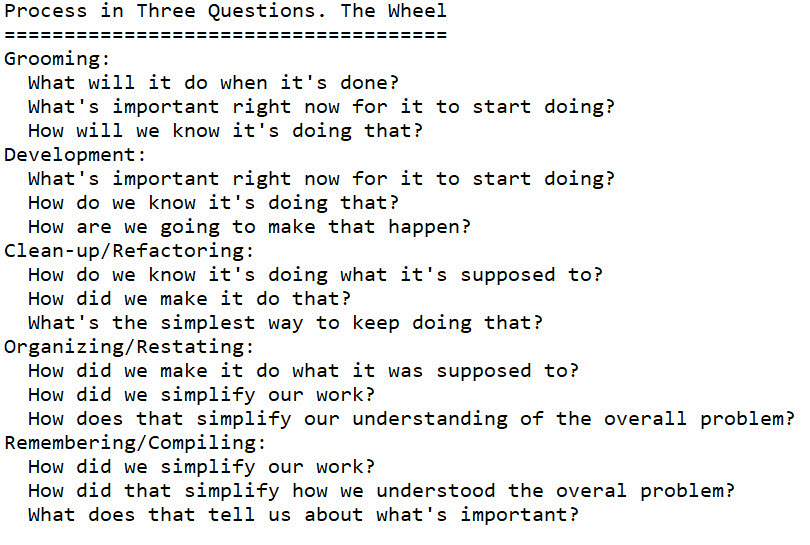

# Chapter 22

[^22-0]

[^22-0]: I jokingly call this the "Wheel of Pain" because it was painful to come up with, I imagine it will be used in all sorts of inappropriate and painful ways to make people's lives more painful, and once you narrow in on exactly what the hell you're doing, the types of questions themselves tend to be painful, at least the important ones.

You would think that in a book like this, at some point there would be a diagram of things you haven't seen before, maybe some kind of circle or loop. Some cool new process. Something you can show the other nerds down at the water cooler.

Process books love circles and loops, especially colored circles with little stick figures.

I don't want to disappoint you guys, but we did not have the budget for colored circles. Instead, all we could afford were a few dots. Even then, all we could get was gray.[^22:2]

[^22:2]: Sadly, we blew the budget on colored pyramids back in section one.

We've generalized conversations in this book, explaining how good conversations happen and why you can't replace conversations with data feeds. We've shown how to capture and store the minimum amount of information that  "remembers" what's important to you and reminds you of where and how good conversations can take place.

We've walked though a bunch of different scenarios, and as we finish out small team activities and move later to large teams, team-of-teams, programs, and the Meta genre -- we're found ourselves talking more and more about *action*, not information. Process. Meetings. That's because in order for you to learn important things about information (Structured Analysis), I have to walk you through a lot of action that generates and uses information, even if it's just pretend action.

What can we apply? What's best? What do all processes have in common? What's the best process for me? I'm looking at an A-7 scenario in this Nakatomi Tower project, dang it. Where's the little chart where I can take the A-7 scenario I have and cross-check it to find the step-by-step best process?

-sigh-

## Test-Driven Analysis Wheel

You'd think that if I were looking at trying to make some kind of generalizations about process, the obvious way would be to look at multiple examples of good processes and find similarities, right? Group them together. Look for commonalities.

Actually no. It doesn't work that way. At all.

The reason why is interesting in itself. Analysis is mostly mental, unspoken, and subconscious. The only thing I could do by cutting across and making inventories is gather together a bunch of stuff that various people have put together to do stuff -- all physical stuff, of course -- most of which relies on all of that hidden, undiscovered stuff to work in one form or another behind-the-scenes. It would be more like a survey than a generalization. And then most likely I'd end up with some version the measure-decide-act-inspect loop, or DMAIC, or OODA. (All of which are wonderful loops. Big fan of OODA myself.)

This is why just about any process book has a circle or cycle in it. Once you see that there is an overall circle that involves understanding stuff and making decisions, it's impossible to un-see it. It's everywhere! They're everywhere! So we're all stuck in cycle-land whether that the best way of looking at things or not.

For our purposes, though, the actual way that seems to work is to scan it all, think, then dive deep one-at-a-time, still considering the whole but focusing on the tiny example in front of you. Try to figure out what's going on in people's minds as that example plays out, not what kind of meeting they're holding or what the terms are. If you can do that, then you can try to build together some things that seem to be going on no matter what the ritual or process. Incrementally more and more difficult and complex scenarios and see if those same invisible things continue to be important. 

Doing this, you don't end up with a generalized process. What you instead end up with is a constellation of categories of questions that seem to recur over and over again, something like "categories of things your mind is working on all the time no matter what process you use". That's a different thing entirely than what you would expect.

The implication here is quite interesting. A great many excellent processes involve a lot of meetings and such and might never actually outwardly do anything that looks like these general categories of questions. It's just that whatever else you're doing, activity in those categories also happens inside the minds of the people involved at the same time. 

In fact, as expected, most processes that involve analysis look nothing like these categories. Grooming/refinement is probably the exception, and the reason we covered it first is because of the similarities involved. 

Even more interesting, my intuition says that it might actually be counterproductive to try to create processes directly around the categories, as most of the time in analysis a direct attack on something results in a lot of noise, paperwork, ritual, and well, no actual analysis. Analysis is weird in that direct attacks almost always result in suboptimal results. From what I've seen, your mind has to be looking away, focused somewhere else for it to work through the most important thing. We've talked about that several times when we mentioned the magic act.

This is not a book about process. If it were, boy would it be easier. I'd just give you the process. We'd have a bunch of little charts. And cycles. With the little stick men. This book is based on what happens inside a group of people's heads when they creatively make something that never existed before. How to get them the information they need.

After watching a lot of creative technical teams, it looks to me like there are five types of questions that arise during dialectics no matter what the context. All of these touch on tests and testing in some way. As far as I know, they all happen simultaneously inside of people's heads as the work progresses. Or maybe in a haphazard fashion in each person. Beats me. I gave up mind-reading after that problem I had in the circus.[^22-31]

[^22-31]: For the record, they never did prove anything.

So there is no loop. It's just a bunch of dots. I call it a wheel because wheels are cool. Who doesn't like wheels? It's my book. When you write your book, you can have cyclones, or roller-coasters, potato mashers, donut jugglers, or something else entirely. [^22:4]

[^22:4]: I advise against pyramids. Everybody does pyramids. Earthquakes and soup might be good if you could make it work. 

## Wheel Trivia

Now that we have our wheel, there are some interesting relationships to observe.

Draw a vertical line down the middle, splitting it in half. This splits internal versus external interaction. On the right-hand side, we have all of the external questions that have to do with how we are changing the target system: what we're doing, how we know if we're done, whether or not we've been successful or not. On the left, we have all of the internal questions that have to do with whether we really understand what we're doing or not; our internal mental models: are we only making the solution as complex as it needs to be and no more, are we solving the right problem instead of the problem we thought we had, are we reconsidering what we've learned as we go along.

You can do the same thing with a horizontal line. Drawing a horizontal line splitting the wheel in half separates thinking from doing. The top half is all about thinking: what do we think the problem is, what do we think the best way to learn more about it is, what do we think would help us do that? The bottom half is all about doing: what do we do to see if we're done, what do we do to get to done, what do we do to keep things simple, what do we do to organize our thoughts.

While there are no processes here, between any two dots there's a common form of activity that occurs no matter what kind of analysis model you're working with. We've already talked about Refinement. There's also Development, Refactoring, Restating, and Synchronizing. There are a plethora of books on those first three areas. For many people, this book is an introduction to the last two.

Interestingly, and this wasn't planned, it seems whatever dot you point at, looking clockwise, dots "earlier" on the wheel have a direct impact. We'll talk about that in a bit. So whatever it is, it kind of turns. There are arcs. It is wheel-ish. Wheelie. Wheeling. 

Earlier in the book we were on rock-solid footing with Plato and the old Greek dudes. As we move more and more into thinking-about-thinking, examining what may or may not be going on inside of people's heads, by necessity there's more guesswork. I'll show you what I have right now. I'll explain why I have it. I'll show you how you can use it. But also be aware that this is speculative.

As I mentioned several times in section one, there is a proud tradition with philosophers of coming up with a few good ideas -- then taking the good ideas way too far. I'm certainly no philosopher, but I'd like to do what little I can to carry on the tradition. Later we'll be using the Big Old Analysis Wheel O' Pain to locate underground rivers and heal infirmities in the young.

Take it, try it. If you find this useful, then it's a win. As for me? I ask for nothing, except maybe a toga. If I could get a toga, that'd be great. Also maybe a marble statue that I can leave for future generations. But that's it. If you could make it a talking statue would be even better. Maybe with a hat. other than that, and a large boat you can land a helicopter on, I'm good.

## The Dots

Each dot represents a critical group of questions that keep occurring.

1. What's important right now?
2. How will we know we're changing things for the better?
3. Have we completed that change?
4. What's the simplest target system we can have that still does what we want?
5. What's the simplest way of looking at the problem that makes changing the target system the easiest?

## Moving Between the Dots.

If the dots are the general categories of questions people ask, looks like there are important process-type things happening where one type of question leads to another. This means there are five different generic types of transitions that advance analysis.

1. Refinement: taking what's important and figuring out how we'll know we've done it
2. Development: taking the tests that define the positive change we want to make and making them pass 
3. Clean-up/Refactoring: Keeping all the tests passing while making the system simpler
4. Organizing/Restating: Taking what we've learned so far from engaging with the problem and re-thinking what the actual problem is 
5. Remembering/Synchronizing: Taking our understanding of the what the overall problem is and using that to determine what we have to do next 

Can you join dots across as well as in a circle to come up with some interesting transitions? I don't know. That'd sure make the diagram more complicated, wouldn't it? It'd also probably use up our line budget.

## Scale Invariance

If these categories hold up, since they are about analysis in general, they would be *scale invariant*, that is, they would hold for doing tiny little jobs like TDD or giant, almost impossible jobs like organizing the family crazy Santa game each year.

## Question Arcs

One of the things that falls out of the diagram is the idea that if you are moving between two nodes, the node "prior" to those two sets up the context nicely for your movement. So if you're doing development, you're making failing tests pass. But you're doing that based on what's important or not -- which is the previous dot.

If you're doing Remembering/Synchronizing, you're taking your simplest understanding of what you're trying to do overall and come up with what the most important things are. But you do that based on your understanding how the target system is set up the way it is and why.

We will continue to test out this categorization system for questions as we work through more and more complicated situations. But it's not a process. There is no cycle. It's not a wheel. Well it is a wheel, but it has no rim. You can't directly use it to go anywhere. What you can use it for is to evaluate other processes and your information flow to make sure you understand the types of things that happen to the model when questions pop up in any of these areas. It will form the crux of a system to create and evaluate processes.

Since we started covering the Scrum stuff, here are the remaining rituals.

## Sprint Planning/"Ready for Work"

Sprint planning is simply taking goals/tests next up and figuring out what you can do, performing splits as necessary by using all the information you already have. Figure out what you can do, check the tests, code, and analysis model into source control with a label, then start doing it.

## Stand-up

Stand-ups are the way teams dynamically allocate their day. From an analysis standpoint, the information is there in the heads of the people in the room. It's much more about everybody as a group concentrating on value delivery instead each person doing some kind of weird status report.

Do you like points or hours or some kind tracking? Fine. Update the cards on the wall if you like. (You have a wall, right?) 

Want to keep things easy? Have several other systems that want to know what you're doing? You can also just check out the sprint backlog EasyAM file, update a tag(s), and check it back in. You decide which tags work for you. If you have something like notepad and Dropbox, no tools required. Heck you could probably get it all working on Google Drive and have nice reports for zero overhead. Then on a regular basis pipe the CSV file, filtered for only the tags you want, to those external systems.

## Done/Demo 

A showcase is for the rest of the organization. After all, the team and Product Owner already knows what's working and what isn't. So while there's quite to add about the format I prefer, from the Analysis Model standpoint not a lot is going on.

Perhaps.

If you do a showcase and suddenly people from afar are giving you a boatload of feedback? Whoa horsey! You're in a dangerous spot here! Before those people think they're placing orders at McDonalds, you had better get things under control. To have quality conversations, you'll need to focus that feedback and send it back into the team during Step 1 of grooming. The showcase is never an approval meeting. You've already got approval through the tests you had before you started. It's not a requirements session either. It's supposed to start synchronizing what the team is doing with the rest of the organization. In a way it's a bit like a stand-up, only at a higher level. And just like a stand-up, it should dynamically allocate time as needed for more grooming. (Only at a level higher than the team.)

## Retrospectives Part 1

Let's come back to retrospectives when we dive deep into Meta in the next part.

## The Missing Meeting

Looking at the dots, and looking at what we've talked about so far, there's something missing.

Every kick-ass project I've ever been associated with had several instances where the team drastically re-imagined what the solution would look like and how they would deliver it. It always resulted in less work, more value, and happier customers. It's the last dot, "Building The Right Things". So where's that in the processes we've been talking about?

I don't know if anything's  missing. I don't know if this has to be a meeting. I don't think so. But being able to rework and simplify what you're doing is a critical part of intellectually owning the problem. I wouldn't trust a team that didn't do it. Like all of the dots on the wheel of pain, it's important stuff that happens all the time while are thinking. Not a meeting. You are restating your backlog, right?

I always worry about whether we're building the right thing and keep bringing it up until I see others start worrying about it too. Are we doing this the smart way? But most likely not a meeting. I'm thinking that "Do smart stuff" wouldn't look so good on the team calendar. Plus we'd all have to save all of our intelligent remarks for just that one meeting, since you don't use them early in the week and then run out.