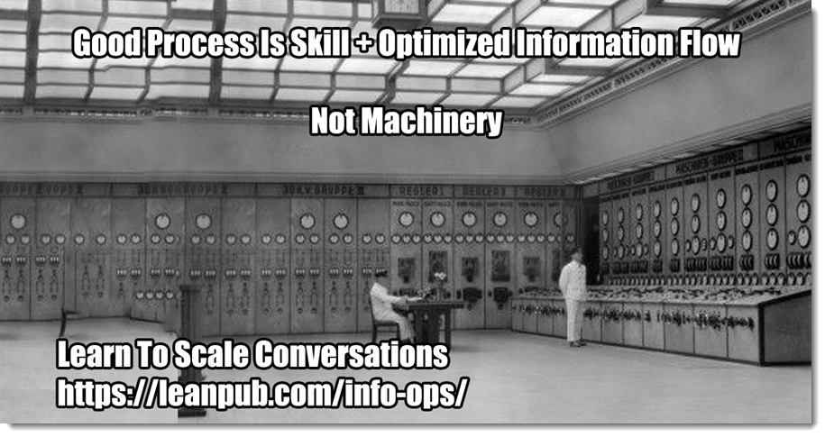

# What To Do When You're Not Directly Creating Something

## Managing Intangibles

We've spent a lot of time in this section talking about using Structured Analysis to create technology solutions: programs, websites, robots, space stations, Mars colonies, decks, things like that. Things that you can touch or see. Things where you create your own reality as you go. Things that require creative work to make happen.

The book started with an introduction to questions, the dialectic, analysis, and Structured Analysis. No matter what information you have, it's going to fit somewhere in an Analysis model, even if it's only in your head. Then we moved to working by yourself, using Structured Analysis to have better conversations with people you're trying to help. Finally we moved out to teams, talking about how teams operate to gather and move information around as they create things people want.

So what are the limits? Is every effort something where Structured Analysis can give you the minimum amount of work for the maximum amount of value?

It is not. Structured Analysis is the way we understand and make sense of things, whether we realize it or not. But not everything is understandable. Many times we try to understand whatever we're doing as if it were a computer program because that's an easier world to understand.

To help sort it all out, here are the questions I go through when somebody asks an odd question like "Can I use this to write my dance for elephants?"

### What is the Target System?

While analysis is always in the same three buckets and abstraction levels, work is in the form of To-Be System Realized Behavior and Supplementals. All work is to change some target system so that it exhibits new behavior and follows new rules.

What is the target system? It seems like kind of a trivial question, don't people realize what they're working on?

They do not, many times because they would rather define work in terms that's easy for them to understand.

Let's say you are on a team that manages a dozen other teams creating a fleet of self-piloting underwater slot machines. These things happen. As a team that manages other teams, what is your target system?

If said "the other teams", you are wrong. Your target system is creating that fleet of underwater gambling robots. The teams are simply one of the tools you're using to do that. You have a lot of other tools to use: webinars, seminars, conferences, press appearances, COTS evaluation, and so on. The minute you take your focus off the target system is the minute you've stopped being part of the solution and started being part of the problem.

So you still have work items, Behaviors joined up with Suppelmentals to make goals/tests. It's just that you have many more tools to master and use appropriately than one guy working out of a closet.

There's a discussion to be had around the Meta genre and managing/leading people, but that's not your target system.

Let's say you're managing a political campaign. You've built enough doghouses in your career that you're finally going to run for dog-catcher.

What's your target system?

If you're like a lot of people, you might start off asking questions and mentally-modeling political campaigns. Let's see, there are are various forms of media, there are different ways to interact....

Pretty soon you could have an entire model built around "running a campaign". It would show the world of political campaigns.

It would be wrong.

Looking at the Analysis Survey, the top row is all about how our model touches the outside world. It's no coincidence that the first thing you see are Actors. Determining your target system begins with asking "Who are the people I am trying to help?"

What you've done is assume that you are the actor. You are modeling and creating a system for you to use. But that's not what you're doing at all. Yes, you'll have to use/create/invent some kind of system, but what you're doing is changing the behavior of voters. Voters and people who might vote are the actors. They're the people that you're striving to help. What do they want? How can you help them? Beats me. That's the work.

If you think you're the actor of the target system, you end up creating stuff that you think you *should* want, if you knew what you were doing. It's kind of a dysfunctional game of play pretend. You think "If I were some super successful political guy, I would need all kinds of cool tools to run my campaign"

There are times where you are the Actor. The system is about you: finding out what you do, finding out how you'd like things done, and so on. But in the political campaign scenario, if you're happy but you're not elected? You've not met your goal. So you can't be the actor. Instead, just like before, you and the things you do are tools.

This is an interesting example because not only are you trying to provide benefits to the average voter, your ultimate goal isn't to help them do thing they already do but to start doing things they currently don't. This is a special type of work where you're both observing and trying to change actor behaviors. That comes under Lean Startup at the end of the book.

### Is the Target System a Formal System?

There's a lot of really nerdy stuff here out of my league. The important point is that computers and technology follow certain rules. Math follows certain rules. When we construct a solution using math and technology, we're assuming the world we model also conforms to the rules of math and technology.

You cannot engage in a productive dialectic with a crazy person because they're under no obligation to have a logical and consistent view of the universe. 

In general, whatever the target system, it should have at least these properties. It is...

- Consisting of primitives that are put together in various ways according to a set of rules.
- Recursively decidable. You should be able to determine whether or not something is true or false given the rest of the system. This might involve drilling down through other parts of the system. You couldn't model the art of singing because singing has attributes that are undecidable. As much as I might try, I can't take math and become a better karaoke singer.
- Isomorphic to a formal language. With technology, this is fairly easy, since technology runs on various computer languages, which are a type of formal language.
- Logical. It is consistent. If something is one way in one place, it's the same way in another.
- Deductive. Given that certain things are true, it follows (you can deduce) that other things must be true also.

A deck follows these rules. So does a Mars Colony project. A computer program certainly does. A children's book about donkeys from the edge of space probably does not. (Depending on the donkeys)

You can certainly use Analysis, Structured or otherwise, to try to make sense of such systems. After all, there's nothing else available to you. But trying to gain traction to change the future behavior of the target system when the target system is not a formal one is mostly an exercise in frustration. You can't write accounting software with Jello.

### What kind of World does the Target System exist in?

Every system that you build or modify must interact with the outside world. For those of you new to the world, various pieces of the world operate in different ways.

In 1999 Dave Snowden began work on a model to help manage intellectual capital at IBM. That's what Wikipedia says. What that means is that IBM had a lot of really smart people who knew a lot of smart stuff. Could IBM take an inventory of all the smart people and smart stuff they knew? Put it into some kind database or library? That way if you wanted to find somebody who was able to speak French and could juggle cats, you'd just enter stuff on a screen somewhere.

Dave dove into this and ended up with a question. (Everything good in life begins with a question.) How do you sort out the types of things people know and can do? You'd think that you might organize kind of like a library, maybe alphabetically. But actually that didn't help when folks went to look up stuff. 

Instead, Snowden took a look at Epistemology, squinted his eyes a bit and condensed a hundreds of years of smart people thinking about stuff into a list of four kinds of environments you might find yourself in. Once you knew what kind of environment you're in, then you could start looking up folks who knew or were able to do stuff.

Here are the four "Domains"

- Simple/Obvious/Clear. This is when you are in a "known knowns" situation. There are rules. The relationship between cause and effect is clear. Do X, Y happens. Every time. Anybody can move around and make sense in this domain.
- Complicated. This is when you are in a "known unknowns" situation. Given X, you can make Y happen, but it takes intellectual work and expertise. Building software is an example of a complex domain.
- Complex. This is the "unknown unknowns" situation. Things happen for a logical reason, but you're never exactly sure what that reason is. Much of like what occurs in the Complex Domain, although our brains keep cheating and pretending that we're actually in one of easier ones. Usually we deal with this domain by watching, doing stuff, then looking backwards to try to find patterns. Patterns may only be guesses, but they're the best we've got. If we get a pattern of doing stuff and having other stuff happen, it's progress.
- Chaotic. Intractable. Things happen. We do things. Other things happen. Cause and effect are unclear and maybe non-existent given our current knowledge. Chaotic environments are environments you can't make sense of. You end up relying on intuition, imagination, and luck. When you're in a Chaotic environment, your main goal is to try to do something, anything, to reduce it to a Complex one. Complicated or Simple would be even better.

If you're writing a program to balance checking accounts, the larger domain that the target system is operating in is math and accounting. It's a Simple Domain. You add, you subtract. It can be no simpler.

If you're writing a program to assess the accounting practices of a multinational corporation, you're helping your Actors operate in the Complicated Domain. There are a lot of simple parts, but it requires expertise to figure out and master. Your job as programmer is to create a target system where the Actors can work in a Complicated Domain. 

If you're writing a program to manage stock portfolios, you're helping your Actors operate in a Complex Domain. 

You can't write any software for chaotic systems. People are receiving information they can't process or understand. There's certainly nothing you could do to help folks in a place like this. "Use the Force, Luke," is as good advice as any.

Even if the Target System you're creating or changing is a formal system, if it exists in a chaotic environment, or if it's built assuming the environment is one way when it's another, it's not going to be useful.

### How do we Observe The System? What are the executable tests?

It's funny how so many of these points sound trivial but are actually deep and important. If you can't observe the target system, you can't do any useful work.

The reason we drive towards tests with everything we do is because tests are the only agreed-upon, objective, easily reproducible, and scalable way to observe the target system.

Agreed-upon: it's a direct result of the analysis. It's the only reason the analysis exists. Tests are the blossoming of the productive dialectic.

Objective: tests that are automated are not open to subjective opinion. You may not like the tests, or think the tests need replacing, but everybody can agree on whether they passed or failed.

Easily reproducible: you'd think that testing should be as easy as pushing a button. It is not. Testing should happen whether or not any buttons are pushed, it should be continuous. If testing is not reproducible at all, or if it's so burdensome that it rarely happens? You really don't have a system that needs any kind of thinking about.

### How does the feedback loop work?

When I look for advice on how to evaluate and engage in situations, I look to startups and the military, for the same reason. They either get it right or they die. There tends to be a much more practical aspect of wisdom in those areas than in other places.

A famous saying in military circles is "Amateurs talk tactics. Professional talk logistics." That means that when you see the military, you think about guns, tanks, fighting and such. But like an iceberg, that's just what people *see*. The real trick of things is getting all of those guns, tanks, soldiers, and planes to the right place with food, fuel, ammo, training, and everything else they need. That's logistics, and it is just as critical, even more so, than the fighting. If you can't eat and you have no bullets, you're not fighting. And even if you have the best army on the planet, if you can't keep them supplied and moving where they need to be, you've lost. If you doubt me, ask Napoleon.

Likewise, when people begin analysis to create or modify some formal system, the most obvious thing they think about is the system itself. (Hopefully.) If they think about some super-influential-and-powerful application, like Facebook, they think of all the features of Facebook. (The tech people without a clue want to talk about scaling applications to billions of users. They can't make a lemonade stand anybody would use, but they're eager to know how to handle ten million operations per second.)

But the professionals think about something else: how do you know if you're wrong? 

After all, no matter what you're doing, if it's worth doing at all it's bound to be a bit tricky. Asking about whether you can test it or not determines whether it can be inspected, but the key question is whether or not you're set up to change course if you've made a mistake. 

When I look at something like Facebook, I want to know how they gather information about what people want, how that information moves around and is absorbed by the company. How they manage to make decisions so quickly and anticipate what people want before they even know they want it. That's the important stuff.

Contrast that to the way so many corporate and governmental systems are developed.

I have seen billions of dollars spent on systems where there was neither effective testing nor any sort of feedback loop. That's mind-boggling to me. Eventually, however, systems are tested. They always are. And then what might have been a tiny, unimportant change years ago turns into an unmitigated disaster. All because there was no mechanism in place for observing the continuous tests and changing course accordingly.

There is an incredibly vast amount of money spent each year by organizations that know they have a problem but don't seem to be able to intelligently talk about it amongst themselves. So they get out the checkbook and buy a tool. On the box, the tool says that it is useful for organizations in their situation with their kinds of needs.

They come home from the Super-X with the box, install the software.......and nothing. Here are people that understand they have a need, are willing to spend handsomely to have that need met. But there's no reasonable or effective conversation loop where backlog refinement, (Sorry. Learning.) takes place. You can get everything else right with SA, but if there's no feedback loop, it's wrong. It's broken.

One of the worst places this happens is with corporate programming teams. They have money, they have somebody pretending to be a customer, what else could they need? Perhaps some idea if anybody is using or finding value in the work they're doing?

Amateurs talk about features, delivery dates. Professionals talk about feedback loops. If you don't have a feedback loop, go home.

### Is it Creative?

Is a fantasy novel something you could use Structured Analysis on? Sure. Fantasy novels, more than any other novel, have strict rules that must always be followed. Otherwise the reader feels cheated. (Oddly enough, authors have much more freedom when writing straight fiction, although credibility always has it's limits.)

It's probably a sucky way to write a book, but readers certainly use SA internally to think about books they're reading, no matter how they're created.

## Project Chartering/Vendor Management

There's a special type of small team work that's especially tricky for people who don't understand Structured Analysis or how solutions happen. That's either chartering a project or handling a vendor for a project.

In both cases, the team has money, knowledge, and a need -- but not enough time or energy to create the solution themselves.

The first thing to realize before you even start considering project chartering or vendor management is the new rule of the 21st century: *Everybody's job is to automate everybody's job.*

There was a time, centuries ago, when nobody could write. If the king or somebody important had to write a letter, they called in a scribe. Scribes were experts on writing and reading things.

Those people no longer exist. When you go to write an email, you don't go looking around for a scribe.

Likewise, there was a time when every big company had something called a "secretarial pool", where people worked that knew how to take shorthand and type up letters.

Those people no longer exist. 

At the turn of the century, we had a situation where if you wanted a computer to do something, you hired somebody called a "developer". This person was an expert in automating things.

Before this century is out, these people will no longer exist. You'd no more find a specialist who was a programmer than you'd find a professional calligrapher. They exist, of course, but it's not the same thing. Reading, writing, taking notes, and sending letters? These are skills that everybody is required to do now as a condition of being considered a useful member of society. 

It used to be only certain people wrote. Now everybody writes. Only certain people specialize in difficult or performance writing, and it's a notoriously ill-paying job. It used to be only certain people coded. Now everybody codes for items in the Simple Domain. The specialists are moving up to the other, more tricky Domains.

Programming is following the same path as writing. If you're hiring somebody or a team of somebodies to simply codify and automate something your team is already doing, in most all cases you'd be better off doing it yourself, even if none of you program. That's because the technology part of the equation, if you know what you're doing, shouldn't be a factor in getting the system created. Instead, most all of difficult work will revolve around using Analysis to create a shared mental model.

You've read this book. Do you really want and need to take the time to get aligned with an outside group? For most work, you could probably spend the same amount of time learning how to overcome whatever technical gaps you have to making it happen. Then, when you're done, not only do you have an exact solution for a problem you all agree on, you have the ability to create more solutions as new situations arise.

I know what you're thinking: but that's not my job! I'm the sales rep manager, or the office hat coordinator. I don't have time for automating stuff. I'm not supposed to be automating stuff. I'm supposed to be working on more important things!

This is the sound of the old businessman in 1990 saying he doesn't have time to learn how to use spreadsheets, or email. He's got more important things to be doing!

What he doesn't understand is that all the translation and overhead required for him *not* to understand spreadsheets and email is far greater than just learning it and then using it to do his job better. The same goes for automating most business processes. Using cynefin, if you're in the Simple/Obvious Domain and need a system created or modified? In most cases you're better off doing it yourself.

But let's assume that you're in the Complicated or Complex Domain, you're part of a large organization which you're serving, and that organization has entrusted you to create or modify some target system to meet certain defined needs of a bunch of Actors.

We're smart now, let's start with pro-level questions. What's the feedback loop? Forget talking about what it does, or how we're going to test it. How are we going to know that we're headed down the wrong road and need to change? How is the project team or vendor going to be able to tell us that we're wrong?

I don't think anybody ever really asks this. Instead, they usually wonder about how they're going to *tell* the external team what to do. Nobody seems to wonder about how they're going to *listen* to the experts they're paying to create so perhaps they can learn something.

Yet if there were nothing to learn, if it were truly simple? There wouldn't be a need for an external team to begin with.

In reality, once you send a non-trivial problem to an outside group to solve and automate, you're signed on for a lot of learning and difficult discussions. Not only do you have to listen to learn and adapt, you have to be willing to engage in dialectics to create completely new and perhaps uncomfortable models as the team gets into alignment.

What you're really doing is paying somebody else to learn something and then take the time to un-learn you and bring you up to speed on what they're finding.

Since you've got a lot to learn and talk about, the faster the feedback loop the better. Anything over a day or three becomes unwieldy and counterproductive quickly. When I think of all the efforts with quarterly or annual feedback cycles, it's like a pit opening up that money and people's lives fall into.

So be aggressive and go with daily feedback loops.[^23-10] Weekly if you're a sucker for pain. And that's feedback loops, not status reports, release planning, or contract updates. That's a regular backlog refinement discussion with the folks that you've chartered to make things happen in some target system.

[^23-10]: There's an interesting exception to all of this: when you don't care about anything at all but results. Far too often it is assumed that this is the case when it's not, but there are times when it's true. Just go make it happen. In that case, all you're really talking about is a test or series of tests that currently fail but you would like have pass. (The test(s), of course, meet all of the criteria we've gone over.). In most cases, when people say all they care about is results, they do not have sufficient tests in place. You start in on the process of putting them in place and you're back to doing the Analysis work we've been talking about all along. Sometimes I call these "subterranean projects". You're doing Structure Analysis for a technology project, just nobody realizes that's what's going on. To them you're just trying to come to agreement on tests to give the vendor. If you're lucky, eventually they figure it out as they realize how it all works.

The next decision to make is how you are going to observe the system. The gold standard for any successful effort is automated continuous testing and reporting. Whatever you choose to test or observe, it should happen without anybody setting it up or starting it, and the results should be easily available to anybody either in the management or delivery team. I suggest wall displays.

Next you have to establish in cynefin terms what sort of universe the target system exists in. If it's simple, you should be doing it. If it's chaotic, it's probably a waste of time and energy (although there are some AI and Bayesian approaches to chaotic system that in some cases might be fruitful).

That means that either you'll be assisting experts in making sense of stuff or you'll be you'll be helping people determine what kinds of stuff they're trying make sense of. C.S. Peirce called these "abduction" and "deduction". We'll be talking more about Peirce in the second book.

Are you working to create or change a formal system? For anything involving technology, the answer is usually yes.

Finally, what is the target system? Who are you helping to interact with what thing to help them reach their goals? "We're writing a phone app for doctors to schedule new patient referrals" is a great answer to that question. Or "We're helping lawyers use their smart lawn mowers to file tort cases" is an odd answer, but it works. Who are the actors? With what system will they be interacting? Throw in a general reason for the work and this question is answered.

Congratulations! You now have a project that has a chance of success. You can continue forward with the rest of analysis and development as outlined in the book.

What about teams managing more than one effort? You can scale this out to quite a few efforts. If it won't scale, then you've spread yourself too thin. Personally I wouldn't want to be on any more than half a dozen efforts. After that my brain would explode. It's important to pick-and-choose. I understand that many vendors will tell you they can do whatever you'd like with minimum input on your part. Governance is making compromises and trade-offs. Unfortunately you can't get something for nothing.

In this section we've described how small teams collect, use, modify, and deliver important information. We've shown how to use EasyAM. Finally in this chapter we've talked about situations where the team is unsure about what role it plays in the solution; what kinds of solutions are tractable. Then we've wrapped everything we've learned together to talk about teams where they're indirectly responsible for a target system changing. What's required for information to be used effectively in this situation?

Next we'll talk about various automated scenarios where the Analysis Model plays more of an active role in being the switchboard for information flow.

{blurb, class: information}

### Did you get it?

You learned why Structured Analysis works great in some situations and not-so-great in others. You learned how to identify those situations and what to do if you're in a situation where it doesn't work that well. You learned why teams that run teams are most at risk for self-deception -- and you learned strategies to help avoid that happening.

{/blurb}