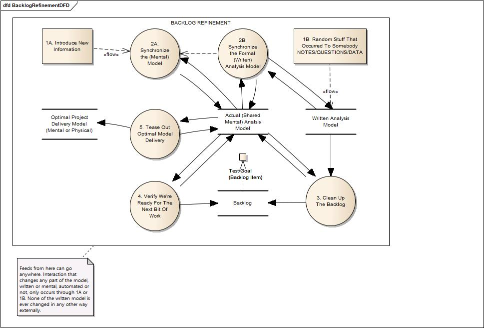
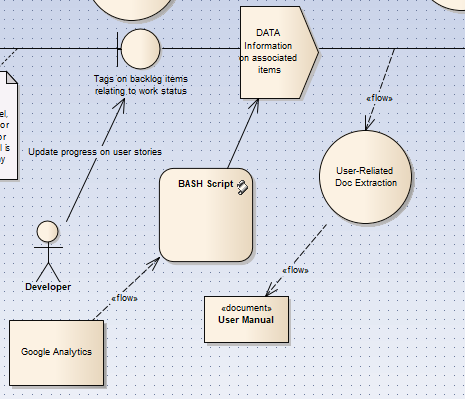

# Chapter 24

## Simple Single-Team Automation

### sprint/kanban tracking

### Google Analytics hooking into a "whenever" in the MSP

### Continuous User Manual Creation

### FAQ Feeds

## pipelines with BASH
 
## Info-Ops

