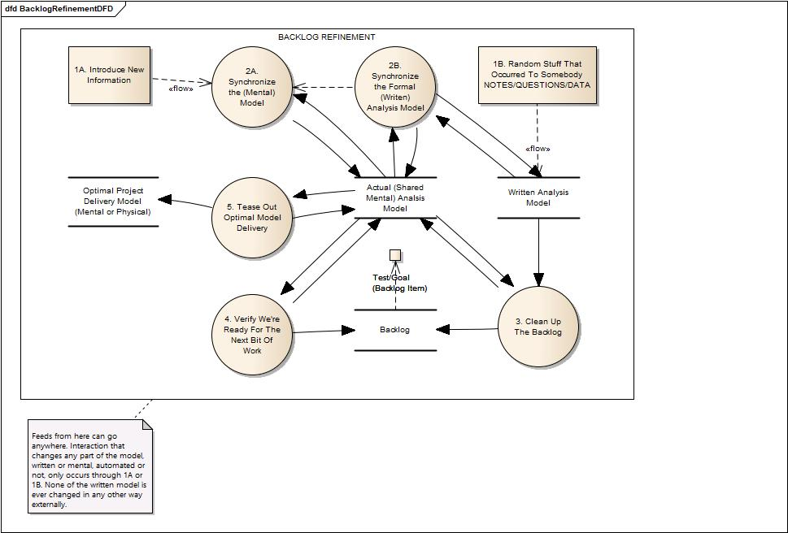

# Chapter 25

Let's have some fun.

First, we'll make a model of how backlog refinement happens. Remember, it doesn't have to happen this way. We just made this up to use as a prop to talk about the kinds of things that need to happen around refinement.

But hey. It's lots of boxes, some pointy arrows. It's even got dashed lines. There must be something really important going on here!

## Simple Single-Team Automation

Now we need some project-tracking tools, something with more lines and colorful graphs we put in powerpoints. Should we buy an expensive system?

Only if we're getting a kickback. Otherwise, why not just tag the stories you're doing then update the tags? A developer checks out the sprint backlog, she updates the tags, then checks it back in. It may take 30 seconds if they type really slow.

Now you add the command-line parameters to EasyAM to output only the sprint backlog (or whatever else you want), then pipe the CSV file to a Google or Excel sheet. Now you have all the graphs you could want. (And project tracking, too.)

### Sprint/Kanban tracking

You can even add lanes to this system if you want to. Just make a tag "Lane=In-Progress" or something like that. The spreadsheet does the rest.

Or, if this sounds a bit too hacky for you, use some free online tool like Trello. Then write a script to load new cards into Trello and another script to take the status in Trello and add it to the tags in EasyAM. Now you can use Trello to do your card-moving or Kanban-style work.[^25-1] EasyAM will keep the data for you and send it to other places as-needed.

[^25-1]: I know that Trello isn't a Kanban system. No lanes, no policies, no pull-based work flow. Of course, you can still use it as a Kanban system as long as you do those things yourself. Or use another, *real* online Kanban system. Just be sure to pick something you can pipe stuff in and out of.

### Google Analytics hooking into a "whenever" in the MSP

If you're creating anything where you can't physically interact with all of the users, you're going to have to instrument code.  Instrument it immediately. It should never be an afterthought. (If anything, set up page and app metrics before you even content or functionality in there.)

Why? Because you don't know what's going on. You *think* people do A, B, and then C, but maybe they just do A, then leave. Or A and C, without ever doing B. Anytime you're dealing with users not in the room, somebody has been doing a lot of guessing and making a lot of assumptions about things. There's nothing wrong with that. You just have to keep checking the actual usage data against the Analysis Model.

The best way to do that is to set up your instrumentation architecture around your Master Business Model and Master Supplementals. Then, on a regular schedule, deliver the usage telemetry from your various tools into the DATA sections of the appropriate model items in EasyAM.

This way, next time you look at behaviors A, B, and C? You'll have the appropriate information you need right there alongside everything else in the model, where it should be.

### Continuous User Manual Creation

Remember all of those notes we took while putting the models together? All the questions that were answered? Many of those same questions will be asked again -- and those same notes gone through -- when we do the user manual.

User manuals can either be very easy or very painful. The painful way is to completely develop the app. Then you bring in some outsiders to do the user manuals. You have to go back through everything again, trying to get the new guy up to speed.

That hurts. It hurts just thinking about it.

There's even a great deal of bonus pain, because I can guarantee you that the app will continue changing whether the user manual continues changing or not.

Now you've got three systems, all out of sync with one another: the analysis paperwork, the actual app itself, and the user manuals.

Ouch.

The easy way is to create a feed from your EasyAM model to another owned by people in charge of writing and editing stuff. They add their own EasyAM files as they do their work. After all, each team has its own shared mental model, right? Then they continuously feed their model, which includes yours, into a set of markdown files. These files are continuously updated right alongside the analysis model. No extra work required. Things never get out of sync, and you get the benefits of using a professional writing and editing team without shooting yourself in the foot so much.

### Forum Round-Tripping

This same kind of disconnect can happen in forums. User ask questions, report problems, and generally provide excellent feedback -- but it's not directly connected to the team's shared model.

Just like you did with Trello, code-up a round-trip system between your forum software and your model. An easy way of doing this is simply adding tags for all your behavior and supplementals, then manually tagging stuff as it comes into the forum. Every so often, have a script go out and grab the tagged stuff and add it as notes to a model feed in a separate directory (You don't want all those forum comments in your model every time you do anything with it.)

### Slack Integration

The same pattern can be used with Slack, setting up round-tripping and piping things both in and out.

Slack gets a little weird because people want to use it as some sort of oddball requirements system. It never really works that way. Physical conversations still happens. The dialectic and analysis models continue to grow -- they're just spread out everywhere and never aligned or synchronized. 

If you want a company chat program, something like Slack is awesome. In this way it's just a fancy telephone. If you want to use a program like that for other things, you need to go back and read this book again.

### FAQ Feeds

FAQ Feeds? Same thing.

## Generic Pipelines Using Scripting

If you're starting to see a pattern here, yay! There is one. Various teams and efforts have their own "home" directory. EasyAM files are piped in there through OS scripting, the team uses the information as part of their normal work, then what they've created is piped out to other consumers.
 
Just like CI/CD/DevOps, this is something that starts small, grows as needed, and eventually becomes another programming job.

This idea, of taking written analysis information, mixing and matching as necessary, and piping from provider to consumer using a publish model? This is new. It's a powerful idea with just small teams using it. It gets even wilder when you move up to multiple teams and thousands or tens of thousands of developers.

## Info-Ops Wrap-Up

Look at you. You've finished up the Info-Ops book and are now ready to go make the world a better place. I can't wait to see what you accomplish.

Together, we have truly accomplished feats of a brobnagagian nature. (Brobnagagian means "big". Thank me later.) There's a huge distance between average folks struggling through projects and people who know and use these skills effectively. Now you're a member of an elite group.

I'm not trying to BS you. This is knowledge and skills that no formal course I know teaches -- yet they are critical for the happiness and productivity of any team creating anything of value. I wrote this because nobody else had written it. It needed to be done.

We started our journey together talking about Air France 447. In that story, everybody involved, managers, engineers, assemblers, maintenance operators, and finally pilots were highly-trained professionals. They were acting using industry best practices. In any other circumstances, things would have been fine. The A330 had been flying over 25 years when the crash occurred. It had safely taken millions of people where they wanted to go.

Yet 216 people died that night.

They died because the natural way the pilots had of looking at things were not the way the designers and engineers thought they should be. Flying is like that. There are a lot of things that are non-intuitive. We train our way out of it to a degree. But a dark, stormy night in the middle of the Atlantic is not the place to discover a gap of that magnitude.

Throughout the book, we've been talking about making things people want. To do that, we had to learn how to take and use notes. We had to learn why paperwork is both necessary and completely inadequate by itself to handle that job. We talked about a lot of really easy ways that people introduce waste and friction into a development effort.

We learned how everybody can be a professional and do a great job and still get people killed. Or waste years of their life in unhappy product development death marches. It's not about being smart or knowing a huge amount of some engineering skill. It's not about being a craftsman, or being an expert in a certain area. These things may be important. You have to have them to build things right. But as far as building the right thing? It's never about that.

A bunch of school-age kids could have done the initial analysis work in creating the A330. And there's a good chance they would have done a better job than the professionals who actually did it. No amount of formal training can take the place of simple questioning and maintaining team alignment.

Once we got the dialectic, note-taking, modeling, and Structured Analysis in our heads, we moved on to tools. We learned how to capture important things. We learned how to pipe things around to where they are needed.

Walking through several examples using tools as we went, we started talking about the Meta bucket, or how we work together. We saw examples of using the work to build and validate Meta model, although we didn't take it that far. (I've saved most of the Meta conversation for the large team discussion coming in book 2. That's because when you're by yourself, as long as you're doing the work, nobody else cares what your process is. It's only as you start getting a lot of people involved that Meta becomes something more out in the open and important.)

We learned a lot about backlogs, what makes a good backlog, the many forms of bad backlogs, and how to keep your backlog simple and manageable. We did the same thing with refinement, learning a couple of dozen antipatterns and then talking about how an example refinement agenda would play out with real teams.

Then we started talking about processes in general. The TDA Wheel Of Pain shows us that there are only five categories of important questions, although the questions can occur at any time and in any order. But once we realize that there is a pattern and relationship between categories of important questions, we start realizing that we may not be asking some of the most important ones.

Information doesn't get to where it needs to go. People die.

We talked about oddball teams, teams that don't make things you can touch and interact with. We learned that Structured Analysis is useful no matter what you're doing, but if the target system is chaotic? You can't change it. If the target system is simple, it should have already been automated by whoever was doing the work. It's only target systems in the complicated and complex domains where creating and modifying target systems provide anything of value.

Finally, we took our free EasyAM tool and played around with it some. Since everything you're doing can be tagged, and since EasyAM can keep track of all the tags for you, you can use it to interact with and manage a lot of the project-tracking and corporate stuff that might be driving you nuts. You manage a build server, don't you? Isn't your analysis information more important than your code?

In a big way, what we've learned isn't that much more difficult than many of the other things we've had to learn to do our jobs. The hardest part about it is having to *unlearn* stuff we already thought we knew. When I say "Isn't your analysis information more important than your code?", most people would disagree. That's because most people, if they know anything about analysis at all, would think of it as some kind paper tiger exercise where it ends by giving a bunch of documents to the developers. In that world? No, the analysis isn't more important than the code.

But you know better now. You know what real analysis is, you know how it keeps happening whether or not we want it to, and you know that the alignment around questions, conversations, and tests is far more important than a bunch of bits somewhere. With enough of the right tests, I could build a hundred systems that would all make you happy. But with a system with no tests, I'm not even sure what it does right now, much less how to change it for the better.

Thank you for coming along. I hope to see you in future books!

*Ceterum autem censeo Carthaginem delendam esse*[^25-31]

[^25-31]: I figured I needed some kind of cool catch-phrase to end the book. Back in Roman days, there was a guy called Cato the Elder who really didn't like the city of Carthage. So no matter what else he was talking about, he always ended it with that phrase. It means something like "And finally, I conclude by saying Carthage must be destroyed!" Carthage *was* eventually destroyed, but I guess there's probably nothing wrong with destroying it again. Plus nobody has used the phrase in a long time -- and latin, right? How cool is that? Dang Carthogenians. Never met one I liked. (You know, you never hear about them doing much good in the world.)