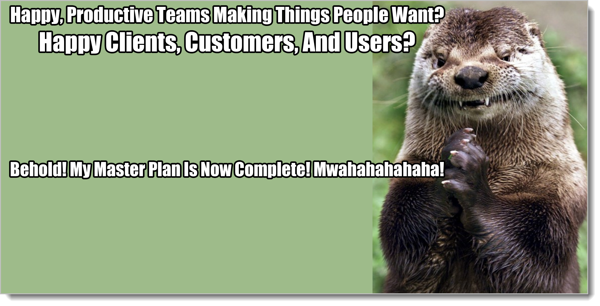
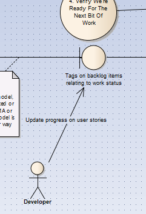

# Slicing And Dicing: Scripting, Automation, Importing And Exporting

Let's have some fun.

First, we'll make a model of how backlog refinement happens. Remember, it doesn't have to happen this way. We just made this up to use as a prop to talk about the kinds of things that need to happen around refinement.

But hey. It's lots of boxes, some pointy arrows. It's even got dashed lines. There must be something really important going on here!

## Simple Single-Team Automation

Now we need some project-tracking tools, something with more lines and colorful graphs we put in powerpoints. Should we buy an expensive system?

Only if we're getting a kickback. Otherwise, why not just tag the stories you're doing then update the tags? A developer checks out the sprint backlog, she updates the tags, then checks it back in. It may take 30 seconds if they type really slow.

Now you add the command-line parameters to EasyAM to output only the sprint backlog (or whatever else you want), then pipe the CSV file to a Google or Excel sheet. Now you have all the graphs you could want. (And project tracking, too.)

### Sprint/Kanban tracking

You can even add lanes to this system if you want to. Just make a tag "Lane=In-Progress" or something like that. The spreadsheet does the rest.

Or, if this sounds a bit too hacky for you, use some free online tool like Trello. Then write a script to load new cards into Trello and another script to take the status in Trello and add it to the tags in EasyAM. Now you can use Trello to do your card-moving or Kanban-style work.[^25-1] EasyAM will keep the data for you and send it to other places as needed.

[^25-1]: I know that Trello isn't a Kanban system. No lanes, no policies, no pull-based work flow. Of course, you can still use it as a Kanban system as long as you do those things yourself. Or use another, *real* online Kanban system. Just be sure to pick something you can pipe stuff in and out of.

### Google Analytics hooking into a "whenever" in the MSP

If you're creating anything where you can't physically interact with all of the users, you're going to have to instrument code.  Instrument it immediately. It should never be an afterthought. (If anything, set up page and app metrics before you even place content or functionality in there.)

Why? Because you don't know what's going on. You *think* people do A, B, and then C, but maybe they just do A, then leave. Or A and C, without ever doing B. Anytime you're dealing with users not in the room, somebody has been doing a lot of guessing and making a lot of assumptions about things. There's nothing wrong with that. You just have to keep checking the actual usage data against the Analysis Model.

The best way to do that is to set up your instrumentation architecture around your Master Business Model and Master Supplementals. Then, on a regular schedule, deliver the usage telemetry from your various tools into the DATA sections of the appropriate model items in EasyAM.

This way, next time you look at behaviors A, B, and C? You'll have the appropriate information you need right there alongside everything else in the model, where it should be.

A big place to get value is checking on your supplementals. Is your app truly "easy to use"? Does it really keep people engaged? Analytics can tie those vague phrases (or more likely, one of their grand-children) to real tests that are ran every time somebody visits.

### Continuous User Manual Creation

Remember all of those notes we took while putting the models together? All the questions that were answered? Many of those same questions will be asked again -- and those same notes gone through -- when we do the user manual.

User manuals can either be very easy or very painful. The painful way is to completely develop the app. Then you bring in some outsiders to do the user manuals. You have to go back through everything again, trying to get the new guy up to speed.

That hurts. It hurts just thinking about it.

There's even a great deal of bonus pain, because I can guarantee you that the app will continue changing whether the user manual continues changing or not.

Now you've got three systems, all out of sync with one another: the analysis paperwork, the actual app itself, and the user manuals.

Ouch.

The easy way is to create a feed from your EasyAM model to another owned by people in charge of writing and editing stuff. They add their own EasyAM files as they do their work. After all, each team has its own shared mental model, right? Then they continuously feed their model, which includes yours, into a set of markdown files. These files are continuously updated right alongside the analysis model. No extra work required. Things never get out of sync, and you get the benefits of using a professional writing and editing team without shooting yourself in the foot so much.

### Forum Round-Tripping

This same kind of disconnect can happen in forums. Users ask questions, report problems, and generally provide excellent feedback -- but it's not directly connected to the team's shared model.

Just like you did with Trello, code-up a round-trip system between your forum software and your model. An easy way of doing this is simply adding tags for all your behavior and supplementals, then manually tagging stuff as it comes into the forum. Every so often, have a script go out and grab the tagged stuff and add it as notes to a model feed in a separate directory (You don't want all those forum comments in your model every time you do anything with it.)

### Slack Integration

The same pattern can be used with Slack, setting up round-tripping and piping things both in and out.

Slack gets a little weird because people want to use it as some sort of oddball requirements system. It never really works that way. Physical conversations still happen. The dialectic and analysis models continue to grow -- they're just spread out everywhere and never aligned or synchronized. 

If you want a company chat program, something like Slack is awesome. In this way it's just a fancy telephone. If you want to use a program like that for other things, you need to go back and read this book again.

### FAQ Feeds

FAQ Feeds? Same thing.

## Generic Pipelines Using Scripting

If you're starting to see a pattern here, yay! There is one. Various teams and efforts have their own "home" directory. EasyAM files are piped in there through OS scripting, the team uses the information as part of their normal work, then what they've created is piped out to other consumers.
 
Just like CI/CD/DevOps, this is something that starts small, grows as needed, and eventually becomes another programming job.

This idea, of taking written analysis information, mixing and matching as necessary, and piping from provider to consumer using a publish model? This is new. It's a powerful idea with just small teams using it. It gets even wilder when you move up to multiple teams and thousands or tens of thousands of developers.

{blurb, class: information}

### Did you get it?

You learned why using a compiler metaphor is a massively more productive way of looking at your information than the current crop of tools. You learned how to bolt an analysis compiler into your workstream and build tools just like every other tool you use to develop technology. You learned how to use DevOps thinking to provide an almost infinite number of ways you can configure your tools to reduce waste.

{/blurb}