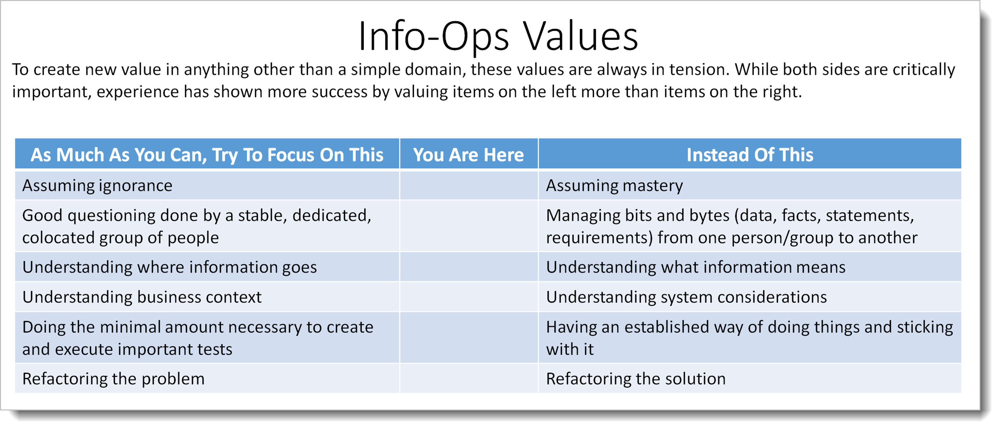

# Recap: Info-Ops in Ten Minutes

Most all process books describe making stuff people want as a mechanical engineering problem, no matter how much they try not to. This person goes here, this person goes there. These people do these processes. These documents are created. They're describing the process of value creation in engineering terms because frankly, most of the authors and readers of these books are engineers.

Now you've learned that the real work is the management of information inside of people's heads. You know what that information is, how to organize it, and how to keep groups of people synchronized with one another. The meetings, roles, flowcharts, diagrams, and process advice you might hear in other places is all *derivative* based on information flow. It's as if what we've been doing is teaching people to build radios by giving them pictures of the insides of radios and instructions of how to connect things up. It's not necessary wrong -- but it fails very quickly, as soon as some unforeseen circumstance arises.

Instead we should have been teaching them electronics theory, how electrons move around. Then add a little bit of practical advice on soldering, wiring, and so forth. Once you understand what it is you're moving around and how it behaves, you can build all kinds of stuff. You can build the radio that it's in the book. Or build another radio of your own devising. If anything goes wrong, you're fine. You understand electron flow.

Now you have a foundation for how creative technical work happens. You understand information flow.

Throughout the book we've constantly emphasized "assuming ignorance". Remember Socrates! You always think you know more than you actually do. Always.

We've shown many examples of "good questioning done by a stable, dedicated, colocated group of people". The beauty of assuming ignorance and questioning is  --- even if you do know something, the physical act of asking questions between a group of people is what creates that shared model. Nothing else. You can't swap out group members, write questions and answers down, or none of that other nonsense. You can't mail it in. There are a ton of things that look like they might work here. But they don't.

The hard part of this book, the core of it, is "understanding where information goes". We spent a bunch of chapters in beginning on that, and it will be something you can take with you for the rest of your career. Tags, layers, master models? These are how you organize important conversations, creating a conversation library where you can pick up a difficult or technical conversation months later without missing a beat.

In every example we've covered, the emphasis is on "understanding the business context", especially once the person knows what they want. This book has talked about building the right thing *once you know what you want to build*. In the next book, we're going to talk about the other part of business context, figuring out what to build. In either case, it's that front-end work, getting the problem to the folks that can solve it without creating a tool, process, and paperwork mess that's the important thing.

Once we figured out where we were and what we wanted to do, we learned the importance of "doing the minimal amount necessary to create and execute tests". Without this critical value, the book would just be a bunch of paperwork exercises you can do to create thick reports full of neat graphics. We learned Test-Driven Analysis. We learned our diagram/card rule.

Finally, we learned about "refactoring the problem", which is only possible to consistently do if you understand and apply the other values.  Everybody wants to talk about refactoring the solution. If you can't refactor, simplify, and restate the problem? You shouldn't be creating technical solutions for folks at all. Far too many teams are stuck just doing what they're told from some stupid list on a tool somewhere. Nobody has permissions or the time to do a bunch of cleaning up or asking "what's the simplest problem we should be solving?" They've stopped being trusted and valued knowledge workers and are instead just cogs in machine. (Insert profanity here.)

If you can't restate your backlog and begin working in half a day or less you're a slave to your tools and processes. You're working for them instead of them working for you.

Look at you! You've finished up the Info-Ops book and are now ready to go make the world a better place. I can't wait to see what you accomplish.

Together, we have truly accomplished feats of a brobnagagian nature. (Brobnagagian means "big". Thank me later.) There's a huge distance between average folks struggling through projects and people who know and use these skills effectively. Now you're a member of an elite group. Remember: with great power comes great responsibility.

Remember how we started our journey together talking about Air France 447? In that story, everybody involved, managers, engineers, assemblers, maintenance operators, and finally pilots were highly-trained professionals. They were acting using industry best practices. In any other circumstances, things would have been fine. The A330 had been flying over 25 years when the crash occurred. It had safely taken millions of people where they wanted to go.

Yet 216 people died that night.

They died because the natural way the pilots had of looking at things were not the way the designers and engineers thought they should be. Flying is like that. There are a lot of things that are non-intuitive. We train our way out of it to a degree. But a dark, stormy night in the middle of the Atlantic is not the place to discover a gap of that magnitude.

Now you know that everybody can be a professional and do a great job and still get people killed. Or waste years of their life in unhappy product development death marches. It's not about being smart or knowing a huge amount of some engineering skill. It's not about being a craftsman, or being an expert in a certain area.

A bunch of school-age kids could have done the initial analysis work in creating the A330. And there's a good chance they would have done a better job than the professionals who actually did it. No amount of formal training can take the place of simple questioning and maintaining team alignment.

What's really cool is that you learned enough that we could start talking about processes in general. There are only five categories of important questions, although the questions can occur at any time and in any order. Once you realized that there is a pattern and relationship between categories of important questions, you can start looking at whatever process you're doing to see how these questions are being handled. That's some ninja-level stuff.

Information doesn't get to where it needs to go. People die. Now you know why that happens. More importantly you know how to keep it from happening again.

I think you'll find the hardest part about it is having to *unlearn* stuff we already thought you knew. If you ask somebody, "Isn't your analysis information more important than your code?", most people would disagree. That's because most people want to focus on what they're doing instead of who they're trying to help. Enough about you, let's talk about me some more!

But you know better now. 

Structured Analysis achievement level unlocked. Welcome to the next level.

Thank you for coming along. I hope to see you in future books!

*Ceterum autem censeo Carthaginem delendam esse*[^25-31]

[^25-31]: You have to have some kind of cool catch-phrase to end your book. Leave people happy. Don't end the book on an unhappy or dour phrase. Your last words should be pithy and memorable. They should make you sound intelligent and sensitive. Back in Roman days, Cato the Elder really didn't like the city of Carthage. He just couldn't stop talking about how much he hated it. So no matter what else he was talking about, he always ended it with that phrase. Loosely translated, it means something like "And finally, I conclude by saying Carthage must be destroyed!" Carthage *was* eventually destroyed, but I think there's probably nothing wrong with destroying it again. Nobody has used the phrase in a long time; it's due to become cool again. Plus Latin, right? How cool is that? Huh? Dang Carthagenians. Never met one I liked. (Ever hear about a Carthagenian building an orphanage? Feeding the poor? See?) Last words are important. Mean little bastards.