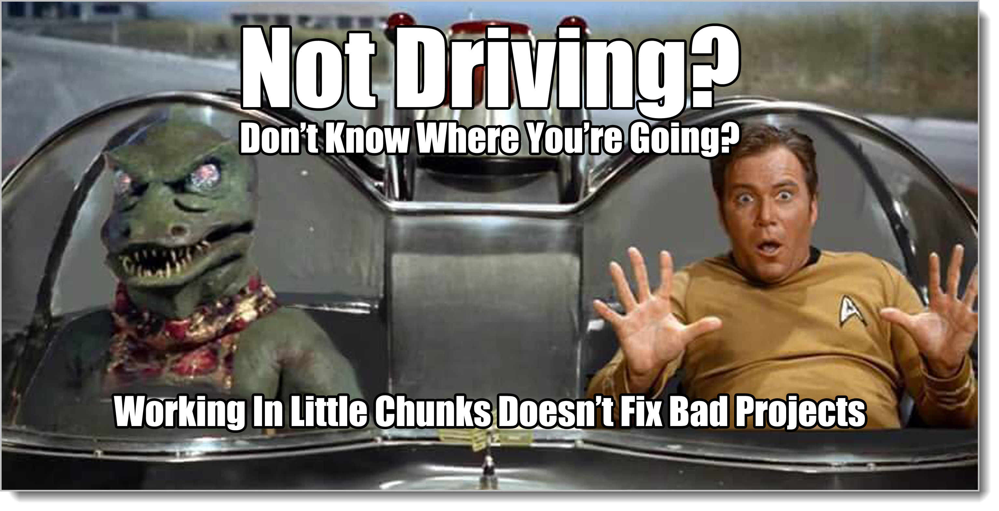
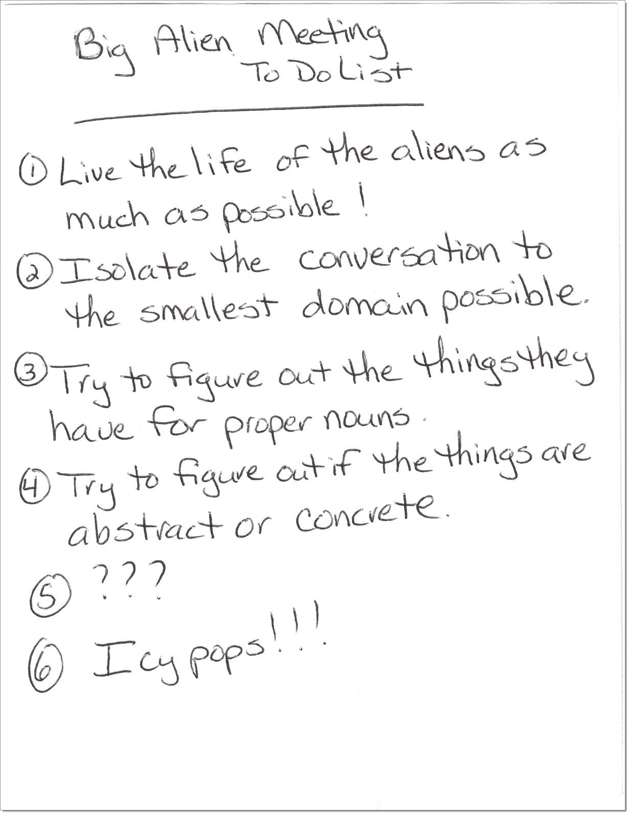
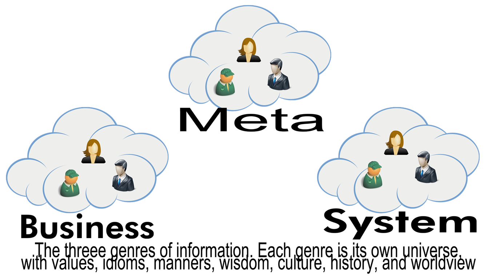

# Making Our Plan

Information flow optimization is providing the right amount of information at the right time to support effective analysis by the people doing the work.

How would you communicate with aliens?

The usual answer from sci-fi and science is that we'd use some sort of mathematical substrate. In Carl Sagan's book "Contact" humans receive a signal full of prime numbers. In "Close Encounters of the Third Kind" they use the math of music. SETI scientists have attempted to communicate with aliens by monitoring radio signals around the wavelength of hydrogen, which makes a ton of assumptions: communication would be by radio, atomic wavelengths hold some sort of curious pull on species wanting to talk, and other species actually want to communicate, among others.

As an example of how difficult the language problem can be, in the excellent book "Three Body Problem" the issue of communication is almost hand-waved away by author Liu Cixin. That's a good thing, because most of the time this topic is done poorly.

There is one notable exception: the 2016 movie "Arrival" [Which I'll refer to as "the movie" for the rest of this chapter.] They solve lots of plot problems by having the aliens arrive at Earth and hang out in giant eggs, waiting for us to try to communicate with them. In fact, the entire plot revolves around the question of how to communicate with aliens.

And it's not math. Instead you end up using ideas kicked around by some guys named Sapir, Whorf, and Chomsky.[^3-1]

[^3-1]: Friends who are linguists, I understand that I'm painting with a really broad brush here. It's an effort to keep the narrative simple and moving along. Sapir-Whorf never proposed their "hypothesis" Chomsky's ideas are being butchered and he wasn't the first to propose the structuralism of a universal grammar. I am very sorry about having to skim over many of these important details.

Sapir, Whorf, and Chomsky were linguists. These are people who study languages. It's a relatively new science. The general study of languages, of course, has been going on forever. Studying how all the different languages have similarities and differences started happening only in the last 150 years or so. 

There are a ton of interesting debates going on in linguistics, but the big one in the movie concerns the Sapir-Whorf hypothesis and linguistic structuralism, probably best-expressed in Chomsky's "Syntactic Structures"[^3-2]

[^3-2]: I thought about using the phrases "linguistic relativism" and "universal grammar" but by using the names of the linguists I hope to personalize the story. Here's a nice discussion of the two ideas bounced up against one another. [https://linguistics.stackexchange.com/questions/14673/sapir-whorf-vs-chomsky](https://linguistics.stackexchange.com/questions/14673/sapir-whorf-vs-chomsky)

Don't worry! There won't be a test.

This is really about one question: is language mostly determined by the culture we live in? Our world, our values, our feelings, and so forth? Or is language simply a formal construct with various pieces, like a building being made out of bricks?

On one hand, the Sapir-Whorf guys felt that your life and values, the way you think, was tied hand-in-hand with the way you expressed things. The Inuit have a bunch of different words for snow and ice. We do not. That's because it's not part of our way of life. There are certain thoughts of an individual in one language that cannot be understood by those who live in another language. Your universe is your language.

On the other hand, the Chomsky/structural guys felt that language is simply a type of program that runs on human hardware. Chomsky was able to create a system where he could take any known language and break it up into tiny pieces and rules. Brains are operating systems that use languages in the same way Microsoft Windows is an operating system that uses programs. The actual language was just one of perhaps many language apps running on the operating system of our brain.

Let's say you were solving a problem, perhaps creating a new product for weasel farmers. The Sapir-Whorf school would advise you to become part of the weasel-farming world. Live and breathe the life of a weasel farmer! Of course they would also tell you to understand the formal science needed to make the product. The Chomsky guys would tell you to gather as much information as possible about weasel farming, tagging the information and how it's structured into a formal system, a "language of the weasel farmer". Of course they would also tell you to understand the formal science needed to make the product. They might even suggest that there is a mapping between the information you learned and the product you're building.

If you've been around computer programming for any length of time, this might sound familiar. The SW folks are the ones telling you how important it is to be as close as you can with the user of the product. Nothing can take the place of that! The structuralist folks are the ones telling you how programming is just a matter of mapping the language of the user into the language of the computer.

Anybody remember Model-Driven Development?[^3-3] The idea was that using the Unified Modeling Language, we could construct a model of how concepts existed in the mind of the people we were trying to help. Then? There was a somewhat magical transform that happened that mapped the symbols and structures from the user to the computer. Everything was about symbols, grammar, and mappings.

[^3-3]: There was a whole suite of technologies based on models and transforms. MDA, MDD, OCL, and some others. Wiki is a good place to start exploring. [https://en.wikipedia.org/wiki/Model-driven_engineering](https://en.wikipedia.org/wiki/Model-driven_engineering)

It's a natural instinct to want to immediately start organizing towards a goal.

In the movie "Arrival" we see this happening almost as soon as the aliens arrive. The military wants to know: Are they going to attack? What are their plans? Are they peaceful? They have specific questions from their world that they want answers to from the alien's world.

Remember Socrates! 

The linguist, played by Amy Adams, points out that these kinds of questions are the questions you can ask at the end of your investigations, once you have some idea of how to communicate, not at the beginning. It's not simply a matter of constructing some kind of alien language dictionary, where you look up one word in English and then substitute the alien one. We know nothing about their way of life. Even if we knew the alien phrase for "we come in peace", it might not mean the same to them as it does to us. Lots of folks throughout history have come in peace and ended up destroying the cultures they came into contact with.

There's always a tension between the people who need to get something done right now and the people who need to understand what the heck is going on before they'll do anything. Both sides have a good point. There's a similar tension between the Sapir-Whorf folks that tell us language is all about culture, the two are tied together and can never be separated, and the Chomsky folks that tell us language is simply a mechanistic contrivance our brains have evolved to communicate.

You may feel a similar tension at work between the people who want to build more and the people who want to understand more. As we'll find out in this book, both sides are right. Both sides are also wrong. I'll show you how to do both at the same time. For now let's just look at how we solve the problem of getting started by using our friendly hollywood movie aliens.

In the movie, the way they get started is by meeting face-to-face with the aliens, then pointing to stuff and making the sound that represents that thing. The linguist points to herself and gives her name. Based on history, we know that this is the way people of different languages have learned each other's language. They begin with proper nouns. No matter how you put together a language, you have to have some abstract symbols or sounds to represent physical objects.

We limit the scope of engagement as tightly as possible, making what could be an impossible problem much easier. In this movie this involved only communicating about things in the room, only communicating between two entities, only communicating about proper nouns.

That's also how we're going to handle information flow, by restricting the area of conversations to the point that having good conversations becomes much easier. In fact we're going to do it much the way it was done in the movie, only with a lot more detail around each step and taking the time to understand why each step is important.

We're going to add a tagging system to our information as it is created and consumed. We'll learn to tag things. Once we've learned to tag things, we'll learn how to collect and route it.

First let's clear up some terms. There are a bunch of words that kind of mean the same thing. There's this general term "conversations" that everybody likes. What makes a good product? Good engineering and good conversations! But I can have a good conversation about football. I have no idea what "good" means. There's that really cool term "dialectic" we just learned. A dialectic is what makes a good conversation! Of course!

I'm going to use "**analysis**", because it's dialectics about a particular thing. **Analysis is dialectical conversations around one particular domain. It's everything we do while talking about our work aside from actually doing the work itself.**

If our job were to dig holes, analysis would be dialectical conversations around which tools to use, how deep to dig the holes, why we're digging the holes, how many holes to dig, and so on. It's not the work of digging the hole itself, it's the critical conversations we have all around the work. You can't do anything without analysis, but analysis isn't the actual work.

In "Arrival", analysis was all of the conversations aside from the aliens actually talking to the linguist. It was the planning, talk about how to do decontamination, the discussion of what topics were next, the discussion about who was in charge, the coordination with the other groups, the lecturing on how to communicate with aliens. All of the conversations "around" actually talking to the aliens was analysis. Analysis sets the stage for doing the work.

So now we have a second big word that I expect you to use from here on out! Woo hoo! **Analysis** *Analysis is the use of the dialectic -- asking humble, pointed, direct, and honest questions back and forth among friends seeking a common understanding, probing out thesis and antithesis -- in order to provide the foundation needed to solve a particular problem.*

**Information flow optimization is providing the right amount of information at the right time to support effective analysis by the people doing the work.**

You need to learn how to do analysis well with the people you work with. Quality information is a key component of that.

This book is like a lego set. We're starting out with little bricks. When we're done we'll have huge structures: computer programs, languages, workflows, all kinds of cool stuff. It all starts with these little bricks.

## Genres

The information we're managing supports analysis. And to make a really tough job really easy, we limit that analysis to small pieces, or domains. (Otherwise analysis would just be talking about anything at all tangetially related to what we're doing. We gotta limit stuff.)

For our first step at limiting things, there are three domains (let's call them "genres") of things we talk about, no matter what we're doing. There is the genre of **the problem we're trying to solve**. There is the genre of **how we're going to solve it**. There's the genre of **the solution itself**.

In the movie, there were **conversations about how to find out if the aliens were friendly**, there were **conversations around how they were going to work together**, and there were **conversations with the aliens.** Those are our three genres.

That's it. If you wanted a simple three-way system of categories, you'd split along these lines: universe of the problem we're trying to solve, universe of the solution we're making, and universe of the way we work. Each of these universes is its own little special land with terms, phrases, jargon, ways of doing things, stories, values, culture, and so on. Each genre is completely different. 

They are all foreign lands. We must never forget that and always treat them as such. We should never expect languages and phrases that work in one land to work in the other -- even if the words and phrases are the same. A "customer" in terms of the problem we're solving is a completely different thing from a "customer" in terms of how we run our business. And that's a completely different thing from some database table or class we call "customer"

Just because the words are the same doesn't mean they're the same thing. Just the opposite. Be humble. Remember Socrates. Have a spirit of curiosity and inquisitiveness.

Yes, the word is the same. No, it does not have the same meaning. 

In the movie, they agreed a lot with the Sapir-Whorf people. Nothing could be accomplished until they started to learn the culture of the aliens, and once they learned the ways of the aliens, it actually changed the way their brains operated! Yikes!

That's far-fetched even for sci-fi. No linguist I know about would take Sapir-Whorf that far, but it's absolutely true if you're moving information around to make things for people. Each of our genres is its own universe. When we learn more and more about those universes, it will change the way we think about things.

Some of the worst business books I see are books that immerse the reader in one of these genres with the implied idea that by learning about that genre, the reader will be able to do their jobs better. This is not only false, it hurts the readers. By focusing on one genre, say "how to write programs", the only thing we do is increase the density and complexity of the language around that genre, which can, oddly enough, make it more difficult to do the necessary work of moving between genres that it takes to get anything done.

I see management books and classes that act as if you can be a manager (which is all about how we're going to solve things) without regard for the actual problem you're solving or what you're actually making. To them, management is supposed to exist as a sort of abstract world on its own, disconnected from life. I see programming books and classes that act as if by somehow learning the tiny intricacies of a programming language you'll know anything about how to organize the overall work, or what kinds of lives the people you're trying to help live. 

We love these genres and many of us would, if given the chance, spend all of our time living and interacting in this one genre/universe of our choice. But it takes living and interacting in all three genres to get anything useful done.

Don't get me wrong. Each of these genres are extremely important. But they're only important because we move between all three everyday. You have to learn about all three of these genres. But we don't teach people that way. It's like training people to be excellent taxi drivers by sending them to four years of learning about how cars work.

Let's call our three genres **Business**, **System**, and **Meta**.

The Business genre is the universe of people we want to help. You may have heard it being called the "Problem Domain" by some folks. It consists of language, rituals, values, and wisdom that has nothing to do with technology. It's just about the people we're trying to help. No tech.

The System genre is the universe of the finished product, the thing we're doing. You may have heard of it being called the "Solution Domain" It consists of language, rituals, values, and wisdom that has nothing to do with people. It's just about making stuff, whether it's a computer program, a bridge, or an outline to a novel. It's just about the product.

The Meta genre is the universe of people making products, our system for doing our job. You may have heard of it being called "Process" It consists of language, rituals, values, and wisdom about our working life. It's just about making people's lives better. Nothing about the people we're helping and nothing about the actual thing we're building. Just about how we work.

Let's recap. Good information flow and management supports analysis (dialectics) around our job. To make these analysis conversations as easy, quick, and thorough as possible, we have to narrow our scope of engagement. To narrow our analysis conversations, we're going to use a tagging system. Our first set of tags is called the genre tags. They are Business, System, and Meta. Every piece of information has one and only one of these three tags.

We only have about a dozen tags we need to learn in four different sets: genre (which we just did), abstraction levels, buckets, and temporal indicators. This is what we'll go over in the next chapters. Once we have our tagging system,  we'll move to application.

This process, having a fixed way of organizing information in order to make it more useful so that everything goes into one and only one spot is called **Structured Analysis**. Once you understand Structured Analysis, you'll find that a bunch of things that used to be difficult suddenly become very easy.

{blurb, class: information}

### Did you get it?

You learned why being able to take apart any kind of information is key to asking good, precise questions. You learned how the effective use of Structured Analysis and tags promises to easily and quickly do that, whether on a new or pre-existing project. You also learned how genres are the most important set of tags we have. Only by figuring out what we currently have are we going to be able to figure out what we're missing.

{/blurb}
