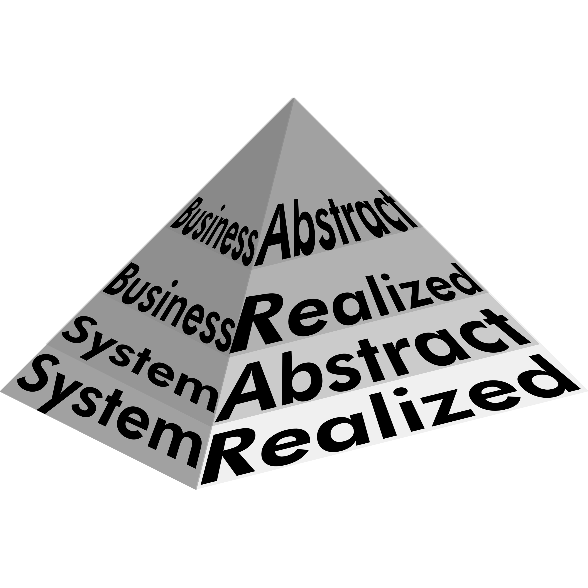
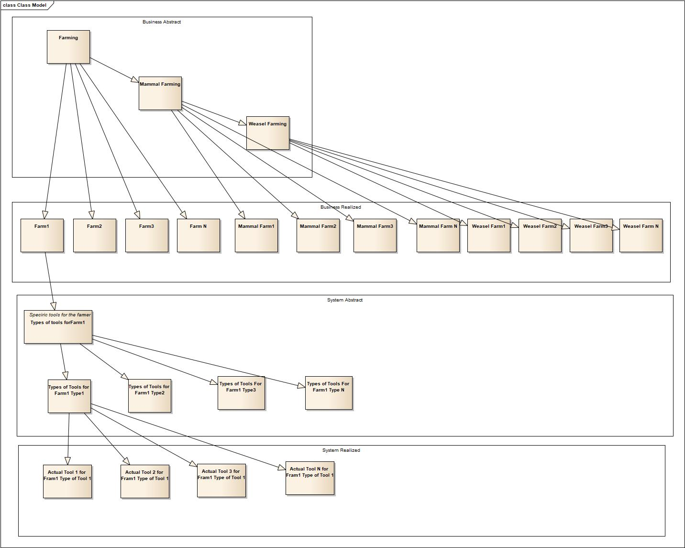

#Chapter 4

Now that we've convered genres, the universes that contain the people we're helping, the thing we're building, and the way we're doing our work, we're moving to **Abstraction Levels**.

Early in the movie "Arrival"[^4-1], once they've narrowed down the universe of things to talk about to just the physical items in the spaceship, Amy Adams' character, the linguist Louise, points to herself and says "Louise", indicating that this was her name.

[^4-1]: If you haven't watched Arrival yet, it's a good flick. I wouldn't use it as a textbook, but it covers some neat concepts and got a 94% on Rotten Tomatoes. [Here it is on Amazon](http://amzn.to/2DgaNzx)

Wait a minute, the physicist played by Jeremy Renner says, when you point to yourself and say "Louise", how do they know if you're talking about your name or your species?

It's a most excellent question. It's such a good question it's the next set of tags we have to talk about in our journey to master effective information tagging.

## Plato's Cave

Plato did not live in a cave, but a cave is one of the things he's best known for. He told a story in 500 BCE that introduced a concept that tens of thousands of programmers are using right now.[^4-2]

[^4-2]: If you're interested in reading a translation of his allegory, it quite short and readable. Here's one on a Shippensburg University webiste. [https://webspace.ship.edu/cgboer/platoscave.html](https://webspace.ship.edu/cgboer/platoscave.html)

Plato asks us to imagine a group of prisoners held in a cave since birth. They're shackled to the ground and can't move. All they can see is the wall in front of them. Back behind their heads is a wall like you would use in a puppet show. Behind that wall is a fire.

So we've got a bit of a 500BC home theater system in place. There's a fire, which the prisoners can't see. The fire shines a light on the puppet stage, which the prisoners also can't see. People start carrying objects across the stage. Some of the people are talking. Some aren't.

From where the prisoners are sitting, all they can see are shadows of things moving across the wall. Every now and then they hear somebody talking as the shadows appear and move. This is all they know.

Hey, it's not NetFlix, but I guess it beats getting eaten by a wooly mammoth.

Plato's first question was: what do these people experience in terms of reality? To them, the shadows on the wall are the only reality they know. If somebody says "here's a chicken", or "here's a duck", on the wall there would be a shadow of a chicken or duck. To them the shadows of the chicken and duck *was* the chicken and the duck. They would understand how things move by looking at how the shadows move. The voices they heard, to them, would sound like it was coming from the shadows. Over the years they would create their entire lives around the shadows and sounds in the cave.

Now imagine they break their chains. Getting up, they look back at the fire. It's bright! Ferocious! Painful to look at!

Now imagine one of these other people walking around notice our friends have escaped, and, feeling in a good mood, shows them some stuffed ducks and chickens. See? Do these look familiar?

Could the prisoners who had only seen the shadows of ducks and chickens recognize a real 3-D stuffed duck or chicken if it were shown to them? Probably not -- not without a lot of thought and reflection.

Many would not want to look at the firelight. It's too painful. There are too many new strange and unfamiliar experiences.

Now our new friend of the prisoners drags some of them up out of the cave into the daylight. As they emerge from the cave, they see the sun. Would this not be extremely painful and irritating? It would be impossible to bear, even for those who wanted to be there. It would take time to even be able to *see*.

As they finally are able to open their eyes, the first thing they can see will be the shadows, the things they're already familiar with from their previous life in the cave. Then the reflection of men and other objects in the water. The stars and moon will be easy for them to see -- although completely foreign to their way of life.

Finally, our friends will actually be able to look at the sun briefly.

Now our friend shows the prisoners something truly wondrous. A real chicken and a real duck. What would they think of them?

Looking back on their life in the cave, what would they think of the life they used to have? Wouldn't they look back on that time and pity themselves?

Now let's take our escaped prisoners and put them back in the cave, back near the fire, back in their shackles, back looking at shadows. At first they can't see anything. Their eyes are too accustomed to the sunlight. Then they start telling the other prisoners about what happened.

"...would they not sound ridiculous? Men would say of them that they went up and down they came without their eyes; and that it was better not even to think of ascending; and if any one tried to loose another and lead him up to the light, let them only catch the offender, and they would put him to death."[^4-3]

[^4-3]:I've made this story into a version where several prisoners come out of the cave and paraphrased accordingly. The discussion in this book is how groups of people work together. Plato was speaking about education and the individual. I'm talking about the same thing only as it applies to groups.

Not sure, but it sounds to me a bit like Plato is talking about what happened to Socrates.

## Abstraction Levels

Plato was making a point about truth and education. When we're born, we're like the people living in the cave. We see things only in primitive, two-dimensional terms. Then we start getting educated. If done correctly, education should be scary! There are lots of new concepts and we have freedoms we never had before.

The more education we get, the more we realize that our entire life, while true to us at the time, was a lie. It was simply a poor, blind way of stumbling through reality. Finally we emerge into the sunlight, which Plato takes for truth. There we see a **real** duck and chicken.[^4-4]

[^4-4]: There are no ducks and chickens in the Allegory of the Cave. I added them in. I guess Plato missed out on that opportunity. Sucks to be him.

It's a short story, but one with a profound impact on how we view our lives. Are we going to continue to be concerned with the shadows of things, the things we experience everyday? Or are we able to move beyond the simple things we see on the cave wall and begin talking about reality how it actually exists?

Like many important lessons, however, it works in multiple ways. Plato, continuing in a long line of great thinkers coming up with a good idea and taking it too far, is on a roll about how education is difficult, painful, scary, and not appreciated by those without an education. But once you've seen the truth, you'll never want to go back. You can't.

Just like the questioning/thesis/counter-thesis dialect thing of Socrates's, it's impossible to overstate what a huge impact this idea had on all of modern thought. Maybe you weren't finally understanding all of truth and beauty as you intellectually moved out of that cave, but there definitely was something God-like going on.

And one of the immediate impacts the Allegory of the Cave had was religion. A lot of religion before the cave was story/allegory based. The gods were like us, they had feelings like us, relationships like us, and so on.

Once people uderstood and started talking and thinking with Plato about how concepts worked like they did in the cave, they started asking questions and demanding answers about whether or not the things they believed in were represestations of reality in its purest form. When the New Testament's Gospel of John begins with "ἐν ἀρχῇ ἦν ὁ λόγος, καὶ ὁ λόγος ἦν πρὸς τὸν θεόν, καὶ θεὸς ἦν ὁ λόγος." - "In the beginning was the Word, and the Word was with God, and the Word was God."? This is a philsophical, Platonic statement. Being able to talk about what we believe like this is something we owe to the Greeks.[^4-5]

[^4-5] One of the catchphrases to use if you love learning history is "Athens, Rome, and Jerusalem", the point being that most all of modern western thought is a result of the intersection of important things that happened in those cities.

Another of the things that occured to people reading Plato was that there was something we might best call *levels of abstraction*. The shadow of a duck is a duck in some way. The stuffed duck? Also a duck. Outside, the live duck? We might call it the "real duck" Then there's our idea of what a duck is. It exists only in our mind. For Plato, that would be the "true duck" The most ducky of ducks. The ultimate reality. Any kind of duck you could experience would simply be a version of the True Duck.

For people who know object-oriented programming, this should sound familiar. In OO programming, we have templated classes, abstract classes, base classes, concrete classes. They all represent the same thing, but some of these are more abstract than others.

And so no matter how tightly we scope our conversation by using tags, there are always going to exist levels of abstraction. When you meet those giant elephant-octopus alien guys on the spaceship and point to yourself and say "Louise", unless we know which abstraction level we're working on it's impossible to determine if you're providing your name, announcing your gender, labeling your species, or what. We have to be clear about abstraction levels.

## Parent-Child relationships

Let's take a problem in the Business Genre and walk through how abstraction levels matter.

You've decided to become a weasel farmer! Yay you! Now your long journey to succesful weasel farming has begun. To start off on the right foot, you'd like to know as much as you can about the business of weasel farming.

Not the mechanics of it. You don't care whether you need to buy a Hinderslot F-4000 weasel-picker or how a tractor-propelled weasel juggler works in sub-freezing weather. That's all implementation stuff. System Genre stuff. What you want to know is how the people part of weasel farming works. Who do you have to know? What sorts of things are you required to do? How do you schedule out your time? That kind of thing.

So you ask the local college to produce a report on weasel farming. You have no experience at all with any of this and any kind of information is useful.

You get several reports back. There's a report on how to run a farm. That's useful, since you've never done that before. There's a report on how to fun a mammal farm, which is quite different than a agriculture farm. Also very useful.

These reports are all related to one another in that each report could be considered an abstract or parent version of the next one. Farming is an abstract version of mammal farming. Mammal farming is an abstract version of weasel farming.

This parent-child relationship is going to be hugely important in information processing.

If I told you that farming involved wearing bib overalls, I wouldn't have to tell you that mammal farming involved wearing bib overalls. You already know that. If I told you that mammal farming required you to keep a vet on-call I wouldn't have to tell you that weasel farming required you to keep a vet on call. You already know that.

Parent-child relationships in analysis means that I can perform the analysis at the highest level possible, then re-use that information with any children or grandchildren without having to re-do all that work. 

In the Meta Genre, I can take a lot of classes on management, Lean, and Agile and learn the *generic* concepts, the concepts as they exist in their most vague and true state. Then when I start managing a product team at PickleCorp, they can send me to some classes on how management happens in this field. Finally as I get into a program I can spend a few days shadowing another manager to determine how the PickleCorp management system applies to our particular situation.

At each step, they don't have to keep repeating the information from the previous step. It's a higher level of abstraction. Organizing things in a parent-child relationship through abstraction levels is a powerful tool that allows us to move tons of important information around only handling it as much as absolutely necessary.

##  Abstract and Realized

While you can have as many parent-child relationships that makes sense to you, there are two main kinds of abstraction levels that we'll tag: **Abstract** and **Realized**.

**Abstract** items are all those items that exist only in pure form. They're ideas. They don't have correspondence in the real world. All those reports you asked the college to do? They're all abstract reports, about how things happen *in general*

There is no generic farm. It's an abstract concept. There are tons of real farms, but there's no such thing as an abstract farm. Every farm has to farm something. Likewise there's no such thing as a mammal farm. Or a weasel farm. We talk about these things in the abstract because in most cases that's we need. If we were talking about how farmers take vacations, unless we were forced to, we would start talk about faming in the abstract.

**We always work at the highest abstraction level possible unless we are absolutely forced to work at a lower level**

This increases value, reduces waste, and allows information to flow better.

If you asked me to build you an application to play a game, you and I would spend some time talking about how to play the game -- not shared memory schemas in RISC architectures. I wouldn't even show you a screenshot unless it was important. If you want an app to play a game and I give you an app to play a game, as far as I'm concerned we're done. Keep it as high as possible.

You've read these reports and, dang it, weasel farming sounds like the life you've always wanted. You've learned a ton reading these things, but you still feel like there's a lot that you're missing. Sure, all of these things are generally true, but how does it actually work? It all seems so theoretical.

So you go back to college and ask them for more practical information. Tell me how actual weasel farming happens.

The first report is a study of several different farms in your area. It talks about how each farm operates (without referring to technology, of course, that's another genre) Farmers get their equipment here, they take their wares to these markets, and so on.

The second report is a study of mammal farming in the last ten years. It is real-world examples of the business practices of successful mammal farms.

The third report is a set of interviews with weasel farmers. (No, not weasels who farm. People who farm weasels.) For each farmer, you learn what their life is like: what's important, what they worry about, how they think of their job.

This is a completely different kind of information, although there's still a parent-child relationship between the three. This is how the **abstract** idea of weasel farming is **realized** by real people, in the real world.

Does that make the first set of reports useless? Heavens no! They were a critical part of getting oriented to your new world. And they covered a lot of ground that you wouldn't want cluttering up the other reports.

**Realized** items are abstract items that are "instantiated" in the real world. If the abstract items were cookie cutters, the real items would be cookies. Each cookie is the same shape as the cookie cutter, of course, but each cookie is also unique. It's a version of the abstract.

For many people, there's no difference in the discussion between the abstract and realized. It's all just the way things are. They work at the widget factory and as far as they're concerned, all factories are just like the widget factory. There's only one reality. They're not able to talk about different kinds of factories or how factories in general might operate.

There's nothing wrong with this. Not everybody has a wide field of view. These folks are like the prisoners in the cave. All they see are the shadows. If you start asking a bunch of questions about how things work in the abstract it's just going to confuse them.

This is yet another reason to keep things as high as possible on the abstraction level. Talk about how things work in general, as if there were no differences in application. If you're forced to, talk about the *realized* version of things, how it varies between different instantiations.

If you've noticed a pyramid in all this, you're very observant. That's because there's a picture of a pyramid in the book before you get to this text.

But there's also a natural pyramid that has to do with parent-child and abstraction levels. The higher we go up in abstraction, the more generic the idea. There is only one abstract "farm" we could talk about. Our discussion would cover every farm that ever existed and every farm that ever could exist. For that one farm, however, there are a bunch of different kinds of mammal farms: cows, pigs, horses, antelopes, spider monkeys. One abstract farm item is the parent of a ton of abstract mammal farm items. The same goes for the next level. For every abstract cow farm, there are tons of abstract children: big cow farms, brown cow farms, and so on.

A natural pyramid is at work. One which we will exploit.

## The relationship between Business and System

There's another relationship we can also use, between the **Business** and **System** genres.

You have studied up on the life of the weasel farmer and there's nothing that can stop you now. In fact, after reading all those reports and interviews you think you know enough about how the business works to want to get going.

But there's one more piece. The piece you purposefully left out until later. How does all the technology work? The computer systems, programs, the automated weasel-picking device, the tractor-driven weasel juggler...how does it all help make a good weasel farm work?

Note: now that you understand the life of weasel farmers, you can start thinking about technology. But not before.

In fact, it's still too early. Next up would be trying to go work on a weasel farm. That's about as **realized** an experience in the **Business** genre as you can get. You want the best way to have a successful weasel farm? Go work on a successful weasel farm and then branch out slowly on your own, using the lessons you've learned as you do the work.

Most weasel farmers will not allow you to do that, however. They can be a viscous, selfish bunch, sadly.

(Note to all you guys out there wanting to form your own startup: this is mostly the steps you would go through to do that as well. Find somebody you'd like to help, then learn as much as you can at the **Business Abstract** level. Once you've exhausted that book work, get out in the field and connect yourself at the hip to people who are actually living in that world. During this time you will learn as much as you can at the **Business Realized** level, directly from the real people doing it. Most of what you learn will be non-verbal. Finally, when you feel you've exhausted that level, you're ready to move to the **System** genre and begin thinking about what you might want to build to help the people you've been attached to.)

Sadly, no weasel farmers will help you, so you go back to the college. What sorts of tools do weasel farmers use? You don't want the brand names or feature lists. You just want to know what sorts of tools you'll need.

Just like before, you get back a bunch of reports all in a parent-child relationship, only this time none of them are about the business, instead they are about the tools used in the business. Conversations around tools and machines, without talking about specific brands, feature sets, or exact implementation details are at the **System Abstract** level.

The first report took a real-world example of a farm, one of your **Business Realized** cases, and talked about the types of sofware needed to make that kind of business operation work well. 

The second report took a real-world example of mammal farming and walked through the types of tools you'd need from the hardware store to run that specific type of mammal farm.

Finally there was a report taking one of the world-famous weasel farms and discussing the various architectural and construction techniques used in their advanced weasel barns.

Each report took a specific instance of a business, a **Business Realized** instance, and listed a bunch of different types of tools and machines, the **System Abstract** things, that could be used to make that type of business work.

They're all about tools and implementation, but only in the generic, abstract sense. The report tells you what kinds of things you'll want to look for in farming software for that one farm, but there are tons of actual farming programs that do that. The other report tells you about the types of tools you'll need from the hardware store for that one kind of mammal farm, but for each type there could be a dozen different brands and variations. You'll be excited to read about the latest types of architectural developments in weasel farm barns that could work for that world famous weasel farm, but there are a million barns that could conform to those specs that the farm might choose from.

At the **System Abstract** level, we're talking about the general tools and techniques used to solve specific business problems, but we're not narrowing ourselves down to any specific implementation details. Why? Because we don't have to. Remember to stay as high as possible for as long as possible. Only gather as little as you need to, and stay as high as you can for as long as you can.

The abstraction flow works like this: **Business Abstract -> Businss Realized -> System Abstract -> System Realized**

This two part pyramid that you see in the diagram above can be used all kinds of places. Places you wouldn't expect.

The four things to learn in this chapter are these:

1. Some things are naturally the parent of other things. That is, some things are abstract versions of other things. Plato taught us this. We use it in computer programming every time we use templates, virtual classes, or inheritance.
2. After you tag genre, tag abstraction level. The two values are **abstract** and **realized**. Things inside each abstraction level can be the parent of other things in that same level
3. There is a natural pyramid at work here where you can capture things at a high level and never have to repeat yourself later. It goes like this: **Business Abstract -> Businss Realized -> System Abstract -> System Realized**
4. Just the five tags we have so far, along with the parent-child thing, and we can already create a zillion different categories. Whoa horsey! The entire purpose of this tagging system is to minimize work. Never think that you need to fill out the pyramid. You'll end up spending all your time drawing little diagrams instead of getting any work done.

The next set we'll talk about contains three different tags that connect up what we've been talking about with whatever your job is. There's one more set after them, but they're the real last important set of tags.
