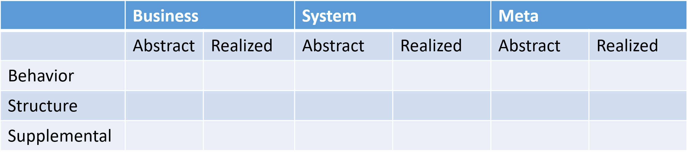

#Chapter 5

Do you own a chicken or a duck? If so, how do you know what kind of chicken or duck it is? Is it a Plymouth Rock chicken? An Orpington chicken? A Mallard? A Black-Bellied Whistling Duck?

How do you even know you have a chicken or a duck? How do you tell the difference between breeds? How do you tell the difference between species?

Let's say you're a biologist on an exciting expedition. One day you come across a creature. How do you tell what kind of creature it is? How do you know whether it's a new kind of creature or something that somebody has already discovered?

Plato taught us how to walk up the tree of abstraction, moving to higher and higher levels. Your pet duck is a type of domestic duck. A domestic duck is a type of duck. Ducks are a type of bird. Birds are a type of animal. We keep moving up. Plato asks us to abstract toward purity and ultimate truth.

When we talk about Abstraction Levels we're always using the phrase "is a" sometimes adding on "type of" at the end.

Plato was all about becoming a more pure, abstract version of some thing. But his student Aristotle asked the reverse question: how do we sort things out from one another?

Take a break from reading. Stand up. Walk outside. Look around.

There are all kinds of things out there! Sky, clouds, birds, squirrels. Who the heck named all this stuff? Sure, for as long as people could speak, they had words for the things around them. But languages were different, environments were different. What was needed was some kind of system for organizing all the stuff around us so everything goes into a category. Then we can start studying the things in different categories.

Today we go online and find out what things are. Didn't you ever wonder how everything got organized?

Aristotle.[^5-1]

[^5-1]:Of course there have been tons of different ways of organizing the universe around us. Aristotle's was just the one that eventually stuck for scientists, as I point out later in the chapter.

Aristotle was Plato's student. Plato was Socrates's student. From Scorates we have no written record. Plato gave us some text. We know a lot about the things he taught. Aristotle took that even further, generating a ton of texts, establishing a high-quality royal academy, teaching all the great leaders of his day.

Remember Alexander the Great, played by Colin Farrell in the 2004 movie "Alexander"?[^5-2] Alexander conquered over 90% of the known world, devouring entire empires and ending up in India years later. His men had faught so long and hard that they basically decided they weren't going to fight anymore. (Especially with the elephants. Fighting elelphants ain't no fun.) Ever wonder why over 20 cities are named in some way around "Alexander"? That's Alexander the Great.

[^5-2]: Not really the greatest movie in the word. The general rule about movies that cover something in history is this: they suck. They might be good movies, but they almost always suck at describing what actually happened. Add Oliver Stone to that mix and you get commentary more than anything else. It was a train wreck. Still, I liked watching it. I'm a sucker like that. [http://amzn.to/2CSSbUX](http://amzn.to/2CSSbUX)

Who taught him? Aristotle, that's who. 

The Greeks and their next-door neighbors, the Persians, didn't like each other too much. (You can see that in the movie "300")[^5-3]

[^5-3]: A much better movie. Not a great movie, but a good-looking one. [http://amzn.to/2APpSoP](http://amzn.to/2APpSoP)

Aristotle's advice to Alexander was "to treat the Greeks as if he were their leader, and other peoples as if he were their master ; to have regard for the Greeks as for friends and kindred, but to conduct himself toward other peoples as though they were plants or animals; for to do so would have been to cumber his leadership with numerous battles and banishments and festering seditions."[5-4]

[^5-4]:This is from Plutarch, I believe. I had read it several times in various places. Found it again here: [http://www.perseus.tufts.edu/hopper/text?doc=Perseus:abo:tlg,0007,087:1](http://www.perseus.tufts.edu/hopper/text?doc=Perseus:abo:tlg,0007,087:1)

Thankfully Alexader did not follow Aristotle's advice. But far from the days of Socrates sitting out by the city gates annoying all the rich and powerful people, by now they were sitting with kings and advising them on how to conquer the world.

You know, once they got some of the initial bugs worked out, this philosophy thing was really taking off.

## Behavior and Structure

Aristotle stayed with Plato for over 20 years, learning as much as he could and sticking with the "in the heavens is the actuality and pure form of everything. Our world is merely a shadow" schtick that Plato was really on about during that time. But eventually he left, and his thoughts, like many students, took an almost opposite turn from has master's. (I'm looking at you, Anakin Skywalker.)

Aristotle became more concerned with the here and now, the things we could see, feel, hear, touch, or smell. The world around us. So instead imagining a pure version of everything he talked about, he started wondering jsut how many types of things there were. Every duck is an individual, of course, but they're all ducks. The green ducks we call Mallards are obviously both ducks and not the same as white domestic ducks you see on ponds everywhere.

Given a bunch of stimulae, how do you sort it all out?

There's a ton of reading here if you want to do it. By answering this question, Aristotle answered the question of how some people can become specialists in one area but not another. This is the beginning of biology, zoology, natural sciences. There were many books he wrote. Natural Philosophy exploded.

For our purposes, however, Aristotle taught to use our senses and sort things out into how they are structured and how they behave.

Birds fly. Cows don't. That's a big difference in how they behave. Birds have two legs. Cows have four. That's a big difference in how they are structured.

What Aristotle suggested was that you could come up with a series of tests around how things are structured and behave that would sort them all out into nice, little categories.

Using this, he came up with a classification system for all animals. Fancy word alert. A system that arranges things according to how they relate to one another is called an **"ontology"**. Stick with me and you'll have a sentence none of your friends can understand in no time! "How can we create effective ontologies without a powerful dialectic driving it?" (You know what that means, right?)

People used his system forever. It gave everybody a place to put the things they'd seen, categories of stuff that they could reason about. I could become an expert in the Plymouth Rock chicken. You could run into a chicken on the street, observe it for a while, and determine that it's the kind of chicken I know everything about. That's without ever having met me, or even seen a chicken.

This allowed us to split the world of knowledge up into little pieces we could digest. Amazing stuff.

More important than the Natural Sciences (Wow, that's weird to say), is the *method Aristotle used to organize things*

Things are structured a certain way. Things do stuff. We can make a decision tree around those two areas and categorize anything, not just chickens.

Building an online system for a hospital? What is it supposed to do? How is it structured? Once you've fully answered those questions, you're done. The job is complete.

No matter what your organization is trying to do, behavior and structure are the only two things to talk about, whether you're talking about how things are now or how you want them to become. We use Aristotle's system for creating science every day when we talk about whatever our job is.

Job descriptions? A list of behaviors a person is supposed to be doing. Org  charts? A structural diagram of how roles relate to one another. Specification for a new bridge? A few behaviors the bridge has to support ("Trucks up to 100 tons must be able to cross at speeds up to 100mph") and a huge stack of structural diagrams needed to support those behaviors. Work at a Dentist's office? Your office provides the public with a list of certain behaviors (fill teeth, clean teeth, and so on). It also has a physical structure. The lobby is in front of the cleaning room, while down the hall is the x-ray machine. The structure supports the behavior.

We can take anything in the universe that we're able to observe and reason about, and slice it up into neat little pieces by talking about what it does and how it's structured.

Everything, everything is all **Structure** and **Behavior**.

Well. Almost.

## Supplementals

I don't want to spoil it for you, but it turns out Plato gets his revenge in the end.

No, I was not lying to you. Everything in your world, whatever it is, is all about **Behavior** and **Structure**.

It those dang abstraction levels again that cause problems. The issue is that I can say something at a high abstraction level that might mean all kinds of things. You don't know.

Let's say you're building software and hardware for a new kind of ATM. Things are going well. You've made a prototype, you're working closely with some local bank customers. Everybody is happy.

Then as Product Owner I walk in one day and say "You know, guys. This system has to work seamlessly with Lithuanians."

"Sure thing, boss!" is the correct reply, of course. And you'll do it. But just what the heck did that sentence *mean*, anyway?

It could mean anything. It could mean all the screens have to display a language the Lithuanians can read. It could mean we use Lithuanian currency. It could mean we have to use parts that the Lithuanian government approves. Heck, for all we know, Lithuanians have their own unique way of counting and using money. There could be some cultural differences nobody has considered.

What kind of statement was that, anyway? The statement the product onwer made: "This system has to work seamlessly with Lithuanians"? Was it behavior or structure?

The answer is: Yes! It's behavior **and** structure. It's an abstract statement that covers both.

Oh boy. Freaking Plato, huh?

Many times people will say and ask for things that are generic or fuzzy enough not to have any real meaning until you actually start doing the work. They are abstract concepts that, once they become instantiated, take on meaning in structure and behavior. But only then.

"We're going to build this entire system using Visual Klingon," the VP said.

Does he mean everything? Are we going to rewire the CPUs? No, he can't literally mean *everything*. It's just a generic statement that needs to be true once we actually start working.

It's a **System Abstract Supplemental**, an abstract rule about how the the solution is going happen. Once we start making it happen. The "This sytem has to work seamlessly with Lithuanians" statement? It's a **Business Abstract Supplemental**, because it describes at an abstract level that any kind of business interaction we have, including answering the phone or doing it all by hand, has work seamlessly with Lithuanians, whatever that means.

**Supplementals** are abstract statements, general rules that have to hold true, than can relate to both structure and behavior. We really don't exactly how they apply until we start doing the work.

The reason Aristotle didn't run into this problem was because he was always concerend with the reality in front of him. Reality was created. He was simply categorizing and organizing it. Plato didn't have that problem because he was always concerned with the hidden, true meaning of things. He didn't worry about sorting things out the way Aristotle did.

If we're moving information around, we have to do both, generalize using abstraction levels and sort things into finer pieces using behavior structure. So when somebody gives us an abstract piece of information that can cover both structure and behavior, we have to keep track of it and make sure we remember it when we're actually doing the work.

So there are three, and only three **"Buckets"**[^5-5] **Behavior, Structure, and Supplementals**

[^5-5]: Beats the heck out of me what to call them. I've called them buckets for many years. In retrospect, I should have called them something complicated-sounding, like "ontological metacategories". All this time I could have had a higher billing rate. Dang it.

**Behavior** is what things do.

**Structure** is how little pieces fit into bigger pieces.

**Supplementals** are broad statements about both behavior and structure that cannot be resolved until you actually talking about specific structural pieces and behavior.

Of course, there's always the parent-child relationship that we need to remember.

So we end up with a kind of "Analysis Bingo" sheet, where everything in our information stream fits into one of these boxes.

Did I just say that everything in your organization, all of the information it gathers, creates, and processes? It all fits into one of these 18 boxes? Really? That's crazy!

I did. And it does. One of the reasons we've spent time meeting all these old Greek dudes is because I don't want you thinking that these categories are arbitrary. They are not. They're not just something I made up. They're result of hundreds of years of really smart people thinking really smart thoughts. (I was not one of those people) If you want a different categorization system you'll need to go back and reinvent western thought. I'll wait here.

There are a couple of more curveballs that we'll go over in this first section of the book, but these tags are at the heart of any effective information stream. And there isn't a lot of them.

**There's Genre (Business, System, Meta), Abstraction Level (Abstract, Realized), and Bucket (Behavior, Structure, Supplemental). For any piece of information, pick one tag from each of these groups.**

There's one more group that's rarely used, but we need to go over it. We also need to know how to add detail to items in the buckets (Behavior, Structure, Supplemental) and how all of your information is connected together. Then our foundation journey will be complete.

