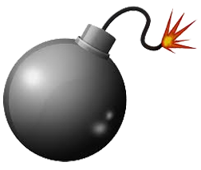
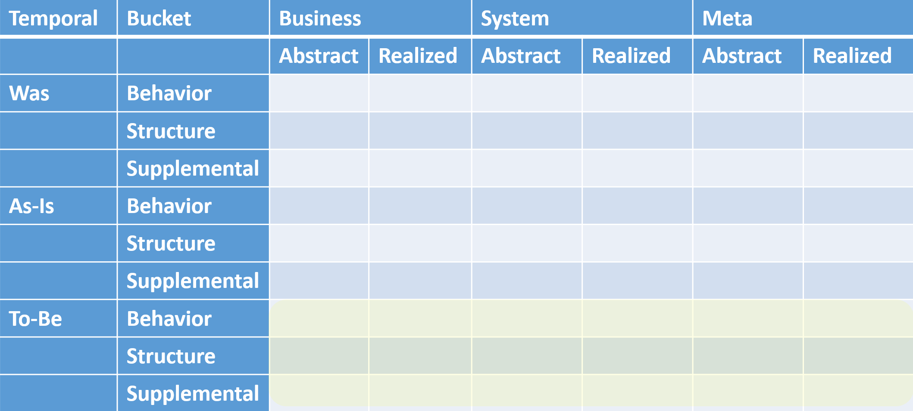
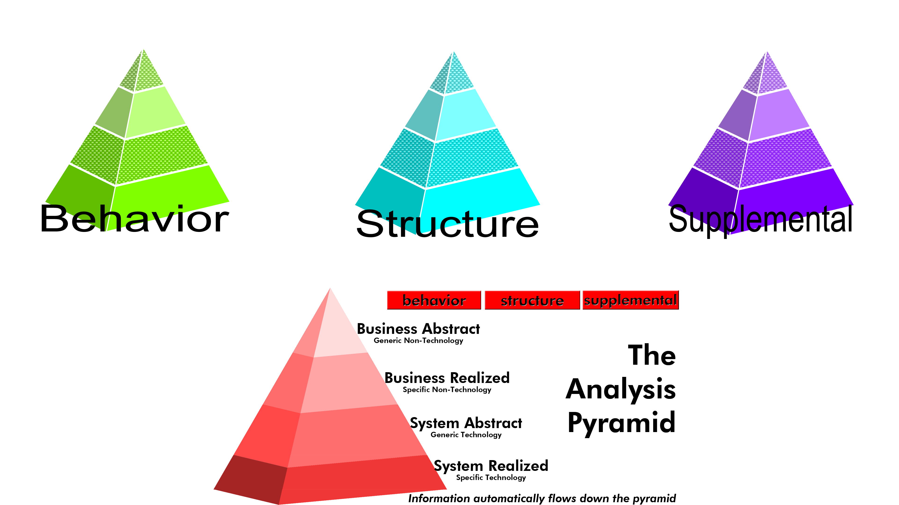

# Chapter 6

In 2004 I worked on a secret bom for the Department of Defense.

It's not something I like to talk about. It was a long time ago. My country needed me.

A DoD agency called me in to work on replacing a set of critical systems that all worked together with one system that would be easier to modify and maintain.

As a software architect, I didn't know what to expect. Clients have all sorts of ideas about how to start off major new efforts. Most times they place so many constraints on the system before they even figure out what it's supposed to do that it's doomed to failure.

I was asked what I needed. "A big open space where we can work side-by-side, a couple of months or so, and people who have a lot of experience in the various ways these other systems work."

Monday morning when I showed up, they sent me to an abandoned Food Lion, which is a grocery store chain in the U.S. The agency had rented out the entire store, and when I walked in there were about dozen people waiting for me in the otherwise empty building.

"Who are you guys?"

"We're the experts you requested for two months. Are you ready to start?"

I looked around. All of these people were staring at me. So we blocked off a little theater where we could set up a projector, then gathered around some chairs and flipcharts. I brought up notepad and a drawing tool on the screen and started asking questions.

The next two months consisted of all of us in that room asking questions of one another and writing down the conclusions we reached. We also brought in folks from other parts of the agency and asked them questions.

Initially, our questions focused around what the current various systems did, but we also had to talk about what the new system would do.

But wait, that's two completely different things, right?

## Temporal Indicators

Our last group of tags are called **Temporal Indicators**. I build software for people. Most of the time our discussions are around what they want in the future. But a few times in my career I've had to spend time talking about how things were in the past -- or how they are currently.

The Temporal Indicators I've used for those situations are **Was, As-Is, and To-Be**

Certain situations might have a need for other indicators. I don't know. These have worked for me and I've never seen any others used.[^6-1]

[^6-1]: Guessing, you might end up with a separate indicator for all the possible verb tenses. That gets crazy complicated though, and why get complicated if you don't have to? Most all of the time I'm using "To-Be", so much so that I rarely explicitly tag it as such.

The grid's a great way of looking at the tagging system. Everything goes into one of the boxes. We need to remember, however, that there is a pyramid of parents to children inside of each box. There's also a pyramid relationship that runs along this path Business Abstract -> Business Realized -> System Abstract -> System Realized

I'm going to use pyramids from here on out. The grid shows that the tagging system itself is really simple to use. Once things are tagged, where it gets interesting (and powerful) is in those parent-child relationships and the way things in the different buckets interact with one another.

The project with the DoD went very well. The customer was concerned that our super user group would disagree on critical components of the new system. That was a valid concern. They disagreed. But what we did was first talk about the **Business Realized As-Is** situation, outlining all the various ways the different business units went through their job without respect for technology. Everybody got to talk about their job and the special and cool way they worked at their location.

They all got to talk about how their experience was unique and the values they had with one another. It was a great group. People listened. Once we had all of the **Business Realized As-Is** items in place, I asked a simple question: "What sort of generic things are true across all of these instances? You guys are doing some awesome work, and each unit is different, but what parts are the same?"

The group was then able to describe generic behaviors, structures, and supplementals that would have to be true in the upcoming system no matter exactly how it was implemented. We moved up an abstraction level and changed temporal indicators, to the **Business Abstract To-Be** level without any problems. We put off decisions about how each individual unit would work until later. As long as the new system supported all the generic desires, it could be configured differently for different users. That was a problem for another day. Remember: work as high as you can for as long as you can.

Now that we had agreement on the general way things had to be, the **Business Abstract To-Be** stuff, we took that agreement and did all kinds of other cool things that we'll talk about later.

Temporal indicators combined with abstraction levels can be a very powerful way to move forward in a large group with tons of diverse interests. It's always my "go-to" place when starting a large, tricky, project.

In the movie "Arrival", temporal indicators played a huge role in the plot as well, the entire idea of things occurring in the past, present, or future was foreign to our new friends, and that caused all sorts of other things to happen. (I don't want to spoil it.)

How about my story? What was the agency? What was the mission? What happened?

I was working for the Defense Commissary Agency. They run a series of grocery stores all over the world supporting the troops and their families. As part of our work back then, I had to sign a non-disclosure agreement, of course. One of the diagrams we created was called a "Business Object Model", or "BOM"

Yep. That's right. I worked on a secret bom for the Defense Department. The bom I worked on involved green beans.

