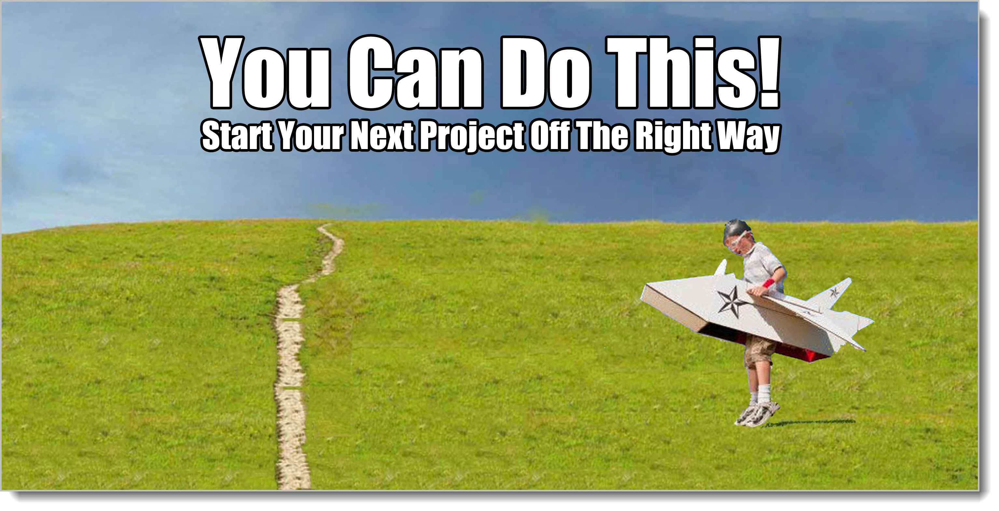

# Rapid-Fire Examples

## Application

Our tagging system is now complete. Woo hoo! If you bail out now, if you're hit by an oxcart hauling dog sweaters barreling down a country lane one dark night heading to the nearest laundromat, end up in a coma, and wake years from now not remembering anything but this book, your time has been well-spent. You can use these tags anywhere. These same tags will be useful today or a thousand years from now.

Taking notes on how your organization is going to do a re-org next year? Let's see, that's information about the people that make things happen. That's in the **Meta** Genre. If we're talking about how the people relate to one another, how people and little groups relate to other people and groups, how things fit together, we're talking about **Structure**. It's happening in the future, so it's **To-Be**. Finally we'll probably be talking about things in the **Abstract** at first, what kinds of principles we want to use to do the work. Then we'll move on to the concrete (Always stay as high as possible for as long as possible)

Even though we've labeled our conversation as **Structure**, in actuality once you start talking about any of the buckets, things from the other buckets show up. Why does Joe need to report to Sue? Because Joe does the inventory, and Sue is responsible for property. We asked about **Structure**. In return, here we have **Behavior** (Joe doing the inventory) and **Supplementals** (Sue being responsible for property, whatever that means). Even though it's from another bucket, that information is just as important as the org chart stuff. After all, you'll probably need to know that later. "Jim takes care of the coffee supplies. Where should he report. Well, let's see, we said a couple of days ago that Sue is responsible for property..."

The three buckets always travel together. You can never just single one bucket out. You always get the three.

### Dental Franchise

You've picked up a new job! It's the first day out of the hospital from your coma (they never found that oxcart driver), and you land a new job. A local dentist has invented the perfect system for running a dental office. He wants to create a franchise, a system where other dentists pay him money and he provides them with the training and tools to run a dental office just like his. Like McDonalds, only for dentists.

The only problem? He needs an instruction book. He needs somebody to take down all of the things his office does and how they do them. Create an "Operations Manual" for running the best dental shop possible. Okay. How do you do that?

First you separate out the tools and mechanical part of running the dental office from the business side of things. He wants an operations manual. Whenever I hear "operations manual" I think of **Business Realized Behavior**. Business Realized Behavior is the actual way a certain business is ran.

But wait, some things are probably part of the franchise and some things aren't. Some things probably don't matter and some things the people are free to make various choices. So you'll need to start at the abstract level, find out how dental offices are ran no matter who runs them. Once you take enough notes at the **Business Abstract Behavior** level that you think you understand most of the generic parts of running a dental office, you'll interview and take a bunch of notes at the **Business Realized Behavior** level.[^7-0]

[^7-0]: There's some ambiguity here. If this guy is teaching a universal way to run dental offices, is that **Abstract**, because it's universal? Or is it **Realized**, because since no matter what his system is, it is one of many ways to run a dental office? I'll talk about this later, but you can pick either one. Just be clear on which one you pick and why. In this case, we have one **Abstract** level, the pure form. Then two **Realized** levels, the one he teaches and the one customers instantiate (which we're not modeling.) Remember that there are tons of levels of abstraction, all covered by the parent-child "Is A" relationships. So we can have one layer in Abstract and a couple of layers in Realized. It's all relative to what you're trying to understand. If it weren't, if there were some universal truth here instead of Analysis going on, we'd just do the work one time and never have to do it again. But life ain't like that. Another guy coming in to the same situation would draw the model differently. That's the way mental models work.

As always, once you start asking about Behavior, you'll start hearing about Structure and Supplementals. So you've really got six kinds of things to talk about, the three buckets at the Business Abstract level and three buckets at the Business Realized levels. If you're keeping track, that's **Business Abstract Behavior, Business Abstract Structure, Business Abstract Supplementals, Business Realized Behavior, Business Realized Structure, and Business Realized Supplementals**.

During your conversation, expect people to pop all over the place. You'll have finished talking about how dental businesses work in the abstract (Business Abstract.) Then you'll start talking about exactly how this franchise wants to teach things. "How does teeth cleaning happen?" you might ask. "Well, you never do teeth cleaning without checking insurance first", "Wait a minute. Is that true for this franchise, or true for all dental offices?", "It's true for all offices. Nobody will do a cleaning without validating insurance."

So you ask a **Business Realized Behavior** question (How does teeth cleaning happen), and you get a **Business Abstract Supplemental** (Nobody will do a cleaning without validating insurance.) What does it mean to "validate insurance"? Beats me. You file away the information you got, then either chase down the new Supplemental or continue with what you were talking about before.

Almost every time you ask a question about one thing, you'll get information for somewhere else. You'll probably have new questions too. Remember Socrates! Questions are where it's at.

Human conversations are naturally unstructured. It's impossible to talk about simply one thing and cover it all. Our minds don't work that way.[^7-1] Instead, pick a topic and talk about it, catching all the stuff that goes in other areas and getting back to those areas later. Tagging allows you to have natural conversations where you can organize both the information you're getting and the follow-up questions using the same system.

[^7-1]: Oddly enough, I've noted that when you ask about behavior, you almost always get a structure answer back. When you ask about structure, you almost always get a behavior answer. The pattern holds strongly enough that I actually ask about things I'm not interested in so I can get the answers I need. If I wanted to know what a new computer system did, I might ask what they wanted on the screens (Structure), then write down all the Behavior answers that came back. We'll talk about this later.

## Movie Special Effects

The Dentist job was fun, but you got fired. You hurt the dentist's fillings.

After the Dentist job, you were hired to created a giant plastic model of a land-attack ship for an upcoming science fiction movie. You're all about creating giant plastic models, but what should this thing look like? (Aside from "really cool!")

Hmm. How a particular implemented solution should be constructed. You have a **System Realized Structure** problem.

Above the System Realized level there's the Business Abstract level, the Business Realized level, and the System Abstract level. That's nine other buckets aside from the three in the level you're on. Nine! Do you really have to sit down and talk about all that crap just to make a cool plastic model?

Of course not. But you need to know those levels exist. That's all. Do as little as you need, as late as possible, and only what you need.

You stay as high as you can as long as you can. In our case, the real point of this is that it looks good in the movie and works for the shot. So as long as we do that, we're fine.

Okay, what's our first question? Here's the Director. What do we ask him?

"So what kind of things do you want this land attack ship to *do*?"

"It should have this cool laser on the front where it shoots people on the ground. It also needs a hatch on top our hero can climb out of. And it should look like a giant wooden badger."

Ok. We started with **Business Abstract Behavior**. It's the top level of our pyramid and a good place to start with questions. In reply, we got back **System Realized Structure** (laser on the front), **System Abstract Behavior** (laser somehow shoots people on the ground. Laser shots? Continuous light? We don't know. That's System Realized Behavior. Save that question for later.) We got **System Realized Structure** (needs a hatch on top). Cool, so our director is designing the ship for us. We'll remember to put that in there. And it needs to look like a giant wooden badger. That would be both structure and behavior, and it's talking in general terms about how it looks, so that's a **System Abstract Supplemental**

Do we need to tediously go through each of our boxes in Analysis Bingo? Of course not. But we could spend a few minutes making the three lists at the highest level, even if it's just among ourselves without the Director present. It would give us some context to talk about the answers we do need.

So all the artists sit and ask ourselves, if we were the Evil Empire designing a land attack craft, what kind of things would it do? After ten minutes of brainstorming, we have a list. Our land attack ship will:

1. Walk across open ground like a camel
2. Jump over hills and fortifications like a rabbit
3. Turn it's "head" left and right in a sinister way
4. Crouch down and make a cool growling sound
5. Shoot lasers at stuff. (Right?)
6. Make hissing sounds as steam or something shoots out the back every now and then (We discussed loud farting sounds before a big attack, but sadly the guys didn't like that.)
7. Glow green or blue when it gets angry

Cool. Some of that stuff we'll need to show in the movie. Some maybe just for us. Some of that stuff we just made up for fun. So that's our **Business Abstract Behavior** list, stuff that it has to do no matter how we make the model. Do we know anything about structure? We quickly sketch out a list there too. Our land attack ship must have:

1. Laser turret
2. Legs with knees
3. Hatch
4. Neck
5. Head 
6. Windows
7. Entry hatch

Neat. We're actually talking about physical parts of the ship, we asked for **Business Abstract Structure** and we came up with **System Abstract Structure**. That's fine. We probably don't need Business Abstract Structure stuff. Let's try skipping it. We've sketched out what it has to do and the necessary pieces we'll have to model. Are there any supplementals? Stuff that's true no matter what?

After a bit we came up with a couple. It must always be true that:
1. The ship does some kind of thing before it shoots: crouches, glows, or hisses
2. The ship looks like it might fall down at any minute, but quickly adapts, like that robot on those YouTube videos. Done right, this will convince the audience that it's actually super-stable
3. Maybe we should have different colors for different stuff. Red lasers, blue feet, etc.

Wait! Forgot the most important one! 4. Must look like a giant wooden badger.

Cool. Some new Business Abstract Supplementals.

That got kind of vague at the end, but it's better than nothing. Ten, twenty minutes later, you've finished kicking around questions with one another (Anybody remember the dialectic? Nailed it.) and you're ready to play with some models. Yay!

The gang spends the next few days making sketches of ships and guns and people doing dramatic things, throwing some pieces together to make something to look at. During that time, you'll probably refine the items in your three lists. (If not, you're probably doing something wrong.) You'll have a lot more conversations/dialectics. (Sorry, I meant you'll be performing a lot more analysis.)[^7-51] During all of those conversations and playing around with models, while it looks like nothing is happening but fun modeling stuff, you're doing something much more important: *You're creating a shared mental model* Analysis For The Win!

[^7-51]: Remember, I'm not talking about meetings! Analysis and the dialectic happens all the time, whether we want it to or not. It's our natural way of organizing things in our heads.

The director's not in the room, however, so you're probably far away from what he wants (and heading farther away with each passing day.) so you call him back to show him what you've got. As you get out the sketches and hand him the prototypes, you read the items on the behavior list "Check this out. We thought it would walk like a camel, crouching and jumping over stuff" you say as you play with the model.

Now the director is building a mental model. He doesn't know as much as you do, so he's doing it the old-fashioned way: in his head. He asks some questions. Changes some things on your list. After an hour or so you have a new set of three lists (Behavior, Structure, and Supplementals) and some models you pieced together while talking to him. More analysis.

The gang gets back together for a few days and riffs on this new list. Then the Director comes back and you repeat the process. After a few times, everybody in the room has the same mental model of how these land ships are supposed to look and work. Double bonus points for you because you've been keeping notes with all the stuff tagged. When the team hires a new guy, you can all walk through the notes and he can get up to speed very quickly. 

You can't push a shared mental model into his head with notes, of course! This book isn't about *documentation*. The new guy will still have a bunch of questions he'll want to ask, and you'll have a bunch of questions to ask him. He'll go through the same process you did with the director with reading and understanding the lists, asking questions, answering questions, and playing around with solutions. He will have to do that to join the shared mental model with the rest of you. Guess what? The gang will end up changing their model with the addition of the new guy. The dialectic is about groups of people asking each other questions around theses and antitheses to form a shared mental model. New people? New model. 

The only thing the tagged notes and prototypes do is drastically speed up the time it takes to create those models.

## Corporate Training Department

That was a cool job, wasn't it? But, alas, that job ended in tears as well. The studio cut the budget.

The Dentist and special effects gigs were fun, but this next one? Who couldn't get excited about planning Corporate Training for the upcoming year? All those classes and books, Powerpoints and lectures. It gets me crazy agitated just thinking about it.

But it's work; you gotta do it, and here you are. You're working at BigCorp and your team has a large budget and is supposed to fund training for the upcoming year.

Books, presentations, teachers, students. What the heck does that have to do with our tags? I thought the tags were about building stuff, right?

Well, that's why I picked this example. The tags are about creating shared mental models.[^7-61] You can use those models to build stuff -- or to do other things. Remember Socrates! Everything we talk about in life goes back to those old Greek guys. Including planning training.

[^7-61]: Just to be Mr. Pedantic Man, you don't have to have the tags to create a shared mental model, of course. People have been doing it for thousands of years without tags. The tags are just a tool to make it all happen faster. As we do more and more examples, you'll see how the tags continue to pay off.

So the first question is this: what do we need a shared mental model about? That is, what target system are we changing?

The immediate answer is that we're creating a schedule, sending out RFPs, installing an LMS, and doing other day-to-day operations. But if we did all of that, could we still fail? 

Sure.

So that's not it. Thinking about doing all of that stuff should be *secondary*. All of that stuff is the actual way we end up going about our jobs. It's not the nature of the job itself. The nature of the job itself is probably something like "make poeple better and stuff" The budgets, schedules, classes, notes? All of that is the final product. It's the **System Realized** level stuff.

What we need to know is the reason why we're doing things. The overall nature of where we are and how we define success. We gotta talk about the **Business Abstract** stuff.

(In fact, you'll find that no matter what you're trying to understand, you have to spend some amount of time at the **Business Abstract** level to get oriented. More on that later.)

So what's the goal of a corporate training department? To provide training? That's like saying the goal of a water spigot is to provide water. True, but circular. What do we need the water for? What do we need the training for? *Why is somebody paying for this?*

One of the saddest and most common mistakes is that they don't understand analysis, so they confuse the tools for the job with the job itself. Need to dig a ditch? Go buy a $15-million-dollar bulldozer and then start reading the instruction book. It sounds insane, but people do this with software all the time.

After much sitting around and scratching your heads, you finally hit on it: corporate training exists to change the habits of people in the organization from poor habits to productive ones.

It doesn't exist for simple knowledge. It doesn't exist to enforce policy. (Policy probably plays a role here, but only because some policies represent habits you'd like folks to have. There are a lot of other habits you'd like folks to have that aren't polices, nor should they be.)

So we are trying to understand and deploy a system that changes the habits of folks in the corporation. That's what they pay us for, that's what we have to focus on. We should not get side-tracked by whatever our preexisting beliefs are about training departments and how they work. If buying a fleet of clown cars will help us change habits more than anything else? We're buying a fleet of clown cars. By understanding our mission, we're able to judge success or failure.

So back to our three lists, just like last time. What kinds of behaviors in general do people have that want to change other folks' habits? What's our **Business Abstract Behavior**? They are:

1. Make an ordered list of habits they'd like to change (from most important to least important)
2.  Select and implement some way of determining which habits people have 
3.  Make a list of different things they can do to change habits 
4.  Try some things 
5.  See which ones work and which ones don't work 
6.  Try to guess a pattern in what works and what doesn't work 
7.  Continue experimenting to see if the pattern was correct or not 

That's our first-pass at **Business Abstract Behavior**. It's interesting to me how scientific it all is. It sounds just like the things scientists would do to train rats or something.

How about pieces of stuff? What general pieces of stuff do we have to implement this behavior? Well, we have:

1. Surveys
2. Classes
3. Videos
4. Lectures
5. Brown Bags

No. Wait. No. Some of that is stuff we'd use to actually get the job done. Some of that is stuff we'd use to understand the job. We've mixed up Business Abstract and System Abstract. These are all types of applied solutions, that is, a survey is a type of thing to measure what habits people have. It's a tool. "Habit measurement", on the other hand, is a piece of something we need, whether it's done by survey, interview, hidden cameras, installed tools, or whatever. We've jumped down from Business Abstract to System Abstract, just like last time, but we're not in a hurry to prototype. This thing is going to take years to work through. Surely we should stay abstract longer. We don't have to order classes tomorrow. (Even then we could spend a few hours at the Business Abstract level. It's not going to do anything but help us.)

Let's try this again. What high-level pieces of stuff do we need to talk about changing people's habits? We have:

1. People
2. Habits
3. Interventions
4. Habit Measurements
5. Experiments
6. Time Periods (An experiment consists of a measurement, intervention, time period, and another measurement)
7. Experiment Results
8. Prioritized Habits List

There we go. That's all the high-level abstract things we've talked about so far.

This high level list of items that go together at the most abstract level, the **Business Abstract Structure** list, is an interesting thing. It almost looks like a glossary, doesn't it?

So how about Supplementals? Are there any Business Abstract Supplementals we need to remember?

None we can come up with. No, wait -- we have a legal requirement to teach folks both with disabilities and in our Canadian operations, in French. So there are two: We must always:

1. Interact with our employees who are differently-abled in a way they can consume
2. Interact in French as a secondary language for anything we do in Canada 

That seems good. Then our boss looks at our Supplementals list and remembers back on his last corporate retreat, where they talked about values. He gives us a few more. We must always:

3. Respect our students as the people we report to, our managers/customers
4. Be kind and courteous with everything we do 
5. Follow-up with all of our interactions to make sure we leave a good impression.

After he leaves, we all look around confusedly. What the heck does any of that mean? Beats us. But -- that's the role of supplementals in the first place. We'll figure out what any of them mean once we start doing stuff. For now they're just generalized, abstract statements.

So now that we have our three lists in place at the Business Abstract level, what next? We've decided on an overall flow to our work: make a prioritized list of habits to change, measure what people are doing, do something to change habits, measure again.

Does it have to be more complex than that? Remember, the whole point here is doing the minimum amount necessary for the maximum impact. I'd think next up we'd build a prototype to talk about, just like we did with special effects model.

We'll take a couple of teams, a two-week time period, and run through our flow. We'll actually do a little sample of the work to learn more about the problem and get agreement with one another. We pick a habit, we go out and ask people if they're doing it, then we'll do a 2-day class (or a video, or a sing-a-long. The details do not matter.), then we'll come back a week later and ask again. Whether the habits changed or not, we'll ask the employees why they changed or didn't change. 

Then we'll meet back here. We'll ask one another questions about what worked and what didn't work. We'll come up with theories about what might work or not. We'll come up with counter-theories. Using open, honest questions we'll probe one another's positions until we agree on what our working theory will be. Then we'll engage some more with another prototype.

It's the same pattern as we had with the director and the model. It's the same pattern no matter what you're doing. Over time, over several of these experiments, we'll learn more about our job: what works and what doesn't work. Then we'll scale out to the rest of the organization, always continuing to test and engage in little experiments as we go. We "nail it and then scale it" as one business book put it.

## Dog House

That job didn't last, sadly. You did such a great job training people that they hired robots and now everything is being done in a warehouse in Toledo. 

Oh well. The next gig eventually comes through, and it's for the dogs. Literally. It's a doghouse.

By this time you've got the hang of things. You know how to tag and organize stuff. Fortunately you also know how to build dog houses.

You meet with the customer and chat back-and-forth a bit. 

What behavior? The dogs sleeps in the house. That's all. What structure? The house needs a roof, walls, and door. Nothing special. What supplementals? The guy wants the house to last at least ten years. (Ok, so that means some different choices in building material and paint, but that's fine)

You sketch out a house on your pad and show the guy. He likes it! So then you grab your tools and spend the afternoon building and painting the house.

When you're done, the dog walks over, gets in the house, and goes to sleep. The doghouse did what it was supposed to do.

You get paid, the guy gets a doghouse. The dog takes a nap. Life is good.

What if you were worried about getting paid? Well, you'd take those same lists and sketches and make it into a quick contract, a "Memo of Understanding". You'd both sign it. Then you'd build the house. Maybe you'd get a down-payment first if you were really concerned about the job.

It's the same process as the other examples.

## Mars Colony Project Manager

The doghouse gig was going like gangbusters for several years, but you got kind of tired of that after a while, took a mail order course, and got accepted as humanity's first Project Manager to oversee our new Mars Colony! (It was a pretty good mail-order course.) Wow! Hope they need some doghouses up there.

Your first day on the job, you arrive at a huge, glass building. A robot parks your car. As you enter your glass-panel-wrapped control room, a team of 15 of the smartest people alive meet you. You're informed that whatever budget you desire will be yours, just ask. The doors automatically slide shut in the room and now it's just you and your team. There's this giant executive desk in at the end of the room with your name on it. The future awaits!

Ok, where to start?

Same place as always. With your three lists.

First, though, there is an interesting question that occurs to you.

With this huge of a budget, an enormous staff, a multi-year plan? Will you be doing anything at all that's not on the top level? (The **Business Abstract** level.) I'm not saying that all your work will be theory. You might start launching rockets next week. My question is for such a large project with so many moving pieces, is it a good use of your time to be spending any time working through technology application? Not that you couldn't help, or that you couldn't learn from participating and watching. Walking the shop floor is a critical skill. But to control everything, to plan and understand the big picture, do you need to know everything all at once? Is it even possible to know everything all at once?

It is not. There's simply too much detail. Computer programmers run into this all of the time. There's simply too many levels of technology for them to learn, master, and worry about managing everything all the time. Levels of abstraction save them, and levels of abstraction along with our genres and buckets will save us, too.

We've used our tagging system so far just to organize what we're doing and increase our ability to reach a shared mental model. It's been an effectiveness tool. Now we're finding out that it's required for sanity as well. If you worry about too much stuff all at once, you'll end up being crappy at everything. Just like Aristotle's system of organizing all the animal life allowed natural science to come along, our tagging system will allow us to scope out little areas that we can become experts in.

So the answer is no, you don't need to leave the **Business Abstract** level. Your job is to set direction, implement the values and culture you need, and set the rest of the organization up for success. You need to define what "done" looks like. You don't need to be polishing rocket nose cones. Even when it comes to the tactical details, your job is to work at and ensure the abstract culture and goals are used to create and execute tactics. Somebody has to see the forest and not just the trees.

You know the drill. What sorts of behaviors do we want to see in our target system that will define success for us? (Our **Business Abstract Behaviors**) The system needs to:

1. Move cargo from the surface of the Earth to low earth orbit
2. Move people from the surface of the Earth to low earth orbit
3. Join cargo and people together in orbit in various configurations to create spaceships
4. Take astronauts and cargo to Mars using spaceships
5. Land heavy spaceships on the surface of Mars
6. Take off from the surface of Mars without servicing the spaceships that took us there
7. Fly back to low earth orbit from Mars orbit using the spaceships that got us there 
8. Support astronaut life for two years at a time while in a spaceship 
9. Support astronaut life for up to five years on the surface of Mars 
10. Extend living quarters on Mars as new types of units are manufactured

Ok, that's probably not complete, but it's good enough for a five-minute first-pass. Now how about the Supplementals? What must always hold true?

1. Astronauts should have three options for survival if any one thing goes wrong
2. Once safely in orbit, astronauts should never be without 90 days of supplies (air, water, waste treatment, electricity, comms)
3. However astronauts are transported, there should be a spare ready to go at a moment's notice in case of equipment failure 
4. Astronauts should travel in groups of no less than five at a time 
5. We will accept risk as part of our operating model 

That's a not a bad supplemental list. Take a look at #5. Everything else looks like **Business Abstract Supplemental**. It looks more like **Meta Abstract Supplemental**. Doh! We're also the people responsible for all that meta stuff! And at this level, it's important. Once we finish creating our first draft of a shared mental model of what we're doing, our **Business Abstract** stuff, we're going to need to move immediately over to the **Meta Abstract** stuff. Working in those two areas is going to be critical for everybody else to do their job. That's the work.

Sadly, and with honor, you slowly put your hammer and paint brush in the drawer of your giant executive desk.

So how about structure? What's our **Business Abstract Structure** list look like? Our target system has:

1. Astronauts
2. Spaceships
3. Supplies
4. Mars
5. Earth
6. Low Earth Orbit
7. Cargo
8. Living Habitats
9. Earth-to-Orbit devices
10. Plans, Procedures, Contingency Ops

Also a good enough job for five minutes.

Now that we have our lists, what next? You can't build a Mars Colony using a few lists of stuff. And we've already established that we're not going to be turning lug wrenches. Our job is at the Business and Meta Abstract levels. So what do we do?

What we do is develop out the detail in our lists until we're ready to spin off some **Business Realized** chunks of work to other groups. This is called modularization. And to do that, we have to talk about adding and working with details in our three buckets: Behavior, Structure, and Supplementals.

{blurb, class: information}

### Did you get it?

You learned why the tagging system works for all sorts of projects by taking a whirlwind tour of using it in some oddball project situations. You learned how to start off any new project by using the tagging system from the very first conversation you have. (Either with the customer or among yourselves).

{/blurb}