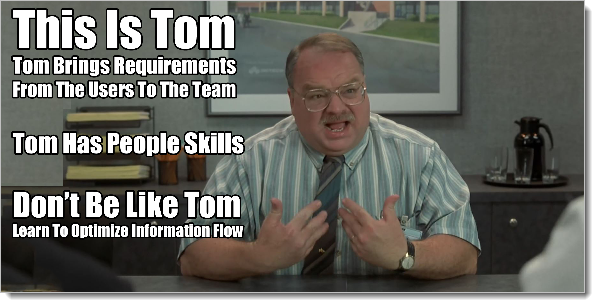

-#Details

# Capturing Minimal Behavior Details

Before we start talking about adding more details to things we've tagged, a fair question is to ask: do we really need to do this? Do we really need to add detail simply because we can?

If you're a programmer and somebody asks you to write a program to balance their checkbook, you guys talk for an afternoon and then you give them the program and they're happy? Why would you want to do any of this tagging and details stuff?

Remember, the goal is to stay as high as possible for as long as possible. We only add detail when we're forced to. The guy asked for "Balance Checkbook" and you delivered "Balance Checkbook". You're done. When you built the doghouses. You'd talk for a few minutes at the **Business Abstract** level, sketch a bit, then work.

If you're working at a pizza place and your boss asks you to clean the backroom, you're going to get into a bit of a dialectic. The dialectic always happens. Do you mean the walk-in too? Or just stock area? How much time do I have? What parts do you want to make sure I cover? (All of these are driving at the real question: what kind of test are you going to perform to make sure I did a good job?)

That's a minute or two conversation. Then you had better be cleaning the backroom. If you start making little lists and charts, you're probably going to be looking for a new job soon.

The nature of this book is taking apart a joke. This is stuff we all do unconsciously. We have since birth. Sometimes when things get complicated we have to do it slowly, piece-by-piece. But we should fight the inclination to do too much work every step of the way. Analysis is the work around the work, not the work itself. Our tagging system is simply a way to speed up using the dialectic to gain shared mental models. Sometimes it doesn't need speeding up. 
Sometimes two people talking in a room for five minutes creates all the shared mental model we need. We just do the job. Go clean the backroom. (For now use common sense. We'll talk later about how to scale up and down.)

Remember Socrates! Socrates was an extremely wise man because he was aware of his profound ignorance and asked a lot of questions --- but he was able to get dressed in the morning. He was able to have day-to-day common interactions without getting all philosophical-ly about it. He wasn't a dork.

Be like Socrates!

Don't be a dork.

## Behavior Titles 

So you've decided that just chatting is not going to work. Making three lists from each of your Behavior, Structure, and Supplemental buckets is also not sufficient to get the job done. What next?

As little as possible. The first step, if you have to, is to formalize the way you create the titles for the items in your behavior list.

Behavior titles can have as many as four parts: **Triggers, Actors, Test, and Outcomes**. But they don't have to have all four.

## Behavior Titles: Test Part 

The first part to formalize with your Behavior titles is the **Test**. This is stated as a verb-noun clause. It's pretty much just the way you would make the Behavior list titles anyway.

Balance Checkbook, Reconcile Account, Sleep in Doghouse, Validate Insurance, Land on Mars, Shoot Lasers at Troops, Guess a Pattern of Training that Works -- these are all Behavior list item titles. They start with a verb or verb phrase: balance, sleep, validate, shoot, guess -- all active-tense verbs. 

The second part of the test is the noun or noun clause: Doghouse, Insurance, Mars, Lasers at Troops, Pattern of Training -- these are all nouns or noun phrases.

There's a reason we call this the **Test** part and why its the most important: it describes the test that must pass for the target system to have changed!

This such an important part of any analysis discussion -- knowing when we're done -- that whenever I start a Behavior list I always use the verb-noun phrase format. For longer efforts involving teams, a lot of folks use index cards to keep track of things. The verb-noun clause part of the Behavior item title fits nicely on any-sized index card. Five minutes and a few cards and you can start scoping out any effort.[^8-2]

[^8-2]: Or you can do a User Story Workshop, or imagineering, or visioning, story mapping, or whatever else the cool kids are doing at your job. But however it ends, you're going to have some desired behavior from the target system, and that Behavior can be listed in verb-noun format. I'm not here to tell you how to solve problems. I'm just here to help you organize and optimize your information flow so that you solve the right problems better. The nice thing about this book is that it works no matter what the new cool-kids stuff is.

Note that there can be only one test. For all of the other parts: Trigger, Actor, Outcome -- there can be multiple items. But for test, there can only be one.

### Behavior Titles: Actors Part

If the **Test** part of **Behavior** titles are all you need, great! If not, the second part I add is the **Actors** part.

**Actors** are the people who are performing the test. They're important, because they're the people you're helping! You probably want to talk to these people. (Remember our three **Genres**: **Business, System, and Meta**. They represent universes of culture and language. Folks in the **Business** genre are the folks actually doing the stuff that we're trying to help out with. They're our actors.)

Who needs to sleep in the doghouse? My pet dog. Who needs to validate insurance? The receptionist. Who needs to land on Mars? Astronauts. Who shoots lasers at troops? The pilot (the real answer here is the director since the pilot is imaginary, but both answers are fine for now.) Who needs to guess whether a pattern of training is working? The training team members.

Identifying all the actors is important for a lot of reasons. The biggest reason is shared understanding. If you are changing a target system to help these folks, are you talking to them? You'd better. How else could you form a shared mental model of what their life is like? (**Business Abstract** level items)

Another good reason to identify the actors is figuring out exactly what the work is. One of the sad things about analysis -- and one that smart people throughout the ages have experienced -- is that many times with enough work you can gain a shared mental model, only with the wrong people, thereby missing out on what the real job is.

On Air France 447, it was a wonderfully-built airplane. The crew was trained quite well. But the mental model the crew had of the airplane before the crash did not match the actual airplane. You can blame that on crew training, which is what happened. Or you can look to the conversations that happened between pilots and the people designing and building the plane. In my layman's opinion, it should be impossible to walk into a cockpit and not understand what the plane is doing. Yet that's what happened. It makes me angry.

Actors tell us who runs the tests that make sure we've done our work. They're the people we need to be joined at the hip with -- and **Actors** are not necessarily the people writing our paychecks.

### Behavior Titles: Outcomes 

We have a test, which is a verb-noun phrase.[^8-21] We have a one or more actors which want this behavior to happen. Once we're done, if we brought together the actors and had them use the system, performing the tests, and the tests pass? We're done, right?

[^8-21]: But a verb-noun phrase isn't a test! A test is a lot more than that! Yes, it is, *but none of it may need to be written down anywhere*. That's a different issue entirely. For our purposes, the verb-noun phrase gives us a big, broad title that we will develop into a test, either just by sitting down and doing the work or some other process, perhaps involving a bunch of stuff. Right now we have the minimum amount we need, which is all we're ever going to do.

Yes. But that's not all of the story. Systems fail. Things don't always work out the way they should. Most of the time the test describes one happy ending[^8-3], "Land on Mars", but there could be a dozen different contingency plans if things don't work out the way they should. The Mars spaceship could fail and they could return to Earth. The habitats might leak and cut short the mission.

[^8-3]: This is called "Happy Path" in a lot of the literature. I will use "Happy Path" and other terms interchangeably.

Things do not always work as planned, and when you're actually building things, you have to take that into consideration.

All of the possible endings to the test are called "Outcomes".[^8-4]

[^8-4]: I used to call them "Goals", but "Outcomes" describes things better, especially for certain types of functional decomposition.

Once an actor starts using the target system to do something, if you're responsible for that system, you have to understand and plan all the possible endings that could occur.[^8-441]

[^8-441]: You don't have to write them all down. I'm not saying that your job is to draw a big diagram of everything that could possibly happen. I'm simply saying that you're responsible for all of it. What you write down and what you develop or not is a different thing entirely. Most folks just do a one or a few outcomes at a time, but it varies depending on what you're doing.

If we were writing a computer program, after we decided what the test was that the actor performed -- "I need to push a button and watch the world burn, dang it!" -- we would then sit down with the user, fire up the IDE, and start talking through all of the possible paths we could take. "What if the button wasn't there? What if you pushed it and the world didn't burn? What if you didn't have fingers?" and so on. 

It's our job as programmers, once we have a test that we're looking to make pass, to make sure we have all the likely different paths covered.

If you're only talking about the "Happy Path", the way things work out when everything is perfect, you can use "So that" in front of your outcomes.

In fact, with all of these parts, we've got kind of a pattern here. Ever play mad-libs? Mad-libs is a game where you fill in the blanks to make a story. One person asks you for a noun, verb, or some other part of speech. You provide it and they put it in the middle of some story. You don't know what the story is. After asking you a bunch of these, they read back the newly-created story with all of your answers in them. It's a lot of fun on long road trips.

Because our titles are kind of fill-in-the-blank stuff, it's a similar situation here. The **Actors** part can be prefixed with "As a". The **Test** part can be prefixed with "I need to", and the **Outcomes** part, for happy path can be prefixed with "So that" For the other paths, "Alternate outcomes are". Or just use "Outcomes" and list all of them.

So it works like this: **As a** astronaut, **I need to** land on Mars **So that** I can live there for five years. **Alternate outcomes are** heading home before landing if the lander fails, leaving early if there are problems on the way down, and dying on the surface if there is a fire.

The titles for these items, whether Behavior, Structure, or Supplemental, follow a pattern. (Remember again: only use what you need to. Never do work simply because "I might need this one day!")

Which brings us to our last Behavior title part.

### Behavior Titles: Triggers 

The **Trigger** tells us why the actor(s) need to do this thing that our target system is helping them with. The magic prefix here is "When"

**When** a person comes into our office for dental work, **As a** receptionist, **I need to** validate their insurance **So that** we know we'll get paid before we start the work. **Alternate outcomes are** customers paying cash up front if they don't have insurance but can afford it, customers being referred to other dental offices if their insurance coverage doesn't apply here, or customers getting a new appointment to allow time for the insurance paperwork to process if the qualify but can't get the approval right away.

The trigger is the thing that kicks all the action off. If the trigger occurs, then rest of this behavior has to occur as well.

**When** an opposing ground unit crosses in front of our land attack ship, **As a** director, **I need to** see this cool change in color and an awesome laser shoot out of the font and blow up the guy **So that** the audience will be convinced this is a tough hombre to deal with.

If you are working special effects and write something like that, I will come to your office and beat you with a wet noodle. It's completely unnecessary. You probably don't need all of this paperwork. But it shows the format in action.

Let's do one to show how you can have multiple entries.

**When** a burglary happens, a quarterly report is due, or there's a surprise audit, **As a** warehouse supervisor or inventory clerk, **I need to** perform a spot inventory of the warehouse **So that** we'll be sure that our recorded inventory is actually how much we have on the premises and accounting is updated with the current value of product on hand. **Alternate outcomes are** an incomplete inventory if an unplanned power or system outage occurs, an inventory that doesn't match on a second count if the second count differs, or an inventory rejected by Quality Control if they don't approve of the way you're working.

If we're using index cards, that's getting to be a bunch of stuff to put on there! Personally I just use **Actor**(s) and **Test** for the cards. Put the rest of the stuff somewhere else like a notepad or text file. But I know plenty of teams that use larger cards and put the full titles on there. Whatever works for you -- and as little as possible to get your work done.

Our Behavior Title mad-libs looks like this:

|Title Part|Prefix|
|--------|------------------------|
|Trigger | When                   |
|Actor   | As a                   |
|Test    | I need to              |
|Outcome | So that                | 
|        | OR Outcomes               |
|        | OR Alternate Outcomes are |

Remember which level you're on while filling out these Behavior titles. Don't mix up **Business Abstract** with **System Realized**. Doesn't matter which level you are on. Pick one and stick to it.

Just like the rest of the material we're covering, this is all just natural conversations. It's up to you to decide to write it down or not. Even if you don't write it down, by understanding the title parts, once you know the Behaviors in your system, now you can ask good follow-up questions. (Who is this for? When does it happen? How do we know we've done it right? What are the possible results here?)

We're taking apart a joke. These are the natural questions you'd ask when understanding the work. We're just separating it all out and making it obvious. The questions are still important whether you use this title format or not.

## Behavior Details 

Let's say you need even more detail about a **Behavior**. By gummity, for some reason simply saying "As an astronaut, I need to land on Mars, dang it!" is not enough to construct an actual space program.[^8-6] You tried pounding the desk and everything.

[^8-6]: Beats me why. Don't even need that much in KSP.

So you've got this behavior. It starts when one of multiple **Triggers** happen. It has a test to see if working right, but no matter what, things flow to one of several **Outcomes**. 

How do you talk in detail about what happens in the middle, between the **Trigger** and the **So that**?

If there's only one **Trigger**, and only one major **Outcome** that you're concerned about, we have this old-fashioned tool called a "flowchart". For just sketching stuff out on a napkin while talking with users and clients, I've used flowcharts for years without problems. But since technically we can have multiple entry and multiple exit points, we'll one of those new-fangled tools called an **Activity Diagram**. Plus it sounds better.

## A Note About Diagrams

In this book, we'll talk about a few different ways of diagramming the information you hear in conversations. Doodling or diagramming is a completely natural and powerful way to capture information. You do not need any kind of training, special paper or tools to doodle or diagram.
 
It can also go off the rails.

The problem with doodling and diagramming -- the problem with any form of permanent record, whether it's video or a collection of reports, is that it's quite easy for the record to take the place of the dialectic, at least in people's minds. 

The dialectic is all about questions, theses and antitheses in the minds of a particular group. There are four parts to that sentence: questions, theses, antitheses, and "particular group". All of those parts are critical to the dialectic, and the dialectic is critical to the advancement of our species. None of that has anything to do with diagramming or writing things down.

What are the purpose of books, then? Surely I'm not saying that all forms of writing are useless. That's crazy! Are you crazy?

I am not crazy. Without permanent records, we'd still be in caves.

The written record is important because it provides a lot of canned templates around various areas of interest *so that we start the dialectic from a better position*. There's a ton of super abstract stuff that we shouldn't have to cover every time we do anything.

Ever see an old cowboy movie? In the background of a wild west town, along the streets you can see a row of various buildings: the bank, saloons, and so forth. In many movies these weren't real buildings at all. They were a huge wall put up with images on the front showing the buildings.

If you were stuck back in time in the old west with just a bunch of movies and some lumber, and your job was to create a town for the people to live and work in, a good place to start would be to create a large mock-up of what a town was supposed to look like. 

Some parts might look pretty good! About every western has a lot of saloons in it, so you'd probably do a good job of building a saloon. Some parts wouldn't be so good. Know what the mayor's office looks like in an old west town? I don't. I could probably guess. Some parts might just be a wall with some stuff on the front that made it look like there was a building there. Nothing more. It's all you knew to build.

After you spent a long time building out all of this, when the people finally arrived, at that point you'd really begin to figure out how an old west town operates. Your saloons? Way too many and way too fancy. Old west towns didn't have as many as you thought per square block. Churches? Where are your churches? Doh! I guess there were churches, right? How about cobblers? Remember the blacksmith?

Wow, you forgot a lot. One of the major things was that the people in western towns were *Victorians*, they lived, spoke, and thought like people did in the 1800s, which is nothing much at all like they do in modern movies.[^8-8]

[^8-8]: Maybe True Grit. If you've watched the original movie, note how odd everybody sounds. That's probably pretty close to the actual way they spoke, not like Clint Eastwood.

All of that media you consumed, no matter what it was or at what level of detail, only provided you with a crude mock-up to get started. In some cases the mock-up was useful. Many times it was not. In fact, the general rule is the more material you consume to get started *aside from the bare minimum required*, the more you're going to spend time and effort doing the wrong thing.[^8-9]

[^8-9]: There is a long rant I could provide here about the proper nature of a university education. (Including the importance of a strong liberal arts foundation.) I will not do that.

Same goes for diagrams and other forms of permanent writing. These tools exist so that groups of us in separate locations can create huge mock-up models of how things might look and work before we get together for the actual work. They're critical and required, but they're not the work itself. The work itself happens when the dialectics begins. Good permanent information has the sole purpose of supporting analysis. (Really good books can support various kinds of analysis the you'll use the rest of your life. Poor books may take up your time and never be used to actually understand anything. Note that fiction can also be a great form of written record, as it teaches us how we might act in imaginary situations -- allows us to sort out our feelings and values without being engaged in "real work" at all. For that reason, good fiction, in fact, can be more useful than a lot of textbooks that teach things you'll never use.)

If you want to use diagramming or some other formal system of permanent recording, be sure you use the minimal amount for the job in front of you. To continue our previous example, great fiction prepares you for life, the universe, and everything. It can be long and extended. Good textbooks give you templates for hundreds of different work/life situations in your future. They can be quite big. If you're building a doghouse, you do not need to write "War and Peace" or begin constructing an architectural diagram for the Sistine Chapel. You might need a sketch or two so you don't forget stuff and agree about end-state, but that's about it.

It's also important that new people are able to consume whatever you're writing down. Many times I've seen teams create documentation that they themselves can't (or won't) consume just a week later. That's a fail.

</rant>

## Pieces of Behavior Diagrams

There are five pieces that I use to diagram Behaviors in a rough **Activity Diagram** format. (Nerd alert! Activity Diagrams are part of the Unified Modeling Language, or UML. They're based loosely on "Petri Nets", a mathematical construct used since the mid 20-th century. So if you're doodling on a napkin at the local pub while talking about your new job, and somebody asks what you're doing? Tell 'em "I'm sketching a petri net as part of a behavior model to support a critical dialectic" Maybe they'll buy you a free drink. Never hurts to try, right?)

**Filled Circles** There are multiple entry and exit points in an Activity Diagram. I used filled circles to represent these. Maybe write a little label off to the side. Maybe not. 

**Lines** Lines connect up things in the diagram. They all flow one way. I don't use arrows because it's usually clear which way the activity proceeds.

**Boxes** Boxes are where things happen. I draw the boxes big enough to write inside what's supposed to happen.

**Diamonds** Diamonds represent decisions. I usually make my diamonds small, then label the lines that come off in various directions to indicate what the result of the decision was.

**Vertical and Horizontal Bars** I think these are called synchronization bars. Beats me. The idea is that one thing can kick off many things that all happen simultaneously. So one line forms a "T" with a long line, then a bunch of lines come off of that line showing that all of this starts happening at once.

This sounds more complicated than it actually is. In practice, just about anybody off the street can walk up and look at one of my Activity Diagrams and see what's going on. That's the point. I've done hundreds of these, and I don't think I've ever made a diagram that had more than 30 or 40 elements or that I couldn't show to the average person I meet every day and start a conversation.

Just to be clear, the "real" Activity Diagrams that are part of the Unified Modeling Language have all kinds of parts and do all kinds of wondrous things. I've never needed them. Many times, especially earlier in my career, I've used a lot of the more technical diagramming elements, but they've never been useful, mainly because back then I didn't understand what the purpose was. I thought the actual job was diagramming.

If you need these parts of UML's Activity Diagrams, use them, but never make a diagram that can't easily support analysis. Once the diagram becomes the work instead of the analysis, you are officially wasting time and are most likely creating a lot more problems for your team than your are solving. It's far, far too easy to go off by yourself and spend a lot of time building a master model of the universe using diagramming tools. Don't be that guy. In fact, **don't ever diagram or sketch by yourself. Always do it with the team**. (You can clean up diagrams and sketches on your own, but never add or change anything)

{blurb, class: information}

### Did you get it?

Sometimes somebody is talking about a behavior and it's too much for the team to remember the next time they talk about it. We learned a way to record behavior titles and behavior details in a standard format if we need to.

{/blurb}