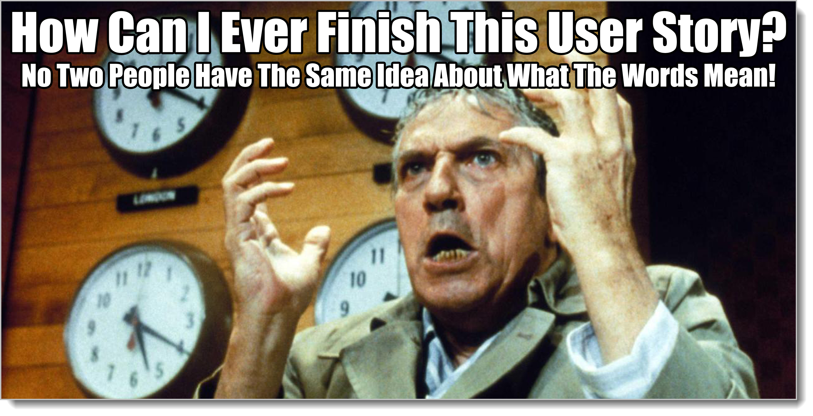
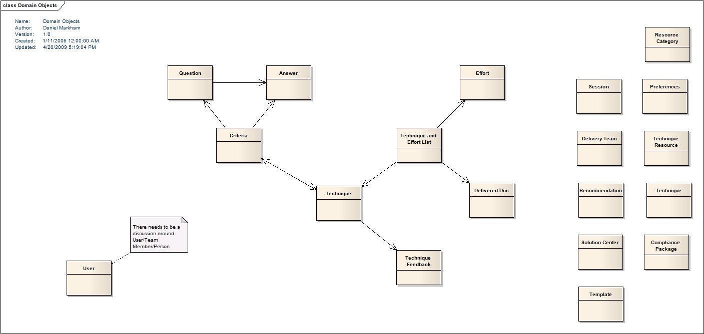

# Capturing Minimal Structure Details 

We diagram things differently depending on which bucket they're in. Behaviors are all about doing things, so we diagram behaviors using Activity Diagrams. Supplementals are all about general, abstract statements. We haven't gotten to those yet. Structure is all about how little pieces fit into bigger pieces.

Whatever you're talking about, there are little pieces that fit into bigger pieces. Usually there are a bunch of them. Just started working with a company? Trying to learn as much you need to about them, do the required analysis, before you begin building? Talking at the **Business Realized** level?

Let's see, for any large company, talking about **Business Realized** stuff, there could be a bunch of Structure information.

- Important terms
- Org charts
- Corporate Divisions
- Market segments
- Contractor/Subcontractor organization
...

The first structural item, "important terms" you will use everywhere. Really, in some way all the other structural items are just variations on the concept of "important terms". Org charts? They consist of important terms (names of people, job titles, hierarchies) and how little pieces fit into bigger pieces. Market segments? Important terms around marketing.

Let's say you're building a computer system for some group. You've done the initial effort in figuring out how this type of organization works in general, the **Business Abstract** work. (You always do that work, even if it's just a few items in three lists.) You've skipped how this particular business works -- you can figure that out as you actually do the work. But you need to understand how in general they'd like their computer systems to operate. You move to the **System Abstract** level. Without diagramming classes and methods, without creating detailed network diagrams with DMZs, load balancers, and jump boxes, how in general do they want their computers to help them?

We've got the **Business Abstract** stuff. How is the **System Realized** stuff going to be structured?[^9-2]

[^9-2]: We're going to talk later about how these kinds of conversations come to happen. Usually you never dive right into structure. So it's fine to dive down to **System Abstract**, but you'd concentrate on Behavior and Supplementals at first, not structure. 

Well, there are a bunch of structural things you might want to model at the **System Abstract** level.

- Important terms about the solution
- Database tables (logical)
- Notational Network diagrams (planning, not implementation)
- General Nav Map for the corporate portal
- Document catalog that the computer system has to process

Note again the top item: important terms.

Important term alert! Important terms in whatever conversations you're having and how those terms relate to one another? A "Visual Glossary?" That's called a **Domain Model**. Every other structural model is some version of a **Domain Model**.

So as you start talking, list all the important words people are using. Woo! With a simple list of "common terms we talk about", you've started on your first Domain Model. Yay you!

ADD MODEL IN HERE

## Structure Titles

Structure Titles should be a list of nouns or noun phrases in singular (not plural) tense. Dog, cat, pig, aardvark, ferret, mouse, hamster, rat, chicken, rabbit, fish, and bird might be great structure titles if you're working with something involving family pets.

When I teach Domain Modeling, usually we spend some time asking one another questions while making a list of important terms on the whiteboard (or in our notes). 

Usually the first thing we'll do is have a conversation where no questions are asked. Everybody keeps a list of important nouns on their own. Whatdya know? Everybody has a slightly different list!

Then we'll have a conversation where one person asks all the questions. Everybody keeps separate notes. It's better. Still, there are a lot of differences. We'll have a conversation where everybody gets to ask questions and everybody keeps separate notes. At this point it feels like we're getting somewhere. As the entire group participates in questions, they start creating that shared mental model we were talking about.

From here we can have a second session where all the lists are compared and one master list of structure titles is created -- or we try it a final way. In the final way everybody asks questions, but one person makes a list of important nouns on the whiteboard or flipchart while the conversation is occurring. Every class agrees this is the best way because looking at the nouns (or noun phrases) as they're added makes everybody wonder if they all have the same understanding of those terms or not. Most times not. (Although it may take a while for that to come out.)

Remember Socrates! The work is in getting the shared mental model. The structure titles are just a list of noun/noun-phrases. Without doing the real work just making lists is worse than useless.

## Structure Details 

**Structure** is how little pieces relate to bigger pieces, and the pieces are just nouns or noun-phrases. The obvious question: How do we show how they relate?

To show how the nouns relate, how about using lines and arrows? There are dozens of various ways of showing how things relate to one another. Do we need more than lines and arrows? Probably not.

Just like with Behavior, where I took UML's Activity Diagram and stripped out everything but the smallest set of things we might need, for structure I'm going to take UML's **Class Diagram** and strip a bunch of stuff out until it does only what we need. And just like with Behavior, there are four things we need to remember.

**Boxes** Boxes are cool. You can put stuff in them. So put each of your noun or noun-phrases in a box.

**Lines with arrows on the end** Since we're talking about how little pieces fit into bigger pieces, draw lines with arrows to show which boxes have other boxes.

Write "Has a" on the line to show that one thing has another thing.

**Other nouns inside the boxes** Sometimes you'll hear a noun phrase in conversation and it sounds kind of important -- but you're just not sure yet. In that case, make your box into two parts. On the top put your main noun. In the bottom part, put other nouns that it "has" that might get their own boxes one day if they're good and behave themselves. (We call these "**Attributes**" in the world of UML, but we really don't need to live in the world of UML right now.)

**No loops** This last part is a little weird, but it makes stuff work out later for us. You'll be drawing little boxes in no time, putting little nouns in there and hooking them up with arrows. Don't make a loop. You can't walk the arrows and end up back where you started. Bad!

Nerdy talk time. When we say no loops, what we're talking about is a **Directed Acyclic Graph**, or DAG. When we're doing Domain Models, the structural model of important terms that we talk about, we should always make sure the lines represent "Has a" relationships and it's a DAG.

You'll thank me later. Meanwhile, if you're following along at home, you should be getting a lot of new words for your upcoming status reports and job applications! "Last week we executed a precision dialectic with the customer that allowed us to rough-out a Directed Acyclic Graph in support of a Domain Modeling consensus."

Heck, that sounds like a bunch of people in that room got advanced degrees! Maybe they all wear lab coats. Probably drive around in fancy cars. Sure beats "We met the guy at a Seven-11 and wrote 'cat', 'horse', 'pig', and 'turnip' on the back of the napkin we used for our Giant Jumbo Dog. The frickin' slurpee machine was still out of order. Bozos." 

Trust me, you need these big words if you're going to impress dates and customers. I do this all the time. Oh boy, yeah. It's scary the kind of popularity you get with the right terms. 

## A Word About Domain Model Ambiguity

Let's say you've got five important nouns so far: dog, cat, pet outfit, name, and legs. Let's see. A dog has legs. So you put "Dog" in a box and draw the arrow to another box with "Legs" A cat has legs. Same for pet outfit. A dog has a pet outfit. A cat has a pet outfit. They don't have to have a pet outfit, but they *could* have a pet outfit. That's all that matters.

Five boxes. The dog and cat boxes each have arrows pointing to the leg and pet outfit boxes. Now you've got your final noun, "name".

Does a dog have a name? Sure. A cat? Sure? Legs? No. You might want to give the legs of your pets names. If you were a veterinarian, maybe each leg has a separate name? But let's say you're not a veterinarian. So no. No names for legs.

How about pet outfits? Do they have names? Well yeah, they could. "Let's get skippy in his little sailor suit for the dance" seems like a reasonable thing for a pet owner to say. But maybe "sailor suit" isn't a name. Maybe it's a type of outfit? 

With only five boxes, you're already struggling to figure out what goes where. How do you decide? What's the right answer? What if we added something like "mammal" in. A dog doesn't *have a* mammal. A dog is a *type of* mammal. How does that work?

The answer is that there is no answer. 

A lot of us, for whatever reason, as soon as we pick up a computer or a piece of paper forget that our job is about *other people*, analysis. The dialectic. It's not about whatever is on the computer or the piece of paper.

So in an important way, it doesn't matter. There is no right or wrong way to do Domain Models and other forms of structural diagrams. That's not what they're for. You are not trying to get the right answer. You are using a prop to create a shared mental model.

Socrates, Plato, and Aristotle thought they were using the dialectic to get *truth*. Two thousand years of philosophy and science that came after that showed they were doing no such thing. They were getting agreement, alignment. We're doing the same thing.

So in a way it's kind of a game. "Ok, guys. We put important stuff we talk about in these little boxes. Then we join them up with arrows that represent Has A relationships. And we can't have loops. How are we going to do it?"

The work is everybody agreeing how to do it. (Another reason why you can never, never, ever do this kinda thing on your own.) It's "right" if everybody agrees. It's "wrong" if people can't come up with some shared way of drawing little boxes and arrows.

If you can't come up with an agreed-upon way to draw little boxes and arrows? Now is the time to start looking for a new job. Save yourself.

So it is expected and necessary that any two groups of people doing analysis on the same problem with the same information create vastly different domain models. That's how it's supposed to work. It's "right" if they all agree. It's perfect if anybody in the group can come to the whiteboard and draw the model again while everybody nods their heads in agreement. You've nailed it.

When I'm using sketches and models for analysis, I'm looking at people in the room, watching their eyes, looking for signs in their body language that they're uncomfortable. Many crappy people doing this work take the opportunity to diagram and use it as a way to dominate the discussion. This is a complete and total fail. If it continues this person needs to find another job. That's not how analysis works.

This gets us to another rule about analysis: Analysis is completely dependent on the people doing the analysis. **You can't take analysis models created by one group and "plug them into" another group.** The entire point is shared mental models. Unless you've mastered mind control, it takes dozens and dozens of dialectics to get that model, not a book report or long email (Of course they might help. Anything might help prompt good conversations, right? It's not that written stuff is useless. It's that it does something different from what we expect it to do. Good documentation can provide an excellent foundation for analysis. It is not a replacement for the analysis itself.)

Ambiguity is a necessary part of analysis. All of the things we do in analysis are to identify ambiguity and resolve it somehow among ourselves. Domain Models are a funny duck. They are so simple-looking that people think they're trivial. Some of the teams I teach learn domain modeling and then never use them because they don't get it. It doesn't feel connected to the work as much as the Behavior Models (Activity Diagrams) do. Asking a team member to construct a Domain Model while seeing if the rest of the team agrees with him is actually one of the quickest ways to see how far out of alignment the team is. [^9-51]

[^9-51]: There is deep, dark black magic in doing this exercise that's not immediately apparent. We will learn later that *all structure is derivative*, that is, you don't create/record structure and structural details in the same way that you do things in the other bucket. Instead, the information in the other buckets **forces** the structural information to appear. So when you're doing a domain model, you're not deciding what the important words are, you're capturing the words that are already important in the team's mind. That's a completely different way of looking at it than intuition would suggest.

Fortunately you're reading this book, so as we move from theory to application, you're going to see a bunch of different ways domain models can help you plan and understand what the work is.

{blurb, class: information}

### Did you get it?

We learned how to add titles and details to structural items if we need to. The most critical structural items on any project are the words we use in our conversations.

{/blurb}