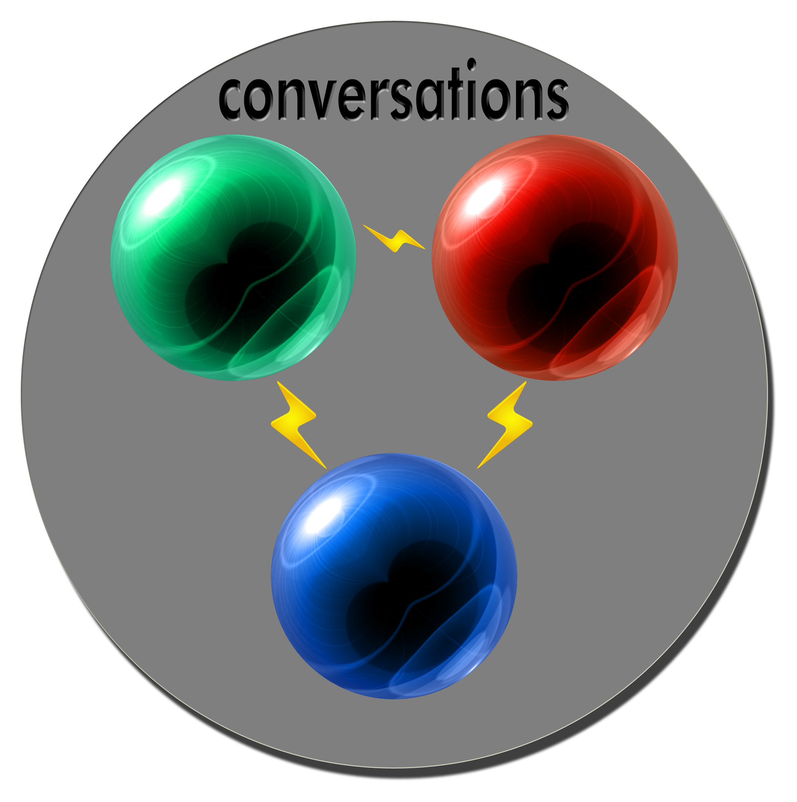

{frontmatter}

# Preface: What to Expect in this Book

This book is about organizing all the information that's generated when you're creating something that's not actually building the product: user notes, questions, diagrams, workshops, website data, backlogs, CRC cards, user stories, character maps, wireframes, and so on.

This book is useful anytime you have 2 or more people attempting to create something that's never been done before, whether it's a spaceship, fantasy world, web application, startup, or undersea farming community.

This is not about process, although various processes are used as examples. A hundred years from now everybody may using WhizBangOMatic Process 7.0. The principles in this book will still apply and be useful. You will, however, find a lot of insight into whatever processes you are currently using and how to make them better.

This is not theory and hand-waving, although the first part of the book is solely understanding theory and the basics. Once you've finished the first section, in later sections you'll learn to apply the theory in small teams, teams-of-teams (programs/PMOs), and startups.

There will be programming. The nature of most all project work is that you collect far more data than you hang on to in your head, so it has to go somewhere. After we learn the basics in Section 1, we'll automate gathering and putting things where you can easily find them again.
